# Ngnix

## nginx 安装

### 环境准备

* Centos 7.4+
* 可访问联网
* 关闭防火墙

```bash
sudo systemctl stop firewalld
sudo systemctl disable firewalld
```

### 使用yum安装

```bash
sudo yum install yum-utils net-tools
```

```bash
cat > /etc/yum.repos.d/nginx.repo << EOF
[nginx-stable]
name=nginx stable repo
baseurl=http://nginx.org/packages/centos/\$releasever/\$basearch/
gpgcheck=1
enabled=1
gpgkey=https://nginx.org/keys/nginx_signing.key
module_hotfixes=true
EOF
```

```bash
sudo yum install nginx
```

### 常用命令

```bash
nginx 

#立即停止
nginx -s stop

#执行完当前请求再停止
nginx -s quit

#重新加载配置文件，相当于restart
nginx -s reload

#将日志写入一个新的文件
nginx -s reopen

#测试配置文件
nginx -t
```

日志位于/var/log/nginx/

使用systemctl启动、停止、重新加载

注意：在centos 7中，用systemctl启动nginx可能出现如下错误，nginx: [emerg] bind() to 0.0.0.0:8000 failed (13: Permission denied)

* 这是由于selinux的安全策略引起的。解决方法如下：setenforce 0 （临时）
* 修改/etc/selinux/config，设置SELINUX=disabled （永久有效，需重启）

```bash
systemctl start nginx

systemctl status nginx

#产看日志
journalctl -xe

systemctl stop nginx

systemctl reload nginx

#配置开机启动
systemctl enable nginx
```

### 配置文件

配置文件位于 /etc/nginx/nginx.conf , 下列命令会引用/etc/nginx/conf.d目录下所有的.conf文件，这样可以保持主配置文件的简洁，同时配个多个.conf文件方便区分，增加可读性。

```nginx
include /etc/nginx/conf.d/*.conf;
```

默认配置/etc/nginx/conf.d/default.conf

```nginx
server {
    listen       80; #监听端口
    server_name  localhost;

    location / {
        root   /usr/share/nginx/html; #根目录
        index  index.html index.htm; #首页
    }

    error_page   500 502 503 504  /50x.html;
    location = /50x.html {
        root   /usr/share/nginx/html;
    }
}
```

配置文件结构

```nginx
http {

  server{#虚拟主机
   
    location {
      listen 80；
      server_name localhost;
    }
    location {
   
    }
  
  }

  server{
  
  }

}
```

## 配置静态web

配置文件示例：

```nginx
server{
  
    listen 8000;
    server_name localhost;
  
    location / {
        root /home/AdminLTE-3.2.0;
        index index.html index2.html index3.html;
    }
  
}
```

虚拟主机server通过listen和server_name进行区分，如果有多个server配置，listen + server_name 不能重复。

### listen

```nginx
#监听可以配置成IP或端口或IP+端口 
listen 127.0.0.1:8000; 
listen 127.0.0.1;（ 端口不写,默认80 ） 
listen 8000; 
listen *:8000; 
listen localhost:8000;
```

### server_name

* server_name主要用于区分，可以随便起。
* 也可以使用变量 $hostname 配置成主机名。
* 或者配置成域名： example.org  www.example.org  *.example.org
* 如果多个server的端口重复，那么根据域名或者主机名去匹配 server_name 进行选择。

下面的例子中：

```nginx
# curl http://localhost:80 会访问这个
server {
    listen       80;
    server_name  localhost;

    #access_log  /var/log/nginx/host.access.log  main;

    location / {
        root   /usr/share/nginx/html;
        index  index.html index.htm;
    }

 # curl http://nginx-dev:80 会访问这个
server{
    listen 80;
    server_name nginx-dev;#主机名
  
    location / {
        root /home/AdminLTE-3.2.0;
        index index.html index2.html index3.html;
    }
  
}
```

### location

* /请求指向 root 指向的目录
* location 总是从/目录开始匹配，如果有子目录，例如/css，他会指向/static/css
* 可以使用正则表达式

#### root

root其寻找文件是 root地址+location，如下例子会去 /var/www/html/work下面寻找文件，如 http://localhost:80/work/ab.html其会寻找 /var/www/html/work/ab.html文件

```nginx
location /work {
     root /var/www/html;  
}
```

#### alias

root与alias类似，root其寻找文件是 alias，如下例子会去 /var/www/html/下面寻找文件，如 http://localhost:80/work/ab.html其会寻找 /var/www/html/ab.html文件

```bash
location /work {
    alias /var/www/html/;# 记得最后加‘/’
}
```

区别：当**alias**用于去正则表示时，必须捕捉要匹配的内容并在指定的内容处使用，例子如下

```bash
location ~ ^/users/(.+\.(?:gif|jpe?g|png))$ {
    alias /data/w3/images/$1;
}
```

#### index

通常配合root与alias，表示访问该地址展示的内容，例如下面访问 http://localhost:80/work就会找到 /var/www/html/index.html找不到该文件就找 /var/www/html/abc.html(可多个)

```bash
location /work {
     alias /var/www/html/;
     index index.html abc.html;
}
```

## HTTP反向代理

正向代理与反向代理

* 正向代理：在客户端代理转发请求称为正向代理。例如VPN。
* 反向代理：在服务器端代理转发请求称为反向代理。例如nginx

### 配置代理服务

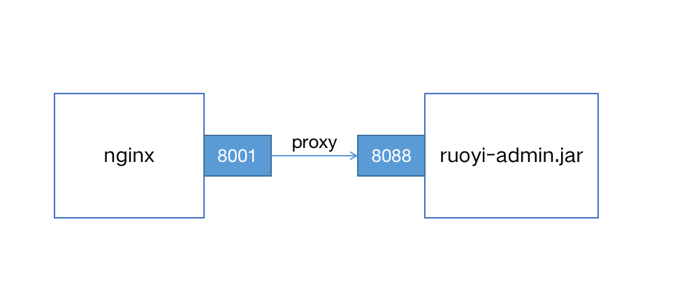

启动ruoyi后台服务，端口为8088；

```bash
java -jar ruoyi-admin.jar
```

nginx配置文件：

```nginx
server {
  
  listen 8001;
  
  server_name ruoyi.localhost;
  
  location / {
    proxy_pass http://localhost:8088;
  }

}
```

proxy_pass配置说明：

* 如果proxy-pass的地址只配置到端口，不包含/或其他路径，那么location将被追加到转发地址中
* 访问 http://localhost/some/path/page.html 将被代理到http://localhost:8080/some/path/page.html

```nginx
location /some/path/ {
    proxy_pass http://localhost:8080;
}
```

* 如果proxy-pass的地址包括/或其他路径，那么/some/path将会被替换，
* 访问 http://localhost/some/path/page.html 将被代理到 http://localhost:8080/zh-cn/page.html

```nginx
location /some/path/ {
    proxy_pass http://localhost:8080/zh-cn/;
}
```

设置代理请求headers

用户可以重新定义或追加header信息传递给后端[‎](http://nginx.org/en/docs/http/ngx_http_proxy_module.html#proxy_pass_request_headers)‎服务器。可以包含文本、变量及其组合。默认情况下，仅重定义两个字段：‎

```nginx
proxy_set_header Host       $proxy_host;
proxy_set_header Connection close;
```

由于使用反向代理之后，后端服务无法获取用户的真实IP，所以，一般反向代理都会设置以下header信息。

```nginx
location /some/path/ {
    #nginx的主机地址
    proxy_set_header Host $http_host;
    #用户端真实的IP，即客户端IP
    proxy_set_header X-Real-IP $remote_addr;
    proxy_set_header X-Forwarded-For $proxy_add_x_forwarded_for;

    proxy_pass http://localhost:8088;
}
```

常用变量的值：

```nginx
$host：nginx主机IP，例如192.168.56.105
$http_host：nginx主机IP和端口，192.168.56.105:8001
$proxy_host：localhost:8088，proxy_pass里配置的主机名和端口
$remote_addr:用户的真实IP，即客户端IP。
```

## 动静分离

动静分离的好处

Apache Tocmat 严格来说是一款java EE服务器，主要是用来处理 servlet请求。处理css、js、图片这些静态文件的IO性能不够好，因此，将静态文件交给nginx处理，可以提高系统的访问速度，减少tomcat的请求次数，有效的给后端服务器降压。

分离静态文件

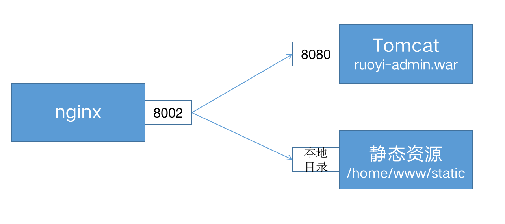

```nginx
server{

  location / {
    proxy_pass http://localhost:8080/;
  }
  
  location = /html/ie.html {
    root  /home/www/static;
  }
  
  location ^~ /fonts/ {
   
    root  /home/www/static;
  }
  
  location ~ \.(css|js|png|jpg|gif|ico) {
    root /home/www/static;
}
```

## 缓冲和缓存

### 缓冲

* 缓冲一般放在内存中，如果不适合放入内存（比如超过了指定大小），则会将响应写入磁盘临时文件中。
* 启用缓冲后，nginx先将后端的请求响应（response）放入缓冲区中，等到整个响应完成后，再发给客户端。

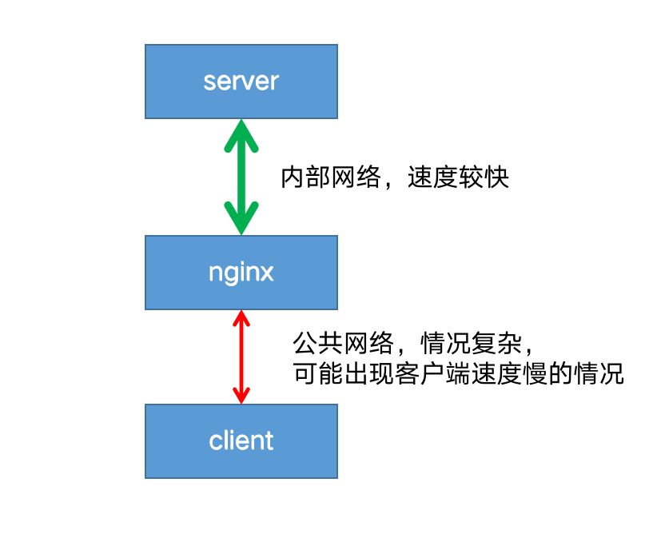

客户端往往是用户网络，情况复杂，可能出现网络不稳定，速度较慢的情况。而nginx到后端server一般处于同一个机房或者区域，网速稳定且速度极快。

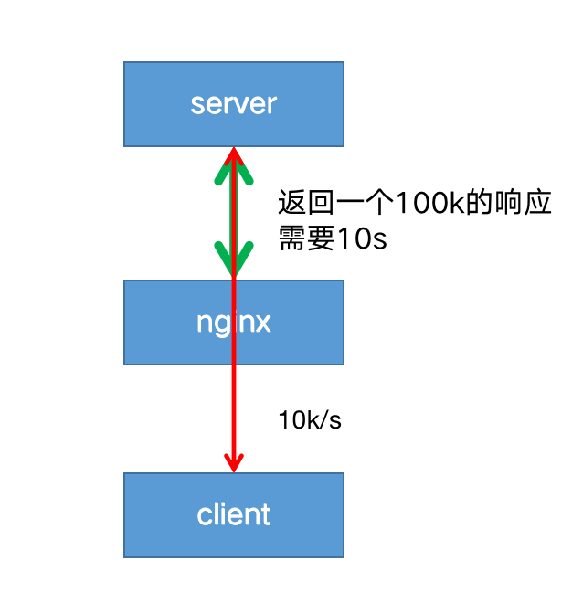

如果禁用了缓冲，则在客户端从代理服务器接收响应时，响应将同步发送到客户端。对于需要尽快开始接收响应的快速交互式客户端，此行为可能是可取的。

这就会带来一个问题：因为客户端到nginx的网速过慢，导致nginx只能以一个较慢的速度将响应传给客户端；进而导致后端server也只能以同样较慢的速度传递响应给nginx，造成一次请求连接耗时过长。

在高并发的情况下，后端server可能会出现大量的连接积压，最终拖垮server端。

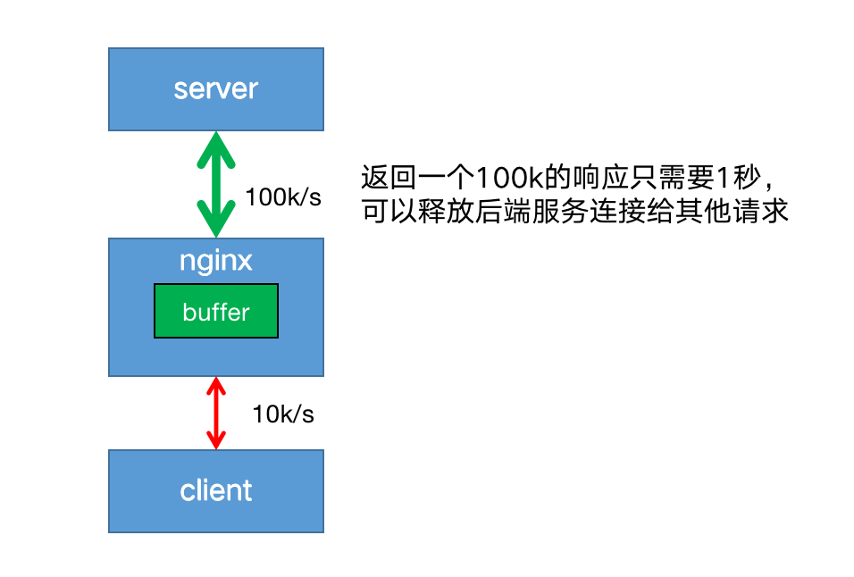

开启代理缓冲后，nginx可以用较快的速度尽可能将响应体读取并缓冲到本地内存或磁盘中，然后同时根据客户端的网络质量以合适的网速将响应传递给客户端。

这样既解决了server端连接过多的问题，也保证了能持续稳定的像客户端传递响应。

使用[proxy_buffering](https://nginx.org/en/docs/http/ngx_http_proxy_module.html#proxy_buffering)启用和禁用缓冲，nginx默认为 on 启用缓冲，若要关闭，设置为 off  。

```nginx
proxy_buffering off;
```

[proxy_buffers](https://nginx.org/en/docs/http/ngx_http_proxy_module.html#proxy_buffers) 指令设置每个连接读取响应的缓冲区的大小和数量 。默认情况下，缓冲区大小等于一个内存页，4K 或 8K，具体取决于操作系统。

来自后端服务器响应的第一部分存储在单独的缓冲区中，其大小通过 [proxy_buffer_size](https://nginx.org/en/docs/http/ngx_http_proxy_module.html#proxy_buffer_size) 指令进行设置，此部分通常是相对较小的响应headers，通常将其设置成小于默认值。

```nginx
location / {
    proxy_buffers 16 4k;
    proxy_buffer_size 2k;
    proxy_pass http://localhost:8088;
}
```

### 缓存

启用缓存后，nginx将响应保存在磁盘中，返回给客户端的数据首先从缓存中获取，这样相同的请求不用每次都发送给后端服务器，减少到后端请求的数量。

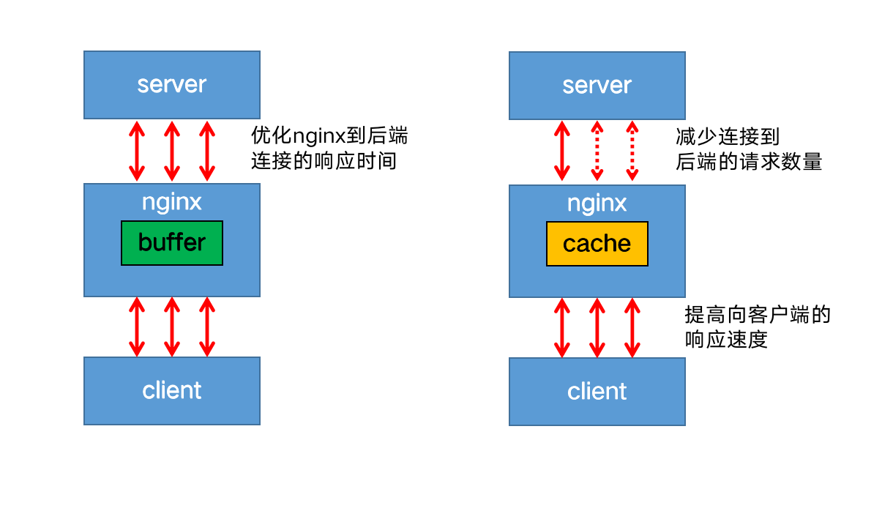

启用缓存，需要在http上下文中使用 [proxy_cache_path](https://nginx.org/en/docs/http/ngx_http_proxy_module.html#proxy_cache_path) 指令，定义缓存的本地文件目录，名称和大小。

缓存区可以被多个server共享，使用[proxy_cache](https://nginx.org/en/docs/http/ngx_http_proxy_module.html#proxy_cache)指定使用哪个缓存区。

```nginx
http {
    proxy_cache_path /data/nginx/cache keys_zone=mycache:10m;
    server {
        proxy_cache mycache;
        location / {
            proxy_pass http://localhost:8000;
        }
    }
}
```

缓存目录的文件名是[proxy_cache_key](https://nginx.org/en/docs/http/ngx_http_proxy_module.html#proxy_cache_key) 的MD5值。

例如：/data/nginx/cache/c/29/b7f54b2df7773722d382f4809d65029c

[proxy_cache_key](https://nginx.org/en/docs/http/ngx_http_proxy_module.html#proxy_cache_key)默认设置如下：

```nginx
proxy_cache_key $scheme$proxy_host$uri$is_args$args;
```

也可以自定义缓存的键，例如

```nginx
proxy_cache_key "$host$request_uri$cookie_user";
```

缓存不应该设置的太敏感，可以使用[proxy_cache_min_uses](https://nginx.org/en/docs/http/ngx_http_proxy_module.html#proxy_cache_min_uses)设置相同的key的请求，访问次数超过指定数量才会被缓存。

```nginx
proxy_cache_min_uses 5;
```

```nginx
proxy_cache_path /var/cache/nginx/data keys_zone=mycache:10m;

server {

    listen 8001;
    server_name ruoyi.localhost;
  
    location / {
        #设置buffer
        proxy_buffers 16 4k;
        proxy_buffer_size 2k;
        proxy_pass http://localhost:8088;      

    }


    location ~ \.(js|css|png|jpg|gif|ico) {
        #设置cache
        proxy_cache mycache;
        proxy_cache_valid 200 302 10m;
        proxy_cache_valid 404      1m;
        proxy_cache_valid any 5m;

        proxy_pass http://localhost:8088;  
    }

    location = /html/ie.html {

        proxy_cache mycache;
        proxy_cache_valid 200 302 10m;
        proxy_cache_valid 404      1m;
        proxy_cache_valid any 5m;

        proxy_pass http://localhost:8088;  
    }

    location ^~ /fonts/ {

        proxy_cache mycache;
        proxy_cache_valid 200 302 10m;
        proxy_cache_valid 404      1m;
        proxy_cache_valid any 5m;

        proxy_pass http://localhost:8088;  
    }

}
```

## 负载均衡

跨多个应用程序实例的负载平衡是一种常用技术，用于优化资源利用率、最大化吞吐量、减少延迟和确保容错配置。‎使用nginx作为非常有效的HTTP负载平衡器，将流量分配到多个应用程序服务器，可以提升Web应用程序的性能，提高扩展性和可靠性。

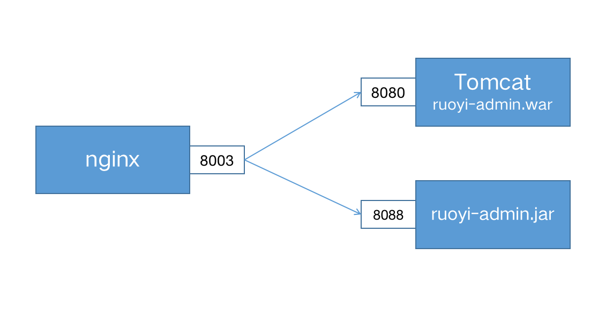

使用 upstream定义一组服务 。

注意：upstream 位于 http上下文中，与server 并列，不要放在server中。

```nginx
upstream ruoyi-apps {
    #不写，采用轮循机制
    server localhost:8080;
    server localhost:8088;
  
}
server {
  listen 8003;
  server_name ruoyi.loadbalance;
  
  location / {
    proxy_pass http://ruoyi-apps;
  }
}
```

### 负载均衡策略

1. 轮循机制（round-robin）默认机制，以轮循机制方式分发。
2. 最小连接（least-connected ）将下一个请求分配给活动连接数最少的服务器（较为空闲的服务器）。‎

   ```nginx
   upstream backend {
       least_conn;
       server backend1.example.com;
       server backend2.example.com;
   }
   请注意，使用轮循机制或最少连接的负载平衡，每个客户端的请求都可能分发到不同的服务器。不能保证同一客户端将始终定向到同一服务器。‎
   ```
3. ip-hash
   客户端的 IP 地址将用作哈希键，来自同一个ip的请求会被转发到相同的服务器。

   ```nginx
   upstream backend {
       ip_hash;
       server backend1.example.com;
       server backend2.example.com;
   }
   此方法可确保来自同一客户端的请求将始终定向到同一服务器，除非此服务器不可用。‎
   ```
4. hash
   通用hash，允许用户自定义hash的key，key可以是字符串、变量或组合。
   例如，key可以是配对的源 IP 地址和端口，也可以是 URI，如以下示例所示：‎

   ```nginx
   upstream backend {
       hash $request_uri consistent;
       server backend1.example.com;
       server backend2.example.com;
   }
   请注意：基于 IP 的哈希算法存在一个问题，那就是当有一个上游服务器宕机或者扩容的时候，会引发大量的路由变更，进而引发连锁反应，导致大量缓存失效等问题。
   ```

   consistent参数启用 ‎[‎ketama‎](http://www.last.fm/user/RJ/journal/2007/04/10/rz_libketama_-_a_consistent_hashing_algo_for_memcache_clients)‎ 一致哈希算法，如果在上游组中添加或删除服务器，只会重新映射部分键，从而最大限度地减少缓存失效。‎
   假设我们基于 key 来做 hash，现在有 4 台上游服务器，如果 hash 算法对 key 取模，请求根据用户定义的哈希键值均匀分布在所有上游服务器之间。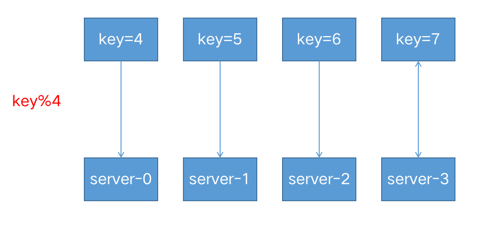当有一台服务器宕机的时候，就需要重新对 key 进行 hash，最后会发现所有的对应关系全都失效了，从而会引发缓存大范围失效。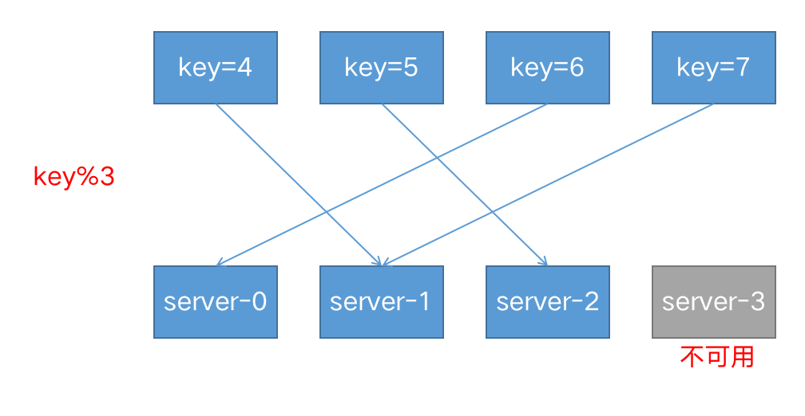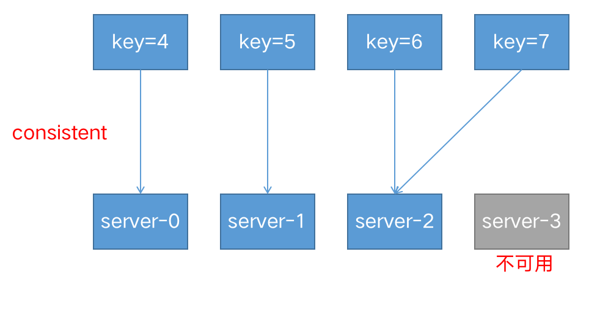
5. 随机‎‎  (random）
   每个请求都将传递到随机选择的服务器。
   two是可选参数，NGINX 在考虑服务器权重的情况下随机选择两台服务器，然后使用指定的方法选择其中一台，默认为选择连接数最少（least_conn‎）的服务器。

   ```nginx
   upstream backend {
       random two least_conn;
       server backend1.example.com;
       server backend2.example.com;
       server backend3.example.com;
       server backend4.example.com;
   }
   ```
6. 权重（weight）

   ```nginx
   upstream my-server {

       server performance.server weight=3;
       server app1.server;
       server app2.server;

   }
   ```

   每 5 个新请求将按如上方式分布在应用程序实例中：3 个请求将定向到performance.server，一个请求将转到app1.server，另一个请求将转到app2.server。‎
   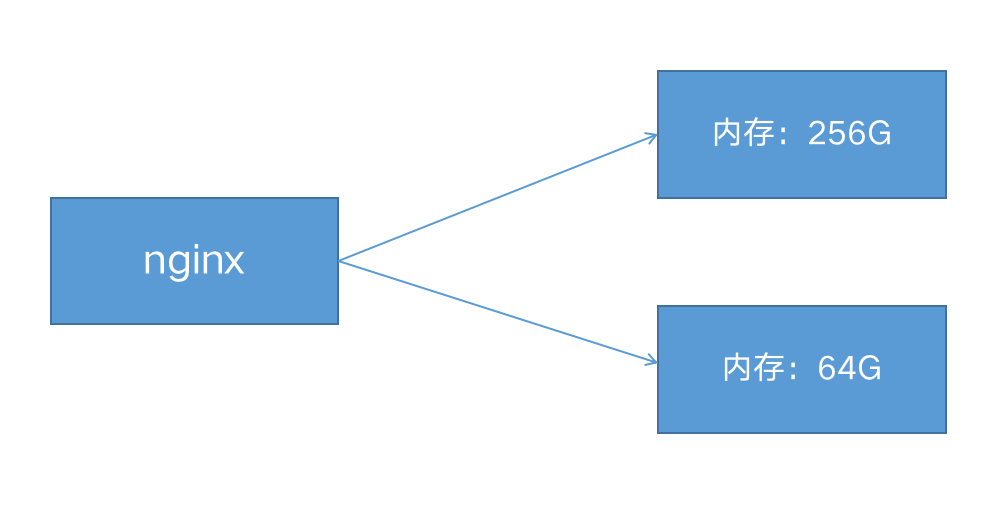
7. 健康检查
   在反向代理中，如果后端服务器在某个周期内响应失败次数超过规定值，nginx会将此服务器标记为失败，并在之后的一个周期不再将请求发送给这台服务器。‎
   通过[fail_timeout‎](https://nginx.org/en/docs/http/ngx_http_upstream_module.html#fail_timeout)‎ 来设置检查周期，默认为10秒。
   通过[max_fails‎](https://nginx.org/en/docs/http/ngx_http_upstream_module.html#max_fails)来设置检查失败次数，默认为1次。‎
   ‎在以下示例中，如果NGINX无法向服务器发送请求或在30秒内请求失败次数超过3次，则会将服务器标记为不可用30秒。

   ```nginx
   upstream backend {
     server backend1.example.com;
     server backend2.example.com max_fails=3 fail_timeout=30s; 
   } 
   ```

## URL重写

nginx有两个重写指令：return和rewrite

### return

服务端停止处理并将状态码status code返回给客户端

* return codeURL
* return codetext
* return code
* return URL

强制所有请求使用Https

错误写法

```nginx
server {

    listen 8003;
    server_name ruoyi.loadbalance;

    return 301 https://localhost:8004;
}
```

正确写法

```nginx
server {

    listen 8003;
    server_name ruoyi.loadbalance;

    return 301 https://192.168.56.105:8004;
}
```

### 转发和重定向

转发是服务端行为，重定向是客户端行为。

#### 转发

发向代理proxy_pass属于转发，浏览器的访问栏输入的地址不会发生变化。

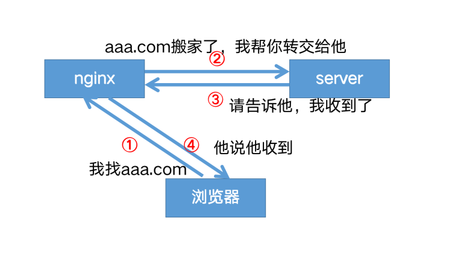

#### 重定向

return，rewrite属于重定向，在客户端进行。浏览器的访问栏输入的地址会发生变化。

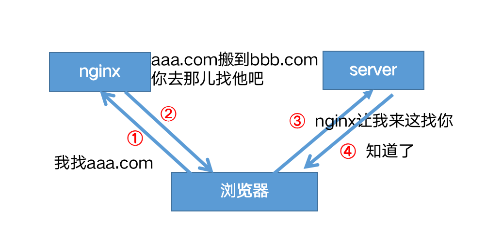

域名迁移，不让用户收藏的链接或者搜索引擎的链接失效
将请求从 www.old-name.com old-name.com 永久重定向到 www.new-name.com，包含http和https请求

```nginx
server {
    listen 80;
    listen 443 ssl;
    server_name www.old-name.com old-name.com;
    return 301 $scheme://www.new-name.com$request_uri;
}
```

由于捕获了域名后面的 URL 部分，因此，如果新旧网站之间存在一对一的页面对应关系（例如，www.new-name.com/about 具有与 www.old-name.com/about 相同的基本内容），则此重写是合适的。如果除了更改域名之外还重新组织了网站，则通过省略以下内容，将所有请求重定向到主页可能会更安全

```nginx
server {
    listen 80;
    listen 443 ssl;
    server_name www.old-name.com old-name.com;
    return 301 $scheme://www.new-name.com;
}
```

添加www

```nginx
# add 'www'
server {
    listen 80;
    listen 443 ssl;
    server_name domain.com;
    return 301 $scheme://www.domain.com$request_uri;
}
```

### rewrite

如果指定的正则表达式与请求 URI 匹配，则 URI 将按照字符串中的指定进行更改。指令按其在配置文件中出现的先后顺序执行。

```nginx
server {
    # ...
    rewrite ^(/download/.*)/media/(\w+)\.?.*$ $1/mp3/$2.mp3 last;
    rewrite ^(/download/.*)/audio/(\w+)\.?.*$ $1/mp3/$2.ra  last;
    return  403;
    # ...
}
```

上面是使用该指令的示例 NGINX 重写规则。它匹配以字符串 /download 开头的 URL，然后在路径后面的某个位置包含 /media/ 或 /audio/ 目录。它将这些元素替换为 /mp3/，并添加相应的文件扩展名，.mp3 或 .ra。和 变量捕获未更改的路径元素。

例如，/download/cdn-west/media/file1 变成了 /download/cdn-west/mp3/file1.mp3。如果文件名上有扩展名（如 .flv），则表达式会将其剥离，并将其替换为.mp3。

如果字符串包含新的请求参数，则以前的请求参数将追加到这些参数之后。如果不需要这样做，则在替换字符串的末尾放置一个问号可以避免附加它们，例如：replacement

```nginx
rewrite ^/users/(.*)$ /show?user=$1? last;
```

### last与break

* last：如果当前规则不匹配，停止处理后续rewrite规则，使用重写后的路径，重新搜索location及其块内指令
* break:如果当前规则不匹配，停止处理后续rewrite规则，执行{}块内其他指令

#### 不使用last和break

在root /home/AdminLTE-3.2.0/pages下创建一个1.txt，里面内容是this is a file

```nginx
server {

    listen 8000;
    server_name nginx-dev;

    rewrite_log on;

    location / {
        rewrite ^/old/(.*) /new/$1;
        rewrite ^/new/(.*) /pages/$1;
        #根目录
        root /home/AdminLTE-3.2.0;
        #首页
        index index.html index2.html index3.html;
    }

    location  /pages/1.txt {
        return 200 "this is rewrite test!";
    }

}
```

默认按顺序执行。
访问 http://192.168.56.105:8000/old/1.txt
结果：this is rewrite test!

#### 使用last

1. 访问 http://192.168.56.105:8000/old/1.txt
   匹配到了rewrite ^/old/(.) /new/$1
2. last指令不执行后续的rewrite规则,以新的/new/1.txt路径去匹配location
3. *先匹配到location /, 有匹配到location里的rewrite ^/new/(.*) /pages/$1规则，重定向到
   /pages/1.txt
4. 匹配到了location /pages/1.txt ，于是返回了this is rewrite test!

```nginx
server {

    listen 8000;
    server_name nginx-dev;

    rewrite_log on;

    location / {
        rewrite ^/old/(.*) /new/$1 last;
        rewrite ^/new/(.*) /pages/$1;
        #根目录
        root /home/AdminLTE-3.2.0;
        #首页
        index index.html index2.html index3.html;
    }

    location  /pages/1.txt {
        return 200 "this is rewrite test!";
    }

}
```

#### 使用break

访问 http://192.168.56.105:8000/old/1.txt

1. 匹配到了rewrite ^/old/(.*) /new/$1
2. break指令不执行后续的rewrite规则,以新的/new/1.txt路径去执行块内的其他指令
3. 去root目录下寻找文件, 由于不再村/home/AdminLTE-3.2.0/new/1.txt这个文件，返回404

```nginx
server {

    listen 8000;
    server_name nginx-dev;

    rewrite_log on;

    location / {
        rewrite ^/old/(.*) /new/$1 break;
        rewrite ^/new/(.*) /pages/$1;
        #根目录
        root /home/AdminLTE-3.2.0;
        #首页
        index index.html index2.html index3.html;
    }

    location  /pages/1.txt {
        return 200 "this is rewrite test!";
    }

}
```

## TCP反向代理

### stream

```nginx
#HTTP代理
http {
  server {
    listen 8002;
    proxy_pass http://localhost:8080/;
  }
}

#TCP代理
stream {
  server {
    listen 13306;
    proxy_pass localhost:3306;
  }
}
```

### tcp负载均衡

```nginx
stream {
  
  upstream backend-mysql {
  
    server localhost:3306;
    server localhost:3307;
  
    keepalive 8;
  }
  
  server {
    listen 13306;
    proxy_pass backend-mysql;
  }
}
```

使用keepalive定义连接池里空闲连接的数量。

keepalive_timeout默认60s。如果连接池里的连接空闲时间超过这个值，则连接关闭。

在最简单的 HTTP 实现中，客户端打开新连接，写入请求，读取响应，然后关闭连接以释放关联的资源。


在客户端读取响应后，保持连接处于打开状态，因此可以将其重新用于后续请求。


使用 [keepalive](https://nginx.org/en/docs/http/ngx_http_upstream_module.html#keepalive) 指令启用从 NGINX Plus 到上游服务器的保持活动连接，定义在每个工作进程的缓存中保留的与上游服务器的空闲保持活动连接的最大数量。当超过此数字时，将关闭最近最少使用的连接。如果没有 keepalives，您将增加更多的开销，并且连接和临时端口都效率低下。
现代 Web 浏览器通常会打开 6 到 8 个保持连接。

## HTTPS配置

HTTPS 协议是由HTTP 加上TLS/SSL 协议构建的可进行加密传输、身份认证的网络协议，主要通过数字证书、加密算法、非对称密钥等技术完成互联网数据传输加密，实现互联网传输安全保护。

### 生成证书

```nginx
openssl genrsa -des3 -out server.key 2048
openssl req -new -key server.key -out server.csr
openssl x509 -req -days 365 -in server.csr -signkey server.key -out server.crt
```

### 配置ssl

```nginx
server {
    listen              443 ssl;
    server_name         ruoyi.https;
    ssl_certificate     /home/ssl/server.crt;
    ssl_certificate_key /home/ssl/server.key;
    ssl_protocols       TLSv1 TLSv1.1 TLSv1.2;
    ssl_ciphers         HIGH:!aNULL:!MD5;
  
    location / {
        proxy_pass http://localhost:8088;
    }
}
```

如果设置了密码，需要加上

```nginx
server{
  ……
  ssl_password_file   /home/ssl/cert.pass;
  ……
} 
```

### https优化

SSL 操作会消耗额外的 CPU 资源。CPU 占用最多的操作是 SSL 握手。有两种方法可以最大程度地减少每个客户端的这些操作数：

* 使保持活动连接能够通过一个连接发送多个请求
* 重用 SSL 会话参数以避免并行连接和后续连接的 SSL 握手

会话存储在工作进程之间共享并由 [ssl_session_cache](https://nginx.org/en/docs/http/ngx_http_ssl_module.html#ssl_session_cache) 指令配置的 SSL 会话缓存中。一兆字节的缓存包含大约 4000 个会话。默认缓存超时为 5 分钟。可以使用 [ssl_session_timeout](https://nginx.org/en/docs/http/ngx_http_ssl_module.html#ssl_session_timeout) 指令增加此超时。以下是针对具有 10 MB 共享会话缓存的多核系统优化的示例配置：

```nginx
ssl_session_cache   shared:SSL:10m;
ssl_session_timeout 10m;
```
