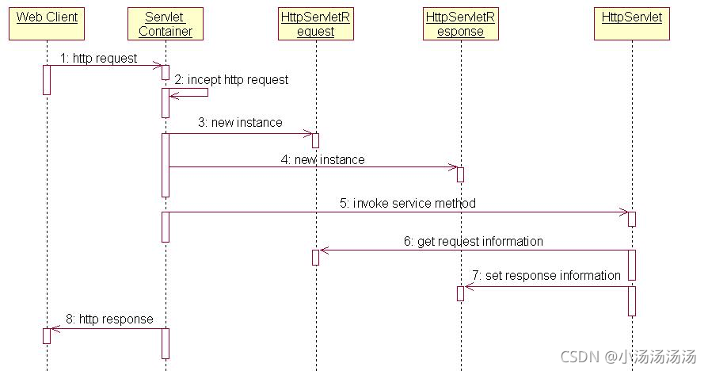
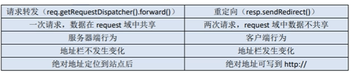

# Servlet的实现

Servlet是Server与Applet的缩写，是服务端小程序的意思。使用Java语言编写的服务器端程序，可以像生成动态的WEB页，Servlet主要运行在服务器端，并由服务器调用执行，是一种按照Servlet标准来开发的类。是SUN公司提供的一门用于开发动态Web资源的技术。(言外之意:要实现web开发，需要实现Servlet标准)
Servlet 本质上也是Java类，但要遵循Servlet 规范进行编写，没有main()方法，它的创建、使用、销毁都由Servlet容器进行管理(如Tomcat)。(言外之意:写自己的类，不用写main方法，别人自动调用)
Servlet是和HTTP协议是紧密联系的，其可以处理HTTP协议相关的所有内容。这也是Servlet应用广泛的原因之一。
提供了Servlet功能的服务器，叫做Servlet容器，其常见容器有很多，如Tomcat, Jetty, WebLogic Server,WebSphere,JBoss 等等。

## Servlet规范

实现Servlet规范，即继承HttpServlet类，并到如响应的包，该类中已经完成了通信的规则，我们只需要进行业务的实现即可。

```java
public class Servlet01 extends HttpServlet{
  
}
```

## 重写service方法

满足Servlet规范只是让我们的类能够满足接收请求的要求，接收到请求后需要对请求进行分析，以及进行业务逻辑处理，计算出结果，则需要添加代码，在规范中有一个叫做service的方法，专门用来做请求处理的操作，业务代码则可以写在该方法中。

```java
public class Servlet01 extends HttpServlet{

  @Override
  protected void service(HttpServletRequest req, HttpServletResponse resp) throws ServletException, IOException {
    // // TODO Auto-generated method stub
    // super.service(arg0, arg1);
  }
  
}
```

## 设置注解

在完成好了一切代码的编写后，还需要向服务器说明，特定请求对应特定资源。
开发servlet项目，使用WebServlet将一个继承于javax.servlet.http.HttpServlet的类定义为Servlet组件。在Servlet3.0中，可以使用@WebServlet注解将一个继承于javax.servlet.http.HttpServlet的类标注为可以处理用户请求的Servlet。
此后就不需要设置web.xml配置文件

```java
//非特殊一般写这个形式
@WebServlet("ser01")
//name 起个名字做区分，value才是路径
@WebServlet(name ="/demo",value = "ser01")
//多个路径映射，都可以访问
@WebServlet(name ="/demo",value = {"ser01","ser001"})
//同上
@WebServlet(name = "/demo", urlPatterns = { "ser01", "ser001" })
public class Servlet01 extends HttpServlet{

  @Override
  protected void service(HttpServletRequest req, HttpServletResponse resp) throws ServletException, IOException {
    // // TODO Auto-generated method stub
    // super.service(arg0, arg1);
  }
  
}
```

## Servlet工作流程

1. 通过Host找到主机服务器
2. 通过请求地址找到访问的web应用和资源，再通过请求地址找到与之对应的servlet
3. 第一次访问会创建servlet，第二次访问则直接调用
4. 生成req和resp，处理业务，返回响应。

## Servlet的其他实现方式（了解）

1. 常用是继承HttpServlet
2. 继承GenericServlet
3. 实现Servlet

## Servlet生命周期

Servlet没有main()方法，不能独立运行，它的运行完全由Servlet引擎来控制和调度。所谓生命周期，指的是servlet容器何时创建servlet实例、何时调用其方法进行请求的处理、何时并销毁其实例的整个过程。，要与全局作用域对象的生命周期做区分

1. 类加载，实例和初始化时机（只调用一次）
   当请求到达容器时，容器查找该servlet对象是否存在，如果不存在，则会创建实例并进行初始化。
   ```java
   @Override
     public void init(ServletConfig config) throws ServletException {
       System.out.println("创建实例");
     }
   ```
2. 就绪/调用/服务阶段（可调用多次）
   有请求到达容器，容器调用servlet对象的service()方法，处理请求的方法在整个生命周期中可以被多次调用；HttpServlet的service()方法，会依据请求方式来调用doGet()或者doPost()方法。但是，这两个do方法默认情况下，会抛出异常，需要子类去override
   ```java
     @Override
     protected void service(HttpServletRequest req, HttpServletResponse resp) throws ServletException, IOException {
       System.out.println("调用服务");
     }
   ```
3. 销毁时机（只调用一次）
   当容器关闭时（应用程序停止时)，会将程序中的Servlet 实例进行销毁。
   ```java
     @Override
     public void destroy() {
       System.out.println("实例销毁");
     }
   ```

上述的生命周期可以通过Servlet 中的生命周期方法来观察。在Servlet中有三个生命周期方法，不由用户手动调用，而是在特定的时机有容器自动调用，观察这三个生命周期方法即可观察到Servlet的生命周期。

## Servlet时序图



1. Web Client向Servlet容器(Tomcat)发出Http请求。
2. Servlet容器接收Client端的请求。
3. Servlet容器创建一个HttpRequest对象，将Client的请求信息封装到这个对象中。
4. Servlet创建一个HttpResponse对象。
5. Servlet调用HttpServlet对象的service方法，把HttpRequest对象和HttpResponse对象作为参数传递给HttpServlet对象中。
6. HttpServlet调用HttpRequest对象的方法，获取Http请求，并进行相应处理。
7. 处理完成HttpServlet调用HttpResponse对象的方法，返回响应数据。
8. Servlet容器把HttpServlet的响应结果传回客户端。

## HttpRequest对象

### HttpRequest对象介绍

    HttpServletRequest对象:主要作用是用来接收客户端发送过来的请求信息，例如:请求的参数，发送的头信息等都属于客户端发来的信息，service()方法中形参接收的是HttpServletRequest接口的实例化对象，表示该对象主要应用在HTTP协议上，该对象是由Tomcat封装好传递过来。
	HttpServletRequest是ServletRequest 的子接口，ServletRequest 只有一个子接口，就是HttpServletRequest。既然只有一个子接口为什么不将两个接口合并为一个?
	从长远上讲:现在主要用的协议是HTTP协议，但以后可能出现更多新的协议。若以后想要支持这种新协议，只需要直接继承ServletRequest接口就行了。
	在HttpServletRequest接口中，定义的方法很多，但都是围绕接收客户端参数的。但是怎么拿到该对象呢?不需要，直接在Service方法中由容器传入过来，而我们需要做的就是取出对象中的数据，进行分析、处理。

### 接收请求

* getMethod() ;获取请求方式
* getContextPath() ; 获得当前应用上下文路径
* getRequestURI()；获得请求地址，不带主机名
* getRequestURL()；获得请求地址，带主机名
* getProtocol()；获取http版本号
* getQuerString()；获取请求行中的参数部分
* getParameter()；获取指定名称的参数值
* getParameterValues()； 获取指定名称参数的所有值(比如复选框)

```java
    // 获取完整路径 (从http开始到？前结束)
    req.getRequestURL();
    // 获取部分路径 (从项目站点名开始到？前结束)
    req.getRequestURI();
    // 获取参数字符串，(从？后面开始到最后的字符串)
    req.getQueryString();
    // 获取请求方式
    req.getMethod();
    // 获取协议版本
    req.getProtocol();
    // 获取项目站点名 (项目对外访问路径)
    req.getContextPath();// 上下文路径
    // 获取指定名称的参数 常用重点！
    req.getParameter("name");
    // 获取指定名称参数的所有值(比如复选框)
    String[] hobbys = req.getParameterValues("hobby");
    if (hobbys != null && hobbys.length > 0) {
      for (String string : hobbys) {
  
      }
    }
```

### 请求乱码问题

tomcat8以上版本的GET请求不会乱码，但POST会乱码

tomcat7以下版本的GET请求会乱码，POST会乱码

方式一 tomcat全版本的的post请求

```java
req.setCharacterEncoding("UTF-8");
```

方式二 针对tomcat7以下的get方法乱码

```java
//仅解决必须转成中文的写法
new String(parameter.getBytes("iso-8859-1"), "utf-8");

//本身不乱码就不要改，比如tomcat8的get本身不乱码，修改后就必定乱码

```

### 请求转发

    请求转发，是一种服务器的行为，当客户端请求到达后，服务器进行转发，此时会将请求对象进行保存，地址栏中的URL地址不会改变，得到响应后，服务器端再将响应发送给客户端，从始至终只有一个请求发出。

实现方式如下，达到多个资源协同响应的效果。

```java
//从服务端跳转到另一个Servlet或客户端
//从始至终只有一个请求，且只能访问本地的资源
//数据可以共享
req.getRequestDispatcher("url").forward(req, resp);
```

### request作用域（只在请求转发有效）

通过该对象可以在一个请求中传递数据，作用范围:在一次请求转发中有效，即服务器跳转有效,，jsp页面也可以获取该作用的内容。

```java
    // request作用域
    //设置作用域对象内容
    req.setAttribute("name", "张三");
    //获取作用域对象内容
    req.getAttribute("name");
    //删除作用域对象内容
    req.removeAttribute("name");
```

```html
<html>
<body>
<h2>Hello World!</h2>
<%
  System.out.println(request.getAttribute("name")+"aoligeo");
%>
</body>
</html>
```

## HttpResponse对象

### HttpResponse对象介绍

    Web服务器收到客户端的http请求，会针对每一次请求，分别创建一个用于代表请求的request对象和代表响应的response对象。
	request和response对象代表请求和响应:获取客户端数据，需要通过request对象;向客户端输出数据，需要通过response对象。
	HttpServletResponse的主要功能用于服务器对客户端的请求进行响应，将Web服务器处理后的结果返回给客户端。service()方法中形参接收的是HttpServletResponse接口的实例化对象，这个对象中封装了向客户端发送数据、发送响应头，发送响应状态码的方法。

### 响应数据(只能二选一)

#### 字节流响应

```java
//第一步: 使用字节输入流读取那张图片
//使用ServletContext获取资源的真实路径
String realPath = getServletContext().getRealPath("img/mm.jpg");
InputStream is = new FileInputStream(realPath);
//第二步: 使用字节输出流，将图片输出到浏览器
ServletOutputStream os = response.getOutputStream();
//边读编写
int len = 0;
byte[] buffer = new byte[1024];
while ((len = is.read(buffer)) != -1){
     os.write(buffer,0,len);
}
is.close();

```

#### 字符流响应

```java
//字符输出流
PrintWriter writer = resp.getWriter();
writer.write("realPath");
```

### 响应乱码问题

在响应中，如果我们响应的内容中含有中文，则有可能出现乱码。这是因为服务器响应的数据也会经过网络传输，服务器端有一种编码方式，在客户端也存在一种编码方式，当两端使用的编码方式不同时则出现乱码。

#### getWriter()的字符乱码

对于getWriter()获取到的字符流，响应中文必定出乱码，由于服务器端在进行编码时默认会使用ISO-8859-1格式的编码，该编码方式并不支持中文。
要解决该种乱码只能在服务器端告知服务器使用一种能够支持中文的编码格式，比如我们通常用的"UTF-8"。

```java
//服务端在响应前设置编码
resp.setCharacterEncoding("UTF-8");
```

同时还要指定客户端的解码方式

```java
resp.setHeader("content-type","text/html;charset=UTF-8");
```

或者一次性解决

```java
//同时设置编码格式，上面可忽略
resp.setContentType("text/html;charset=UTF-8");
```

#### getOutputStream()的字节流乱码

服务端用的就是utf-8，只需要设置客户端解码格式即可

```java
resp.setHeader("content-type", "text/html;charset=UTF-8");
```

### 重定向

    重定向是一种服务器指导，客户端的行为。客户端发出第一个请求，被服务器接收处理后，服务器会进行响应，在响应的同时，服务器会给客户端一个新的地址（下次请求的地址response.sendRedirect(url);)，当客户端接收到响应后，会立刻、马上、自动根据服务器给的新地址发起第二个请求，地址栏会发生改变，服务器接收请求并作出响应，重定向完成。

    从描述中可以看出重定向当中有两个请求存在，并且属于客户端行为。

```java
//重定向可以为页面 也可以为servlet
//可以重定向到任何地址
//另一种跳转方式，但request的数据不共享，因为这是让浏览器重新请求了一个网址
resp.sendRedirect("index.jsp");
```

## 请求转发和重定向的区别



请求转发：一次请求，request作用域有效，session作用域有效
重定向：两次请求，request作用域无效，session作用域有效

## cookie

### cookie对象

    Cookie是浏览器提供的一种技术，通过服务器的程序能将一些只须保存在客户端，或者在客户端进行处理的数据，放在本地的计算机上，不需要通过网络传输，因而提高网页处理的效率，并且能够减少服务器的负载，但是由于Cookie是服务器端保存在客户端的信息，所以其安全性也是很差的。例如常见的记住密码则可以通过
Cookie来实现。
	有一个专门操作Cookie的类javax,servlet.http.Cookie。随着服务器端的响应发送给客户端，
	保存在浏览器。当下次再访问服务器时把Cookie再带回服务器。Cookie的格式:键值对用“="链接，多个键值对间通过”;“隔开。

### cookie的创建和发送

    通过new Cookie("key","value");来创建一个Cookie对象，要想将Cookie随响应发送到客户端，需要先添加到response对象中，response.addCookie(cookie);此时该cookie对象则随着响应发送至了客户端。在浏览器上可以看见。

```java
//new 一个cookie
Cookie cookie = new Cookie("userName", "zhangsan");
//保存到response中
resp.addCookie(cookie);
```

### cookie的获取

    在服务器端只提供了一个getCookies()的方法用来获取客户端回传的所有cookie组成的一个数组，如果需要获取单个cookie则需要通过遍历，getName()获取 Cookie的名称，getValue()获取Cookie 的值。

```java
    Cookie[] cookies = req.getCookies();
    if (cookies != null && cookies.length > 0) {
      for (Cookie cookie2 : cookies) {
        System.out.println(cookie2.getName());
        System.out.println(cookie2.getValue());
      }
    }
```

### cookie设置到期时间

    除了Cookie的名称和内容外，我们还需要关心一个信息，到期时间，到期时间用来指定该cookie何时失效。默认为当前浏览器关闭即失效。我们可以手动设定cookie的有效时间（通过到期时间计算)，通过
	setMaxAge(int time);方法设定cookie的最大有效时间，以秒为单位。

到期时间的取值

* 负整数
  若为负数，表示不存储该cookie。
  cookie的 maxAge属性的默认值就是-1，表示只在浏览器内存中存活，一旦关闭浏览器窗口，那么cookie就会消失。
* 正整数
  若大于0的整数，表示存储的秒数。
  表示 cookie对象可存活指定的秒数。当生命大于0时，浏览器会把Cookie保存到硬盘上，就算关闭浏览器，就算重启客户端电脑，cookie 也会存活相应的时间。
* 零
  若为0，表示删除该cookie。
  cookie生命等于0是一个特殊的值，它表示 cookie被作废! 也就是说，如果原来浏览器已经保存了这个Cookie，那么可以通过Cookie的setMaxAge(0)来删除这个Cookie。无论是在浏览器内存中，还是在客户端硬盘上都会删除这个Cookie。

```java
    //将不存储cookie，浏览器过期后失效
    cookie.setMaxAge(-1);
    //设置cookie的存活时间
    cookie.setMaxAge(10);
    //删除该cookie
    cookie.setMaxAge(0);
```

### cookie的注意点

1. Cookie保存在当前浏览器中。
   在一般的站点中常常有记住用户名这样一个操作，该操作只是将信息保存在本机上，换电脑以后这些信息就无效了。而且cookie还不能跨浏览器类型。
2. Cookie存中文问题
   Cookie中不能出现中文，如果有中文则通过URLEncoder.encode()来进行编码，获取时通过URLDecoder.decode()来进行解码。
   ```java
       String name = "姓名";
       String value = "张三";
       //设置编码
       name = URLEncoder.encode(name);
       value = URLEncoder.encode(value);

       Cookie cookie = new Cookie(name, value);

       resp.addCookie(cookie);

       Cookie[] cookies = req.getCookies();
       if (cookies != null && cookies.length > 0) {
         for (Cookie cookie2 : cookies) {
           //进行解码
           URLDecoder.decode(cookie2.getName());
           URLDecoder.decode(cookie2.getValue());
         }
       }
   ```
3. 同名Cookie问题
   如果服务器端发送重复的Cooke那么会覆盖原有的Cookie。
4. 浏览器存放Cookie的数量
   不同的浏览器对Cookie也有限定，Cookie的存储有是上限的。Cookie是存储在客户端（浏览器)的，而且一般是由服务器端创建和设定。后期结合Session来实现回话跟踪。

### cookie路径

    Cookie的setPath设置cookie的路径，这个路径直接决定服务器的请求是否会从浏览器中加载某些cookie。

1. 情形一：当前服务器下任何项目的任意资源都可获取Cookie对象
2. 情形二：当前项目下的资源可获取Cookie对象(默认不设置Cookie的path)
3. 情形三：指定项目下的资源可获取Cookie对象
4. 情形四：指定目录下的资源可获取Cookie对象

   ```java
       //当前项目路径为/ser05
       Cookie cookie = new Cookie(name, value);

       //该服务器任意项目下的资源可以访问
       cookie.setPath("/");
       //该服务器当前项目下的资源可以访问，默认就是当前站点
       cookie.setPath("/demo");
       //该服务器指定项目下的资源可以访问
       cookie.setPath("/demo01");
       //该服务器指定项目下的某个资源可以访问
       cookie.setPath("/demo/ser05");

       resp.addCookie(cookie);
   ```

   如果我们设置path，如果当前访问的路径包含了cookie的路径（当前访问路径在cookie路径基础上要比cookie的范围小) cookie就会加载到request对象之中。
   cookie的路径指的是可以访问该cookie的顶层目录，该路径的子路径也可以访问该cookie。子可以访问父，父不能访问子

   总结:当访问的路径包含了cookie的路径时，则该请求将带上该cookie；如果访问路径不包含cookie路径，则该请求不会携带该cookie。

## session

### session对象

    HttpSession对象是javax.servlet.http.HttpSession的实例，该接口并不像HttpServletRequest或HttpServletResponse还存在一个父接口，该接口只是一个纯粹的接口。这因为session本身就属于HTTP协议的范畴。

    对于服务器而言，每一个连接到它的客户端都是一个session，servlet容器使用此接口创建HTTP客户端和HTTP服务器之间的会话。会话将保留指定的时间段，跨多个连接或来自用户的页面请求。一个会话通常对应于一个用户，该用户可能多次访问一个站点。可以通过此接口查看和操作有关某个会话的信息，比如会话标识符、创建时间和最后一次访问时间。在整个session中，最重要的就是属性的操作。

    session无论客户端还是服务器端都可以感知到，若重新打开一个新的浏览器，则无法取得之前设置的session，因为每一个session只保存在当前的浏览器当中，并在相关的页面取得。
    session的作用就是为了标识一次会话，或者说确认一个用户；并且在一次会话（一个用户的多次请求）期间共享数据。我们可以通过request.getSession()方法，来获取当前会话的session对象。

```java
    //如果存在则获取session对象，不存在就创建session对象
    HttpSession session = req.getSession();
  
    //获取session的绘画标识符
    String id = session.getId();
    //获取session的创建时间
    long creationTime = session.getCreationTime();
    //获取最后一次访问时间
    long lastAccessedTime = session.getLastAccessedTime();
    //判断是否是新的session对象
    boolean new1 = session.isNew();
```

### 标识符JSESSIONID

    Session既然是打了标识一次会话，那么此次会话就应该有一个唯一的标志，这个标志就是sessionld。
	每当一次请求到达服务器，如果开启了会话（访问了session)，服务器第一步会查看是否从客户端回传一个名为JSESSIONID的cookie，如果没有则认为这是一次新的会话，会创建一个新的session对象，并用唯一的sessionld为此次会话做一个标志。如果有JESSIONID这个cookie回传，服务器则会根据JSESSIONID这个值去查看是否含有id为JSESSION值的session对象，如果没有则认为是一个新的会话，重新创建一个新的session对象，并标志此次会话；如果找到了相应的session对象，则认为是之前标志过的一次会话，返回该session对象，数据达到共享。
	这里提到一个叫做JSESSIONID的cookie，这是一个比较特殊的cookie，当用户请求服务器时，如果访问了session，则服务器会创建一个名为JSESSIONID，值为获取到的session(无论是获取到的还是新创建的)的sessionld的cookie对象，并添加到response对象中，响应给客户端，有效时间为关闭浏览器。
	所以Session的底层依赖Cookie来实现。

### session域对象

    Session 用来表示一次会话，在一次会话中数据是可以共享的，这时session作为域对象存在，可以通过setAttribute(name,value)方法向域对象中添加数据，通过getAttribute(name)从域对象中获取数据，通过removeAttribute(name)从域对象中移除数据。

```java
//如果存在则获取session对象，不存在就创建session对象
HttpSession session = req.getSession();
//设置session域对象,存入内容为Object类型
session.setAttribute("userName", "admin");
//获取域对象
String userName = (String)session.getAttribute("userName");
//移除指定名称的session域对象
session.removeAttribute("userName");
```

    数据存储在session域对象中，当session对象不存在了，或者是两个不同的session对象时，数据也就不能共享了。这就不得不谈到session的生命周期。

### session对象的销毁

#### 默认到期时间

    当客户端第一次请求servlet并且操作 session时，session对象生成，Tomcat中session默认的存活时间为30min，即你不操作界面的时间，一旦有操作，session会重新计时。
	那么session的默认时间可以改么?答案是肯定的。
	可以在*Tomcat 中的conf目录下的web.xml文件*中进行修改，但这是统一修改，不建议。

```xml
<session-config> 
    <session-timeout>20</session-timeout> 
</session-config>
```

#### 自己设定到期时间

    当然除了以上的修改方式外，我们也可以在程序中自己设定session的生命周期，通过session.setMaxInactiveInterval(int)来设定session的最大不活动时间，单位为秒。

```java
HttpSession session = req.getSession();
//获取最大不活动时间
int maxInactiveInterval = session.getMaxInactiveInterval();
```

    当然我们也可以通过getMaxInactiveInterval()方法来查看当前Session对象的最大不活动时间。

```java
//session 销毁时间为15秒
session.setMaxInactiveInterval(15);
```

#### 立刻失效（使用最多）

```java
//销毁session对象
session.invalidate();
```

#### 关闭浏览器

    从前面的JESSION可知道，session的底层依赖cookie 实现，并且该cookie的有效时间（默认是-1，即关闭浏览器即失效）为关闭浏览器，从而session在浏览器关闭时也相当于失效了(因为没有JSESSION再与之对应)。

#### 关闭服务器

    当关闭服务器时，session销毁。Session失效则意味着此次会话结束，数据共享结束。

## ServletContext对象

### ServletContext对象介绍

    每一个web应用都有且仅有一个ServletContext对象，又称Application对象，从名称中可知，该对象是与应用程序相关的。在WEB容器启动的时候，会为每一个WEB应用程序创建一个对应的ServletContext对象。
    该对象有两大作用，第一、作为域对象用来共享数据，此时数据在整个应用程序中共享;第二、该对象中保存了当前应用程序相关信息。例如可以通过getServerInfo()方法获取当前服务器信息，getRealPath(Stringpath)获取资源的真实路径等。

```java
    // 通过request对象获取(个人推荐地址中，只要能获取request对象就能用)
    ServletContext servletContext = req.getServletContext();

    // 通过session对象获取
    ServletContext servletContext2 = req.getSession().getServletContext();

    // 通过servletConfig对象获取
    ServletContext servletContext3 = getServletConfig().getServletContext();

    // 直接获取（只能在Servlet中用）
    ServletContext servletContext4 = getServletContext();

    // 常用方法
    // 1.获取当前服务器的版本信息
    String serverInfo = req.getServletContext().getServerInfo();
    System.out.println(serverInfo);
    // 获取项目根路径（真实路径）
    String realPath = req.getServletContext().getRealPath("/");
    System.out.println(realPath);
```

### ServletContext域对象

    ServletContext也可当做域对象来使用，通过向ServletContext 中存取数据，可以使得整个应用程序共享某些数据。当然不建议存放过多数据，因为ServletContext 中的数据一旦存储进去没有手动移除将会一直保存。

```java
    // 通过request对象获取(个人推荐地址中，只要能获取request对象就能用)
    ServletContext servletContext5 = req.getServletContext();
    //设置域对象
    servletContext5.setAttribute("name", "zhangsan");
    //获取域对象
    String attribute = (String) servletContext5.getAttribute("name");
    //移除域对象
    servletContext5.removeAttribute("name");
```

## Servlet三大域对象

1. request域对象
   在一次请求中有效。请求转发有效，重定向失效。
2. session域对象
   在一次会话中有效。请求转发和重定向都有效，session销毁后失效。
3. servletContext域对象（不建议用）
   在整个应用程序中有效。服务器关闭后失效。

## 文件上传和下载

### 文件上传

#### 前台代码

    在做文件上传的时候，会有一个上传文件的界面，首先我们需要一个表单，并且表单的请求方式为POST;其次我们的form 表单的enctype必须设为"multipart/form-data"，即enctype="multipart/form-data"，意思是设置表单的类型为文件上传表单。默认情况下这个表单类型是"application/x-www-form-urlencoded",不能用于文件上传。只有使用了multipart/form-data才能完整地传递文件数据。

```html
<form method="post" action="uploadServlet" enctype="multipart/form-data">
  uname:<input type="text" name="uname"/>
  file:<input type="file" name="myFile"/>
  <button type="submit">提交</button>
</form>
```

#### 后台代码

    使用注解@MultipartConfig将一个Servlet标识为支持文件上传。SeElet将 multipart/form-data的POST请求封装成Part，通过Part对上传的文件进行操作。

```java
    // 设置请求编码格式
    request.setCharacterEncoding("UTF-8");
    // 获取uname表单元素
    String parameter = request.getParameter("uname");
    System.out.println(parameter);
    // 通过getPart(name)方法获取Part对象,name代表的是页面中file文件域的name属性值
    Part part = request.getPart("myFile");
    // 获取文件名
    String submittedFileName = part.getSubmittedFileName();
    // 文件上传位置
    String realPath = request.getServletContext().getRealPath("/");
    // 上传到指定位置
    part.write(realPath + submittedFileName);
    System.out.println(realPath + submittedFileName);
```

### 文件下载

#### 超链接下载

    当我们在HTML或JSP页面中使用a标签时，原意是希望能够进行跳转，但当超链接遇到浏览器不识别的资源时会自动下载，比如zip等；当遇见浏览器能够直接显示的资源，浏览器就会默认显示出来，比如txt、png、 jpg等。当然我们也可以通过download 属性规定浏览器进行下载。但有些浏览器并不支持。

```html
<!--download指定该资源一定是下载项,如果设置了属性值，则下载的文件名为属性值-->
<a href="downLoad/aaa.txt" download>downtxt</a>
<a href="downLoad/bbb.png" download="ppp.png">downpng</a>
<a href="downLoad/ccc.zip">downzip</a>
```

#### 后台下载 io流

1. 需要通过response.setContentType方法设Content-type头字段的值，为浏览器无法使用某种方式或激活某个程序来处理的MIME类型，即不让浏览器识别该资源类型，例如"application/octet-stream"或"application/x-msdownload"等。
2. 需要通过response.setHeader方法设置Content-Disposition头的值为"attachment;filename=文件名"
3. 读取下载文件，调用response.getOutputStream方法向客户端写入附件内容。

```html
<form action="downServlet" >
  fileName:<input type="text" name="fileName"/>
  <button type="submit">提交</button>
</form>
```

```java
    // 设置请求编码格式
    request.setCharacterEncoding("UTF-8");

    // 文件下载位置
    String realPath = request.getServletContext().getRealPath("/");
    String parameter = request.getParameter("fileName");
    File file = new File(realPath + parameter);
    System.out.println(realPath + parameter);
    // 判断是否存在，且是一个标准文件
    if (file.exists() && file.isFile()) {
      // 设置响应类型，为浏览器无法使用某种方式或激活某个程序来处理的MIME类型
      response.setContentType("application/x-msdownload");
      //设置信息头
      response.setHeader("content-disposition", "attachment;filename=" + parameter);
      FileInputStream fileInputStream = new FileInputStream(file);
      ServletOutputStream outputStream = response.getOutputStream();
      byte[] b = new byte[1024];
      int len = 0;
      while ((len = fileInputStream.read(b)) != -1) {
        outputStream.write(b, 0, len);
      }
      outputStream.close();
      fileInputStream.close();
    }
```

## Servlet规范扩展

### 监听器接口

#### 监听器接口介绍

1. 一组来自于Servlet规范下的接口，共有8个接口。在tomcat存在Servlet-api.jar包
2. 监听器接口需要由开发人员亲自实现，http服务器提供jar包，但没有对应的实现类
3. 监听器接口用于监控【作用域对象生命周期变化时刻】**以及**【作用域对象共享数据变化时刻】

#### 作用域对象

1. 在Servlet规范中，认为在服务端内存中可以在某些条件下为两个Servlet之间提供数据共享方案的对象，被称为【作用域，对象】
2. Servlet规范下作用域对象: 一共有三个 。注意是没有cookie的，因为cookie出身不好，是因为其存储在客户端的浏览器缓存中，并不在服务端。
   request域对象、session域对象、servletContext域对象

#### 监听器接口实现类开发规范 三部曲

1. 根据监听的实际情况，选择对应监听器接口进行实现
   例如看到底是想监听全局作用域对象的生命周期变化时刻，还是会话作用域对象的共享数据变化时刻，然后再从八个接口中选出来对应的接口来实现。
2. 实现监听器接口中所声明的【监听事件处理方法】，这些方法会在指定事件发生的时候自动调用，你只需要告诉这些方法在调用的时候要干嘛，不需要去考虑太是什么时候调用的。
3. 在web.xml文件将监听器接口实现类注册到Http服务器

#### 接口案例

##### ServletContextListener接口

    通过这个接口合法的检测全局作用域对象被初始化时刻以及被销毁时刻

监听事件处理方法

    也就是ServletContextListener接口中所定义的两个方法：

```java
public void contextInitlized()  //在全局作用域对象被Http服务器初始化被调用
public void contextDestory()      //在全局作用域对象被Http服务器销毁时候触发调用
```

代码实现

1. 确定了我们是想监听ServletContext接口所修饰的对象，也就是我们全局作用域对象何时被创建，何时被销毁，所以此时应该实现我们的ServeltContextListener接口。
2. 我们此时定义一个监听类名为ServletContextListener01去实现我们的ServeltContextListener接口，重写接口中的两个方法：代码如下所示：
   ```java
   //可以不用xml配置，使用注解即可
   @WebListener
   public class ServletContextListener01 implements ServletContextListener {

     @Override
     public void contextDestroyed(ServletContextEvent sce) {
       System.out.println("服务器销毁");
     }

     @Override
     public void contextInitialized(ServletContextEvent sce) {
       System.out.println("服务器初始化了");
     }

   }

   ```
3. 将我们的监听器接口实现类注册到我们的http服务器当中去：此时需要去web.xml文件中配置如下语句：
   ```xml
   <!-- 注意class里面放入的是我们监听器接口实现类的地址的全限定名称 。 -->
   <listener>
       <listener-class>com.bjpowernode.listener.OneListener</listener-class>
   </listener>
   ```

从之前的概念中我们得知我们全局作用域对象的声明周期为：

1. 在Http服务器启动过程中，自动为当前web应用在内存中创建一个全局作用域对象
2. 在Http服务器运行期间时，一个网站只有一个全局作用域对象，且一直处于存活状态
3. 在Http服务器准备关闭时，负责将当前web应用中全局作用域对象进行销毁处理

##### ServletContextAttributeListener接口

    通过这个接口合法的检测全局作用域对象共享数据变化时刻

监听事件处理方法

    也就是ServletContextListener接口中所定义的三个方法：

```java
public void contextAdd():         //在全局作用域对象添加共享数据时调用此方法
public void contextReplaced()	  //在全局作用域对象更新共享数据调用此方法
public void contextRemove():      //在全局作用域对象删除共享数据时调用此方法
```

    当对全无作用域对象进行操作时，就会触发监听中的方法

```java
ServletContext servletContext = req.getServletContext();
//新增共享数据
servletContext.setAttribute("name", "zhangsan");
//更新共享数据
servletContext.setAttribute("name", "zhangsan");
//删除共享数据
servletContext5.removeAttribute("name");
```

代码实现

1. 确定了我们是想监听ServletContext接口所修饰的对象，也就是我们全局作用域对象的数据何时添加，何时被更新，何时被删除，所以此时应该实现我们的ServletContextAttributeListener接口
2. 我们此时定义一个监听类名为OneListener去实现我们的ServletContextAttributeListener接口，重写接口中的三个方法：代码如下所示：

```java
@WebListener
public class ServletContextAttributeListener01 implements ServletContextAttributeListener {

  @Override
  public void attributeAdded(ServletContextAttributeEvent scae) {
    System.out.println("新增共享数据");
  }

  @Override
  public void attributeRemoved(ServletContextAttributeEvent scae) {
    System.out.println("删除共享数据");
  }

  @Override
  public void attributeReplaced(ServletContextAttributeEvent scae) {
    System.out.println("更新共享数据");
  }
  
}
```

#### 监听器接口提高程序运行速度

举例：jdbc规范中，Connection创建和销毁最浪费时间

在Web应用启动的时候创建一批Connection通道，完成操作后不做销毁，当tomcat关闭的时候才去关闭。（空间换时间）

```java
@WebListener
public class ServletContextListener01 implements ServletContextListener {

  // 服务器启动时，预先创建20个Connection,
  // 在dao方法执行时将创建好的Connection交给add方法
  @Override
  public void contextDestroyed(ServletContextEvent sce) {
    // 模拟线程池
    Map map = new HashMap<>();
    // 线程池容量为20
    for (int i = 0; i < 20; i++) {
      //true为空闲，false为繁忙
      map.put("Connection连接对象", true);
    }
  
    //为了全局都可以用map对象，需要保存到全局作用域对象
    ServletContext servletContext = sce.getServletContext();
    servletContext.setAttribute("connection", map);
  }

  //服务关闭时刻，需要销毁Connection
  @Override
  public void contextInitialized(ServletContextEvent sce) {
    ServletContext servletContext = sce.getServletContext();
    Map map = (Map)servletContext.getAttribute("connection");
    Iterator iterator = map.keySet().iterator();
    while (iterator.hasNext()) {
      //如果Connection不为null
      //关闭Connection
    }

  }

}
```

### 过滤器接口

#### 过滤器接口介绍

1. 来自于servlet规范下接口，存在于tomcat的 servlet-api jar包中
2. Filter接口实现类由开发人员负责提供，http服务器不负责提供
3. Filter接口在http服务器调用资源文件之前，对http服务器进行拦截

#### 具体作用

1. 拦截http服务器，帮助http服务器**检测当前请求的合法性。**
2. 拦截http服务器，对当前请求进行增强操作 。

#### Filter接口实现类 三部曲

1. 创建一个实现filter接口的java类
2. 重写filter接口中的 dofilter() 方法
3. 在web.xml文件中，将过滤器接口实现类注册到http服务器

#### 作用案例

##### 过滤18岁以下的不允许访问/*路径下的资源

```java
@WebFilter(filterName = "Filter01", urlPatterns = "/*")
public class Filter01 implements Filter {

  @Override
  public void doFilter(ServletRequest servletRequest, ServletResponse servletResponse, FilterChain filterChain)
      throws IOException, ServletException {
    // 1.通过拦截的请求对象得到请求包的参数信息，从而针对某些内容进行过滤
    String age = servletRequest.getParameter("age");
    // 2.根据被人，帮助http服务器判断本次请求是否合法
    if (Integer.valueOf(age) > 18) {
      // 将拦截请求对象和响应对象交还给tomcat，由tomcat继续调用资源文件
      filterChain.doFilter(servletRequest, servletResponse);
    } else {
      servletResponse.setContentType("text/html;charser=utf-8");
      PrintWriter writer = servletResponse.getWriter();
      writer.write("18xxx");
    }
  }

}
```

##### 统一设置post编码

```java
@WebFilter(filterName = "Filter01", urlPatterns = "/*")
public class Filter01 implements Filter {

  @Override
  public void doFilter(ServletRequest servletRequest, ServletResponse servletResponse, FilterChain filterChain)
      throws IOException, ServletException {

    servletRequest.setCharacterEncoding("utf-8");
    filterChain.doFilter(servletRequest, servletResponse);
}
```

##### Filter拦截地址格式（正则表达式）

xml格式

```xml
<!--将过滤器类文件路径交给Tomcat-->
          <filter>
              <filter-name>oneFilter</filter-name>
              <filter-class>com.bjpowernode.filter.OneFilter</filter-class>
          </filter>
          <!--通知Tomcat在调用何种资源文件时需要被当前过滤器拦截-->
          <filter-mapping>
              <filter-name>oneFilter</filter-name>
              <url-pattern>想要拦截的路径</url-pattern>
          </filter-mapping>
```

过滤器格式

```java
//具体资源路径拦截：
@WebFilter("/index.jsp") //这是指访问index.jsp的时候会经过过滤器

//具体目录拦截：
@WebFilter("/user/*") //这是指访问user目录下的所有资源时会经过过滤器（常用）

//具体后缀名拦截：
@WebFilter("*.jsp") //这时指访问后缀名为.jsp的资源时会经过过滤器

//所有资源拦截：
@WebFilter("/*") //这是指访问所有资源的时候都会经过过滤器
```

##### 过滤器防止用户恶意登录

未登录通过地址栏直接访问不该访问的文件

旧方式：后台登录成功后，该用户在客户端和服务端保存session，用户在访问其他Servlet时验证是否存在session，有则继续，无则404
	缺点：增加开发难度，增加代码冗余；不能对静态资源文件进行保护

增强：后台登录成功后，该用户在客户端和服务端保存sessin，用户在访问资源前，通过过滤器验证是否存在session，有则继续，无则404

```java
@WebFilter(filterName = "Filter02", urlPatterns = "/*")
public class Filter02 implements Filter {

  @Override
  public void doFilter(ServletRequest servletRequest, ServletResponse servletResponse, FilterChain filterChain)
      throws IOException, ServletException {

    servletRequest.setCharacterEncoding("utf-8");
    //如果是登录请求则放行
    String requestURI = ((HttpServletRequest) servletRequest).getRequestURI();
    if (requestURI.contains("/login")) {
      filterChain.doFilter(servletRequest, servletResponse);
      return;
    }
    //
    HttpSession session = ((HttpServletRequest) servletRequest).getSession(false);
    // 判断身份验证
    if (session == null) {
      System.out.println("无session");
      // 404.html
    }
    // 放行
    filterChain.doFilter(servletRequest, servletResponse);

  }

}
```
