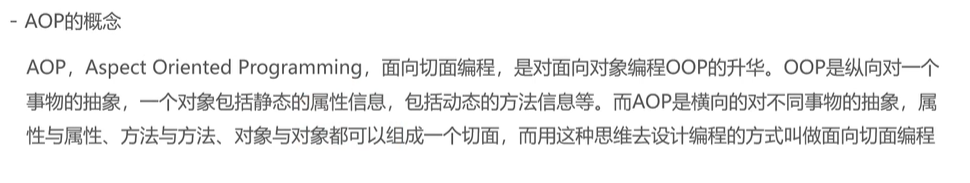
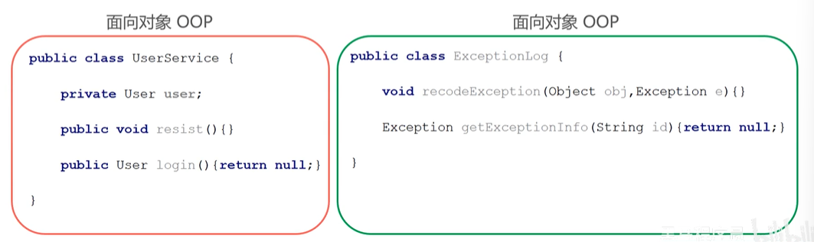
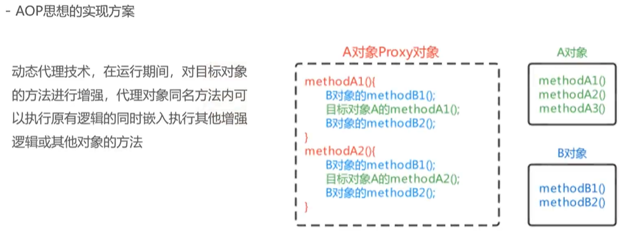
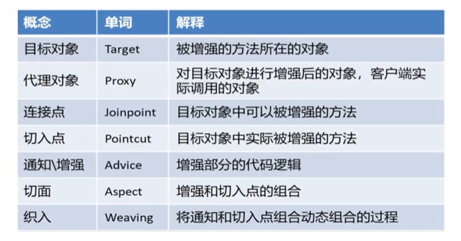
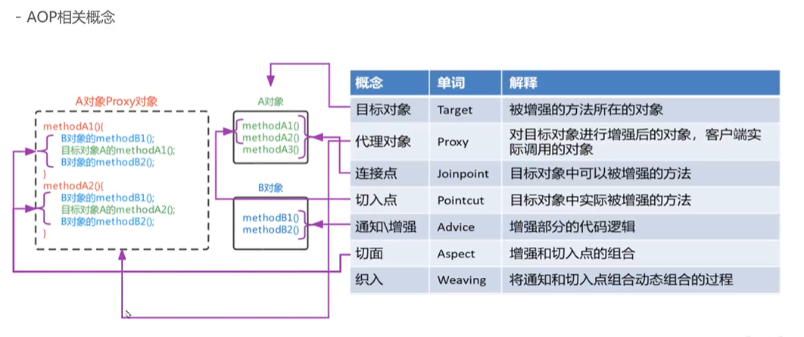

# AOP简介





# AOP思想上的实现方案



# 模拟AOP的基础代码

```java
@Component
public class MyAopBeanPostProcessor implements BeanPostProcessor, ApplicationContextAware {

  // 方式1
  // @Resource
  // private MyAdvice myAdvice;

  // 方式2
  private ApplicationContext applicationContext;

  @Override
  @Nullable
  public Object postProcessAfterInitialization(Object bean, String beanName) throws BeansException {

    // 只要是Service.impl下的包都增强 ：if-else
    // MyAdvic 获取问题：注入到容器中

    Object beanProxy = null;

    System.out.println(bean.getClass().getPackage().getName());

    if (bean.getClass().getPackage().getName().equals("org.example.service.impl")) {
      System.out.println("11111");
      beanProxy = Proxy.newProxyInstance(
          bean.getClass().getClassLoader(),
          bean.getClass().getInterfaces(),
          (proxy, method, args) -> {
            MyAdvice myAdvice = applicationContext.getBean(MyAdvice.class);
            myAdvice.before();
            Object result = method.invoke(bean, args);
            myAdvice.after();
            return result;
          });
    }

    return beanProxy;
  }

  @Override
  @Nullable
  public Object postProcessBeforeInitialization(Object bean, String beanName) throws BeansException {
    // TODO Auto-generated method stub
    return BeanPostProcessor.super.postProcessBeforeInitialization(bean, beanName);
  }

  @Override
  public void setApplicationContext(ApplicationContext applicationContext) throws BeansException {
    this.applicationContext = applicationContext;
  }

}
```

# AOP相关概念




