# 基于xml配置的AOP

## 以前的问题 

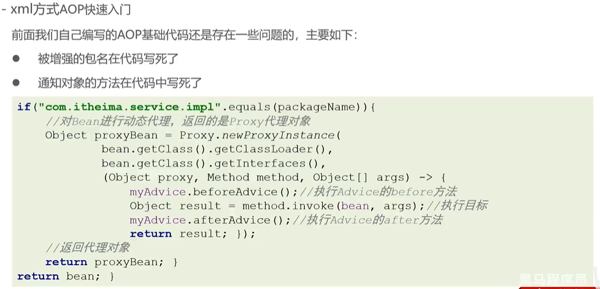

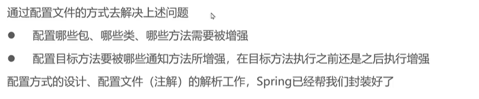 

## xml方式配置AOP快速入门 

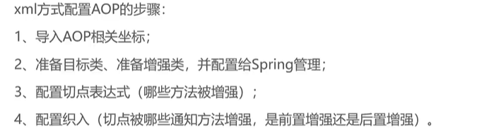

### 1.导入AOP相关坐标;

spring-aop部分来源于aspectj

```xml
    <dependency>
      <groupId>org.aspectj</groupId>
      <artifactId>aspectjweaver</artifactId>
      <version>1.9.6</version>
    </dependency>
```

### 2.准备目标类、准备增强类，并配置给Spring管理

```java
  <bean id="classService" class="org.example.service.ClassServiceImpl">
    <property name="classMapper" ref="classMapper"></property>
  </bean>

  <bean id="myAdvice" class="org.example.advice.MyAdvice"></bean>
```

### 3.配置切点表达式(哪些方法被增强) 和织入

```java
<bean id="classService" class="org.example.service.impl.ClassServiceImpl">
    <property name="classMapper" ref="classMapper"></property>
  </bean>

  <bean id="myAdvice" class="org.example.advice.MyAdvice"></bean>

  <!-- aop配置 -->
  <aop:config>
    <!-- 切点表达式 目的就是要指定哪些方法被增强 -->
    <aop:pointcut id="myPointcut"
      expression="execution(void org.example.service.impl.ClassServiceImpl.show())" />
    <!-- 配置织入，目的是要执行哪些切点与哪些通知进行结合 -->
    <aop:aspect ref="myAdvice">
      <!-- 提供前置增强 -->
      <aop:before method="before" pointcut-ref="myPointcut" />
      <aop:after method="after" pointcut-ref="myPointcut" />
    </aop:aspect>
  </aop:config>
```

## xml方式AOP配置详解

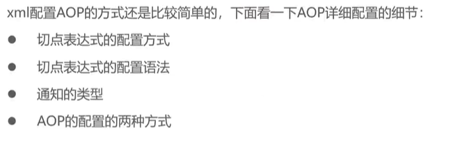

### 1.配置方式

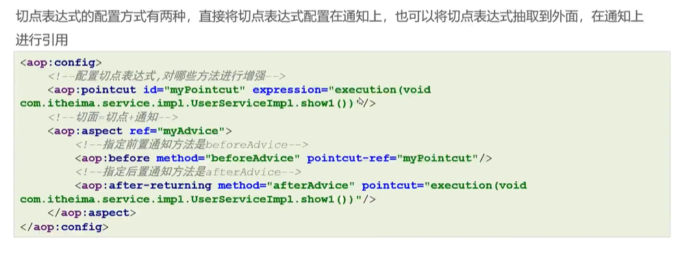

```xml
<!-- aop配置 -->
  <aop:config>
    <!-- 切点表达式 目的就是要指定哪些方法被增强 -->
    <aop:pointcut id="myPointcut"
      expression="execution(void org.example.service.impl.ClassServiceImpl.show())" />
    <aop:pointcut id="myPointcut1"
      expression="execution(void org.example.service.impl.ClassServiceImpl.show1())" />
    <!-- 配置织入，目的是要执行哪些切点与哪些通知进行结合 -->
    <aop:aspect ref="myAdvice">
      <!-- 提供前置增强 -->
      <aop:before method="before" pointcut-ref="myPointcut" />
      <aop:after method="after"
        pointcut="execution(void org.example.service.impl.ClassServiceImpl.show1())" />
    </aop:aspect>
  </aop:config>
```

### 2.配置语法

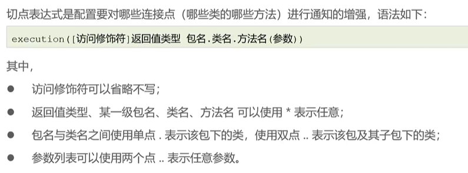

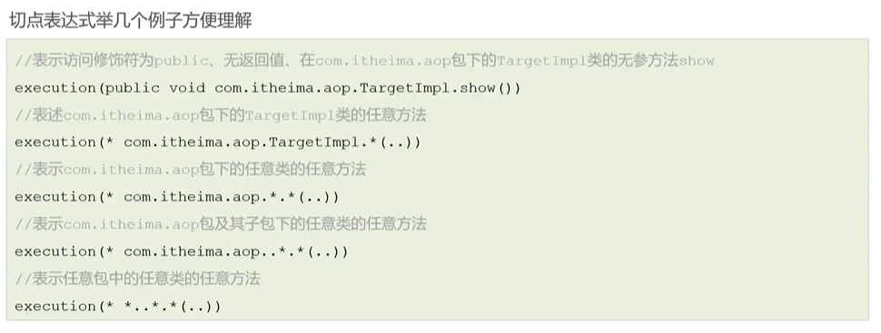

### 3.通知类型

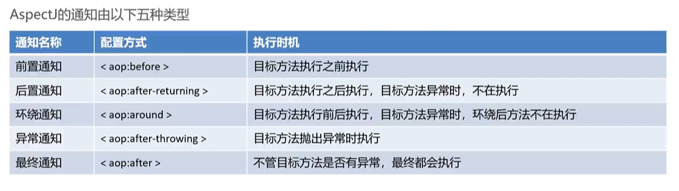

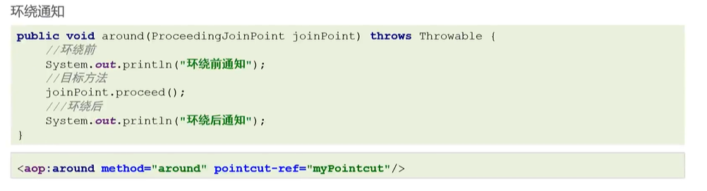

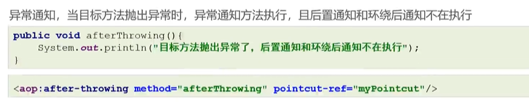

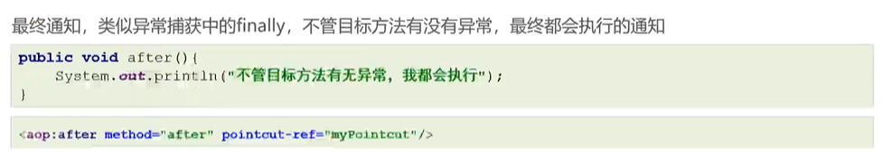

其他传参

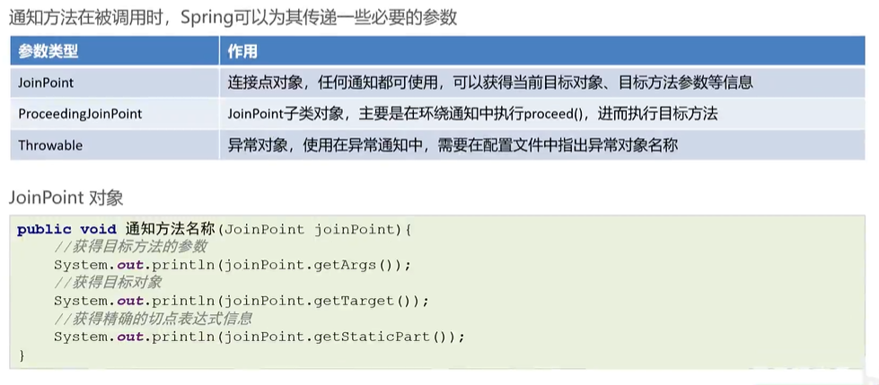

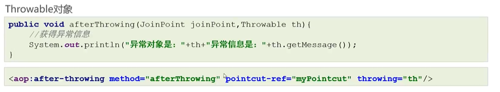

### 4.AOP配置的两种方式

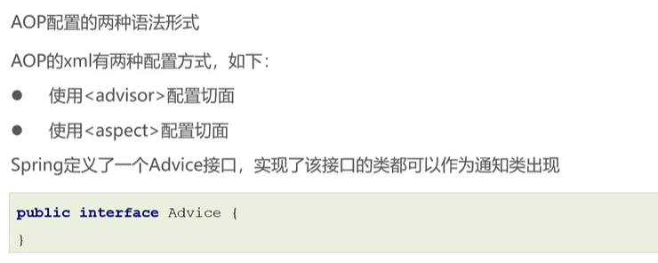

#### advisor

```java
public class MyAdvice03 implements MethodInterceptor {

  @Override
  public Object invoke(MethodInvocation invocation) throws Throwable {
    System.out.println("环绕前");
    // 根据目标方法的引用 获取方法 调用invoke(对象，参数)
    Object res = invocation.getMethod().invoke(invocation.getThis(), invocation.getArguments());
    System.out.println("环绕后");
    return res;
  }

}
```

```java
public class MyAdvice02 implements MethodBeforeAdvice, AfterReturningAdvice {

  @Override
  public void afterReturning(@Nullable Object returnValue, Method method, Object[] args, @Nullable Object target)
      throws Throwable {
    System.out.println("后置");
  }

  @Override
  public void before(Method method, Object[] args, @Nullable Object target) throws Throwable {
    System.out.println("前置");
  }

}
```

```xml
<bean id="classService" class="org.example.service.impl.ClassServiceImpl">
    <property name="classMapper" ref="classMapper"></property>
  </bean>

  <bean id="myAdvice2" class="org.example.advice.MyAdvice02"></bean>

  <!-- aop配置 -->
  <aop:config>
    <!-- 切点表达式 目的就是要指定哪些方法被增强 -->
    <aop:pointcut id="myPointcut"
      expression="execution(void org.example.service.impl.ClassServiceImpl.show())" />
  
    <aop:advisor advice-ref="myAdvice2" pointcut-ref="myPointcut" />
  </aop:config>
```

#### aspect

```java
public class MyAdvice {
  public void before() {
    System.out.println("before");
  }
  public void after() {
    System.out.println("after");
  }
}
```

```xml
<bean id="classService" class="org.example.service.impl.ClassServiceImpl">
    <property name="classMapper" ref="classMapper"></property>
  </bean>

  <bean id="myAdvice" class="org.example.advice.MyAdvice"></bean>

<!-- aop配置 -->
  <aop:config>
    <!-- 切点表达式 目的就是要指定哪些方法被增强 -->
    <aop:pointcut id="myPointcut"
      expression="execution(void org.example.service.impl.ClassServiceImpl.show())" />
    <aop:pointcut id="myPointcut1"
      expression="execution(void org.example.service.impl.ClassServiceImpl.show1())" />
    <!-- 配置织入，目的是要执行哪些切点与哪些通知进行结合 -->
    <aop:aspect ref="myAdvice">
      <!-- 提供前置增强 -->
      <aop:before method="before" pointcut-ref="myPointcut" />
      <aop:after method="after"
        pointcut="execution(void org.example.service.impl.ClassServiceImpl.show1())" />
    </aop:aspect>
  </aop:config>
```

#### 两种方式的不同点

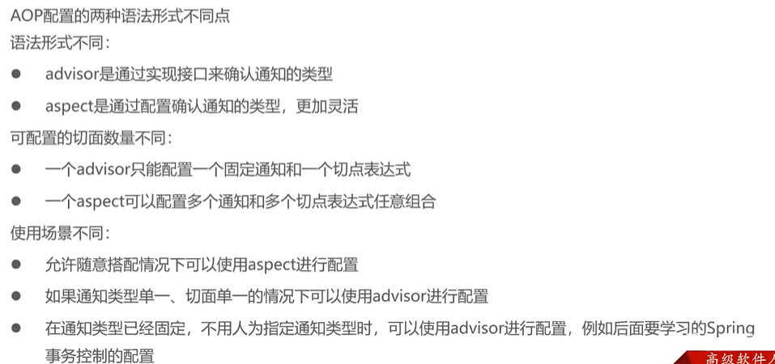

## xml方式AOP原理剖析

### 原理解析

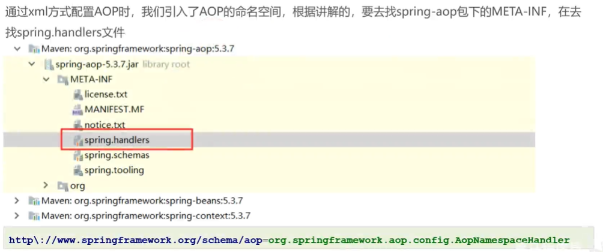

注册解析器，本质是一个BeanPostProcessor

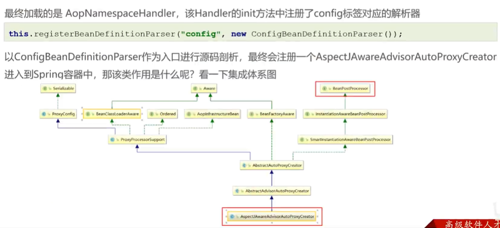

在postProcessAfterlnitialization方法中判断是否生成代理对象

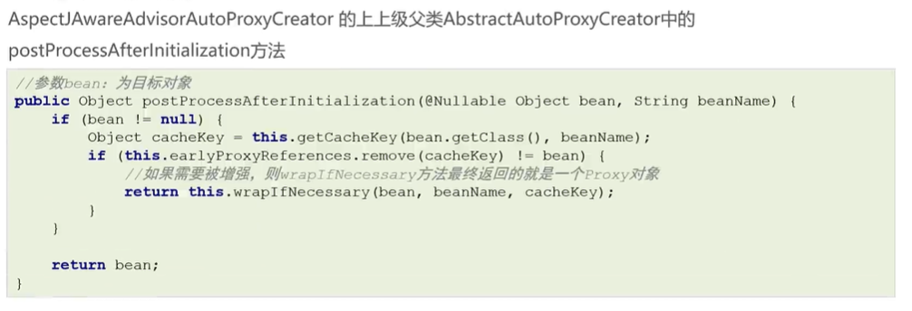

如果要生成代理对象，其最终使用的是jdk代理方式

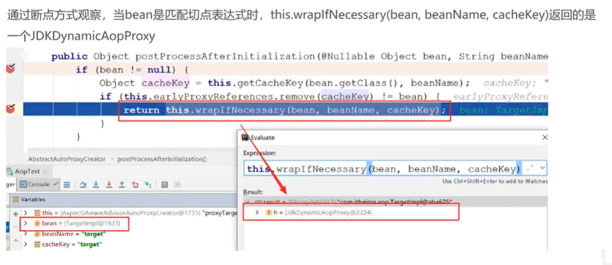

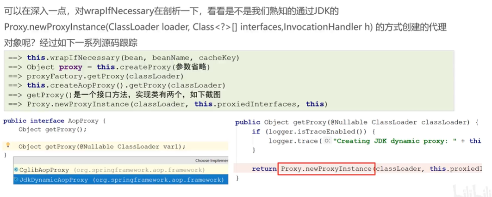

最终生成的代理对象

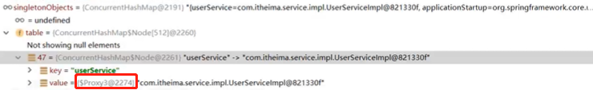

### 动态代理区别

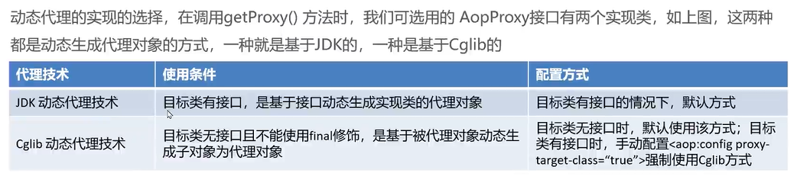

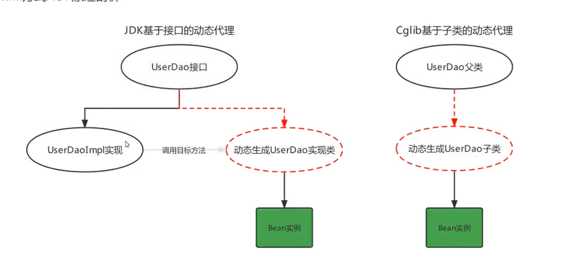

实现

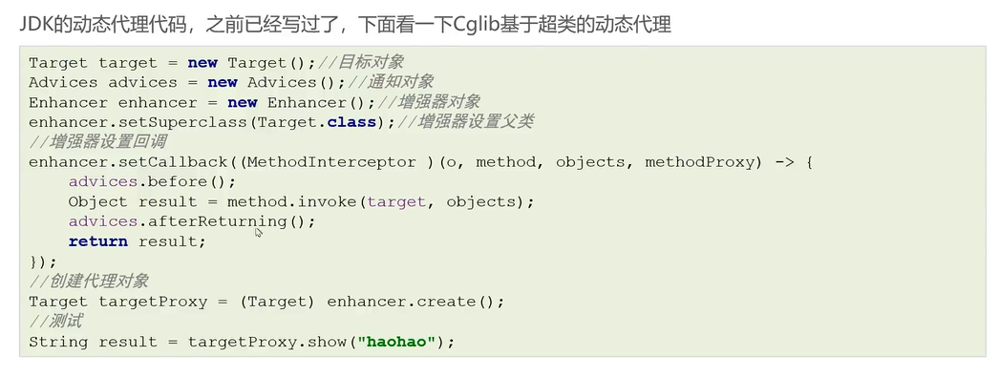
