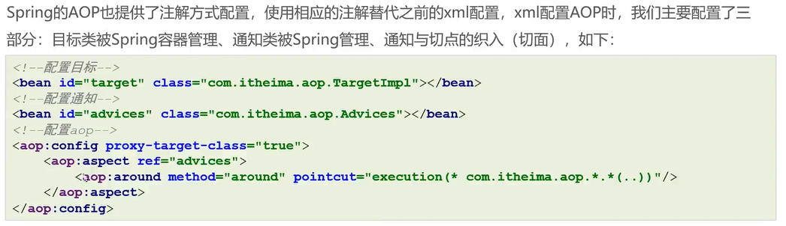
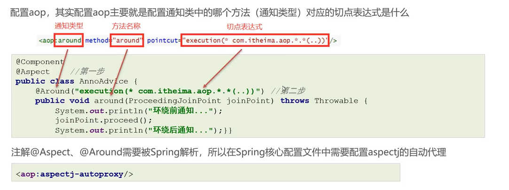
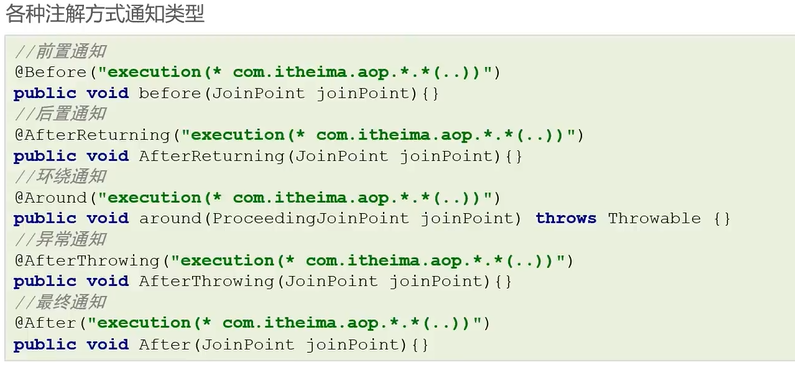
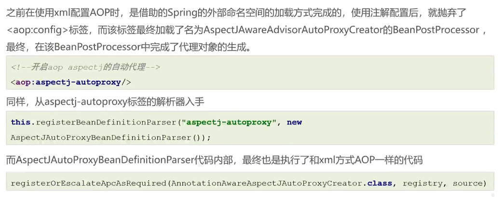
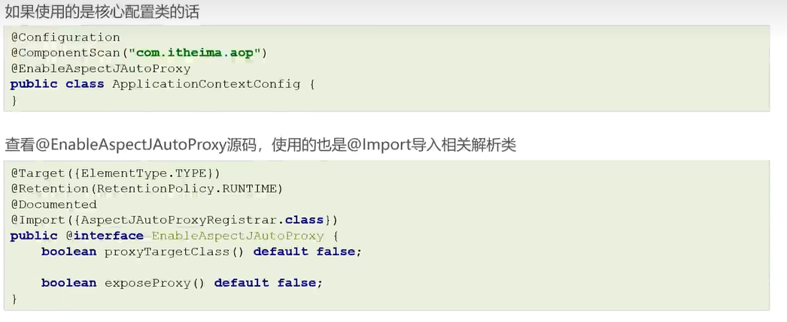
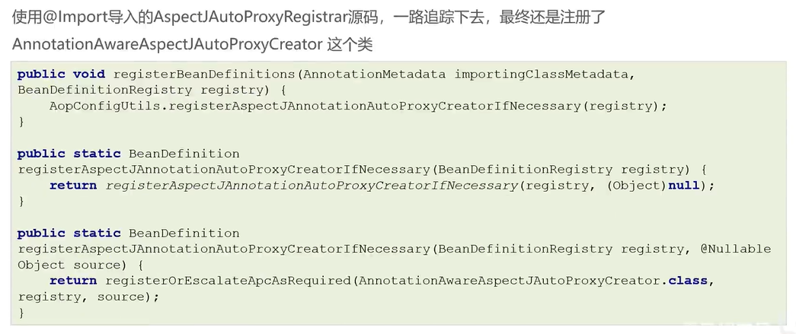
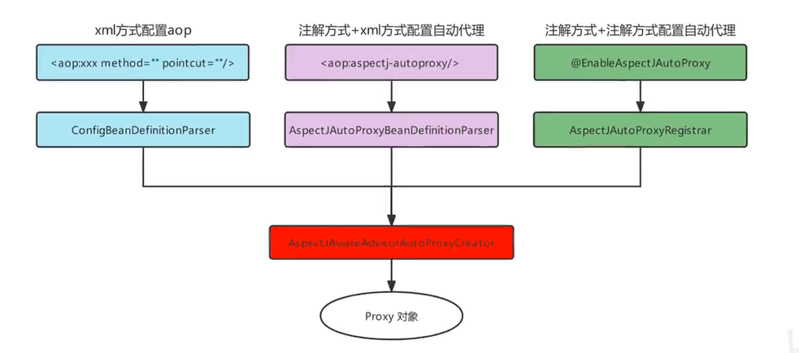

# 基于注解配置的AOP

## 注解方式AOP基本使用





## 注解方式AOP配置详解



1. @Before：在方法执行前执行通知

```java
@Aspect
@Component
public class LogAspect {
    @Before("execution(* com.example.demo.service.UserService.getUser(..))")
    public void before(JoinPoint joinPoint) {
        System.out.println("Before method " + joinPoint.getSignature().getName() + " executes");
    }
}
```

2. @AfterReturning：在方法正常返回后执行通知

```java
@Aspect
@Component
public class LogAspect {
    @AfterReturning(pointcut = "execution(* com.example.demo.service.UserService.getUser(..))", returning = "result")
    public void afterReturning(JoinPoint joinPoint, Object result) {
        System.out.println("After method " + joinPoint.getSignature().getName() + " executes with result: " + result);
    }
}
```

3. @AfterThrowing：在方法抛出异常后执行通知

```java
@Aspect
@Component
public class LogAspect {
    @AfterThrowing(pointcut = "execution(* com.example.demo.service.UserService.getUser(..))", throwing = "ex")
    public void afterThrowing(JoinPoint joinPoint, Exception ex) {
        System.out.println("Exception thrown in method " + joinPoint.getSignature().getName() + ": " + ex.getMessage());
    }
}
```

4. @After：在方法执行后执行通知

```java
@Aspect
@Component
public class LogAspect {
    @After("execution(* com.example.demo.service.UserService.getUser(..))")
    public void after(JoinPoint joinPoint) {
        System.out.println("After method " + joinPoint.getSignature().getName() + " executes");
    }
}
```

5. @Around：在方法执行前后都执行通知

```java
@Aspect
@Component
public class LogAspect {
    @Around("execution(* com.example.demo.service.UserService.getUser(..))")
    public Object around(ProceedingJoinPoint joinPoint) throws Throwable {
        String methodName = joinPoint.getSignature().getName();
        Object[] args = joinPoint.getArgs();
        // 执行方法前打印日志
        System.out.println("Before method " + methodName + " executes with args: " + Arrays.toString(args));
        Object result = joinPoint.proceed();
        // 执行方法后打印日志
        System.out.println("After method " + methodName + " executes with result: " + result);
        return result;
    }
}
```

`@Around`  通知是唯一一种具有返回值的通知类型，其他四种通知类型（ `@Before` 、 `@After` 、 `@AfterReturning` 、 `@AfterThrowing` ）都没有返回值。这是因为  `@Around`  通知可以完全掌控被代理方法的执行过程，包括方法的输入参数和返回值，因此可以自由地修改方法的返回值或者抛出异常，从而对调用方返回不同的结果或者异常信息。

而其他四种通知类型只能在方法执行前、执行后、正常返回或者抛出异常时执行一些额外的逻辑，无法对方法的返回值或者异常信息进行修改。因此，这些通知类型都没有返回值。

需要注意的是，虽然  `@Around`  通知具有返回值，但是如果被代理方法本身没有返回值，那么  `@Around`  通知也可以不返回任何值。此时， `@Around`  通知的返回值类型应该和被代理方法的返回值类型一致，或者是被代理方法返回值类型的子类型。如果返回值类型不一致，那么可能会导致类型转换异常。

## 定义切入点表达式

Spring AOP中有多种定义切入点表达式的方法，以下是其中一些常见的方法：

1. execution：使用execution表达式可以匹配方法的执行。例如，“execution（* com.example.service.*.*(..)）”将匹配com.example.service包中所有类的所有方法。
2. within：使用within表达式可以匹配指定包中的所有方法。例如，“within（com.example.service.*）”将匹配com.example.service包中的所有方法。
3. this：使用this表达式可以匹配当前代理对象所实现的接口类型。例如，“this（com.example.service.MyService）”将匹配实现MyService接口的所有类的所有方法。
4. target：使用target表达式可以匹配目标对象实现的接口类型。例如，“target（com.example.service.MyService）”将匹配实现MyService接口的所有类的所有方法。
5. args：使用args表达式可以匹配方法参数类型。例如，“args（java.lang.String）”将匹配所有参数类型为java.lang.String的方法。
6. @annotation：使用@annotation表达式可以匹配带有指定注解的方法。例如，“@annotation（org.springframework.transaction.annotation.Transactional）”将匹配所有带有@Transactional注解的方法。
7. bean：使用bean表达式可以匹配指定名称的bean上的所有方法。例如，“bean（myService）”将匹配名为myService的bean上的所有方法。
   这些表达式可以组合使用来定义更复杂的切入点表达式，以便更精确地匹配目标方法。

## 注解方式AOP原理剖析








