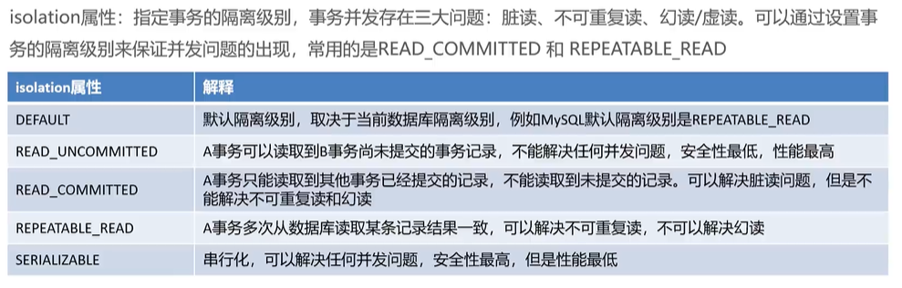

# 基于xml声明式事务控制


## 快速入门

```xml
<bean id="classService" class="org.example.service.impl.ClassServiceImpl">
    <property name="classMapper" ref="classMapper"></property>
  </bean>

  <!-- 配置平台事务管理器 -->
  <bean id="transactionManager" class="org.springframework.jdbc.datasource.DataSourceTransactionManager">
    <property name="dataSource" ref="dataSource"></property>
  </bean>

  <!-- spring定义好的事务 -->
  <!-- transactionManager事务管理器 -->
  <tx:advice id="txAdvice" transaction-manager="transactionManager">
    <tx:attributes>
      <!-- 所以方法都进行事务操作 -->
      <tx:method name="*" />
    </tx:attributes>
  </tx:advice>

  <!-- aop配置 -->
  <aop:config>
    <!-- 切点表达式 目的就是要指定哪些方法被增强 -->
    <aop:pointcut id="myPointcut"
      expression="execution(void org.example.service.impl.*.*(..))" />
    <aop:advisor advice-ref="txAdvice" pointcut-ref="myPointcut" />
  </aop:config>


<bean class="org.mybatis.spring.SqlSessionFactoryBean">
    <property name="dataSource" ref="dataSource"></property>
  </bean>

  <bean class="org.mybatis.spring.mapper.MapperScannerConfigurer">
    <property name="basePackage" value="org.example.mapper"></property>
  </bean>

  <context:property-placeholder location="classpath:db.properties" />

  <bean id="dataSource" class="com.alibaba.druid.pool.DruidDataSource">
    <property name="driverClassName" value="${jdbc.driverClassName}"></property>
    <property name="url" value="${jdbc.url}"></property>
    <property name="username" value="${jdbc.username}"></property>
    <property name="password" value="${jdbc.password}"></property>
  </bean>
```

## 配置详细

### name

使用事务的方法

```xml
<!-- 配置不同的方法的事务属性 -->
<!-- name:方法名称 -->
<!-- 添加操作：add* ;修改操作：update* ;删除操作：delete*-->
<tx:method name="update*" />  
<tx:method name="delete*"/>  
<tx:method name="add*" />
<!-- 写在最后保底工作 -->
<tx:method name="*" />
```

### isolation

事务隔离级别



### timeout和read-only


### propagation

事务的传播行为，一般不做修改


## 原理解析

总结：parser注册了一个环绕通知，通知判断方法是否需要增强，如果需要就在方法前后进行增强。增强的逻辑就是借助ptm进行事务控制。完全就是AOP那一套
