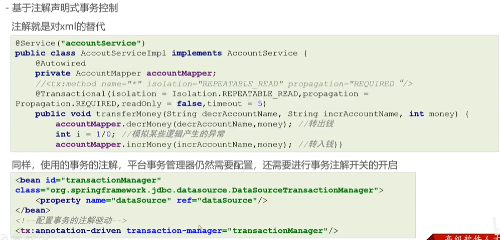

# 基于注解声明式事务控制



## 使用流程

开启事务的自动代理

```java
...
@EnableTransactionManagement
public class SpringConfig {

}
```

编写事务管理器

因此，在 Spring 声明式事务中，`dataSourceTransactionManager` 和 `transactionManager` 注解属性都可以使用的原因是，两者都是 Spring 框架内部已经实现的默认事务管理器的别名或简化名称。使用其中任何一个都会获取 Spring 容器中的默认事务管理器 bean，并使用它进行事务控制。所以，无论使用哪一个名称都没有影响。

```java
@Configuration
public class TransactionConfig {
  @Bean
  public DataSourceTransactionManager dataSourceTransactionManager(DataSource datasource) {
    DataSourceTransactionManager dataSourceTransactionManager = new DataSourceTransactionManager(datasource);
    return dataSourceTransactionManager;
  }
}
```

在需要事务的类（类内全局）或方法（单独）上写标记事务的注解@Transactional

```java
@Component("classService")
@Transactional(isolation = Isolation.READ_COMMITTED, propagation = Propagation.REQUIRED, readOnly = false)
public class ClassServiceImpl implements ClassService {

  @Resource
  private ClassMapper classMapper;

  @Override
  public void show() {
    System.out.println(classMapper.findAll());
  }

  @Override
  public void show1() {
    System.out.println(classMapper.findAll());
  }

  @Override
  @Transactional(isolation = Isolation.READ_COMMITTED, propagation = Propagation.REQUIRED, readOnly = false)
  public void update() {
    classMapper.update("cl0001", "奥里给");
    int i = 1/0;
    classMapper.update("cl0001", "奥里给1");
  }

}
```
