# Spring的后处理器*（ioc aop）

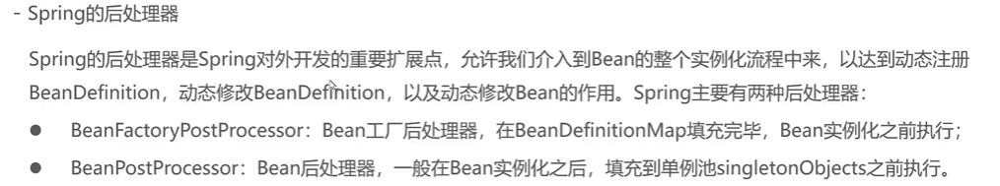

## BeanFactoryPostProcessor

注册于Spring容器中，Spring就会在实例化之前调用该对象方法

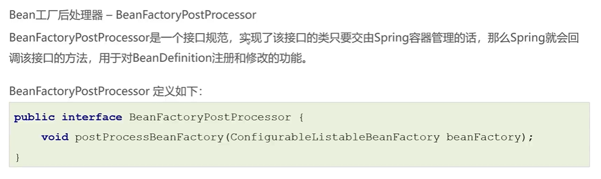

### 实现

修改某个BeanDefinition的BeanClassName

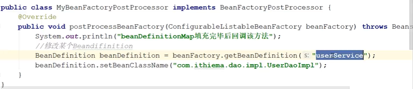

动态注册BeanDefinition

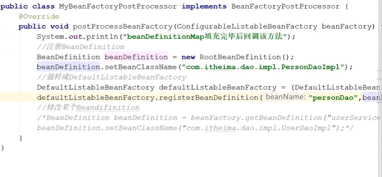

### 配置到容器中


### 利用其子类快速注册BeanDefinition

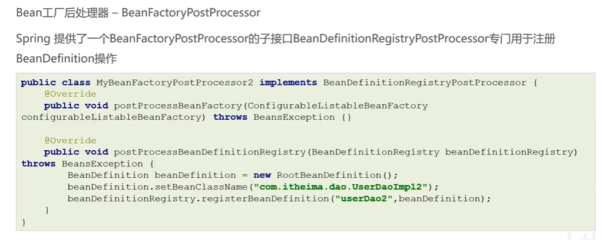

### 调用执行顺序

BeanDefinitionRegistryPostProcessor->BeanFactoryPostProcessor


### BeanFactoryPostProcessor 在SpringBean的实例化过程中的体现

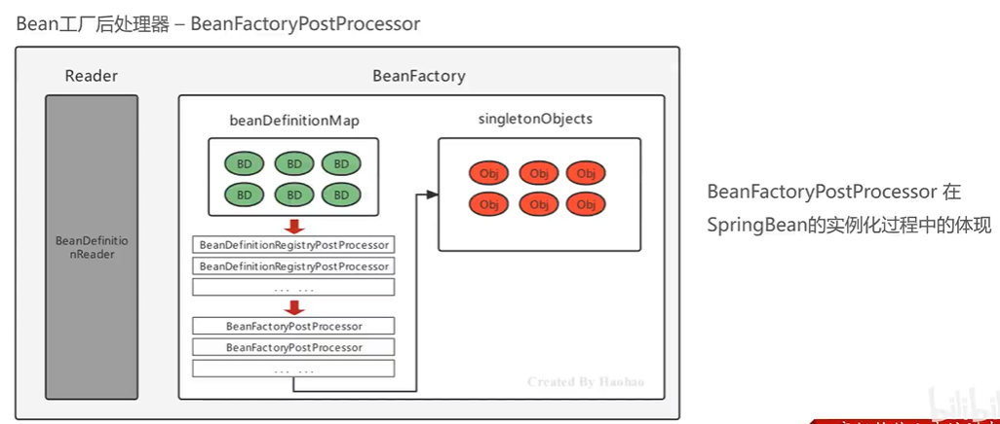

### 自定义注册注解@Component

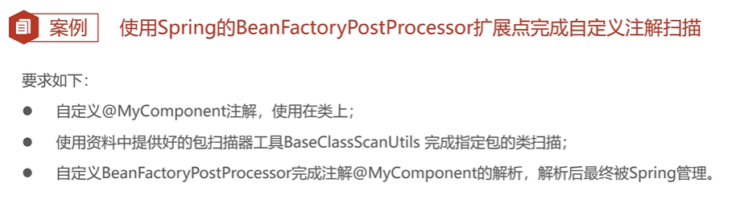

#### 扫描注解工具类

```java
package org.example.utils;

import org.example.dao.MyComponent;
import org.springframework.core.io.Resource;
import org.springframework.core.io.support.PathMatchingResourcePatternResolver;
import org.springframework.core.io.support.ResourcePatternResolver;
import org.springframework.core.type.classreading.CachingMetadataReaderFactory;
import org.springframework.core.type.classreading.MetadataReader;
import org.springframework.core.type.classreading.MetadataReaderFactory;
import org.springframework.util.ClassUtils;

import java.lang.annotation.Annotation;
import java.util.HashMap;
import java.util.List;
import java.util.Map;

public class BaseClassScanUtils {

  // 设置资源规则
  private static final String RESOURCE_PATTERN = "/**/*.class";

  public static Map<String, Class> scanMyComponentAnnotation(String basePackage) {

    // 创建容器存储使用了指定注解的Bean字节码对象
    Map<String, Class> annotationClassMap = new HashMap<String, Class>();

    // spring工具类，可以获取指定路径下的全部类
    ResourcePatternResolver resourcePatternResolver = new PathMatchingResourcePatternResolver();
    try {
      String pattern = ResourcePatternResolver.CLASSPATH_ALL_URL_PREFIX +
          ClassUtils.convertClassNameToResourcePath(basePackage) + RESOURCE_PATTERN;
      Resource[] resources = resourcePatternResolver.getResources(pattern);
      // MetadataReader 的工厂类
      MetadataReaderFactory refractory = new CachingMetadataReaderFactory(resourcePatternResolver);
      for (Resource resource : resources) {
        // 用于读取类信息
        MetadataReader reader = refractory.getMetadataReader(resource);
        // 扫描到的class
        String classname = reader.getClassMetadata().getClassName();
        Class<?> clazz = Class.forName(classname);
        // 判断是否属于指定的注解类型
        if (clazz.isAnnotationPresent(MyComponent.class)) {
          // 获得注解对象
          MyComponent annotation = clazz.getAnnotation(MyComponent.class);
          // 获得属value属性值
          String beanName = annotation.value();
          // 判断是否为""
          if (beanName != null && !beanName.equals("")) {
            // 存储到Map中去
            annotationClassMap.put(beanName, clazz);
            continue;
          }

          // 如果没有为"",那就把当前类的类名作为beanName
          annotationClassMap.put(clazz.getSimpleName(), clazz);

        }
      }
    } catch (Exception exception) {
    }

    return annotationClassMap;
  }

  public static void main(String[] args) {
    Map<String, Class> stringClassMap = scanMyComponentAnnotation("org.example");
    System.out.println(stringClassMap);
  }
}

```

#### 定义注解

```java
//类上使用
@Target(ElementType.TYPE)
//存活范围(运行时可见)
@Retention(RetentionPolicy.RUNTIME)
public @interface MyComponent {

  String value();

}
```

#### 使用注解

```java

@MyComponent("PersionDao")
public class PersionDao {
  
}
```

#### 使用和注册Bean处理器

```java
/**
 * MyComPonentBeanFactoryPostProcessor
 */
public class MyComPonentBeanFactoryPostProcessor implements BeanDefinitionRegistryPostProcessor {

  @Override
  public void postProcessBeanFactory(ConfigurableListableBeanFactory beanFactory) throws BeansException {
  }

  @Override
  public void postProcessBeanDefinitionRegistry(BeanDefinitionRegistry registry) throws BeansException {
    // 通过扫描工具取指定包及其包下的所有类，收集使用@MyComponent的类
    Map<String, Class> map = BaseClassScanUtils.scanMyComponentAnnotation("org.example");
    map.forEach((beanName, clazz) -> {
      String beanClassName = clazz.getName();
      BeanDefinition beanDefinition = new RootBeanDefinition();
      beanDefinition.setBeanClassName(beanClassName);
      registry.registerBeanDefinition(beanName, beanDefinition);
      System.out.println("注解注册了" + beanName);
    });

  }
}
```

```xml
<bean class="org.example.processor.MyComPonentBeanFactoryPostProcessor"></bean>
```

## BeanPostProcesser

注册于Spring容器中，Spring就会在实例化（创建对象）之后，缓存到单例池之前调用该对象方法

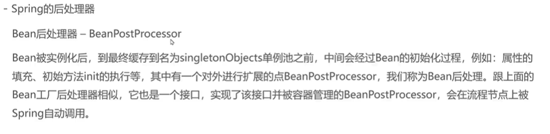

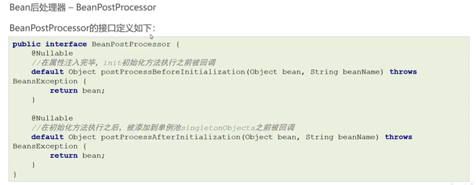

### 实现

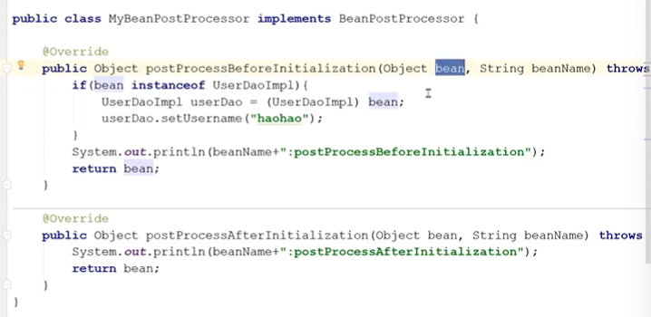

### 执行时机

实例化->before->InitializingBean->init->after

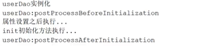

### 日志增强案例

使用动态代理，增强原有对象

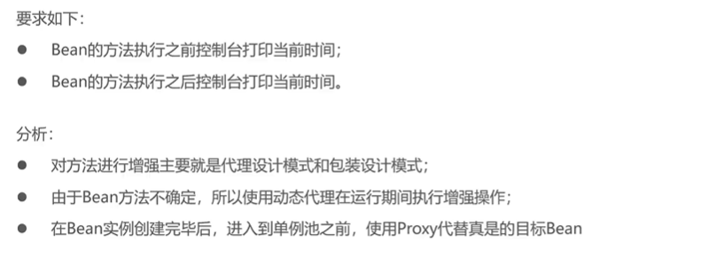

实现


## 两者流程完善

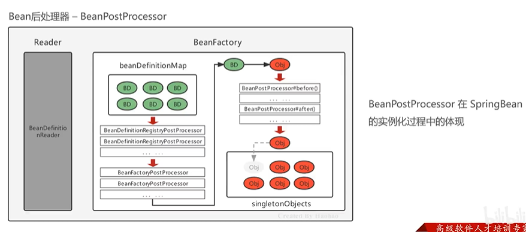
