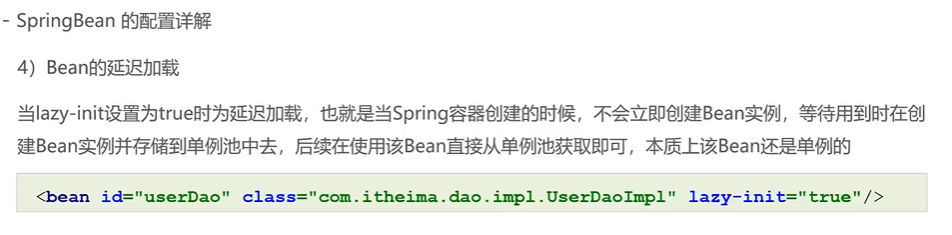
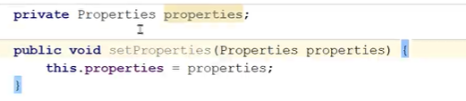
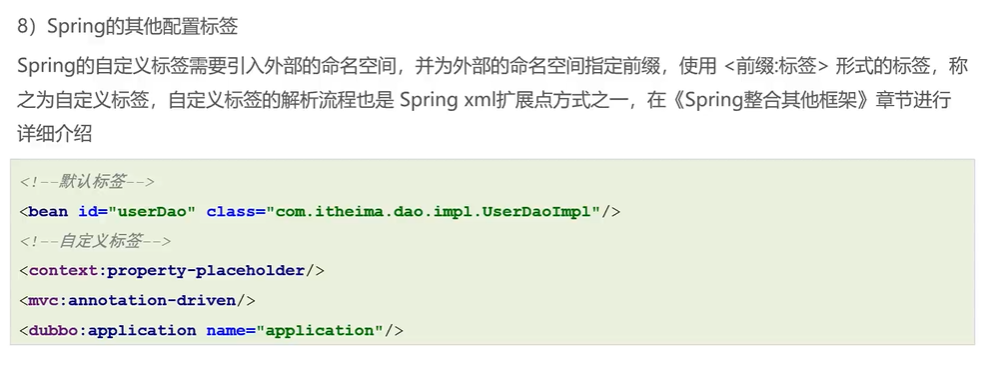

# SpringBean的配置详解

ApplicationContext的配置

## Bean的id和全限定名

beanName的存储

### 配置id的bean

### 未配置id的bean

依据全限定名

## Bean的别名配置

### 配置id

存于applicationcontext下的aliasMap映射

### 未配置id

如果未配置id而配置别名，则别名的第一个就是beanName

## Bean的作用范围

原生环境下的Spring的bean作用范围

webmvc环境下的Spring的bean作用范围

## Bean的延迟加载

类似懒汉式，跟beanFactory的形式

## Bean初始化方法和销毁方法配置

销毁需要显式的销毁

InitializingBean(初始化操作，但时机要早一步)

## Bean实例化配置

### 构造方法实例化

constructor-arg：代表的是构造参数，而不是构造方法的参数

### 工厂方式实例化

#### 静态工厂方法实例化Bean

可以做额外操作，或第三方Bean。

无参

有参

#### 实例工厂方法实例化Bean

(可以做额外操作，或第三方Bean)

无参

有参

#### 实现FactoryBean规范延迟实例化Bean

上方的factory-method为此处的getObject()，如果实现了FactoryBean则不需要特别指明factory-method指向的方法，且只有getBean才加载实例

实现类

#### 工厂方式实例化区别

前两种

实现FactoryBean规范

真正的缓存区域，且是延迟加载的（加载配置文件时加载FactoryBean实例，但只有在getBean时才真正调用getObject获取实例且存入缓存，以后再次调用就去缓存中取）

## Bean的依赖注入方式

### setter

#### List

注入bean方式1(以下省略)

注入bean方式2

#### Set

注入bean方式

#### Map

注入bean方式

#### Properties

注入bean方式

### 扩展：自动装配方式

## Spring的其他配置标签

### 默认标签

#### beans

环境设置

如果在加载xml文件未指明环境，则会使用【默认环境】，如果需要使用上上图的方案激活指定环境，注：默认环境属于公共部分

#### import

#### alias

### 自定义标签

