# Bean的生命周期

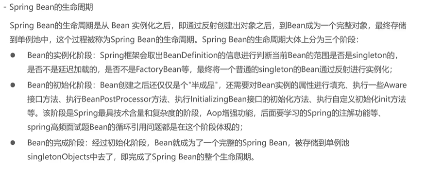

## 实例化阶段

## 初始化阶段*

每个bean的初始化步骤都不是统一操作的

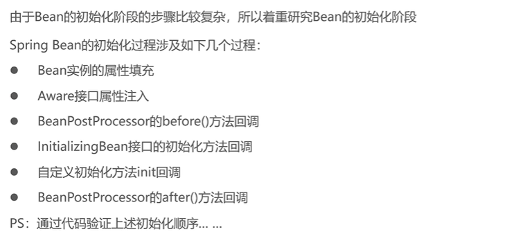

### Bean实例的属性填充

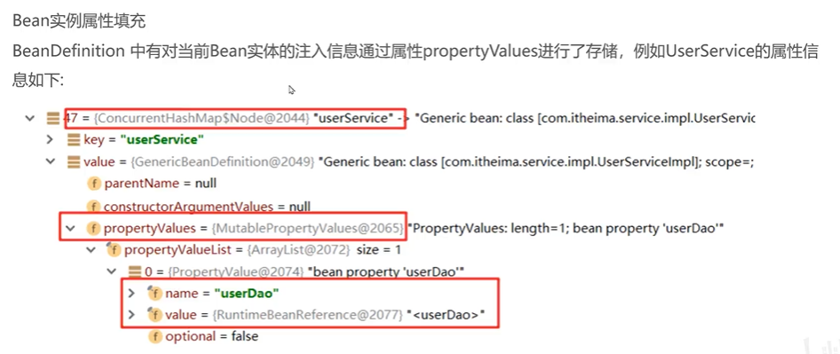

#### Bean属性填充的三种情况

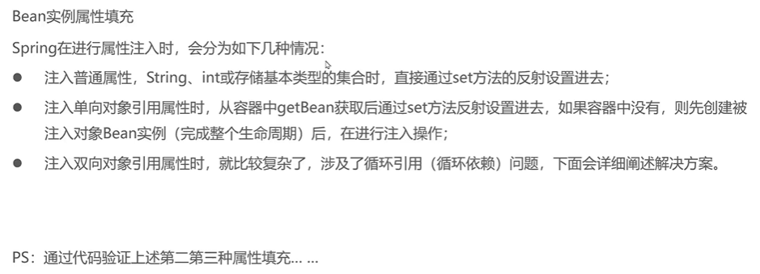

1. 注入普通属性
2. 单向对象引用*（递归）
3. 双向对象引用（循环依赖）**（递归）

##### 单向引用案例

引用存在

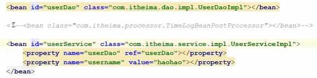

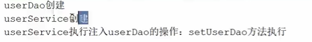

引用不存在

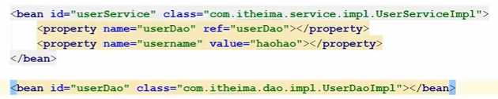

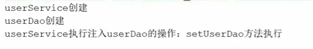

##### 双向引用案例

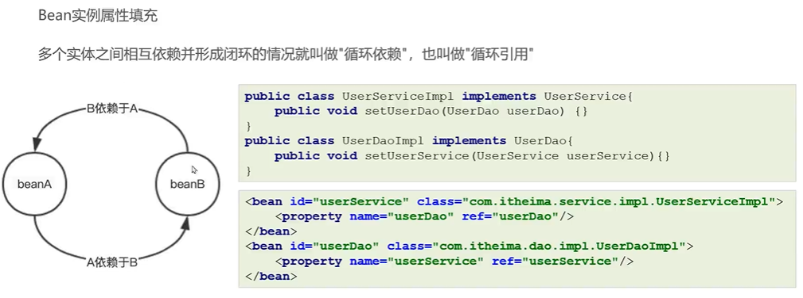

死循环

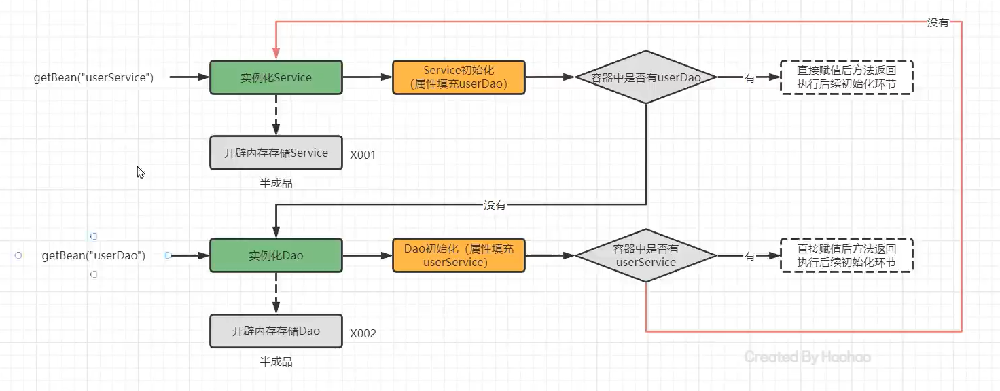

由此引出三级缓存

###### 三级缓存

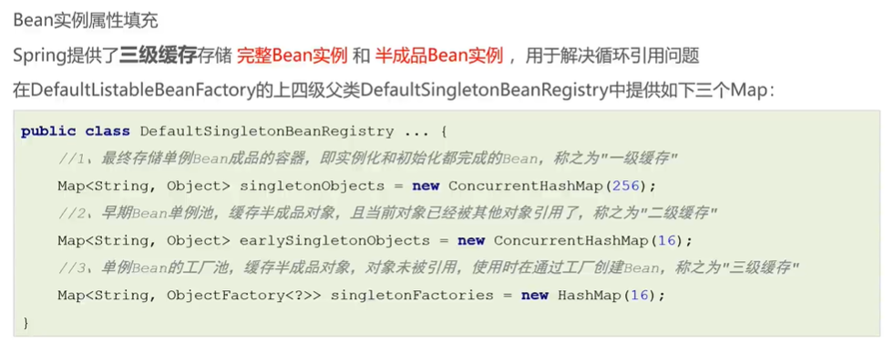

提供半成品对象

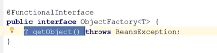

文字描述步骤：

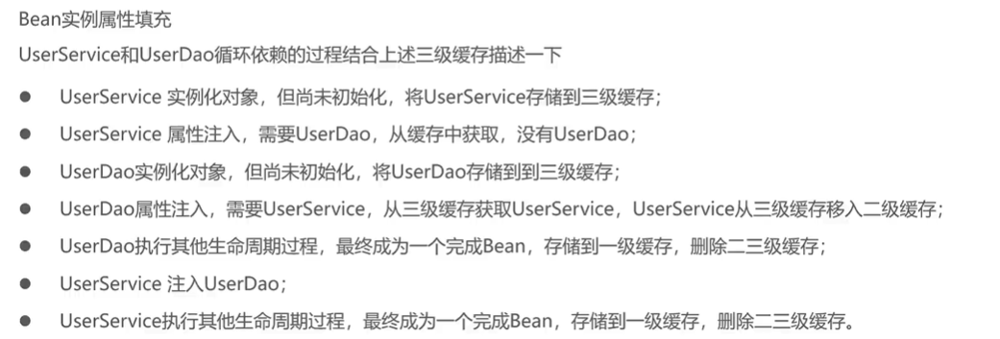

迭代描述步骤：

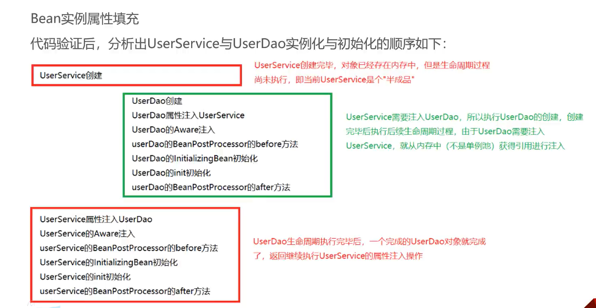

流程图描述步骤：

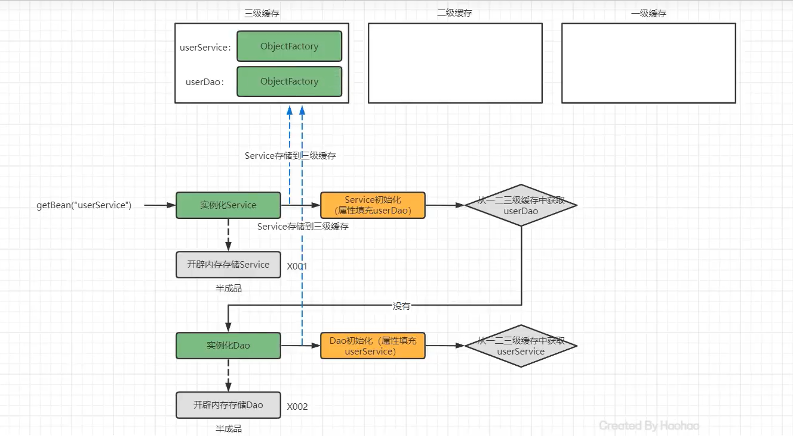

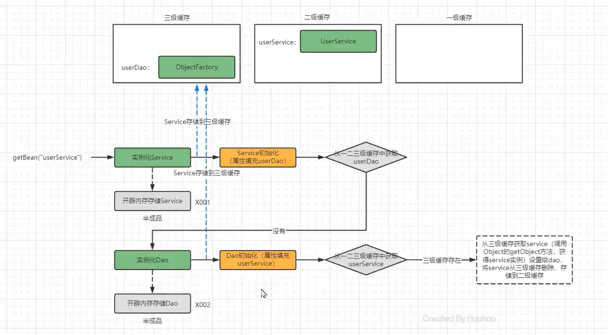

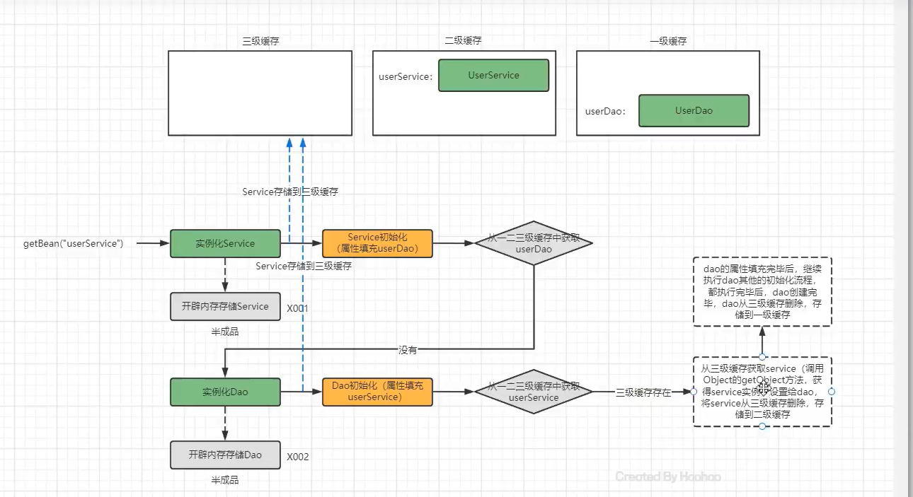

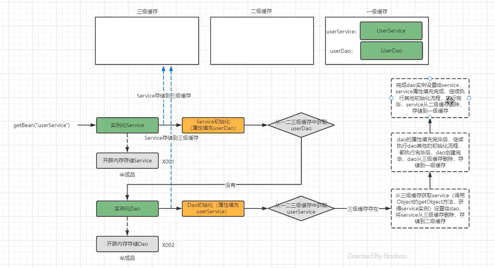

三级缓存大图步骤：

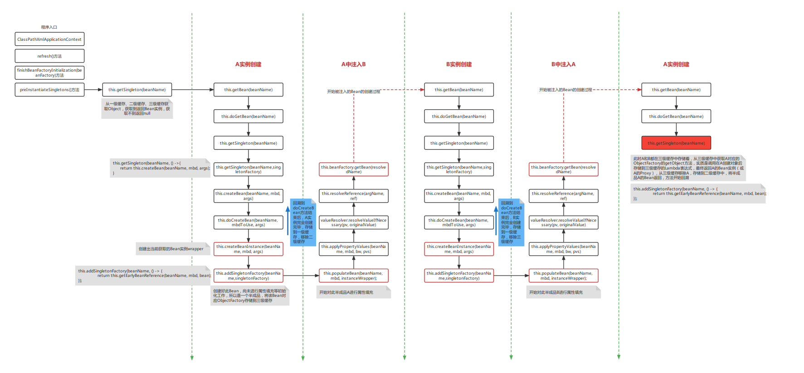

### Aware接口属性注入

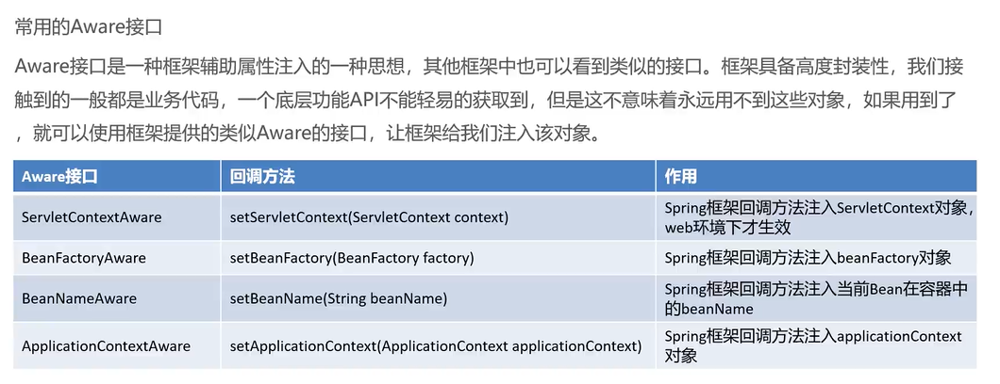

Spring Aware接口可以让Bean获得Spring容器的服务，可以用在以下场景中：

1. Bean可以使用ApplicationContext获取其他Bean；
2. Bean可以使用ApplicationContext来发布事件；
3. Bean可以使用ApplicationContext来获取文件资源；
4. Bean可以使用ApplicationContext来获取系统属性或环境变量。

所需依赖

```xml
<dependency>
      <groupId>javax.servlet</groupId>
      <artifactId>javax.servlet-api</artifactId>
      <version>3.1.0</version>
      <scope>provided</scope>
</dependency>
<dependency>
      <groupId>org.springframework</groupId>
      <artifactId>spring-webmvc</artifactId>
      <version>5.2.0.RELEASE</version>
</dependency>
<dependency>
      <groupId>org.springframework</groupId>
      <artifactId>spring-web</artifactId>
      <version>5.2.0.RELEASE</version>
</dependency>
```

```java
public class UserServiceImpl
    implements UserService, ServletContextAware, ApplicationContextAware, BeanFactoryAware, BeanNameAware {
  // BeanFactory去调用此方法 从容器中获得userDao并设置到此处
  public void setUserDao(UserDao UserDao) {
    System.out.println("userDao被设置了");
  }

  @Override
  public int name() throws InterruptedException {
    Thread.sleep(1000);
    return 1;
  }

  @Override
  public void setServletContext(ServletContext servletContext) {
    //只有web环境下才打印
    System.out.println(servletContext);
  }

  @Override
  public void setApplicationContext(ApplicationContext applicationContext) throws BeansException {
    System.out.println(applicationContext);
  }

  @Override
  public void setBeanName(String name) {
    System.out.println(name);
  }

  @Override
  public void setBeanFactory(BeanFactory beanFactory) throws BeansException {
    System.out.println(beanFactory);
  }

}


/*
userService

org.springframework.beans.factory.support.DefaultListableBeanFactory@333291e3: defining beans [org.example.processor.MyComPonentBeanFactoryPostProcessor#0,org.example.processor.MyBeanPostProcessor#0,userService,userDao,PersionDao]; root of factory hierarchy

org.springframework.context.support.ClassPathXmlApplicationContext@5649fd9b, started on Mon May 22 13:54:47 CST 2023
*/
```

### BeanPostProcessor的before()方法回调

实例化后-初始化前

### InitializingBean接口的初始化方法回调

更早的初始化

### 自定义初始化方法init回调

初始化

### BeanPostProcessor的after()方法回调

实例化后-初始化后

## 完成阶段
