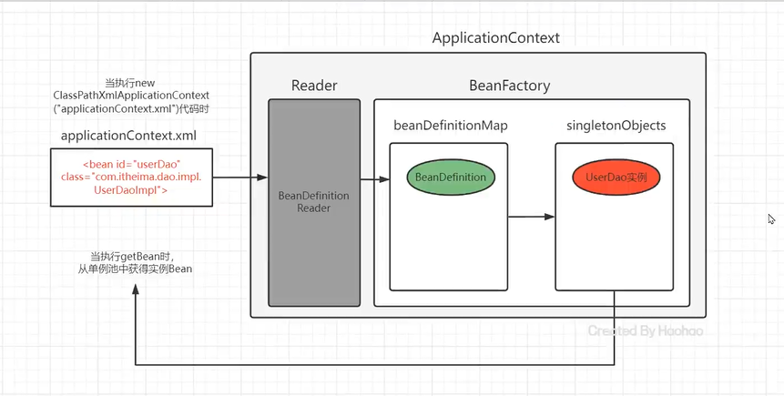
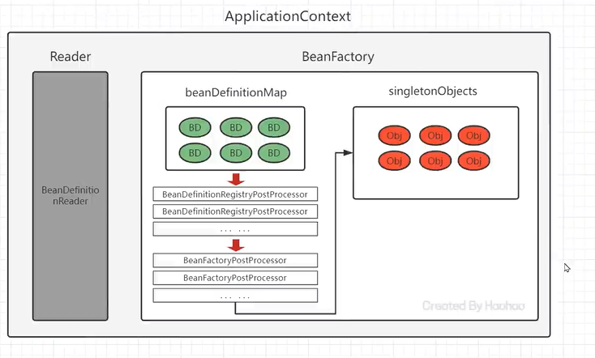
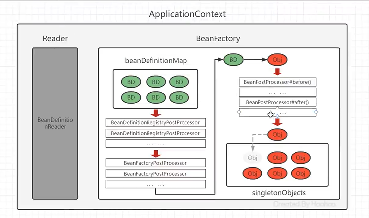
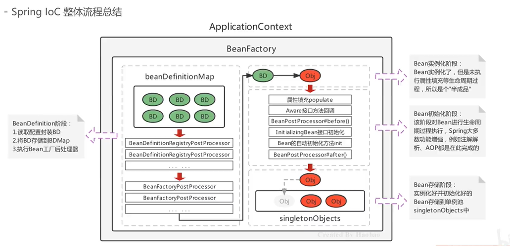

# IOC流程总结

## 从无到有

关键：BeanDefinition（bean定义）、BeanDefinitionMap、singletonObjects（单例池）

关键：BeanFactoryPostProcessor、BeanPostProcesser、实例化前修改、手动注册

关键：BeanPostProcessor【before、after】、功能增强（属性修改、动态代理）

关键：两个总阶段

