# xml方式整合第三方框架

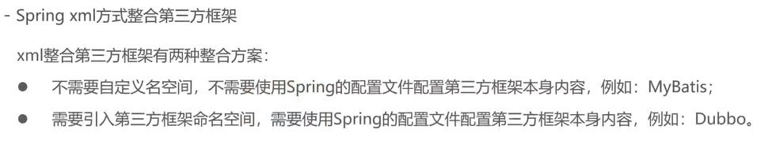

## 整合Mybatis

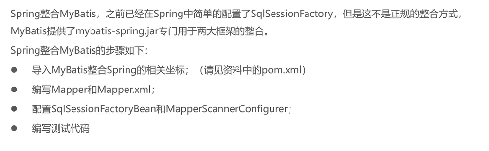

目的：消除繁琐代码

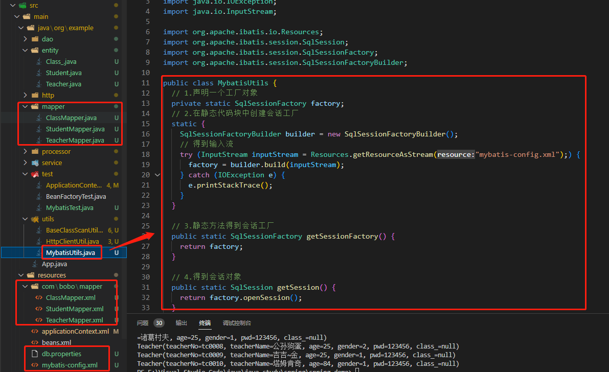

### 导入依赖

```xml
<dependency>
      <groupId>org.mybatis</groupId>
      <artifactId>mybatis-spring</artifactId>
      <version>2.0.5</version>
    </dependency>
<dependency>
    <groupId>org.springframework</groupId>
    <artifactId>spring-jdbc</artifactId>
    <version>5.3.24</version>
</dependency>

```

### 代码实现

```xml
<bean class="org.mybatis.spring.SqlSessionFactoryBean">
    <property name="dataSource" ref="dataSource"></property>
  </bean>

  <bean class="org.mybatis.spring.mapper.MapperScannerConfigurer">
    <property name="basePackage" value="org.example.mapper"></property>
  </bean>

  <!-- 不需要了 -->
  <!-- <import resource="mybatis-config.xml" /> -->

  <bean id="dataSource" class="com.alibaba.druid.pool.DruidDataSource">
    <property name="driverClassName" value="com.mysql.cj.jdbc.Driver"></property>
    <property name="url"
      value="jdbc:mysql://localhost:3300/table_test?useUnicode=true;characterEncoding=utf8;serverTimezone=Asia/Shanghai;useTimezone=true"></property>
    <property name="username" value="root"></property>
    <property name="password" value="123456"></property>
  </bean>

  <bean id="classService" class="org.example.service.ClassServiceImpl">
    <property name="classMapper" ref="classMapper"></property>
  </bean>
```

此中ref="classMapper"已被MapperScannerConfigurer自动注入到容器中了

```xml
<property name="classMapper" ref="classMapper"></property>
```

```java
public static void main(String[] args) throws InterruptedException {
    ApplicationContext applicationContext = new ClassPathXmlApplicationContext("applicationContext.xml");
    ClassService classService = applicationContext.getBean(ClassService.class);
    // System.out.println(userService.name());
    classService.show();
  }
```

### 两个重要类

#### SqlSessionFactoryBean

1. FactoryBean：getObject()->用于返回SqlSessionFactory
2. InitializingBean：dataSource注入后->通过SqlSessionFactoryBuilder的build方法创建SqlSessionFactory

```java
public class SqlSessionFactoryBean implements 
	 FactoryBean<SqlSessionFactory>,
	 InitializingBean, 
	 ApplicationListener<ApplicationEvent> {
    public SqlSessionFactory getObject() throws Exception{
	......
    }
}
```

#### MapperScannerConfigurer（Mapper扫描配置器）

1. BeanDefinitionRegistryPostProcessor：BeanFactory的后处理器（将扫描到的Mapper注册为BeanDefinition）
2. ...

```java
public class MapperScannerConfigurer implements BeanDefinitionRegistryPostProcessor, InitializingBean, ApplicationContextAware, BeanNameAware {

}
```

### 具体流程

1.加载路径下的扫描器

```java
ClassPathMapperScanner scanner = new ClassPathMapperScanner(registry);
```

2.调用ClassPathMapperScanner父类ClassPathBeanDefinitionScanner的scan()方法

```java
scanner.scan(StringUtils.tokenizeToStringArray(this.basePackage, ConfigurableApplicationContext.CONFIG_LOCATION_DELIMITERS));
```

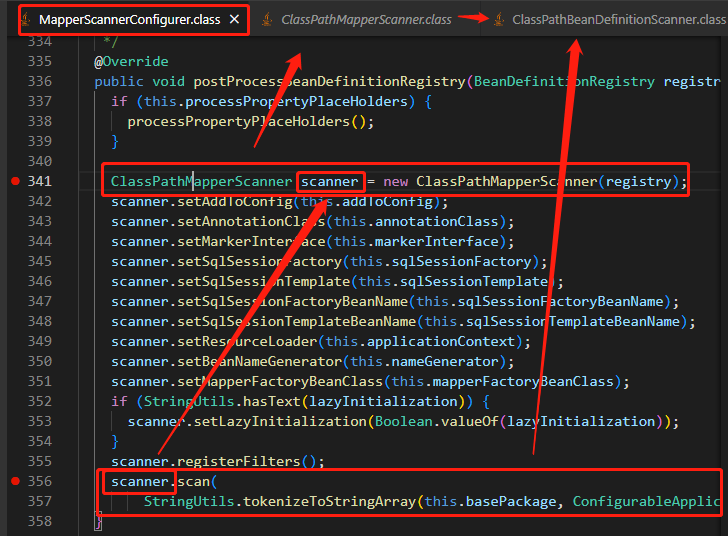

3.basePackages是我们扫描的Mapper包

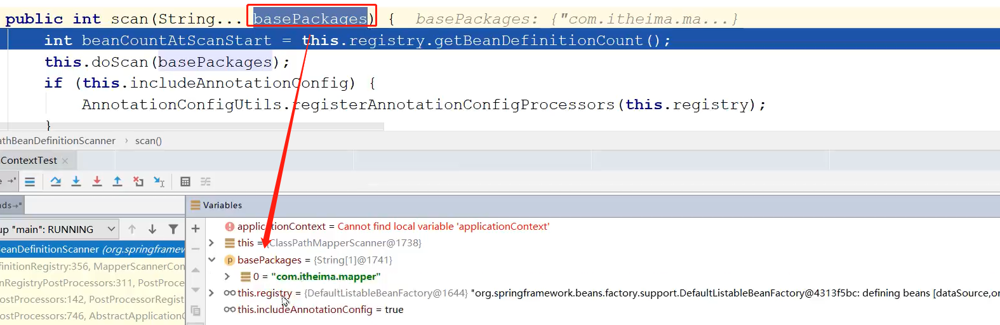

4.ClassPathBeanDefinitionScanner调用其子类ClassPathMapperScanner的doScan()方法

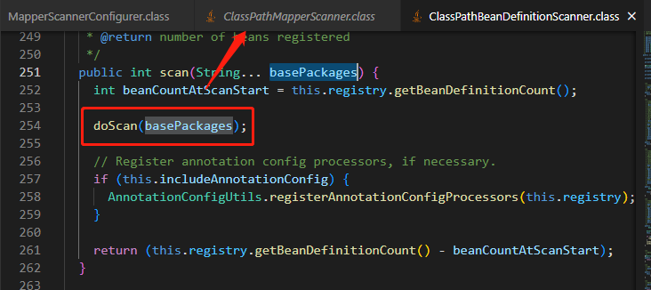

5.此时ClassPathMapperScanner的doScan()方法又去调用其父类ClassPathBeanDefinitionScanner的doScan()方法

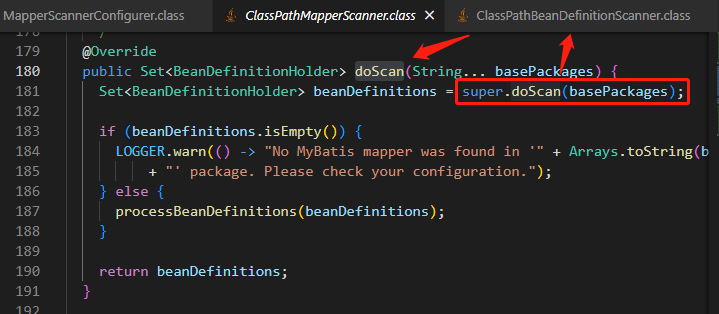

6.将BeanDefinition注册到BeanDefinitionMap中

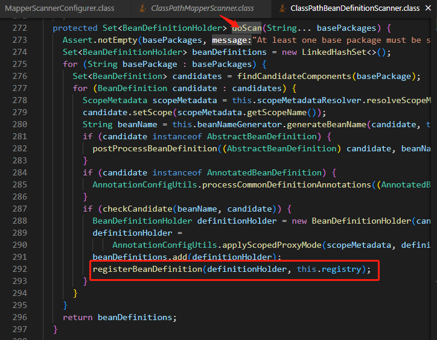

7.但此处为Mapper接口，是无法创建对象的。所以ClassPathBeanDefinitionScanner执行完doScan()方法后返回的beanDefinitions需要在ClassPathMapperScanner的doScan()方法进行二次处理

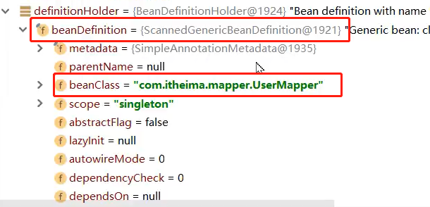

8.由于Mapper接口无法实例化，所以将原有的beanClass覆盖为MapperFactoryBean，作为当前Mapper的全限定名，当实例化时会创建MapperFactoryBean（FactoryBean）的对象

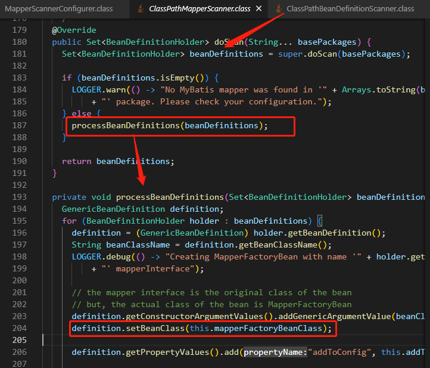

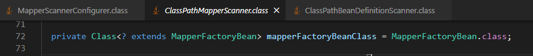

MapperFactoryBean的本质为FactoryBean

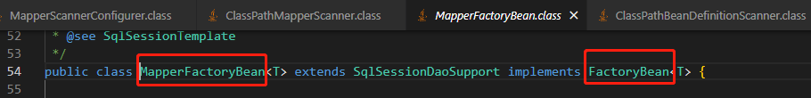

10.MapperFactoryBean其内部有重写的getObject()方法，当实例化bean时会调用getObject()方法得到sqlSession，再通过getMapper方法产生对应的mapper实例

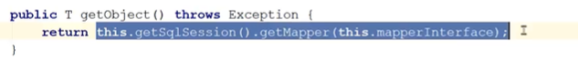

11.此处2代表根据类型自动注入

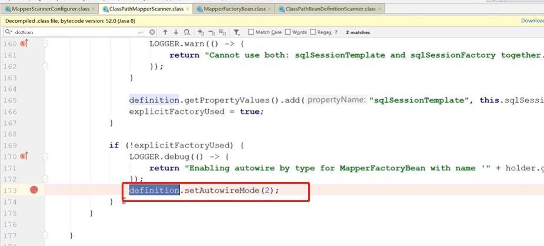

### 原理

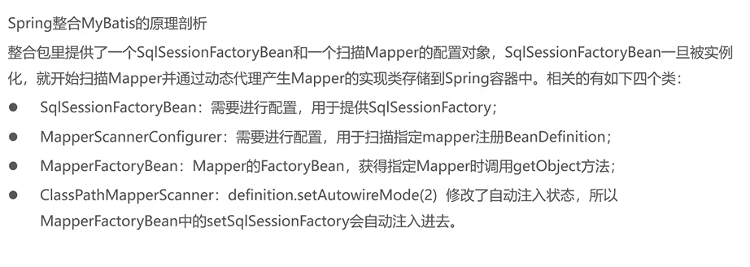

## 整合Dubbo（略）

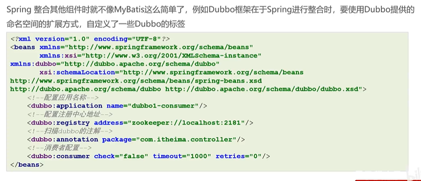

## 整合外部properties文件

注意在properties文件中key要有前缀，否则可能出现无法加载的问题

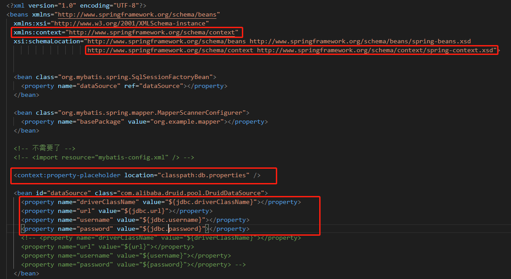

## 自定义命名空间解析原理

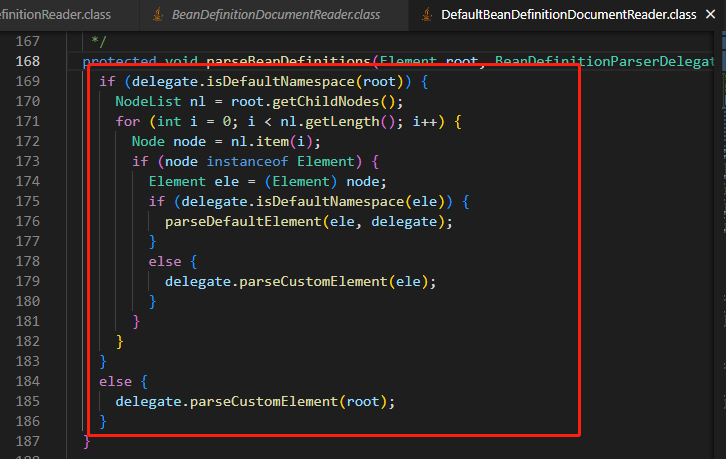

1. for循环逐行扫描节点，if判断是否为默认的命名空间
2. 如果是默认的命名空间（import、alias、bean、beans）就按照解析默认命名空间的方式解析
3. 否则根据标签逆向获取对应的自定义命名空间，返回一个命名空间处理器（提前执行该命名空间处理器的init方法：注入各种标签的解析器），最后使用命名空间处理器调用指定标签的解析器来处理节点

### 个人使用自定义命名空间的总结

1. 如果第三方使用自定义命名空间的方式跟spring集成，需要在包下的META-INF创建spring.handlers文件指定命名空间和其对应的命名空间的解析器
2. 需要实现init方法：主要用于注入命名空间的各种标签解析器
3. 实现parse方法：主要用于解析对用的标签（比如：直接注册BeanDefinition、注册BeanPostProcesser）


### 关于标签约束规则

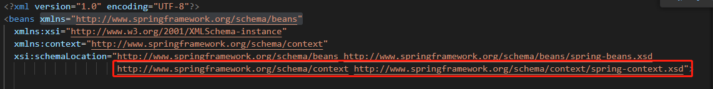

1. 命名空间+空格+.xsd网址（虚假）
2. xsd网址映射到包下META-INF的spring.schemas文件，再映射到真实的xsd文件。

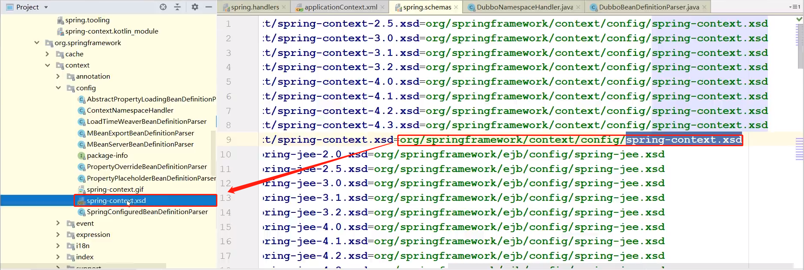

### 总结

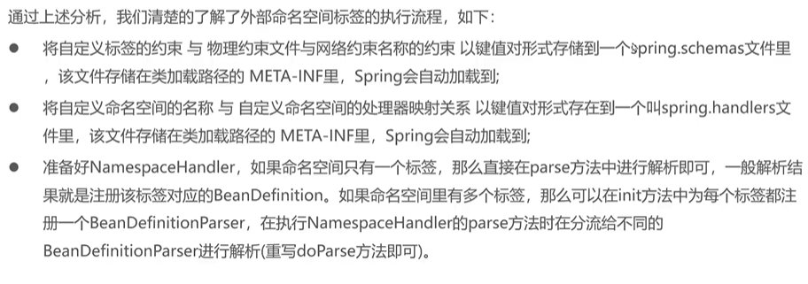

### 案例

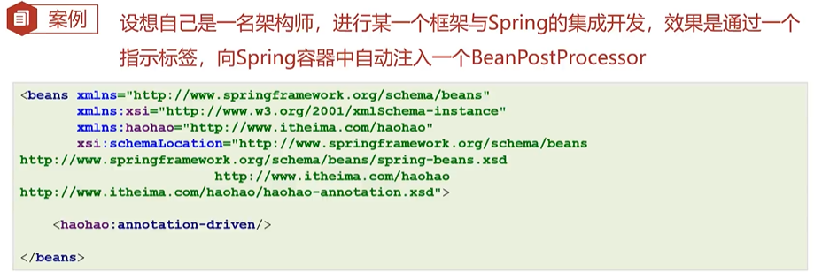

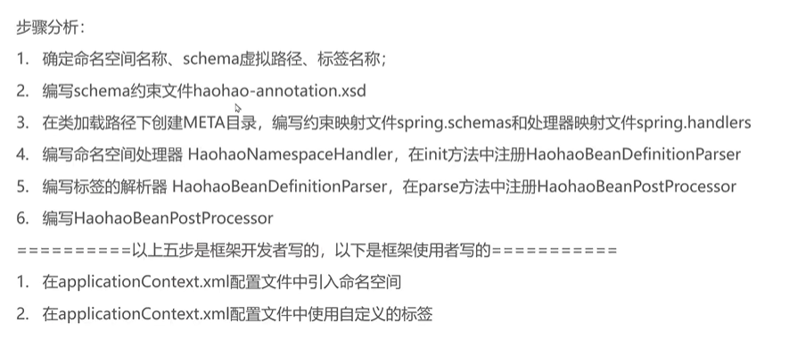

1.略

2.编写约束文件

```xml
<?xml version="1.0" encoding="UTF-8"?>

<xsd:schema
  xmlns="http://www.bobo.com/haohao"
  xmlns:xsd="http://www.w3.org/2001/XMLSchema"
  targetNamespace="http://www.bobo.com/haohao">

  <xsd:element name="annotation-driven"></xsd:element>

</xsd:schema>
```

3.编写约束映射文件和处理器映射文件

约束映射文件

```
http\://www.bobo.com/haohao/haohao-annotation.xsd=org/example/haohao/config/haohao-annotation.xsd
```

处理器映射文件

```
http\://www.bobo.com/haohao=org.example.config.HaohaoNamespaceHandler
```

4.编写命名空间处理器HaohaoNamespaceHandler的init方法

```java
public class HaohaoNamespaceHandler extends NamespaceHandlerSupport{

  @Override
  public void init() {
    registerBeanDefinitionParser("annotation-driven", new HaohaoBeanDefinitionParser());
  }
  
}
```

5.编写标签解析器HaohaoBeanDefinitionParser的parse方法

```java
public class HaohaoBeanDefinitionParser implements BeanDefinitionParser {

  @Override
  @Nullable
  public BeanDefinition parse(Element element, ParserContext parserContext) {
    // 执行逻辑，注入一个beanPostProcessor
    BeanDefinition beanDefinition = new RootBeanDefinition();
    beanDefinition.setBeanClassName("org.example.processor.HaohaoBeanPostProcessor");
    parserContext.getRegistry().registerBeanDefinition("haohaoBeanPostProcessor", beanDefinition);
    return beanDefinition;
  }

}
```

只是测试以下

```java
public class HaohaoBeanPostProcessor implements BeanPostProcessor {

  @Override
  @Nullable
  public Object postProcessAfterInitialization(Object bean, String beanName) throws BeansException {
    System.out.println(beanName + "测试自定义命名空间的标签解释器的BoboBeanPostProcessor的After方法");
    return bean;
  }

  @Override
  @Nullable
  public Object postProcessBeforeInitialization(Object bean, String beanName) throws BeansException {
    // TODO Auto-generated method stub
    return BeanPostProcessor.super.postProcessBeforeInitialization(bean, beanName);
  }

}
```

6.引入和使用

```xml
<?xml version="1.0" encoding="UTF-8"?>
<beans xmlns="http://www.springframework.org/schema/beans"
  xmlns:xsi="http://www.w3.org/2001/XMLSchema-instance"
  xmlns:context="http://www.springframework.org/schema/context"
  xmlns:haohao="http://www.bobo.com/haohao"
  xsi:schemaLocation="http://www.springframework.org/schema/beans http://www.springframework.org/schema/beans/spring-beans.xsd
                      http://www.springframework.org/schema/context http://www.springframework.org/schema/context/spring-context.xsd
                      http://www.bobo.com/haohao classpath:org/example/haohao/config/haohao-annotation.xsd">

  <haohao:annotation-driven />
</beans>
```
