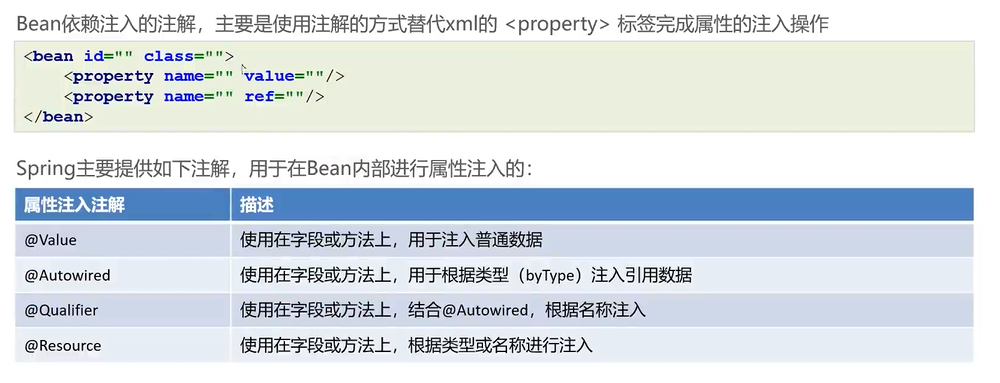

# Bean依赖注入注解开发



## @Value

### 普通属性注入值

@Value("${jdbc.url}")：配置文件中若无 jdbc.url  属性，则会报错，服务启动失败！

@Value("${jdbc.url:www.baidu.com}")：配置文件中若无 user.val.name 属性， 不会报错。

```java
@Value("${jdbc.url}")
private String name;

// @Value("${jdbc.url:www.baidu.com}")
public void setName(String name) {
  this.name = name;
}
```

### 静态属性注入值

错误的

```java
@Value("${user.val.age}")
private static Integer age ;
```

正确的

```java
@Value("${user.val.age}")
public  void setAge2(Integer age) {
    UserVal.age = age;
}

/**
 * 使用 @PostConstruct 注解，实现静态属性赋值
 */
@PostConstruct
public  void setAge3(){
    UserVal.age = age2;
}

/**
 * 实现 InitializingBean 接口，实现静态属性赋值
 */
@Override
public void afterPropertiesSet() throws Exception {
    UserVal.age = age3;
}
```

## @Autowired

@Autowired可以标注在属性上、方法上和构造器上，来完成自动装配。

```java
@Component("classService")
public class ClassServiceImpl implements ClassService{

  @Autowired
  private ClassMapper classMapper;

  @Override
  public void show() {
    System.out.println(classMapper.findAll());
  }
  
}
```

根据类型进行注入，如果同一类型的Bean有多个，尝试根据名字进行二次匹配，如果匹配不成功则报错。

特殊：注入List < UserDao >

```java
@Autowired
  private void xxx(List<UserDao> userDaoList){
    System.out.println(userDaoList);
  };
```

## @Qualifier

如果成员变量@Autowired想直接根据名字匹配则需要搭配@Qualifier使用，如果在参数位置则可以只使用@Qualifier

```java
@Autowired
@Qualifier("classMapper")
private ClassMapper classMapper;
```

## @Resource

maven引入javax.annotation，在jdk11后就被剔除了

```xml
<dependency>
    <groupId>javax.annotation</groupId>
    <artifactId>javax.annotation-api</artifactId>
    <version>1.3.2</version>
</dependency>
```

如果没有指定参数则与@Autowired有些类似，他是先根据名字匹配，再根据类型匹配，如果指定了name参数则与@Autowired+@Qualifier类似，

```java
@Resource
@Resource(name = "classMapper")
private ClassMapper classMapper;
```
