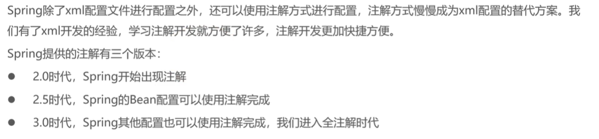
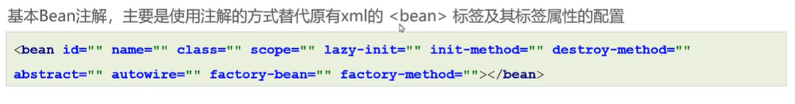
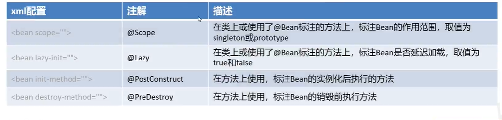
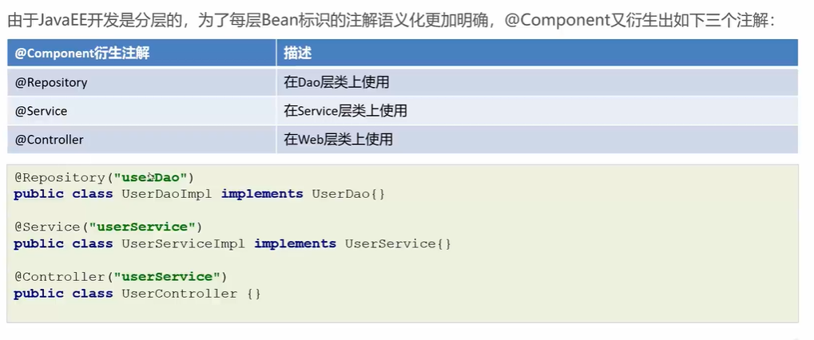

# Bean基本注解开发





## 前提

需要在xml文件中开启注解扫描

```xml
<!-- 注解扫描 扫描指定的基本包和其子包 识别使用的@Component-->
  <context:component-scan base-package="org.example"></context:component-scan>
```

## @Component


```java
// @Component(value = "classService")
@Component("classService")
//@Component 默认是首字母小写的类名
public class ClassServiceImpl implements ClassService{
  private ClassMapper classMapper;

  @Override
  public void show() {
    System.out.println(classMapper.findAll());
  }
  
}
```

## @Scope @Lazy @PostConstruct @PreDestroy



## @Service @Controller @Repository


