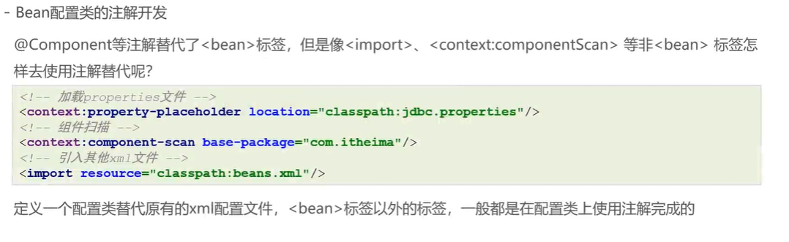
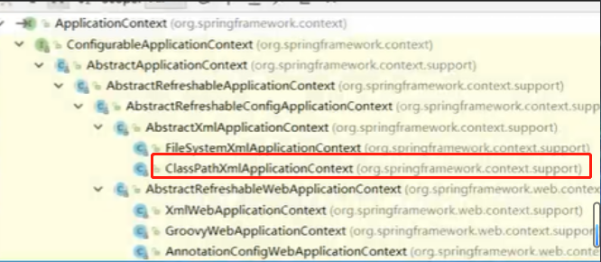
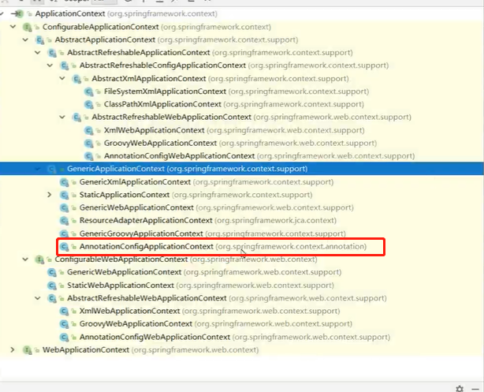
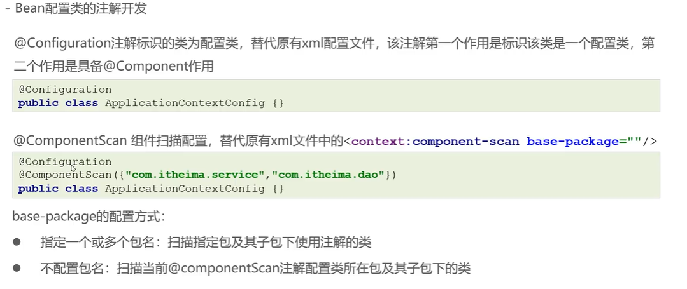
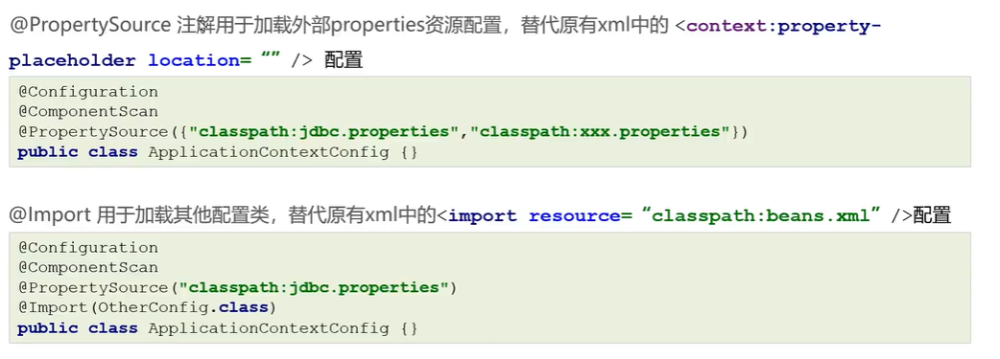

# Bean配置类的注解开发



## xml方式

```java
ApplicationContext applicationContext = new ClassPathXmlApplicationContext("applicationContext.xml");
```



## 注解方式

```java
ApplicationContext applicationContext = new AnnotationConfigApplicationContext(SpringConfig.class);
```



## @Configuration @ComponentScan @PropertySource @Import





```java
@Configuration // 标注当前类是一个配置类（替代配置文件）

// <context:component-scan base-package="org.example"></context:component-scan>
@ComponentScan(basePackages = { "org.example" })

// <context:property-placeholder location="classpath:db.properties" />
@PropertySource({ "classpath:db.properties" })

//此时的OtherBean类就可以不用@Component注解了
@Import(OtherBean.class)
public class SpringConfig {

}
```

## 细致讲解

在Spring中，使用Java Config配置方式时，可以创建多个带有@Configuration注解的配置类，在这些配置类中定义bean并进行装配。同时可以使用@Import来导入其他的配置类。

多个@Configuration类和一个@Configuration中@Import多个@Configuration的 方法都可以用来完成应用程序的配置，但是它们有着不同的用途和关注点。

多个@Configuration类的方法更具模块化，将应用程序的配置分成了几个小模块，每个模块专注于完成自己的任务。这种方式更加符合面向对象设计原则，能够提高配置的可读性和可维护性。例如：

```java
@Configuration
public class AppConfigA {
    //定义bean的方法
}

@Configuration
public class AppConfigB {
    //定义bean的方法
}

@Configuration
@EnableWebMvc
@Import({ AppConfigA.class, AppConfigB.class })
public class WebConfig {
    //定义bean的方法
}
```

在这个例子中，将应用程序的配置分解成三个@Configuration类。AppConfigA和AppConfigB专注于定义bean，WebConfig专注于配置Web应用程序，并通过@Import导入了两个模块。

而一个@Configuration中@Import多个@Configuration类的方法则常用于将不同模块的配置组装在一起，完成一个大的配置。例如：

```java
@Configuration
@EnableWebMvc
@Import({ AppConfigA.class, AppConfigB.class })
public class AppConfig {
    //定义bean的方法
}
```

在这个例子中，使用一个@Configuration来管理应用程序的所有配置，在这里将两个模块导入到同一个配置类中，这样可以将所有配置汇总到一个地方，更方便进行管理。

总的来说，多个@Configuration类的方法更灵活和清晰，适用于应用程序包含多个模块的情况；而一个@Configuration中@Import多个@Configuration类的方法更适用于大型应用程序，其中需要集成和配置多个模块。

## @Configuration 和 @Component 的区别

当你用@Configuration时，Spring会把这个类用动态代理改造一下，会把@Bean修饰的方法改成

// 伪代码

if(容器里没有这个对象) {则new一个出来}

else{返回容器里的对象}

所以，此时如果你调用@Bean注解的方法时，永远返回同一个对象。

设计理念就是，因为@Configuration注解是给配置类加的，从配置里来的对象肯定要设计成单例。
