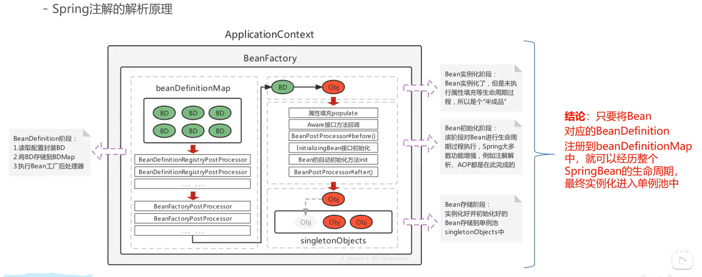
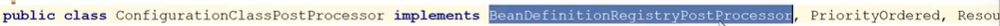

# Spring注解的解析原理

## 生命周期回顾

## xml和注解方式回顾

## 扫描步骤

### xml扫描流程

1.注册自定义命名空间的标签解析器

2.利用自定义命名空间的component-scan标签功能进行解析

3.执行doScan方法

4.利用ClassPathBeanDefinitionScanner.class的doScan方法解析注解，然后逐个注册到BeanDefinitionMap

### 注解扫描流程

1.创建一个注解读取器

2.注册一个注解配置的Processors

3.注册注解解析器

由于部分注解执行时机不同，可能在实例化前（@Commponent），也有可能在实例化之后（@Autowired），所以注册时机也不同

4.同xml解析一样，也是使用ClassPathBeanDefinitionScanner.class的doScan解析注解注册到BeanDefinitionMap

## 总结

