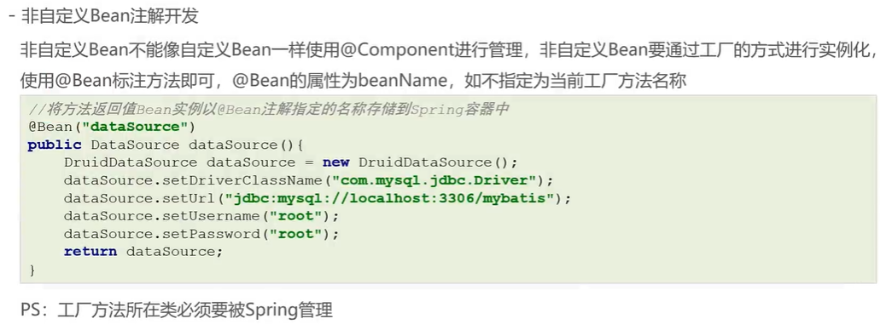
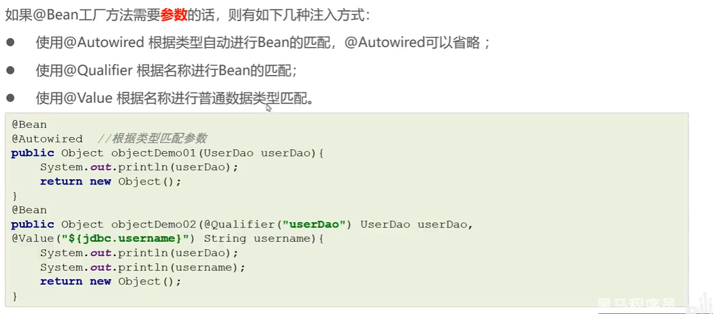

# 非自定义Bean注解开发



## @Bean

@Bean如果不设置参数，则按照方法名设置beanName

```java
@Component
public class OtherBean {

  @Value("${jdbc.driverClassName}")
  private String driverClassName;
  @Value("${jdbc.url}")
  private String url;
  @Value("${jdbc.username}")
  private String username;
  @Value("${jdbc.password}")
  private String password;
  
  @Bean("dataSource")
  public DataSource dataSource() {
    DruidDataSource dataSource = new DruidDataSource();
    dataSource.setDriverClassName(driverClassName);
    dataSource.setUrl(url);
    dataSource.setUsername(username);
    dataSource.setPassword(password);
    return dataSource;
  }

  @Bean("dataSource")
  public DataSource dataSource(
    @Value("${jdbc.driverClassName}") String driverClassName,
    @Autowired UserDao userDao01
    @Qualifier UserDao userDao02
    UserDao userDao03
    ) {
    DruidDataSource dataSource = new DruidDataSource();
    dataSource.setDriverClassName(driverClassName);
    dataSource.setUrl(url);
    dataSource.setUsername(username);
    dataSource.setPassword(password);
    return dataSource;
  }
}
```

注：

1. 因为@Bean是在方法上的，如果类不被注入则不生效，则需要通过@Component注入容器中
2. 如果该方法需要参数的搭配方式：普通参数：@Value、对象：@Autowired、@Autowired+@Qualifier、@Qualifier、或者什么都不加（此前提为方法被@Bean修饰）


