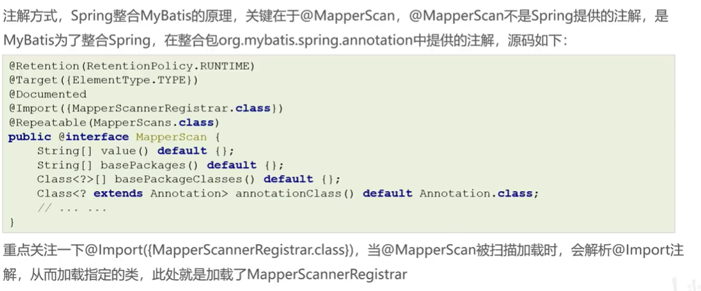
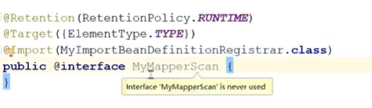

# Spring注解整合第三方框架

## 注入Mybatis

### xml方式注入Mybatis回顾


### 注解方式

#### 注入Mybatis

注入dataSource

```java
@Configuration
@PropertySource({ "classpath:db.properties" })
public class DataSourceConfig {

  @Value("${jdbc.driverClassName}")
  private String driverClassName;
  @Value("${jdbc.url}")
  private String url;
  @Value("${jdbc.username}")
  private String username;
  @Value("${jdbc.password}")
  private String password;
  
  @Bean("dataSource")
  public DataSource dataSource() {
    DruidDataSource dataSource = new DruidDataSource();
    dataSource.setDriverClassName(driverClassName);
    dataSource.setUrl(url);
    dataSource.setUsername(username);
    dataSource.setPassword(password);
    return dataSource;
  }
}
```

#### 注入SqlSessionFactory和MapperScannerConfigurer

```java
/*Mybatis配置类*/
@Configuration
//此时就不需要MapperScannerConfigurer了
@MapperScan("org.example.mapper")
public class MybatisConfig {
  // 定义bean：SqlSessionFactoryBean，用于产生SqlSessionFactory对象
  @Bean
  public SqlSessionFactoryBean sqlSessionFactory(@Autowired DataSource dataSource) {
    SqlSessionFactoryBean ssfb = new SqlSessionFactoryBean();
    // 设置模型类的别名扫描
    ssfb.setTypeAliasesPackage("org.example.entity");
    // 设置数据源
    ssfb.setDataSource(dataSource);
    return ssfb;
  }

  // // 定义bean，返回MapperScannerConfigurer对象
  // @Bean
  // public MapperScannerConfigurer mapperScannerConfigurer() {
  //   MapperScannerConfigurer msc = new MapperScannerConfigurer();
  //   msc.setBasePackage("com.bighorn.dao");
  //   return msc;
  // }
}
```




## @Import讲解


### 方式2

```java
public class MylmportSelector implements ImportSelector{

  @Override
  public String[] selectImports(AnnotationMetadata importingClassMetadata) {
    // AnnotationMetadata叫做注解媒体数组
    //该对象内部封装的是当前类被@Import引用的的类上的其他注解的元信息
    //比如可以获取SpringConfig上的其他注解信息 
    MultiValueMap<String,Object> allAnnotationAttributes = importingClassMetadata.getAllAnnotationAttributes( ComponentScan.class.getName());
    System.out.println(allAnnotationAttributes); 

    //返回的数组封装的是需要被注册到spring容器中的Bean的全限定名
    return new String[]{DataSourceConfig.class.getName()};
  }
  
}
```

SpringConfig.java

```java
@Configuration // 标注当前类是一个配置类（替代配置文件）
@ComponentScan(basePackages = { "org.example" })
//方式1
//@Import(DataSourceConfig.class) 
//方式2
//@Import(MylmportSelector.class) 
//方式3
//@Import({ MyImportBeanDefinitionRegistrar.class })

public class SpringConfig {

}
```

### 方式3

```java
public class MyImportBeanDefinitionRegistrar implements ImportBeanDefinitionRegistrar {

  @Override
  public void registerBeanDefinitions(AnnotationMetadata importingClassMetadata, BeanDefinitionRegistry registry,
      BeanNameGenerator bGenerator) {
    BeanDefinition beanDefinition = new RootBeanDefinition();
    beanDefinition.setBeanClassName(DataSourceConfig.class.getName());
    registry.registerBeanDefinition("DataSourceConfig", beanDefinition);
  }

}
```

### 自定义注解替代@Import


