# BeanFactory

第三方就是我们的BeanFactory

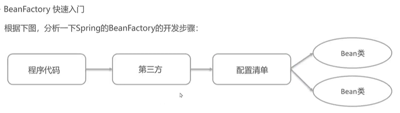

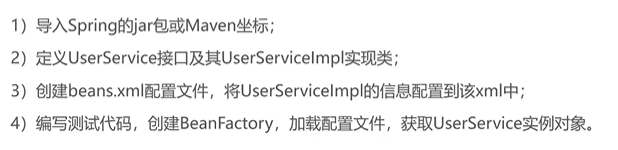

## 快速入门

3）创建beans.xml配置文件，将UserServicelmpl的信息配置到该xml中

```xml
<bean id="userService" class="org.example.Service.UserServiceImpl"></bean>
```

4）编写测试代码，创建BeanFactory，加载配置文件，获取UserService实例对象

```java
    //创建工厂对象
    DefaultListableBeanFactory beanFactory = new DefaultListableBeanFactory();
    //创建一个读取器（xml）
    XmlBeanDefinitionReader reader = new XmlBeanDefinitionReader(beanFactory);
    //读取器和绑定工厂对象
     reader.loadBeanDefinitions("beans.xml");
    //根据id获取bean对象
    UserService userService = (UserService)beanFactory.getBean("userService");
    System.out.println(userService);
```

为bean注入bean(DI 简单操作)

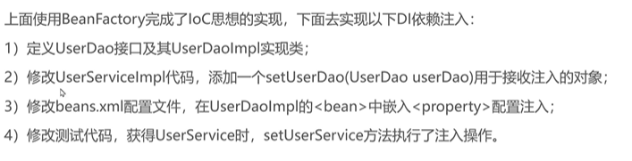

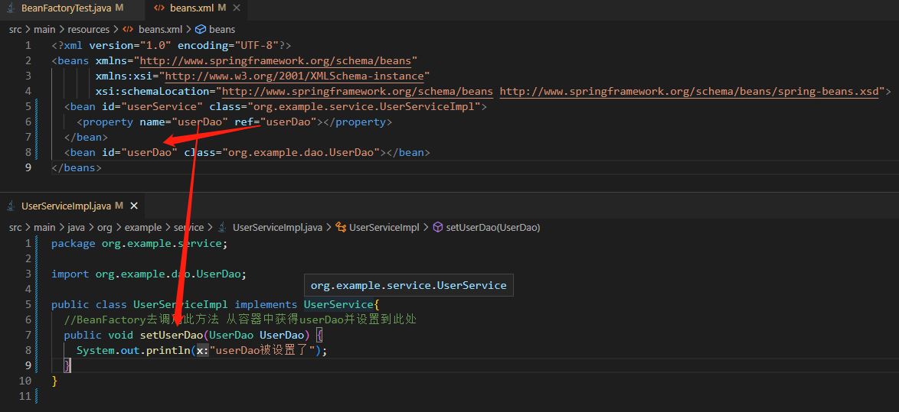

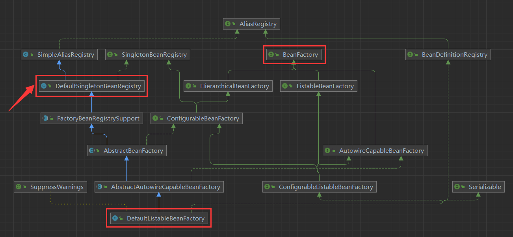

# ApplicationContext

## 快速入门

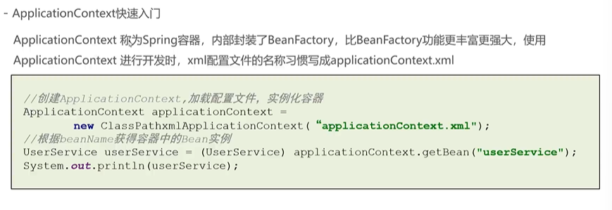

# BeanFactory和ApplicationContext对比

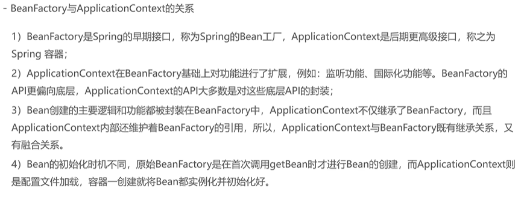

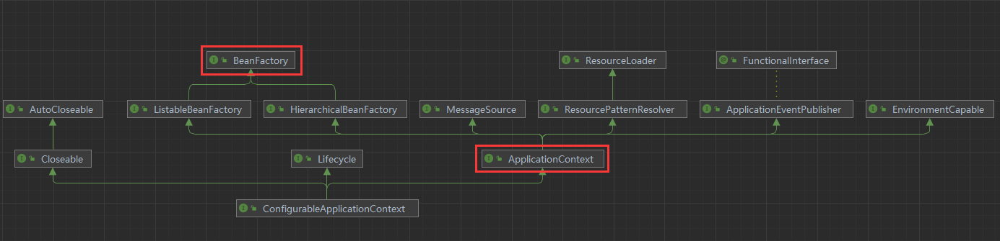

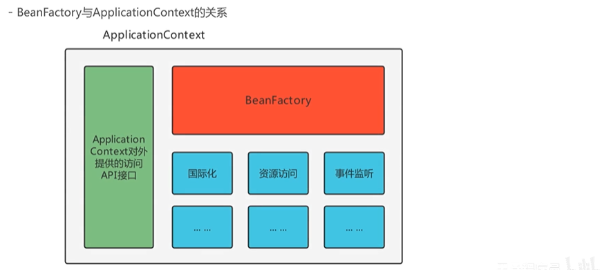

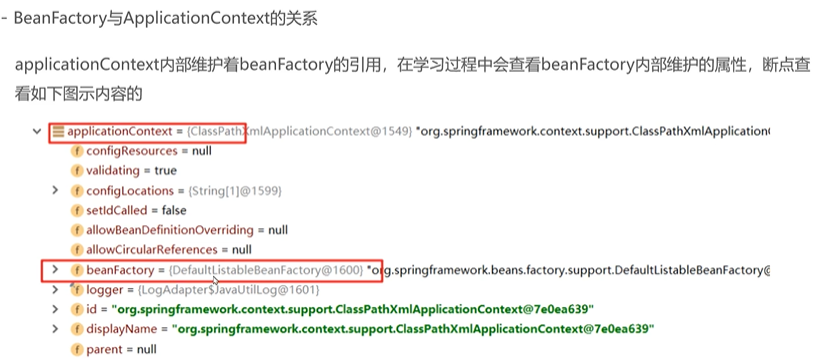

# BeanFactory的继承体系

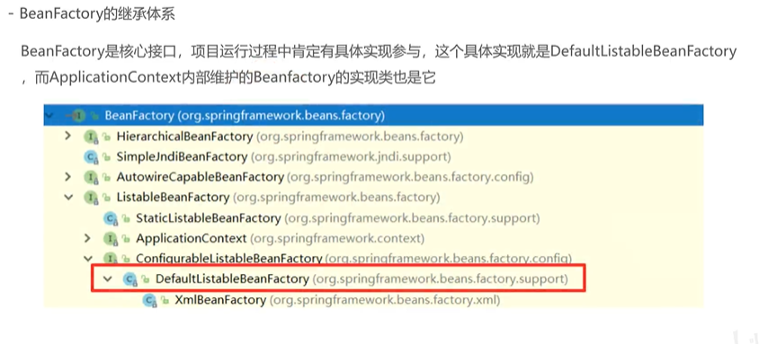

## beanDefinitionMap

注册bean的集合

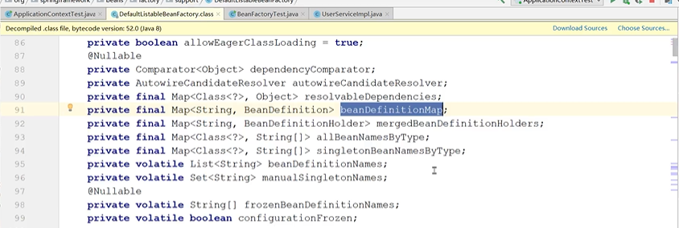

获取bean

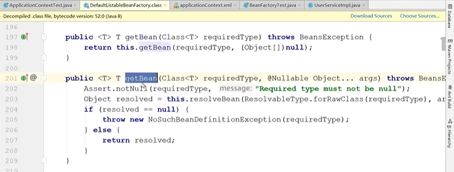

# ApplicationContext的继承体系

spring-context下的继承体系

注解配置方案和xml配置方案

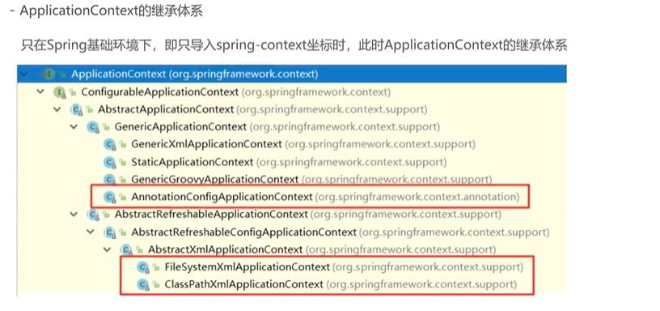

常用三个ApplicationContext的实现类

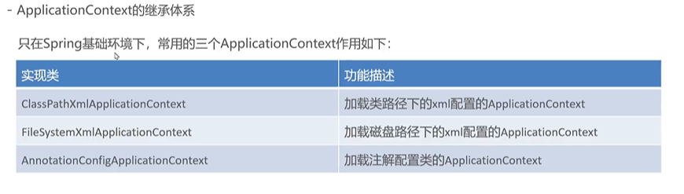

spring-web下的继承体系（暂时的了解）

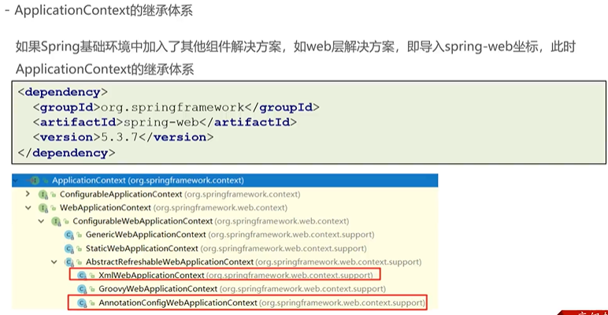
