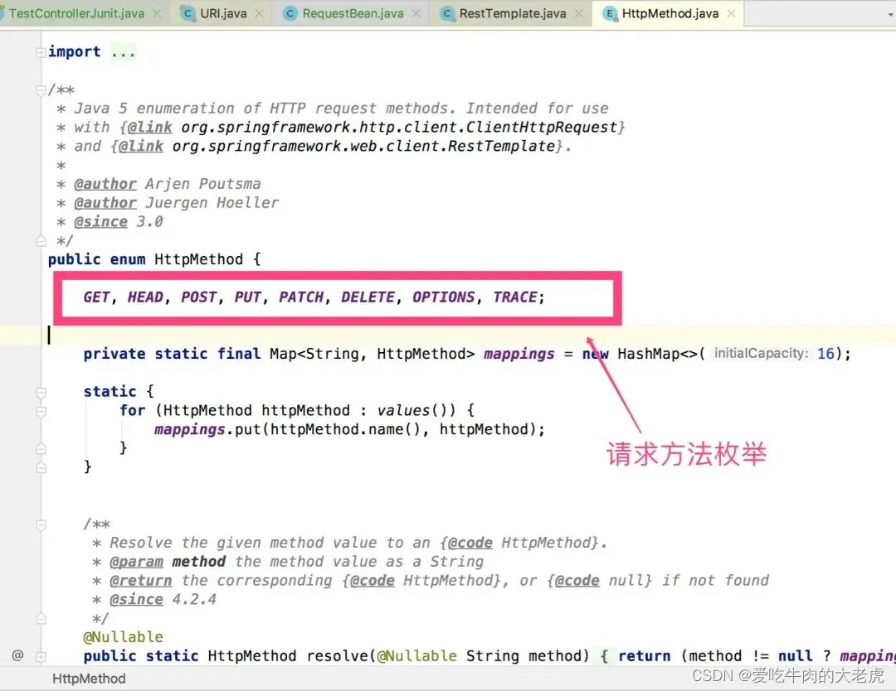

# 基本入门

## 非SpringBoot项目

非SpringBoot项目引入

```xml
<dependency>
  <groupId>org.springframework</groupId>
  <artifactId>spring-web</artifactId>
  <version>5.2.6.RELEASE</version>
</dependency>
```

编写一个单元测试类，使用 RestTemplate发送一个 GET请求，看看程序运行是否正常

```java
@Test
public void simpleTest() {
    RestTemplate restTemplate = new RestTemplate();
    String url = "http://jsonplaceholder.typicode.com/posts/1";
    String str = restTemplate.getForObject(url, String.class);
    System.out.println(str);
}

```

## SpringBoot项目

如果当前项目是 SpringBoot，添加如下依赖接口！

```xml
<dependency>
    <groupId>org.springframework.boot</groupId>
    <artifactId>spring-boot-starter-web</artifactId>
</dependency>
```

同时，将 RestTemplate配置初始化为一个 Bean

```java
@Configuration
public class RestTemplateConfig {
    /**
     * 没有实例化RestTemplate时，初始化RestTemplate
     * @return
     */
    @ConditionalOnMissingBean(RestTemplate.class)
    @Bean
    public RestTemplate restTemplate(){
        RestTemplate restTemplate = new RestTemplate();
        return restTemplate;
    }
}

```

注意，这种初始化方法，是使用了 JDK自带的 HttpURLConnection作为底层 HTTP客户端实现。

当然，我们还可以修改 RestTemplate默认的客户端，例如将其改成 HttpClient客户端，方式如下：

```java
@Configuration
public class RestTemplateConfig {

    @ConditionalOnMissingBean(RestTemplate.class)
    @Bean
    public RestTemplate restTemplate(){
        RestTemplate restTemplate = new RestTemplate(getClientHttpRequestFactory());
        return restTemplate;
    }

    /**
     * 使用HttpClient作为底层客户端
     * @return
     */
    private ClientHttpRequestFactory getClientHttpRequestFactory() {
        int timeout = 5000;
        RequestConfig config = RequestConfig.custom()
                .setConnectTimeout(timeout)
                .setConnectionRequestTimeout(timeout)
                .setSocketTimeout(timeout)
                .build();
        CloseableHttpClient client = HttpClientBuilder
                .create()
                .setDefaultRequestConfig(config)
                .build();
        return new HttpComponentsClientHttpRequestFactory(client);
    }

}

```

在需要使用 RestTemplate的位置，注入并使用即可！

```java
@Autowired
private RestTemplate restTemplate;
```

从开发人员的反馈，和网上的各种 HTTP客户端性能以及易用程度评测来看，OkHttp 优于 Apache的HttpClient、Apache的HttpClient优于 HttpURLConnection。

因此，我们还可以通过如下方式，将底层的 http客户端换成 OkHttp

```java
/**
 * 使用OkHttpClient作为底层客户端
 * @return
 */
private ClientHttpRequestFactory getClientHttpRequestFactory(){
    OkHttpClient okHttpClient = new OkHttpClient.Builder()
            .connectTimeout(5, TimeUnit.SECONDS)
            .writeTimeout(5, TimeUnit.SECONDS)
            .readTimeout(5, TimeUnit.SECONDS)
            .build();
    return new OkHttp3ClientHttpRequestFactory(okHttpClient);
}
```

# API 实践

RestTemplate最大的特色就是对各种网络请求方式做了包装，能极大的简化开发人员的工作量，下面我们以 GET、POST、PUT、DELETE、文件上传与下载为例，分别介绍各个API的使用方式

## 简单响应体封装

```java
@Data
@AllArgsConstructor
public class ResponseBean {
  private String code;
  private String msg;
}
```

## GET请求

通过 RestTemplate发送 HTTP GET协议请求，经常使用到的方法有两个：

* getForObject():返回值是 HTTP协议的响应体
* getForEntity():返回的是 ResponseEntity，ResponseEntity是对 HTTP响应的封装，除了包含响应体，还包含 HTTP状态码、contentType、contentLength、Header等信息

在 Spring Boot环境下写一个单元测试用例，首先创建一个 Api接口，然后编写单元测试进行服务测试。

### 不带参的 get请求

服务端

```java
@RestController
@RequestMapping("/user")
public class User {

  @GetMapping("/login")
  public ResponseBean login() {
    ResponseBean result = new ResponseBean("200", "请求成功，方法：testGet");
    return result;
  }

}
```

客户端

```java
public static void simpleTest() {
    RestTemplate restTemplate = new RestTemplate();
    String url = "http://localhost:8080/user/login";
    String str = restTemplate.getForObject(url, String.class);
    System.out.println("-----------");
    System.out.println(str);
    System.out.println("-----------");
  }
```

### 占位符号传参get请求

服务端

```java
@GetMapping("/login02/{username}")
  public ResponseBean login02(@PathVariable("username") String username) {
    ResponseBean result = new ResponseBean("200", "请求成功，方法：testGet" + username);
    return result;
  }
```

客户端

```java
public void simpleTest() {
    String url = "http://localhost:8080/user/login02/{1}";
    String str = restTemplate.getForObject(url, String.class,"zhangsan");
    System.out.println("-----------");
    System.out.println(str);
    System.out.println("-----------");
  }
```

### restful风格get请求

服务端

```java
@GetMapping("/login01")
  public ResponseBean login01(@RequestParam("username") String username) {
    ResponseBean result = new ResponseBean("200", "请求成功，方法：testGet" + username);
    return result;
  }
```

客户端

```java
public void simpleTest() {
    String url = "http://localhost:8080/user/login01?username={username}";
    Map<String, String> map = new HashMap<>();
    map.put("username", "埃里给");
    String str = restTemplate.getForObject(url, String.class, map);
    System.out.println("-----------");
    System.out.println(str);
    System.out.println("-----------");
  }
```

### getForEntity使用示例

上面的所有的 getForObject请求传参方法，getForEntity都可以使用，使用方法上也几乎是一致的，只是在返回结果接收的时候略有差别。

使用 ResponseEntity`<T>` responseEntity来接收响应结果。用 responseEntity.getBody()获取响应体。

```java
public void simpleTest03() {
    String url = "http://localhost:8080/user/login01?username={username}";
    Map<String, String> map = new HashMap<>();
    map.put("username", "埃里给");
    ResponseEntity<ResponseBean> response = restTemplate.getForEntity(url, ResponseBean.class, map);

    System.out.println("-----------");
    // 获取响应体
    System.out.println("HTTP 响应body：" + response.getBody().toString());
    System.out.println("-----------");
  
    // 以下是getForEntity比getForObject多出来的内容
    HttpStatus statusCode = response.getStatusCode();
    int statusCodeValue = response.getStatusCodeValue();
    HttpHeaders headers = response.getHeaders();
    System.out.println("HTTP 响应状态：" + statusCode);
    System.out.println("HTTP 响应状态码：" + statusCodeValue);
    System.out.println("HTTP Headers信息：" + headers);
  }
```

### header设置参数

```java
public void simpleTest04() {
    String url = "http://localhost:8080/user/login";
    HttpHeaders headers = new HttpHeaders();
    headers.add("token", "123456789");
    // 封装请求头
    HttpEntity<MultiValueMap<String, Object>> formEntity = new HttpEntity<>(headers);

    ResponseEntity<Map> exchange = restTemplate.exchange(url, HttpMethod.GET, formEntity, Map.class);
    System.out.println("-----------");
    System.out.println(exchange);
    System.out.println("-----------");
  }
```

## POST请求

其实 POST请求方法和 GET请求方法上大同小异，RestTemplate的 POST请求也包含两个主要方法：

* postForObject():返回 body对象
* postForEntity():返回全部的信息

### 模拟表单请求

服务端

```java
@PostMapping("/login")
  public ResponseBean login(@RequestParam("username") String username) {
    ResponseBean result = new ResponseBean("200", "请求成功，方法：testPost" + username);
    return result;
  }
```

客户端

```java
public void simpleTest05() {
    String url = "http://localhost:8080/user/login";
    // 请求头设置,x-www-form-urlencoded格式的数据
    HttpHeaders headers = new HttpHeaders();
    headers.setContentType(MediaType.APPLICATION_FORM_URLENCODED);
    // 提交参数设置
    MultiValueMap<String, String> map = new LinkedMultiValueMap<>();
    map.add("username", "唐三藏");
    // 组装请求体
    HttpEntity<MultiValueMap<String, String>> request = new HttpEntity<>(map, headers);

    ResponseBean responseBean = restTemplate.postForObject(url, request, ResponseBean.class);
    System.out.println("-----------");
    System.out.println(responseBean.toString());
    System.out.println("-----------");
  }
```

### 模拟表单请求(传递对象)

服务端

```java
@PostMapping("/login01")
  public ResponseBean login01(ResponseBean responseBean) {
    ResponseBean result = new ResponseBean("200", "请求成功，方法：testPost" + responseBean.getCode());
    return result;
  }
```

客户端

```java
public void simpleTest05() {
    String url = "http://localhost:8080/user/login01";
    // 请求头设置,x-www-form-urlencoded格式的数据
    HttpHeaders headers = new HttpHeaders();
    headers.setContentType(MediaType.APPLICATION_FORM_URLENCODED);
    // 提交参数设置
    MultiValueMap<String, String> map = new LinkedMultiValueMap<>();
    map.add("code", "唐三藏");
    map.add("msg", "唐三111藏");
    // 组装请求体
    HttpEntity<MultiValueMap<String, String>> request = new HttpEntity<>(map, headers);

    ResponseBean responseBean = restTemplate.postForObject(url, request, ResponseBean.class);
    System.out.println("-----------");
    System.out.println(responseBean.toString());
    System.out.println("-----------");
  }
```

### 模拟JSON请求

模拟 JSON请求，post方法测试

服务端

```java
@PostMapping("/login03")
  public ResponseBean login03(@RequestBody ResponseBean responseBean) {
    ResponseBean result = new ResponseBean("200", "请求成功，方法：testPost11" + responseBean.getCode());
    return result;
  }
```

客户端

```java
public void simpleTest06() {
    String url = "http://localhost:8080/user/login03";

    ResponseBean request = new ResponseBean("1212","123123");
  
    ResponseBean responseBean = restTemplate.postForObject(url, request, ResponseBean.class);
    System.out.println("-----------");
    System.out.println(responseBean.toString());
    System.out.println("-----------");
  }
```

### 模拟页面重定向

模拟页面重定向，post请求。位置原因失效

服务端

```java
@Controller
public class LoginController {
    /**
     * 重定向
     * @param request
     * @return
     */
    @RequestMapping(value = "testPostByLocation", method = RequestMethod.POST)
    public String testPostByLocation(@RequestBody RequestBean request){
        return "redirect:index.html";
    }
}

```

客户端

```java
@Autowired
private RestTemplate restTemplate;
/**
 * 重定向，post请求
 */
@Test
public void testPostByLocation(){
    //请求地址
    String url = "http://localhost:8080/testPostByLocation";
    //入参
    RequestBean request = new RequestBean();
    request.setUserName("唐三藏");
    request.setUserPwd("123456789");

    //用于提交完成数据之后的页面跳转，返回跳转url
    URI uri = restTemplate.postForLocation(url, request);
    System.out.println(uri.toString());
}

输出结果如下：
http://localhost:8080/index.html

```

## PUT请求

put请求方法，可能很多人都没用过，它指的是修改一个已经存在的资源或者插入资源，该方法会向 URL代表的资源发送一个 HTTP PUT方法请求，**其与post类似**。示例如下

服务端

```java
@PutMapping("/login01")
  public void login01(@RequestBody ResponseBean responseBean) {
    ResponseBean result = new ResponseBean("200", "请求成功，方法：testPost11" + responseBean.getCode());
    System.out.println(result);
  }
```

客户端

```java
public void simpleTest08() {
    String url = "http://localhost:8080/user/login01";
    ResponseBean request = new ResponseBean("1212","123123");
    restTemplate.put(url, request);
    System.out.println("-----------");
  }
```

## DELETE请求

与之对应的还有 delete方法协议，表示删除一个已经存在的资源，该方法会向 URL代表的资源发送一个 HTTP DELETE方法请求。**其与get请求类似**

服务端

```java
@DeleteMapping("/login01")
  public void login01() {
    System.out.println("result");
  }
```

客户端

```java
public void simpleTest09() {
    String url = "http://localhost:8080/user/login01";
    ResponseBean request = new ResponseBean("1212","123123");
    restTemplate.delete(url);
    System.out.println("-----------");
  }
```

## 通用请求方法exchange方法

如果以上方法还不满足你的要求。在 RestTemplate工具类里面，还有一个 exchange通用协议请求方法，它可以发送 GET、POST、DELETE、PUT、OPTIONS、PATCH等等HTTP方法请求。

打开源码，我们可以很清晰的看到这一点。




采用 exchange方法，可以满足各种场景下的请求操作

## 文件上传与下载

除了经常用到的 get和 post请求以外，还有一个经常会碰到的场景，那就是文件的上传与下载，如果采用 RestTemplate，该怎么使用呢？

案例如下，具体实现细节参考代码注释！

### 文件上传

服务端

```java
@RestController
public class FileUploadController {

    private static final String UPLOAD_PATH = "/springboot-frame-example/springboot-example-resttemplate/";

    /**
     * 文件上传
     * @param uploadFile
     * @return
     */
    @RequestMapping(value = "upload", method = RequestMethod.POST)
    public ResponseBean upload(@RequestParam("uploadFile") MultipartFile uploadFile,
                               @RequestParam("userName") String userName) {
        // 在 uploadPath 文件夹中通过用户名对上传的文件归类保存
        File folder = new File(UPLOAD_PATH + userName);
        if (!folder.isDirectory()) {
            folder.mkdirs();
        }

        // 对上传的文件重命名，避免文件重名
        String oldName = uploadFile.getOriginalFilename();
        String newName = UUID.randomUUID().toString() + oldName.substring(oldName.lastIndexOf("."));

        //定义返回视图
        ResponseBean result = new ResponseBean();
        try {
            // 文件保存，步骤已经省略
            uploadFile.transferTo(new File(folder, newName));
            result.setCode("200");
            result.setMsg("文件上传成功，方法：upload，文件名：" + newName);
        } catch (IOException e) {
            e.printStackTrace();
            result.setCode("500");
            result.setMsg("文件上传失败，方法：upload，请求文件：" + oldName);
        }
        return result;
    }
}

```

客户端

```java
@Autowired
private RestTemplate restTemplate;

/**
 * 文件上传，post请求
 */
@Test
public void upload(){
    //需要上传的文件
    String filePath = "/Users/panzhi/Desktop/Jietu20220205-194655.jpg";

    //请求地址
    String url = "http://localhost:8080/upload";

    // 请求头设置,multipart/form-data格式的数据
    HttpHeaders headers = new HttpHeaders();
    headers.setContentType(MediaType.MULTIPART_FORM_DATA);

    //提交参数设置
    MultiValueMap<String, Object> param = new LinkedMultiValueMap<>();
    param.add("uploadFile", new FileSystemResource(new File(filePath)));
    //服务端如果接受额外参数，可以传递
    param.add("userName", "张三");

    // 组装请求体
    HttpEntity<MultiValueMap<String, Object>> request = new HttpEntity<>(param, headers);

    //发起请求
    ResponseBean responseBean = restTemplate.postForObject(url, request, ResponseBean.class);
    System.out.println(responseBean.toString());
}

```

### 文件下载

服务端

```java
@RestController
public class FileUploadController {

    private static final String UPLOAD_PATH = "springboot-frame-example/springboot-example-resttemplate/";

    /**
     * 带参的get请求(restful风格)
     * @return
     */
    @RequestMapping(value = "downloadFile/{userName}/{fileName}", method = RequestMethod.GET)
    public void downloadFile(@PathVariable(value = "userName") String userName,
                             @PathVariable(value = "fileName") String fileName,
                             HttpServletRequest request,
                             HttpServletResponse response) throws Exception {

        File file = new File(UPLOAD_PATH + userName + File.separator + fileName);
        if (file.exists()) {
            //获取文件流
            FileInputStream fis = new FileInputStream(file);
            //获取文件后缀（.png）
            String extendFileName = fileName.substring(fileName.lastIndexOf('.'));
            //动态设置响应类型，根据前台传递文件类型设置响应类型
            response.setContentType(request.getSession().getServletContext().getMimeType(extendFileName));
            //设置响应头,attachment表示以附件的形式下载，inline表示在线打开
            response.setHeader("content-disposition","attachment;fileName=" + URLEncoder.encode(fileName,"UTF-8"));
            //获取输出流对象（用于写文件）
            OutputStream os = response.getOutputStream();
            //下载文件,使用spring框架中的FileCopyUtils工具
            FileCopyUtils.copy(fis,os);
        }
    }
}

```

客户端

```java
@Autowired
private RestTemplate restTemplate;

/**
 * 小文件下载
 * @throws IOException
 */
@Test
public void downloadFile() throws IOException {
    String userName = "张三";
    String fileName = "c98b677c-0948-46ef-84d2-3742a2b821b0.jpg";
    //请求地址
    String url = "http://localhost:8080/downloadFile/{1}/{2}";

    //发起请求,直接返回对象（restful风格）
    ResponseEntity<byte[]> rsp = restTemplate.getForEntity(url, byte[].class, userName,fileName);
    System.out.println("文件下载请求结果状态码：" + rsp.getStatusCode());

    // 将下载下来的文件内容保存到本地
    String targetPath = "/Users/panzhi/Desktop/"  + fileName;
    Files.write(Paths.get(targetPath), Objects.requireNonNull(rsp.getBody(), "未获取到下载文件"));
}

```

这种下载方法实际上是将下载文件一次性加载到客户端本地内存，然后从内存将文件写入磁盘。这种方式对于小文件的下载还比较适合，如果文件比较大或者文件下载并发量比较大，容易造成内存的大量占用，从而降低应用的运行效率

客户端

```java
@Autowired
private RestTemplate restTemplate;
/**
 * 大文件下载
 * @throws IOException
 */
@Test
public void downloadBigFile() throws IOException {
    String userName = "张三";
    String fileName = "c98b677c-0948-46ef-84d2-3742a2b821b0.jpg";
    //请求地址
    String url = "http://localhost:8080/downloadFile/{1}/{2}";

    //定义请求头的接收类型
    RequestCallback requestCallback = request -> request.getHeaders()
    .setAccept(Arrays.asList(MediaType.APPLICATION_OCTET_STREAM, MediaType.ALL));

    //对响应进行流式处理而不是将其全部加载到内存中
    String targetPath = "/Users/panzhi/Desktop/"  + fileName;
    restTemplate.execute(url, HttpMethod.GET, requestCallback, clientHttpResponse -> {
        Files.copy(clientHttpResponse.getBody(), Paths.get(targetPath));
        return null;
    }, userName, fileName);
}

```

这种下载方式的区别在于：
设置了请求头 APPLICATION_OCTET_STREAM，表示以流的形式进行数据加载
RequestCallback结合 File.copy保证了接收到一部分文件内容，就向磁盘写入一部分内容。而不是全部加载到内存，最后再写入磁盘文件。
在下载大文件时，例如excel、pdf、zip等等文件，特别管用，

# 核心讲解

## excute

所有的 get、post、delete、put、options、head、exchange(一部分)方法最终调用的都是 excute方法

```java
public T execute(String url, HttpMethod method, @Nullable RequestCallback requestCallback,
@Nullable ResponseExtractor responseExtractor, Object… uriVariables)

```


从上面的 Excute方法中我们可以看出 Excute方法只是将 String格式的 URI转成了 java.net.URI，之后调用了 doExecute方法。

doExecute方法如下：


`doExecute` 方法并没有暴露出来，只能通过继承调用
这里需要了解两个类： `RequestCallback & ResponseExtractor`

整个调用过程如下


## RequestCallback

`RequestCallback`用于在 `ClientHttpRequest`上操作的代码的回调接口。允许操作请求头，并写入请求主体。

`RequestCallback`有两个实现类，都是内部类:

* `AcceptHeaderRequestCallback`:只处理请求头，用于 `restTemplate.getXXX()`方法
* `HttpEntityRequestCallback`:继承于 `AcceptHeaderRequestCallback`可以处理 `请求头`和 `body`，用于 `restTemplate.putXXX()、restTemplate.postXXX()和restTemplate.exchange()`方法

## ResponseExtractor

`restTemplate`对此接口 `ResponseExtractor`的检索方法实现，使用的通用回调接口执行，从 `clienthttpresponse`提取数据的实际工作(解析 `HTTP`响应的数据)，但不需要担心异常处理或关闭资源

`RequestCallback`有三个实现类:

* `HeadersExtractor`:用于提取请求头
* `HttpMessageConverterExtractor`:用于提取响应 `body`
* `ResponseEntityResponseExtractor`:使用 `HttpMessageConverterExtractor`提取 `body`（委托模式），然后将body和响应头、状态封装成 `ResponseEntity`对象。
