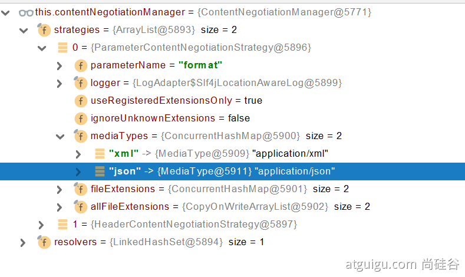

# Web开发

## SpringMVC自动配置概览

* 内容协商视图解析器和BeanName视图解析器
* 静态资源（包括webjars）
* 自动注册 Converter，GenericConverter，Formatter
* 支持 HttpMessageConverters （后来我们配合内容协商理解原理）
* 自动注册 MessageCodesResolver （国际化用）
* 静态index.html 页支持
* 自定义 Favicon
* 自动使用 ConfigurableWebBindingInitializer ，（DataBinder负责将请求数据绑定到JavaBean上）

## 简单功能分析

### 静态资源访问

静态资源目录

只要静态资源放在类路径下：  /static (or /public or /resources or /META-INF/resources
访问 ： 当前项目根路径/ + 静态资源名

原理： 静态映射/**。

请求进来，先去找Controller看能不能处理。不能处理的所有请求又都交给静态资源处理器。静态资源也找不到则响应404页面

改变默认的静态资源路径

```yaml
spring:
  mvc:
    static-path-pattern: /res/**

  resources:
    static-locations: [classpath:/haha/]
```

### 静态资源访问前缀

默认无前缀，此处因为重名问题拦截器拦截了静态资源

```yaml
spring:
  mvc:
    static-path-pattern: /res/**
```

当前项目 + static-path-pattern + 静态资源名 = 静态资源文件夹下找

### webjar

自动映射 /[webjars](http://localhost:8080/webjars/jquery/3.5.1/jquery.js)/**

```xml
<dependency>
    <groupId>org.webjars</groupId>
    <artifactId>jquery</artifactId>
    <version>3.5.1</version>
</dependency>
```

访问地址：[http://localhost:8080/webjars/jquery/3.5.1/jquery.js](http://localhost:8080/webjars/jquery/3.5.1/jquery.js)   后面地址要按照依赖里面的包路径

### 欢迎页支持

controller的Mapper：/index返回index.html视图

静态资源路径下  index.html

* 可以配置静态资源路径
* 但是不可以配置静态资源的访问前缀。否则导致 index.html不能被默认访问

```yaml
spring:
#  mvc:
#    static-path-pattern: /res/**   这个会导致welcome page功能失效

  resources:
    static-locations: [classpath:/haha/]
```

### 自定义 Favicon

favicon.ico 放在静态资源目录下即可。

```yaml
spring:
#  mvc:
#    static-path-pattern: /res/**   这个会导致 Favicon 功能失效
```

### 静态资源配置原理

* SpringBoot启动默认加载  xxxAutoConfiguration 类（自动配置类）
* SpringMVC功能的自动配置类 WebMvcAutoConfiguration，生效

```java
@Configuration(proxyBeanMethods = false)
@ConditionalOnWebApplication(type = Type.SERVLET)
@ConditionalOnClass({ Servlet.class, DispatcherServlet.class, WebMvcConfigurer.class })
@ConditionalOnMissingBean(WebMvcConfigurationSupport.class)
@AutoConfigureOrder(Ordered.HIGHEST_PRECEDENCE + 10)
@AutoConfigureAfter({ DispatcherServletAutoConfiguration.class, TaskExecutionAutoConfiguration.class,
		ValidationAutoConfiguration.class })
public class WebMvcAutoConfiguration {}
```

* 给容器中配了什么。

```java
@Configuration(proxyBeanMethods = false)
@Import(EnableWebMvcConfiguration.class)
@EnableConfigurationProperties({ WebMvcProperties.class, ResourceProperties.class })
@Order(0)
public static class WebMvcAutoConfigurationAdapter implements WebMvcConfigurer {}
```

* 配置文件的相关属性和xxx进行了绑定。WebMvcProperties==spring.mvc、ResourceProperties==spring.resources

#### 配置类只有一个有参构造器

```java
//有参构造器所有参数的值都会从容器中确定
//ResourceProperties resourceProperties；获取和spring.resources绑定的所有的值的对象
//WebMvcProperties mvcProperties 获取和spring.mvc绑定的所有的值的对象
//ListableBeanFactory beanFactory Spring的beanFactory
//HttpMessageConverters 找到所有的HttpMessageConverters
//ResourceHandlerRegistrationCustomizer 找到 资源处理器的自定义器。=========
//DispatcherServletPath  
//ServletRegistrationBean   给应用注册Servlet、Filter....
public WebMvcAutoConfigurationAdapter(ResourceProperties resourceProperties, WebMvcProperties mvcProperties,
				ListableBeanFactory beanFactory, ObjectProvider<HttpMessageConverters> messageConvertersProvider,
				ObjectProvider<ResourceHandlerRegistrationCustomizer> resourceHandlerRegistrationCustomizerProvider,
				ObjectProvider<DispatcherServletPath> dispatcherServletPath,
				ObjectProvider<ServletRegistrationBean<?>> servletRegistrations) {
	this.resourceProperties = resourceProperties;
	this.mvcProperties = mvcProperties;
	this.beanFactory = beanFactory;
	this.messageConvertersProvider = messageConvertersProvider;
	this.resourceHandlerRegistrationCustomizer = resourceHandlerRegistrationCustomizerProvider.getIfAvailable();
	this.dispatcherServletPath = dispatcherServletPath;
	this.servletRegistrations = servletRegistrations;
		}
```

#### 资源处理的默认规则

```java
 @Override
  public void addResourceHandlers(ResourceHandlerRegistry registry) {
    if (!this.resourceProperties.isAddMappings()) {
      logger.debug("Default resource handling disabled");
      return;
    }
    Duration cachePeriod = this.resourceProperties.getCache().getPeriod();
    CacheControl cacheControl = this.resourceProperties.getCache().getCachecontrol().toHttpCacheControl();
    //webjars的规则
    if (!registry.hasMappingForPattern("/webjars/**")) {
      customizeResourceHandlerRegistration(registry.addResourceHandler("/webjars/**")
              .addResourceLocations("classpath:/META-INF/resources/webjars/")
              .setCachePeriod(getSeconds(cachePeriod)).setCacheControl(cacheControl));
    }

    //静态资源
    String staticPathPattern = this.mvcProperties.getStaticPathPattern();
    if (!registry.hasMappingForPattern(staticPathPattern)) {
      customizeResourceHandlerRegistration(registry.addResourceHandler(staticPathPattern)
              .addResourceLocations(getResourceLocations(this.resourceProperties.getStaticLocations()))
              .setCachePeriod(getSeconds(cachePeriod)).setCacheControl(cacheControl));
    }
  }
```

```yaml
spring:
#  mvc:
#    static-path-pattern: /res/**

  resources:
    add-mappings: false   禁用所有静态资源规则
```

```java
@ConfigurationProperties(prefix = "spring.resources", ignoreUnknownFields = false)
public class ResourceProperties {

private static final String[] CLASSPATH_RESOURCE_LOCATIONS = { "classpath:/META-INF/resources/",
			"classpath:/resources/", "classpath:/static/", "classpath:/public/" };

	/**
	 * Locations of static resources. Defaults to classpath:[/META-INF/resources/,
	 * /resources/, /static/, /public/].
	 */
private String[] staticLocations = CLASSPATH_RESOURCE_LOCATIONS;
```

#### 欢迎页的处理规则

```java
HandlerMapping：处理器映射。保存了每一个Handler能处理哪些请求。

  @Bean
  public WelcomePageHandlerMapping welcomePageHandlerMapping(ApplicationContext applicationContext,
                                                             FormattingConversionService mvcConversionService, ResourceUrlProvider mvcResourceUrlProvider) {
    WelcomePageHandlerMapping welcomePageHandlerMapping = new WelcomePageHandlerMapping(
            new TemplateAvailabilityProviders(applicationContext), applicationContext, getWelcomePage(),
            this.mvcProperties.getStaticPathPattern());
    welcomePageHandlerMapping.setInterceptors(getInterceptors(mvcConversionService, mvcResourceUrlProvider));
    welcomePageHandlerMapping.setCorsConfigurations(getCorsConfigurations());
    return welcomePageHandlerMapping;
  }


  WelcomePageHandlerMapping(TemplateAvailabilityProviders templateAvailabilityProviders,
                            ApplicationContext applicationContext, Optional<Resource> welcomePage, String staticPathPattern) {
    if (welcomePage.isPresent() && "/**".equals(staticPathPattern)) {
      //要用欢迎页功能，必须是/** ，写死了
      logger.info("Adding welcome page: " + welcomePage.get());
      setRootViewName("forward:index.html");
    } else if (welcomeTemplateExists(templateAvailabilityProviders, applicationContext)) {
      // 调用Controller  /index
      logger.info("Adding welcome page template: index");
      setRootViewName("index");
    }
  }
```

## 请求参数处理

### 请求映射

#### rest使用与原理

* @xxxMapping；
* Rest风格支持（使用HTTP请求方式动词来表示对资源的操作）
* 核心Filter；HiddenHttpMethodFilter
  1.解决方式：表单method=post，隐藏域 _method=put
  2.SpringBoot中手动开启

```java
@Bean
@ConditionalOnMissingBean(HiddenHttpMethodFilter.class)
//此处需要手动开启=》spring.mvc.hiddenmethod.filter
@ConditionalOnProperty(prefix = "spring.mvc.hiddenmethod.filter", name = "enabled", matchIfMissing = false)
public OrderedHiddenHttpMethodFilter hiddenHttpMethodFilter() {
	return new OrderedHiddenHttpMethodFilter();
}

//自定义 扩展：如何把_method 这个名字换成我们自己喜欢的。
@Bean
public HiddenHttpMethodFilter hiddenHttpMethodFilter(){
    HiddenHttpMethodFilter methodFilter = new HiddenHttpMethodFilter();
    methodFilter.setMethodParam("_m");
    return methodFilter;
}
```

手动开启

```yaml
spring:
  mvc:
    hiddenmethod:
      filter:
        enabled: true   #开启页面表单的Rest功能
```

如果PostMan直接发送Put、delete等方式请求，无需Filter。

Rest风格的form原生表单提交原理


Rest原理（原生html表单提交要使用REST的时候）

* 表单提交会带上_method=PUT
* 请求过来被HiddenHttpMethodFilter拦截
  1）请求是否正常，并且是POST
  2）获取到_method的值。
  3）兼容以下请求；PUT、DELETE、PATCH
  4）原生request（post），包装模式requesWrapper重写了getMethod方法，返回的是传入的值（即_method的值）。
  5）过滤器链放行的时候用wrapper。以后的方法调用getMethod是调用requesWrapper的。

#### 请求映射原理


SpringMVC功能分析都从 org.springframework.web.servlet.DispatcherServlet-》doDispatch（）

```java
protected void doDispatch(HttpServletRequest request, HttpServletResponse response) throws Exception {
    HttpServletRequest processedRequest = request;
    HandlerExecutionChain mappedHandler = null;
    boolean multipartRequestParsed = false;

    WebAsyncManager asyncManager = WebAsyncUtils.getAsyncManager(request);

    try {
      ModelAndView mv = null;
      Exception dispatchException = null;

      try {
        processedRequest = checkMultipart(request);
        multipartRequestParsed = (processedRequest != request);

        // 找到当前请求使用哪个Handler（Controller的方法）处理
        mappedHandler = getHandler(processedRequest);

        //HandlerMapping：处理器映射。/xxx->>xxxx
      } 
	...
    }
	...
  }
```


RequestMappingHandlerMapping：保存了所有@RequestMapping 和handler的映射规则。


所有的请求映射都在HandlerMapping中。

* SpringBoot自动配置欢迎页的 WelcomePageHandlerMapping 。访问 /能访问到index.html；
* SpringBoot自动配置了默认 的 RequestMappingHandlerMapping
* 请求进来，挨个尝试所有的HandlerMapping看是否有对应的请求信息。
  1）如果有就找到这个请求对应的handler
  2）如果没有就是下一个 HandlerMapping
* 我们需要一些自定义的映射处理，我们也可以自己给容器中放HandlerMapping。自定义 HandlerMapping

遍历所有HandlerMapping，查看哪个HandlerMapping可以处理请求

```java
protected HandlerExecutionChain getHandler(HttpServletRequest request) throws Exception {
    if (this.handlerMappings != null) {
      for (HandlerMapping mapping : this.handlerMappings) {
        HandlerExecutionChain handler = mapping.getHandler(request);
        if (handler != null) {
          return handler;
        }
      }
    }
    return null;
  }
```

我们不能同时写多个相同请求映射的原因：找到多个会报错


### 普通参数与基本注解

#### 注解

@PathVariable、@RequestHeader、@ModelAttribute、@RequestParam、@MatrixVariable、@CookieValue、@RequestBody、@RequestAttribute

```java
@RestController
public class ParameterTestController {


    //  car/2/owner/zhangsan
    @GetMapping("/car/{id}/owner/{username}")
    public Map<String,Object> getCar(//rest风格
				     @PathVariable("id") Integer id,
                                     @PathVariable("username") String name,
				     //只能是String：String类型
                                     @PathVariable Map<String,String> pv,
                                     @RequestHeader("User-Agent") String userAgent,
				     //获取全部请求体
                                     @RequestHeader Map<String,String> header,
				     //键值对风格
                                     @RequestParam("age") Integer age,
                                     @RequestParam("inters") List<String> inters,
                                     @RequestParam Map<String,String> params,
                                     @CookieValue("_ga") String _ga,
                                     @CookieValue("_ga") Cookie cookie){


        Map<String,Object> map = new HashMap<>();

//        map.put("id",id);
//        map.put("name",name);
//        map.put("pv",pv);
//        map.put("userAgent",userAgent);
//        map.put("headers",header);
        map.put("age",age);
        map.put("inters",inters);
        map.put("params",params);
        map.put("_ga",_ga);
        System.out.println(cookie.getName()+"===>"+cookie.getValue());
        return map;
    }


    @PostMapping("/save")
    public Map postMethod(@RequestBody String content){
        Map<String,Object> map = new HashMap<>();
        map.put("content",content);
        return map;
    }


    //1、语法： 请求路径：/cars/sell;low=34;brand=byd,audi,yd
    //2、SpringBoot默认是禁用了矩阵变量的功能
    //      手动开启：原理。对于路径的处理。UrlPathHelper进行解析。
    //              UrlPathHelper内有一个布尔型的removeSemicolonContent（移除分号内容）支持矩阵变量的
    //3、矩阵变量必须有url路径变量才能被解析
    @GetMapping("/cars/{path}")
    public Map carsSell(@MatrixVariable("low") Integer low,
                        @MatrixVariable("brand") List<String> brand,
                        @PathVariable("path") String path){
        Map<String,Object> map = new HashMap<>();

        map.put("low",low);
        map.put("brand",brand);
        map.put("path",path);
        return map;
    }

    // /boss/1;age=20/2;age=10

    @GetMapping("/boss/{bossId}/{empId}")
    public Map boss(@MatrixVariable(value = "age",pathVar = "bossId") Integer bossAge,
                    @MatrixVariable(value = "age",pathVar = "empId") Integer empAge){
        Map<String,Object> map = new HashMap<>();

        map.put("bossAge",bossAge);
        map.put("empAge",empAge);
        return map;

    }

}
```

解决矩阵参数

```java
//开启矩阵参数解析方法1
  @Override
  public void configurePathMatch(PathMatchConfigurer configurer) {
    UrlPathHelper urlPathHelper = new UrlPathHelper();
    //不移除分号后的内容
    urlPathHelper.setRemoveSemicolonContent(false);
    configurer.setUrlPathHelper(urlPathHelper);
  }

//  //开启矩阵参数解析方法2
//  @Bean
//  public WebMvcConfigurer webMvcConfigurer(){
//    return new WebMvcConfigurer() {
//      @Override
//      public void configurePathMatch(PathMatchConfigurer configurer) {
//        UrlPathHelper urlPathHelper = new UrlPathHelper();
//        urlPathHelper.setRemoveSemicolonContent(false);
//        configurer.setUrlPathHelper(urlPathHelper);
//      }
//    };
//  }
```

#### Servlet API

WebRequest、ServletRequest、MultipartRequest、 HttpSession、javax.servlet.http.PushBuilder、Principal、InputStream、Reader、HttpMethod、Locale、TimeZone、ZoneId

ServletRequestMethodArgumentResolver  以上的部分参数

```java
//判断参数是否是Servlet API，返回对应解析器（ServletRequestMethodArgumentResolver）  
@Override
  public boolean supportsParameter(MethodParameter parameter) {
    Class<?> paramType = parameter.getParameterType();
    return (WebRequest.class.isAssignableFrom(paramType) ||
            ServletRequest.class.isAssignableFrom(paramType) ||
            MultipartRequest.class.isAssignableFrom(paramType) ||
            HttpSession.class.isAssignableFrom(paramType) ||
            (pushBuilder != null && pushBuilder.isAssignableFrom(paramType)) ||
            Principal.class.isAssignableFrom(paramType) ||
            InputStream.class.isAssignableFrom(paramType) ||
            Reader.class.isAssignableFrom(paramType) ||
            HttpMethod.class == paramType ||
            Locale.class == paramType ||
            TimeZone.class == paramType ||
            ZoneId.class == paramType);
  }
```

#### 复杂参数

Map、Model（map、model里面的数据会被放在request的请求域  request.setAttribute）、Errors/BindingResult、RedirectAttributes（ 重定向携带数据）、ServletResponse（response）、SessionStatus、UriComponentsBuilder、ServletUriComponentsBuilder

```java
Map<String,Object> map,  Model model, HttpServletRequest request 都是可以给request域中放数据，
request.getAttribute();
```

Map、Model类型的参数，会返回 mavContainer.getModel()； ---> BindingAwareModelMap 是Model 也是Map
mavContainer.getModel(); 获取到值的


#### 自定义对象参数

```java
/**
 *     姓名： <input name="userName"/> <br/>
 *     年龄： <input name="age"/> <br/>
 *     生日： <input name="birth"/> <br/>
 *     宠物姓名：<input name="pet.name"/><br/>
 *     宠物年龄：<input name="pet.age"/>
 */
@Data
public class Person {
  
    private String userName;
    private Integer age;
    private Date birth;
    private Pet pet;
  
}

@Data
public class Pet {

    private String name;
    private String age;

}

result
```

### POJO封装过程

ServletModelAttributeMethodProcessor

### 参数处理原理

1. HandlerMapping中找到能处理请求的Handler（Controller.method()）（通过uri确认method）
2. 为当前Handler 找一个适配器 HandlerAdapter； RequestMappingHandlerAdapter（能否处理：是否有注解）
3. 适配器执行目标方法并确定方法参数的每一个值

#### 1、HandlerAdapter


0 - 支持方法上标注@RequestMapping
1 - 支持函数式编程的
xxxxxx

#### 2、执行目标方法

```java
// Actually invoke the handler.
//DispatcherServlet -- doDispatch
mv = ha.handle(processedRequest, response, mappedHandler.getHandler());
```

```java
mav = invokeHandlerMethod(request, response, handlerMethod); //执行目标方法

// ServletInvocableHandlerMethod类
// 执行当前请求的方法
Object returnValue = invokeForRequest(webRequest, mavContainer, providedArgs);
// 执行当前请求真正的方法：
//第一步：获取方法的参数值
Object[] args = getMethodArgumentValues(request, mavContainer, providedArgs);
//第二步：调用controller.method
doInvoke(args)
```

#### 3、参数解析器

确定将要执行的目标方法的每一个参数的值是什么;
SpringMVC目标方法能写多少种参数类型。取决于参数解析器。


1. 当前解析器是否支持解析这种参数
2. 支持就调用 resolveArgument

#### 4、返回值处理器


#### 5、如何确定目标方法每一个参数的值

```java
============InvocableHandlerMethod==========================

  protected Object[] getMethodArgumentValues(NativeWebRequest request, @Nullable ModelAndViewContainer mavContainer,
                                             Object... providedArgs) throws Exception {

    MethodParameter[] parameters = getMethodParameters();
    //如果参数列表为空
    if (ObjectUtils.isEmpty(parameters)) {
      return EMPTY_ARGS;
    }

    //参数确定好的值
    Object[] args = new Object[parameters.length];
    for (int i = 0; i < parameters.length; i++) {
      MethodParameter parameter = parameters[i];
      parameter.initParameterNameDiscovery(this.parameterNameDiscoverer);
      args[i] = findProvidedArgument(parameter, providedArgs);
      if (args[i] != null) {
        continue;
      }
      //判断当前解析器是否支持这种参数类型，内部做了一次参数解析器的列表
      if (!this.resolvers.supportsParameter(parameter)) {
        throw new IllegalStateException(formatArgumentError(parameter, "No suitable resolver"));
      }
      try {
        args[i] = this.resolvers.resolveArgument(parameter, mavContainer, request, this.dataBinderFactory);
      } catch (Exception ex) {
        // Leave stack trace for later, exception may actually be resolved and handled...
        if (logger.isDebugEnabled()) {
          String exMsg = ex.getMessage();
          if (exMsg != null && !exMsg.contains(parameter.getExecutable().toGenericString())) {
            logger.debug(formatArgumentError(parameter, exMsg));
          }
        }
        throw ex;
      }
    }
    return args;
  }
```

##### 5.1挨个判断所有参数解析器哪个支持解析这个参数

```java
//判断当前解析器是否支持这种参数类型，内部做了一次参数解析器的列表
if (!this.resolvers.supportsParameter(parameter)) {
    throw new IllegalStateException(formatArgumentError(parameter, "No suitable resolver"));
}
```

```java
@Nullable
  private HandlerMethodArgumentResolver getArgumentResolver(MethodParameter parameter) {
    HandlerMethodArgumentResolver result = this.argumentResolverCache.get(parameter);
    if (result == null) {
      for (HandlerMethodArgumentResolver resolver : this.argumentResolvers) {
        //只要标注了对应参数解析器的注解即可，返回对应解析器
	if (resolver.supportsParameter(parameter)) {
          result = resolver;
          this.argumentResolverCache.put(parameter, result);
          break;
        }
      }
    }
    return result;
  }
```

##### 5.2解析参数

```java
try {
    args[i] = this.resolvers.resolveArgument(parameter, mavContainer, request, this.dataBinderFactory);
}
```

##### 5.3解析这个参数的值

```java
//调用各自 HandlerMethodArgumentResolver 的 resolveArgument 方法即可
return resolver.resolveArgument(parameter, mavContainer, webRequest, binderFactory);

//调用AbstractNamedValueMethodArgumentResolver的resolveArgument

Object arg = resolveName(resolvedName.toString(), nestedParameter, webRequest);

//此处依据UrlPathHeper提前解析的url地址内的变量全部解析出来，存储到请求域中，此时直接获取对应变量的即可
protected Object resolveName(String name, MethodParameter parameter, NativeWebRequest request) throws Exception {
	Map<String, String> uriTemplateVars = (Map<String, String>) request.getAttribute(
				HandlerMapping.URI_TEMPLATE_VARIABLES_ATTRIBUTE, RequestAttributes.SCOPE_REQUEST);
	return (uriTemplateVars != null ? uriTemplateVars.get(name) : null);
}
```

##### 5.4自定义类型参数 封装POJO

ServletModelAttributeMethodProcessor  这个参数处理器支持

是否为简单类型。

```java
public static boolean isSimpleValueType(Class<?> type) {
    return (Void.class != type && void.class != type &&
            (ClassUtils.isPrimitiveOrWrapper(type) ||
                    Enum.class.isAssignableFrom(type) ||
                    CharSequence.class.isAssignableFrom(type) ||
                    Number.class.isAssignableFrom(type) ||
                    Date.class.isAssignableFrom(type) ||
                    Temporal.class.isAssignableFrom(type) ||
                    URI.class == type ||
                    URL.class == type ||
                    Locale.class == type ||
                    Class.class == type));
  }
```

核心代码

```java
@Override
  @Nullable
  public final Object resolveArgument(MethodParameter parameter, @Nullable ModelAndViewContainer mavContainer,
                                      NativeWebRequest webRequest, @Nullable WebDataBinderFactory binderFactory) throws Exception {

    Assert.state(mavContainer != null, "ModelAttributeMethodProcessor requires ModelAndViewContainer");
    Assert.state(binderFactory != null, "ModelAttributeMethodProcessor requires WebDataBinderFactory");

    String name = ModelFactory.getNameForParameter(parameter);
    ModelAttribute ann = parameter.getParameterAnnotation(ModelAttribute.class);
    if (ann != null) {
      mavContainer.setBinding(name, ann.binding());
    }

    Object attribute = null;
    BindingResult bindingResult = null;

    if (mavContainer.containsAttribute(name)) {
      attribute = mavContainer.getModel().get(name);
    }
    else {
      // Create attribute instance
      try {
        attribute = createAttribute(name, parameter, binderFactory, webRequest);
      }
      catch (BindException ex) {
        if (isBindExceptionRequired(parameter)) {
          // No BindingResult parameter -> fail with BindException
          throw ex;
        }
        // Otherwise, expose null/empty value and associated BindingResult
        if (parameter.getParameterType() == Optional.class) {
          attribute = Optional.empty();
        }
        bindingResult = ex.getBindingResult();
      }
    }

    if (bindingResult == null) {
      // Bean property binding and validation;
      // skipped in case of binding failure on construction.
      WebDataBinder binder = binderFactory.createBinder(webRequest, attribute, name);
      if (binder.getTarget() != null) {
        if (!mavContainer.isBindingDisabled(name)) {
          bindRequestParameters(binder, webRequest);
        }
        validateIfApplicable(binder, parameter);
        if (binder.getBindingResult().hasErrors() && isBindExceptionRequired(binder, parameter)) {
          throw new BindException(binder.getBindingResult());
        }
      }
      // Value type adaptation, also covering java.util.Optional
      if (!parameter.getParameterType().isInstance(attribute)) {
        attribute = binder.convertIfNecessary(binder.getTarget(), parameter.getParameterType(), parameter);
      }
      bindingResult = binder.getBindingResult();
    }

    // Add resolved attribute and BindingResult at the end of the model
    Map<String, Object> bindingResultModel = bindingResult.getModel();
    mavContainer.removeAttributes(bindingResultModel);
    mavContainer.addAllAttributes(bindingResultModel);

    return attribute;
  }
```

* WebDataBinder binder = binderFactory.createBinder(webRequest, attribute, name);
* WebDataBinder ：web数据绑定器，将请求参数的值绑定到指定的JavaBean里面
* WebDataBinder 利用它里面的 Converters 将请求数据转成指定的数据类型。再次封装到JavaBean中
* GenericConversionService：在设置每一个值的时候，找它里面的所有converter那个可以将这个数据类型（request带来参数的字符串）转换到指定的类型（JavaBean -- Integer）
  byte -- > file

@FunctionalInterfacepublic interface Converter<S, T>


Converters 类型转换器


未来我们可以给WebDataBinder里面放自己的Converter；
private static final class StringToNumber `<T extends Number>` implements Converter<String, T>

自定义 Converter

```java
@Bean
  public WebMvcConfigurer webMvcConfigurer(){
    return new WebMvcConfigurer() {
      @Override
      public void configurePathMatch(PathMatchConfigurer configurer) {
        UrlPathHelper urlPathHelper = new UrlPathHelper();
        // 不移除；后面的内容。矩阵变量功能就可以生效
        urlPathHelper.setRemoveSemicolonContent(false);
        configurer.setUrlPathHelper(urlPathHelper);
      }

      @Override
      public void addFormatters(FormatterRegistry registry) {
        registry.addConverter(new Converter<String, Pet>() {

          @Override
          public Pet convert(String source) {
            // 啊猫,3
            if(!StringUtils.isEmpty(source)){
              Pet pet = new Pet();
              String[] split = source.split(",");
              pet.setName(split[0]);
              pet.setAge(Integer.parseInt(split[1]));
              return pet;
            }
            return null;
          }
        });
      }
    };
  }
```

#### 6、目标方法执行完成

将所有的数据都放在 ModelAndViewContainer；包含要去的页面地址View。还包含Model数据。


#### 7、处理派发结果

```java
//处理最终的结果
processDispatchResult(processedRequest, response, mappedHandler, mv, dispatchException);

renderMergedOutputModel(mergedModel, getRequestToExpose(request), response);
```

```java
  InternalResourceView：

  @Override
  protected void renderMergedOutputModel(
          Map<String, Object> model, HttpServletRequest request, HttpServletResponse response) throws Exception {

    // Expose the model object as request attributes.
    // 暴露模型作为请求域属性------------
    exposeModelAsRequestAttributes(model, request);

    // Expose helpers as request attributes, if any.
    exposeHelpers(request);

    // Determine the path for the request dispatcher.
    String dispatcherPath = prepareForRendering(request, response);

    // Obtain a RequestDispatcher for the target resource (typically a JSP).
    RequestDispatcher rd = getRequestDispatcher(request, dispatcherPath);
    if (rd == null) {
      throw new ServletException("Could not get RequestDispatcher for [" + getUrl() +
              "]: Check that the corresponding file exists within your web application archive!");
    }

    // If already included or response already committed, perform include, else forward.
    if (useInclude(request, response)) {
      response.setContentType(getContentType());
      if (logger.isDebugEnabled()) {
        logger.debug("Including [" + getUrl() + "]");
      }
      rd.include(request, response);
    } else {
      // Note: The forwarded resource is supposed to determine the content type itself.
      if (logger.isDebugEnabled()) {
        logger.debug("Forwarding to [" + getUrl() + "]");
      }
      rd.forward(request, response);
    }
  }
```

```java
protected void exposeModelAsRequestAttributes(Map<String, Object> model,
                                                  HttpServletRequest request) throws Exception {

    //model中的所有数据遍历挨个放在请求域中
    model.forEach((name, value) -> {
      if (value != null) {
        request.setAttribute(name, value);
      } else {
        request.removeAttribute(name);
      }
    });
  }
```

## 数据响应与内容协商

### 响应JSON

#### jackson.jar+@ResponseBody

```xml
<dependency>
     <groupId>org.springframework.boot</groupId>
     <artifactId>spring-boot-starter-web</artifactId>        </dependency>
web场景自动引入了json场景
<dependency>
      <groupId>org.springframework.boot</groupId>
      <artifactId>spring-boot-starter-json</artifactId>
      <version>2.3.4.RELEASE</version>
      <scope>compile</scope>
</dependency>
```


给前端自动返回json数据；

##### 返回值解析器


```java
try {
	this.returnValueHandlers.handleReturnValue(returnValue,  getReturnValueType(returnValue), mavContainer, webRequest);
}
```

```java

@Override
  public void handleReturnValue(@Nullable Object returnValue, MethodParameter returnType,
                                ModelAndViewContainer mavContainer, NativeWebRequest webRequest) throws Exception {

    //遍历处理器是否能处理返回值  
    HandlerMethodReturnValueHandler handler = selectHandler(returnValue, returnType);
    if (handler == null) {
      throw new IllegalArgumentException("Unknown return value type: " + returnType.getParameterType().getName());
    }
    handler.handleReturnValue(returnValue, returnType, mavContainer, webRequest);
  }
```

```java
  RequestResponseBodyMethodProcessor
  @Override
  public void handleReturnValue(@Nullable Object returnValue, MethodParameter returnType,
                                ModelAndViewContainer mavContainer, NativeWebRequest webRequest)
          throws IOException, HttpMediaTypeNotAcceptableException, HttpMessageNotWritableException {

    mavContainer.setRequestHandled(true);
    ServletServerHttpRequest inputMessage = createInputMessage(webRequest);
    ServletServerHttpResponse outputMessage = createOutputMessage(webRequest);

    // Try even with null return value. ResponseBodyAdvice could get involved.
    // 使用消息转换器进行写出操作
    writeWithMessageConverters(returnValue, returnType, inputMessage, outputMessage);
  }
```

##### 返回值解析器原理


1. 返回值处理器通过supportsReturnType方法来判断是否支持这种类型返回值
2. 如果支持，返回值处理器调用 handleReturnValue 进行处理
3. RequestResponseBodyMethodProcessor处理器 可以处理返回值标了@ResponseBody 注解的。

---

1. RequestResponseBodyMethodProcessor利用 MessageConverters （消息转换器）进行处理 将数据写为json

---

1. 内容协商（浏览器默认会以请求头的方式告诉服务器他能接受什么样的内容类型）
2. 服务器最终根据自己自身的能力，决定服务器能生产出什么样内容类型的数据，
3. SpringMVC会挨个遍历所有容器底层的 HttpMessageConverter ，看谁能处理？

---

1. 得到MappingJackson2HttpMessageConverter可以将对象写为json
2. 利用MappingJackson2HttpMessageConverter将对象转为json再写出去。

#### SpringMVC到底支持哪些返回值

```java
ModelAndView
Model
View
ResponseEntity 
ResponseBodyEmitter
StreamingResponseBody
HttpEntity
HttpHeaders
Callable
DeferredResult
ListenableFuture
CompletionStage
WebAsyncTask
有 @ModelAttribute 且为对象类型的
@ResponseBody 注解 ---> RequestResponseBodyMethodProcessor；
```

#### HTTPMessageConverter原理

##### MessageConverter规范


HttpMessageConverter: 看是否支持将 此 Class类型的对象，转为MediaType类型的数据。

例子：Person对象转为JSON。或者 JSON转为Person

##### 默认的MessageConverter


0 - 只支持Byte类型的
1 - String
2 - String
3 - Resource
4 - ResourceRegion
5 - DOMSource.class \ SAXSource.class) \ StAXSource.class \StreamSource.class \Source.class
6 - MultiValueMap
7 - true
8 - true
9 - 支持注解方式xml处理的。

最终 MappingJackson2HttpMessageConverter  把对象转为JSON（利用底层的jackson的objectMapper转换的）


### 内容协商

根据客户端接收能力不同，返回不同媒体类型的数据。

#### 引入xml依赖

```xml
<dependency>
   <groupId>com.fasterxml.jackson.dataformat</groupId>
   <artifactId>jackson-dataformat-xml</artifactId>
</dependency>
```

#### postman分别测试返回json和xml

只需要改变请求头中Accept字段。Http协议中规定的，告诉服务器本客户端可以接收的数据类型。


#### 开启浏览器参数方式内容协商功能

为了方便内容协商，开启基于**请求参数**的内容协商功能。

```yaml
spring:
    contentnegotiation:
      favor-parameter: true  #开启请求参数内容协商模式
```

请求示例：

* http://localhost:8080/test/person?format=json
* http://localhost:8080/test/person?format=xml

可支持数据类型受导入的依赖影响（判断是否存在依赖包）



确定客户端接收什么样的内容类型；

1. Parameter策略**优先**确定是要返回json数据（获取请求头中的format的值）
   
2. 最终进行内容协商返回给客户端json即可。

#### 内容协商原理

1. 判断当前响应头中是否已经有确定的媒体类型。MediaType
2. **获取客户端（PostMan、浏览器）支持接收的内容类型。（获取客户端Accept请求头字段）**【application/xml】
   1）contentNegotiationManager 内容协商管理器 默认使用基于请求头的策略
   
   2）HeaderContentNegotiationStrategy  确定客户端可以接收的内容类型
   
3. 遍历循环所有当前系统的 MessageConverter，看谁支持操作这个对象（Person）
   
4. 找到支持操作Person的converter，把converter支持的媒体类型统计出来。
5. 客户端需要【application/xml】。服务端可以处理【10种、json、xml】
   
6. 进行内容协商的最佳匹配媒体类型
   
7. 用 支持 将对象转为 最佳匹配媒体类型 的converter。调用它进行转化 。

导入了jackson处理xml的包->xml的converter就会自动进来

```java
  WebMvcConfigurationSupport jackson2XmlPresent = ClassUtils.isPresent("com.fasterxml.jackson.dataformat.xml.XmlMapper", classLoader);

  if(jackson2XmlPresent){
    Jackson2ObjectMapperBuilder builder = Jackson2ObjectMapperBuilder.xml();
    if (this.applicationContext != null) {
      builder.applicationContext(this.applicationContext);
    }
    messageConverters.add(new MappingJackson2XmlHttpMessageConverter(builder.build()));
  }
```

#### 自定义 MessageConverter

实现多协议数据兼容。json、xml、x-guigu

1. @ResponseBody 响应数据出去 调用 RequestResponseBodyMethodProcessor 处理
2. Processor 处理方法返回值。通过 MessageConverter 处理
3. 所有 MessageConverter 合起来可以支持各种媒体类型数据的操作（读、写）
4. 内容协商找到最终的 messageConverter；

基于**请求头**的内容协商。一个入口给容器中添加一个  WebMvcConfigurer

```java
@Configuration(proxyBeanMethods = false)
public class WebMvcConfigurerConfig implements WebMvcConfigurer {

  @Autowired
  private BoboMessageConverter boboMessageConverter;

  //扩展自定义MessageConverter 消息转换器
  @Override
  public void extendMessageConverters(List<HttpMessageConverter<?>> converters) {
    converters.add(boboMessageConverter);
  }


}
```

```java
@Component
public class BoboMessageConverter extends AbstractHttpMessageConverter<User> { //此处泛型为需要转换的类型

  public BoboMessageConverter() {
    super(new MediaType("application","x-bobo", Charset.forName("UTF-8")));
  }

  @Override
  protected boolean supports(Class<?> clazz) {
    return User.class.isAssignableFrom(clazz);
  }

  @Override
  protected User readInternal(Class<? extends User> clazz, HttpInputMessage inputMessage) throws IOException, HttpMessageNotReadableException {
    return null;
  }

  @Override
  protected void writeInternal(User user, HttpOutputMessage outputMessage) throws IOException, HttpMessageNotWritableException {
    //自定义协议的写出
    String data = user.getName() + ";" + user.getAge();
    outputMessage.getBody().write(data.getBytes());
  }


}
```

基于format（参数）的内容协商


```java
@Override
  public void configureContentNegotiation(ContentNegotiationConfigurer configurer) {

    Map<String, MediaType> map = new HashMap<>();
    map.put("json", MediaType.APPLICATION_JSON);
    map.put("xml", MediaType.APPLICATION_XML);
    map.put("bobo", MediaType.parseMediaType("application/x-bobo"));
    //基于参数的内容协商
    ParameterContentNegotiationStrategy strategy = new ParameterContentNegotiationStrategy(map);
    //基于请求头的内容协商(防止请求头的内容协商失效)
    HeaderContentNegotiationStrategy strategy1 = new HeaderContentNegotiationStrategy();
    configurer.strategies(Arrays.asList(strategy, strategy1));

  }
```

有可能我们添加的自定义的功能会覆盖默认很多功能，导致一些默认的功能失效。

大家考虑，上述功能除了我们完全自定义外？SpringBoot有没有为我们提供基于配置文件的快速修改媒体类型功能？怎么配置呢？【提示：参照SpringBoot官方文档web开发内容协商章节】

## 视图解析与模板引擎

视图解析：SpringBoot默认不支持 JSP，需要引入第三方模板引擎技术实现页面渲染。

### 视图解析原理流程


将数据和视图地址放入ModelAndViewContainer中


视图解析器尝试解析并返回一个视图view


已有的视图解析器


内容协商的视图解析器


依据视图对象的render方法，决定如何渲染页面


### 模板引擎-Thymeleaf

#### 基本语法

1、表达式


2、字面量

文本值: 'one text' , 'Another one!' ,…数字: 0 , 34 , 3.0 , 12.3 ,…布尔值: true , false
空值: null
变量： one，two，.... 变量不能有空格

3、文本操作

字符串拼接: +
变量替换: |The name is ${name}|

4、数学运算

运算符: + , - , * , / , %

5、布尔运算

运算符:  and , or
一元运算: ! , not

6、比较运算

比较: > , < , >= , <= ( gt , lt , ge , le )等式: == , != ( eq , ne )

7、条件运算

If-then: (if) ? (then)
If-then-else: (if) ? (then) : (else)
Default: (value) ?: (defaultvalue)

8、特殊操作

无操作： _

#### 设置属性值 th:attr

设置单个值

```html
<form action="subscribe.html" th:attr="action=@{/subscribe}">
  <fieldset>
    <input type="text" name="email" />
    <input type="submit" value="Subscribe!" th:attr="value=#{subscribe.submit}"/>
  </fieldset>
</form>
```

设置多个值

```html

```

以上两个的代替写法 th:xxxx

```html
<input type="submit" value="Subscribe!" th:value="#{subscribe.submit}"/>
<form action="subscribe.html" th:action="@{/subscribe}">
```

#### 迭代

```html
<tr th:each="prod : ${prods}">
        <td th:text="${prod.name}">Onions</td>
        <td th:text="${prod.price}">2.41</td>
        <td th:text="${prod.inStock}? #{true} : #{false}">yes</td>
</tr>
```

```html
<tr th:each="prod,iterStat : ${prods}" th:class="${iterStat.odd}? 'odd'">
  <td th:text="${prod.name}">Onions</td>
  <td th:text="${prod.price}">2.41</td>
  <td th:text="${prod.inStock}? #{true} : #{false}">yes</td>
</tr>
```

#### 条件运算

```html
<a href="comments.html"
th:href="@{/product/comments(prodId=${prod.id})}"
th:if="${not #lists.isEmpty(prod.comments)}">view</a>
```

```html
<div th:switch="${user.role}">
  <p th:case="'admin'">User is an administrator</p>
  <p th:case="#{roles.manager}">User is a manager</p>
  <p th:case="*">User is some other thing</p>
</div>
```

#### 抽取公共页面

| 标签        | 作用                                             | 写法                                                                         |
| ----------- | ------------------------------------------------ | ---------------------------------------------------------------------------- |
| th:fragment | 布局标签，定义一个代码片段，方便其它地方引用     | `<div th:fragment=“alert”></div>`                                        |
| th:include  | 布局标签，替换内容到引入的文件                   | <head th:include=“layout :: htmlhead” th:with=“title=‘xx’”>`</head>` |
| th:replace  | 布局标签，替换整个标签到引入的文件               | <div th:replace=“fragments/header :: title”>`</div>`                     |
| th:insert   | 布局标签，保留自己的主标签，保留替换内容的主标签 | <div th:insert=“header :: title”>`</div>`                                |

#### 属性优先级


### thymeleaf使用

引入Starter

```xml
        <dependency>
            <groupId>org.springframework.boot</groupId>
            <artifactId>spring-boot-starter-thymeleaf</artifactId>
        </dependency>
```

自动配置好了thymeleaf

```java
@Configuration(proxyBeanMethods = false)
@EnableConfigurationProperties(ThymeleafProperties.class)
@ConditionalOnClass({ TemplateMode.class, SpringTemplateEngine.class })
@AutoConfigureAfter({ WebMvcAutoConfiguration.class, WebFluxAutoConfiguration.class })
public class ThymeleafAutoConfiguration { }
```

自动配好的策略

1. 所有thymeleaf的配置值都在 ThymeleafProperties
2. 配置好了 SpringTemplateEngine(模板引擎)
3. 配好了 ThymeleafViewResolver(视图解析器)
4. 我们只需要直接开发页面

```java
public static final String DEFAULT_PREFIX = "classpath:/templates/";

public static final String DEFAULT_SUFFIX = ".html";  //xxx.html
```

### 代码案例

```html
<!DOCTYPE html>
<html xmlns:th="http://www.thymeleaf.org">
<head>
    <meta charset="UTF-8">
    <title>Thymeleaf Demo</title>
</head>
<body>
    <!-- 基本语法 -->
    <h1 th:text="'Hello, ' + ${name} + '!'" th:if="${name != null}">Hello, Guest!</h1>
    <h1 th:text="'Hello, Guest!'" th:unless="${name != null}">Hello, Guest!</h1>
     <!-- 条件判断 -->
    <div th:if="${flag}">
        <p>条件为真</p>
    </div>
    <div th:unless="${flag}">
        <p>条件为假</p>
    </div>
     <!-- 循环 -->
    <ul th:each="item : ${items}">
        <li th:text="${item}"></li>
    </ul>
     <!-- 表单处理 -->
    <form th:action="@{/submit}" method="post">
        <input type="text" name="username" placeholder="用户名" />
        <input type="password" name="password" placeholder="密码" />
        <button type="submit">提交</button>
    </form>
     <!-- 包含片段 -->
    <div th:replace="fragments/header :: header"></div>
    <div>页面内容</div>
    <div th:replace="fragments/footer :: footer"></div>
     <!-- 引入外部资源 -->
    <link th:href="@{/css/style.css}" rel="stylesheet" />
    <script th:src="@{/js/script.js}"></script>
</body>
</html>
```

## 拦截器

### HandlerInterceptor 接口

```java
/**
 * 登录检查
 * 1、配置好拦截器要拦截哪些请求
 * 2、把这些配置放在容器中
 */
@Slf4j
public class LoginInterceptor implements HandlerInterceptor {

    /**
     * 目标方法执行之前
     * @param request
     * @param response
     * @param handler
     * @return
     * @throws Exception
     */
    @Override
    public boolean preHandle(HttpServletRequest request, HttpServletResponse response, Object handler) throws Exception {

        String requestURI = request.getRequestURI();
        log.info("preHandle拦截的请求路径是{}",requestURI);

        //登录检查逻辑
        HttpSession session = request.getSession();

        Object loginUser = session.getAttribute("loginUser");

        if(loginUser != null){
            //放行
            return true;
        }

        //拦截住。未登录。跳转到登录页
        request.setAttribute("msg","请先登录");
//        re.sendRedirect("/");
        request.getRequestDispatcher("/").forward(request,response);
        return false;
    }

    /**
     * 目标方法执行完成以后
     * @param request
     * @param response
     * @param handler
     * @param modelAndView
     * @throws Exception
     */
    @Override
    public void postHandle(HttpServletRequest request, HttpServletResponse response, Object handler, ModelAndView modelAndView) throws Exception {
        log.info("postHandle执行{}",modelAndView);
    }

    /**
     * 页面渲染以后
     * @param request
     * @param response
     * @param handler
     * @param ex
     * @throws Exception
     */
    @Override
    public void afterCompletion(HttpServletRequest request, HttpServletResponse response, Object handler, Exception ex) throws Exception {
        log.info("afterCompletion执行异常{}",ex);
    }
}
```

### 配置拦截器

```java
/**
 * 1、编写一个拦截器实现HandlerInterceptor接口
 * 2、拦截器注册到容器中（实现WebMvcConfigurer的addInterceptors）
 * 3、指定拦截规则【如果是拦截所有，静态资源也会被拦截】
 */
@Configuration
public class AdminWebConfig implements WebMvcConfigurer {

    @Override
    public void addInterceptors(InterceptorRegistry registry) {
        registry.addInterceptor(new LoginInterceptor())
                .addPathPatterns("/**")  //所有请求都被拦截包括静态资源
                .excludePathPatterns("/","/login","/css/**","/fonts/**","/images/**","/js/**"); //放行的请求
    }
}
```

### 拦截器原理

1. 根据当前请求，找到HandlerExecutionChain【可以处理请求的handler以及handler的所有 拦截器】
2. 先来顺序执行 所有拦截器的 preHandle方法
   1）如果当前拦截器prehandler返回为true。则执行下一个拦截器的preHandle
   2）如果当前拦截器返回为false。直接    倒序执行所有已经执行了的拦截器的  afterCompletion；
3. 如果任何一个拦截器返回false。直接跳出不执行目标方法
4. 所有拦截器都返回True。执行目标方法
5. 倒序执行所有拦截器的postHandle方法。
6. 前面的步骤有任何异常都会直接倒序触发 afterCompletion
7. 页面成功渲染完成以后，也会倒序触发 afterCompletion


## 文件上传

### 古老的页面表单

单文件上传

```html
<form method="post" action="/upload" enctype="multipart/form-data">
    <input type="file" name="file"><br>
    <input type="submit" value="提交">
</form>
```

多文件上传

```html
<form action="/upload" method="post" enctype="multipart/form-data">
    <input type="file" name="files" multiple/>
    <input type="submit" value="上传"/>
</form>
```

### 古老的文件上传代码

```java
/**
 * 单文件上传
 * 1、MultipartFile用来接收表单中上传的文件
 * 2、每个MultipartFile对应表单中的一个元素
 * 3、@RequestParam("f1")用来自动接受表单中的哪个元素？value用来指定表单元素的名称
 *
 * @param f1
 * @return
 * @throws IOException
 */
@RequestMapping(value = "/upload", method = RequestMethod.POST)
public String handleFileUpload(@RequestParam("file") MultipartFile file, Model model) {
    if (!file.isEmpty()) {
        try {
            String fileName = file.getOriginalFilename();
            // 保存文件到本地文件系统或数据库中
            // ...
            model.addAttribute("message", "文件上传成功");
        } catch (Exception e) {
            model.addAttribute("message", "文件上传失败：" + e.getMessage());
        }
    } else {
        model.addAttribute("message", "文件为空");
    }
    return "uploadResult";
}


//多文件上传
@RequestMapping(value = "/upload", method = RequestMethod.POST)
public String handleFileUpload(HttpServletRequest request, Model model) {
    List<MultipartFile> files = ((MultipartHttpServletRequest) request).getFiles("files");
    for (MultipartFile file : files) {
        if (!file.isEmpty()) {
            try {
                String fileName = file.getOriginalFilename();
                // 保存文件到本地文件系统或数据库中
                // ...
                model.addAttribute("message", "文件上传成功");
            } catch (Exception e) {
                model.addAttribute("message", "文件上传失败：" + e.getMessage());
            }
        } else {
            model.addAttribute("message", "文件为空");
        }
    }
    return "uploadResult";
}
```

### 自动配置原理

文件上传自动配置类-MultipartAutoConfiguration-MultipartProperties

自动配置好了 StandardServletMultipartResolver   【文件上传解析器】

原理步骤：

1. 请求进来使用文件上传解析器判断（isMultipart）并封装（resolveMultipart，返回MultipartHttpServletRequest）文件上传请求
2. RequestPartMethodArgumentResolver参数解析器来解析请求中的文件内容封装成MultipartFile
3. 将request中文件信息封装为一个Map；MultiValueMap<String, MultipartFile>

FileCopyUtils。实现文件流的拷贝

```java
    @PostMapping("/upload")
    public String upload(@RequestParam("email") String email,
                         @RequestParam("username") String username,
                         @RequestPart("headerImg") MultipartFile headerImg,
                         @RequestPart("photos") MultipartFile[] photos)
```


## 异常处理

之前的异常处理解决不了，展示白页

### 默认规则

* 默认情况下，Spring Boot提供/error处理所有错误的映射
* 对于机器客户端，它将生成JSON响应，其中包含错误，HTTP状态和异常消息的详细信息。对于浏览器客户端，响应一个“ whitelabel”错误视图，以HTML格式呈现相同的数据
* **要对其进行自定义，添加View解析为error**
* 要完全替换默认行为，可以实现 ErrorController 并注册该类型的Bean定义，或添加ErrorAttributes类型的组件以使用现有机制但替换其内容。
* error/下的4xx，5xx页面会被自动解析；

### 定制错误处理逻辑

1. 自定义错误页：error/404.html   error/5xx.html；有精确的错误状态码页面就匹配精确，没有就找 4xx.html；如果都没有就触发白页
2. @ControllerAdvice+@ExceptionHandler处理全局异常；底层是 ExceptionHandlerExceptionResolver 支持的
3. @ResponseStatus+自定义异常 ；底层是 ResponseStatusExceptionResolver ，把responsestatus注解的信息底层调用 response.sendError(statusCode, resolvedReason)；tomcat发送的/error
4. Spring底层的异常，如 参数类型转换异常；DefaultHandlerExceptionResolver 处理框架底层的异常。
   1）response.sendError(HttpServletResponse.SC_BAD_REQUEST, ex.getMessage());
   
5. 自定义实现 HandlerExceptionResolver 处理异常；可以作为默认的全局异常处理规则
   记得使用@Order(value= Ordered.HIGHEST
   PRECEDENCE 来修改优先级
   
6. ErrorViewResolver实现自定义处理异常；
   1）response.sendError 。error请求就会转给controller
   2）你的异常没有任何人能处理。tomcat底层 response.sendError。error请求就会转给controller
   3）basicErrorController 要去的页面地址是 ErrorViewResolver

### 异常处理自动配置原理

ErrorMvcAutoConfiguration  自动配置异常处理规则

* 容器中的组件：类型：DefaultErrorAttributes -> id：errorAttributes
  
  DefaultErrorAttributes：定义错误页面中可以包含哪些数据。
  
  
* 容器中的组件：类型：BasicErrorController --> id：basicErrorController（json+白页 适配响应）
  
  
  处理默认 /error 路径的请求；页面响应 new ModelAndView("error", model)；

  
  容器中有组件 View->id是error；（响应默认错误页，默认白页）
  
  容器中放组件 BeanNameViewResolver（视图解析器）；按照返回的视图名作为组件的id去容器中找View对象。
  
* 容器中的组件：类型：DefaultErrorViewResolver -> id：conventionErrorViewResolver
  
  如果发生错误，会以HTTP的状态码 作为视图页地址（viewName），找到真正的页面，比如：error/404、5xx.html
  

如果想要返回页面；就会找error视图【StaticView】。(默认是一个白页)

返回json错误


返回白页


### 异常处理步骤流程

1. 执行目标方法，目标方法运行期间有任何异常都会被catch、而且标志当前请求结束；并且用 dispatchException
2. 进入视图解析流程（页面渲染？）processDispatchResult(processedRequest, response, mappedHandler, mv, dispatchException);
3. mv = processHandlerException；处理handler发生的异常，处理完成返回ModelAndView；
   1）遍历所有的 handlerExceptionResolvers，看谁能处理当前异常【HandlerExceptionResolver处理器异常解析器】
   
   2）系统默认的  异常解析器；
   注：ExceptionHandlerExceptionResolver会判断是否有@ExceptionHandler注解的处理；ResponseStatusExceptionResolver会判断是否有@ResponseStatus注解的处理
   

系统默认的 异常解析器处理流程：

1. DefaultErrorAttributes先来尝试处理异常。把异常信息保存到request域，默认情况下（没有自定义的异常处理）返回null；
2. 默认没有任何人能处理异常，所以异常会被抛出
   1）如果没有任何人能处理最终底层就会发送 /error 请求。会被底层的BasicErrorController处理
   2）解析错误视图；遍历所有的  ErrorViewResolver  看谁能解析。
   
   3）默认的 DefaultErrorViewResolver ,作用是把响应状态码作为错误页的地址，error/500.html
   4）模板引擎最终响应这个页面 error/500.html

## Web原生组件注入（Servlet、Filter、Listener）

### 使用Servlet API

* @ServletComponentScan(basePackages = "com.atguigu.admin") :指定原生Servlet组件都放在那里
* @WebServlet(urlPatterns = "/my")：效果：直接响应，没有经过Spring的拦截器？
* @WebFilter(urlPatterns={"/css/*","/images/*"})
* @WebListener

推荐可以这种方式；

扩展：DispatchServlet 如何注册进来

* 容器中自动配置了  DispatcherServlet  属性绑定到 WebMvcProperties；对应的配置文件配置项是 spring.mvc。
* 通过 ServletRegistrationBean `<DispatcherServlet>` 把 DispatcherServlet  配置进来。
* 默认映射的是 / 路径。

```java
@Configuration
public class MyWebMvcConfigurer implements WebMvcConfigurer {

    @Bean
    public ServletRegistrationBean<DispatcherServlet> dispatcherServletRegistration() {
        DispatcherServlet dispatcherServlet = new DispatcherServlet();
        AnnotationConfigWebApplicationContext applicationContext = new AnnotationConfigWebApplicationContext();
        applicationContext.register(MyWebMvcConfigurer.class);
        dispatcherServlet.setApplicationContext(applicationContext);
        ServletRegistrationBean<DispatcherServlet> registrationBean = new ServletRegistrationBean<>(dispatcherServlet, "/myapp/*");
        registrationBean.setName("myapp");
        return registrationBean;
    }
}
```


Tomcat-Servlet；

多个Servlet都能处理到同一层路径，精确优选原则
A： /my/
B： /my/1

### 使用RegistrationBean

ServletRegistrationBean, FilterRegistrationBean, and ServletListenerRegistrationBean

```java
@Configuration
public class MyRegistConfig {

    @Bean
    public ServletRegistrationBean myServlet(){
        MyServlet myServlet = new MyServlet();

        return new ServletRegistrationBean(myServlet,"/my","/my02");
    }


    @Bean
    public FilterRegistrationBean myFilter(){

        MyFilter myFilter = new MyFilter();
//        return new FilterRegistrationBean(myFilter,myServlet());
        FilterRegistrationBean filterRegistrationBean = new FilterRegistrationBean(myFilter);
        filterRegistrationBean.setUrlPatterns(Arrays.asList("/my","/css/*"));
        return filterRegistrationBean;
    }

    @Bean
    public ServletListenerRegistrationBean myListener(){
        MySwervletContextListener mySwervletContextListener = new MySwervletContextListener();
        return new ServletListenerRegistrationBean(mySwervletContextListener);
    }
}
```

## 嵌入式Servlet容器

### 切换嵌入式Servlet容器

* 默认支持的webServer
  1）Tomcat, Jetty, or Undertow
  2）ServletWebServerApplicationContext 容器启动寻找ServletWebServerFactory 并引导创建服务器
* 切换服务器

  

```xml
<dependency>
    <groupId>org.springframework.boot</groupId>
    <artifactId>spring-boot-starter-web</artifactId>
    <exclusions>
        <exclusion>
            <groupId>org.springframework.boot</groupId>
            <artifactId>spring-boot-starter-tomcat</artifactId>
        </exclusion>
    </exclusions>
</dependency>

<!--引入Jetty-->
<dependency>
	<groupId>org.springframework.boot</groupId>
	<artifactId>spring-boot-starter-jetty</artifactId>
</dependency>

<!--引入Undertow-->
<dependency>
	<artifactId>spring-boot-starter-undertow</artifactId>
	<groupId>org.springframework.boot</groupId>
</dependency>
```

原理：

* SpringBoot应用启动发现当前是Web应用。web场景包会导入tomcat
* web应用会创建一个web版的ioc容器 ServletWebServerApplicationContext
* ServletWebServerApplicationContext  启动的时候寻找 ServletWebServerFactory（Servlet 的web服务器工厂---> Servlet 的web服务器）
* SpringBoot底层默认有很多的WebServer工厂；TomcatServletWebServerFactory, JettyServletWebServerFactory, or UndertowServletWebServerFactory
* 底层直接会有一个自动配置类。ServletWebServerFactoryAutoConfiguration
* ServletWebServerFactoryAutoConfiguration导入了ServletWebServerFactoryConfiguration（配置类）
* ServletWebServerFactoryConfiguration 配置类 根据动态判断系统中到底导入了那个Web服务器的包。（默认是web-starter导入tomcat包），容器中就有 TomcatServletWebServerFactory
* TomcatServletWebServerFactory 创建出Tomcat服务器并启动；TomcatWebServer 的构造器拥有初始化方法initialize---this.tomcat.start();
* 内嵌服务器，就是手动把启动服务器的代码调用（tomcat核心jar包存在）

### 定制Servlet容器

方式一：在配置文件 application.properties/yaml 中修改

```yaml
server.port=8081
#项目路径
server.servlet.context-path=/dmf
server.tomcat.uri-encoding=UTF-8

#通用的Servlet容器配置
server.xxx
#Tomcat的设置
server.tomcat.xxx

```

这些配置对应的是 ServerProperties，这是个配置类，对应的就是服务的相关配置。

方式二：**定制和修改Servlet容器的相关配置**

```java
@Configuration
public class MyConfig {
    @Bean //必须要加到容器中才能生效
	public ConfigurableServletWebServerFactory configurableServletWebServerFactory() {
	    //修改tomcat相关配置
		TomcatServletWebServerFactory factory= new TomcatServletWebServerFactory();
		factory.setPort(8083);
		return factory;
	}
```

方式三：xxxxxCustomizer：定制化器，可以改变xxxx的默认规则

```java
//或者使用下面这种方法，泛型根据具体的servlet容器来写。
    @Bean
	public WebServerFactoryCustomizer<TomcatServletWebServerFactory> webServerFactoryCustomizer() {
		return new WebServerFactoryCustomizer<TomcatServletWebServerFactory>() {
			@Override
			public void customize(TomcatServletWebServerFactory factory) {
				factory.setPort(8084);
			}
		};
	}
}
```

## 定制化原理

### 定制化的常见方式

* 修改配置文件；
* xxxxxCustomizer；
* 编写自定义的配置类   xxxConfiguration；+ @Bean替换、增加容器中默认组件；视图解析器
* **Web应用 编写一个配置类实现 WebMvcConfigurer 即可定制化web功能；+ @Bean给容器中再扩展一些组件**
* @EnableWebMvc + WebMvcConfigurer —— @Bean可以全面接管SpringMVC，所有规则全部自己重新配置； 实现定制和扩展功能

```java
@Configuration
public class AdminWebConfig implements WebMvcConfigurer
```

@EnableWebMvc + WebMvcConfigurer原理

1. WebMvcAutoConfiguration  默认的SpringMVC的自动配置功能类。静态资源、欢迎页.....
2. 一旦使用 @EnableWebMvc 、。会 @Import(DelegatingWebMvcConfiguration.class)
3. DelegatingWebMvcConfiguration 的 作用，只保证SpringMVC最基本的使用
   1）把所有系统中的 WebMvcConfigurer 拿过来。所有功能的定制都是这些 WebMvcConfigurer  合起来一起生效
   2）自动配置了一些非常底层的组件。RequestMappingHandlerMapping、这些组件依赖的组件都是从容器中获取
   3）public class DelegatingWebMvcConfiguration extends WebMvcConfigurationSupport
4. WebMvcAutoConfiguration 里面的配置要能生效 必须  @ConditionalOnMissingBean(WebMvcConfigurationSupport.class)
5. @EnableWebMvc  导致了 WebMvcAutoConfiguration  没有生效。

### 原理分析套路

场景starter - xxxxAutoConfiguration - 导入xxx组件 - 绑定xxxProperties -- **绑定配置文件项**
