# 原理解析

## Profile功能

为了方便多环境适配，springboot简化了profile功能。

### application-profile功能

* 默认配置文件  application.yaml；任何时候都会加载
* 指定环境配置文件  application-{env}.yaml
* 激活指定环境
  配置文件激活
  命令行激活：java -jar xxx.jar --spring.profiles.active=prod  --person.name=haha
  修改配置文件的任意值，命令行优先
* 默认配置与环境配置同时生效
* 同名配置项，profile配置优先

### @Profile条件装配功能

```java
@Configuration(proxyBeanMethods = false)
@Profile("production")
public class ProductionConfiguration {

    // ...

}
```

### profile分组

同组同名配置会覆盖

```
spring.profiles.group.production[0]=proddb
spring.profiles.group.production[1]=prodmq

使用：spring.profiles.active=production  激活
```

## 外部化配置

[https://docs.spring.io/spring-boot/docs/current/reference/html/spring-boot-features.html#boot-features-external-config](https://docs.spring.io/spring-boot/docs/current/reference/html/spring-boot-features.html#boot-features-external-config)

### 外部配置源

常用：Java属性文件、YAML文件、环境变量、命令行参数；

### 配置文件查找位置

* classpath 根路径
* classpath 根路径下config目录
* jar包当前目录
* jar包当前目录的config目录
* /config子目录的直接子目录

### 配置文件加载顺序

1. 当前jar包内部的application.properties和application.yml
2. 当前jar包内部的application-{profile}.properties 和 application-{profile}.yml
3. 引用的外部jar包的application.properties和application.yml
4. 引用的外部jar包的application-{profile}.properties 和 application-{profile}.yml

指定环境优先，外部优先，后面的可以覆盖前面的同名配置项

## 自定义starter

### starter启动原理

starter-pom引入 autoconfigurer 包

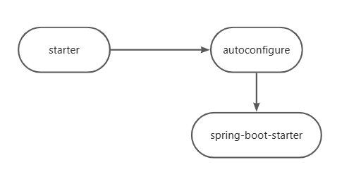

1. autoconfigure包中配置使用 META-INF/spring.factories 中 EnableAutoConfiguration 的值，使得项目启动加载指定的自动配置类
2. 编写自动配置类 xxxAutoConfiguration -> xxxxProperties
   @Configuration
   @Conditional
   @EnableConfigurationProperties
   @Bean

引入starter --- xxxAutoConfiguration --- 容器中放入组件 ---- 绑定xxxProperties ---- 配置项

### 自定义starter

atguigu-hello-spring-boot-starter（启动器）
atguigu-hello-spring-boot-starter-autoconfigure（自动配置包）

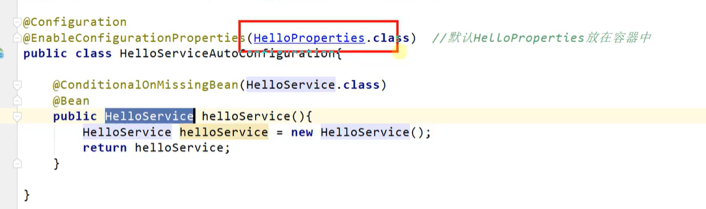

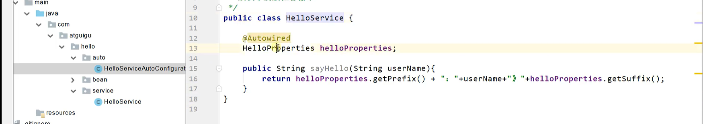

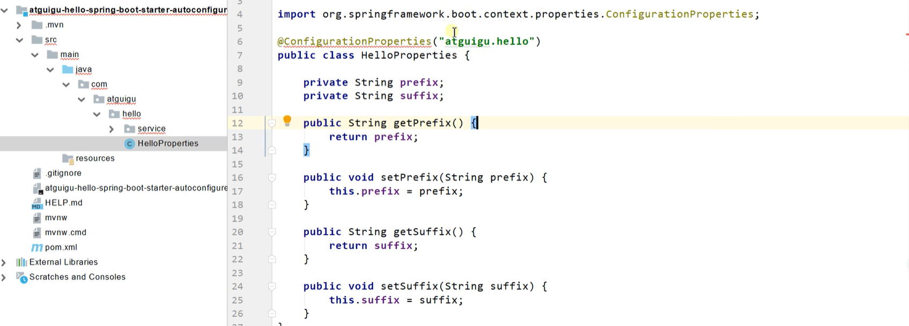

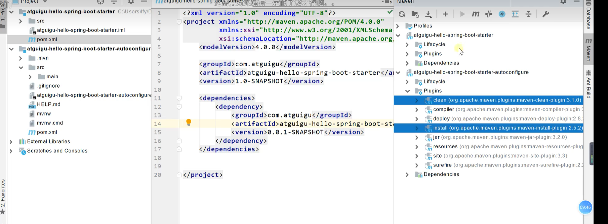

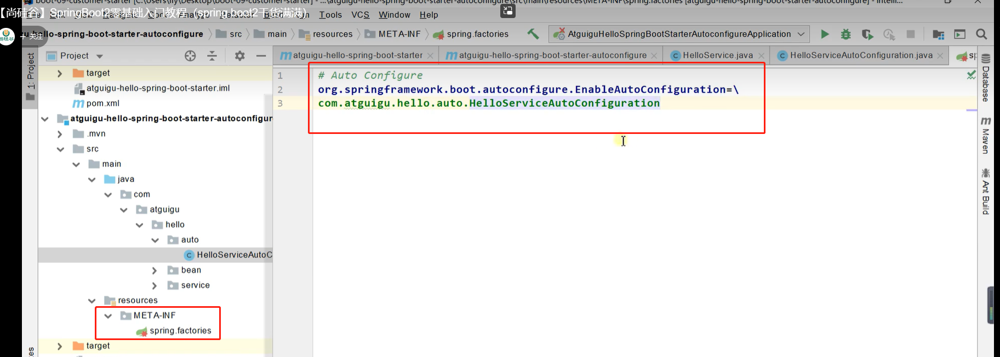

## SpringBoot原理

Spring原理【[Spring注解](https://www.bilibili.com/video/BV1gW411W7wy?p=1)】、SpringMVC原理、自动配置原理、SpringBoot原理

### SpringBoot启动过程

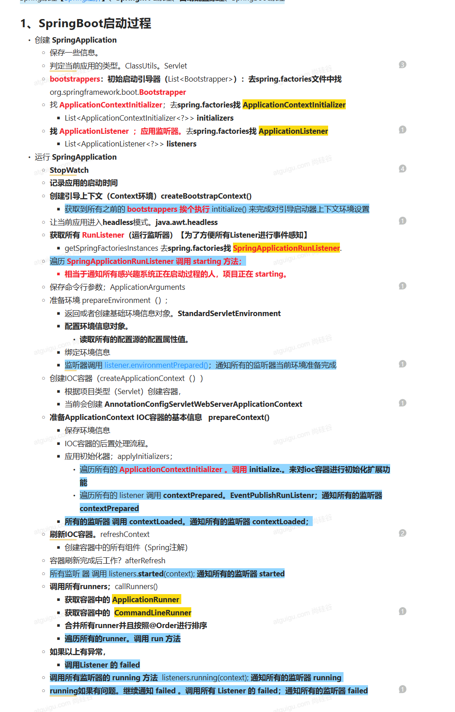

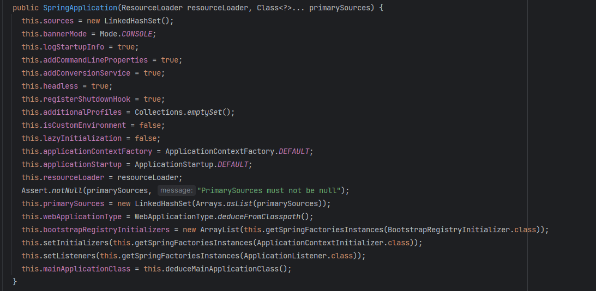

```java
public interface Bootstrapper {

	/**
	 * Initialize the given {@link BootstrapRegistry} with any required registrations.
	 * @param registry the registry to initialize
	 */
	void intitialize(BootstrapRegistry registry);

}
```

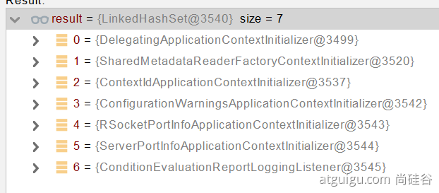

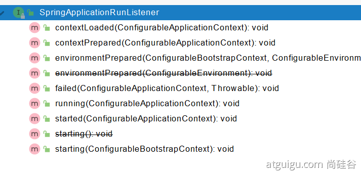

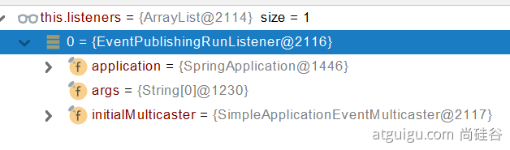

```java
@FunctionalInterface
public interface ApplicationRunner {

	/**
	 * Callback used to run the bean.
	 * @param args incoming application arguments
	 * @throws Exception on error
	 */
	void run(ApplicationArguments args) throws Exception;

}
```

```java
@FunctionalInterface
public interface CommandLineRunner {

	/**
	 * Callback used to run the bean.
	 * @param args incoming main method arguments
	 * @throws Exception on error
	 */
	void run(String... args) throws Exception;

}
```

### Application Events and Listeners

[https://docs.spring.io/spring-boot/docs/current/reference/html/spring-boot-features.html#boot-features-application-events-and-listeners](https://docs.spring.io/spring-boot/docs/current/reference/html/spring-boot-features.html#boot-features-application-events-and-listeners)
ApplicationContextInitializer
ApplicationListener
SpringApplicationRunListener

### ApplicationRunner 与 CommandLineRunner
