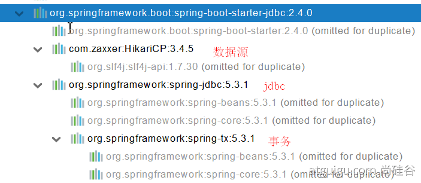
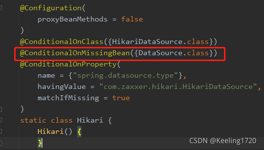

# SQL

## 数据源的自动配置

### 导入JDBC场景

```xml
<dependency>
    <groupId>org.springframework.boot</groupId>
    <artifactId>spring-boot-starter-data-jdbc</artifactId>
</dependency>
```

HikariDataSource 默认数据源



数据库驱动？
为什么导入JDBC场景时，官方不导入驱动？因为官方不知道我们接下要操作什么数据库。
数据库版本和驱动版本对应

```xml
默认版本：<mysql.version>8.0.22</mysql.version>

        <dependency>
            <groupId>mysql</groupId>
            <artifactId>mysql-connector-java</artifactId>
<!--            <version>5.1.49</version>-->
        </dependency>
想要修改版本
1、直接依赖引入具体版本（maven的就近依赖原则）
2、重新声明版本（maven的属性的就近优先原则）
    <properties>
        <java.version>1.8</java.version>
        <mysql.version>5.1.49</mysql.version>
    </properties>
```

### 分析自动配置

自动配置的类：

1. DataSourceAutoConfiguration ： 数据源的自动配置
   1）修改数据源相关的配置：spring.datasource
   2）数据库连接池的配置，是自己容器中没有DataSource才自动配置的
   3）底层配置好的连接池是：HikariDataSource
   ```java
   @Configuration(proxyBeanMethods = false)
   @Conditional(PooledDataSourceCondition.class)
   @ConditionalOnMissingBean({ DataSource.class, XADataSource.class })
   @Import({ DataSourceConfiguration.Hikari.class, DataSourceConfiguration.Tomcat.class,
   			DataSourceConfiguration.Dbcp2.class, DataSourceConfiguration.OracleUcp.class,
   			DataSourceConfiguration.Generic.class, DataSourceJmxConfiguration.class })
   protected static class PooledDataSourceConfiguration
   ```
2. DataSourceTransactionManagerAutoConfiguration： 事务管理器的自动配置
3. JdbcTemplateAutoConfiguration： JdbcTemplate的自动配置，可以来对数据库进行crud
   1）可以修改这个配置项@ConfigurationProperties(prefix = "spring.jdbc") 来修改JdbcTemplate
   2）@Bean@Primary    JdbcTemplate；容器中有这个组件
4. JndiDataSourceAutoConfiguration： jndi的自动配置
5. XADataSourceAutoConfiguration： 分布式事务相关的

### 修改配置项

```yaml
spring:
  datasource:
    url: jdbc:mysql://localhost:3306/db_account
    username: root
    password: 123456
    driver-class-name: com.mysql.jdbc.Driver
```

### 测试

```java
@Slf4j
@SpringBootTest
class Boot05WebAdminApplicationTests {

    @Autowired
    JdbcTemplate jdbcTemplate;


    @Test
    void contextLoads() {

//        jdbcTemplate.queryForObject("select * from account_tbl")
//        jdbcTemplate.queryForList("select * from account_tbl",)
        Long aLong = jdbcTemplate.queryForObject("select count(*) from account_tbl", Long.class);
        log.info("记录总数：{}",aLong);
    }

}
```

## 使用Druid数据源

### druid官方github地址

整合第三方技术的两种方式

* 自定义
* 找starter

### 自定义方式

1、导入依赖

```xml
<dependency>
    <groupId>com.alibaba</groupId>
    <artifactId>druid</artifactId>
    <version>1.2.6</version>
</dependency>
```

HikariDataSource只有在没有其他数据源的情况下才进行导入



2、导入数据源

配置类配置

```java
@Configuration
public class MyDataSourceConfig {
    /**
     *  @ConfigurationProperties 注解让这个Bean与配置文件进行绑定
     *  具体绑定到前缀为spring.datasource下的属性
     *  简单说，spring.datasource配了啥，他的setter就跟着配啥
     */
    @ConfigurationProperties("spring.datasource")
    @Bean
    public DataSource dataSource() throws SQLException {
        DruidDataSource dataSource = new DruidDataSource();
        return dataSource;
    }
}
```

xml配置

```xml
  <bean id="dataSource" class="com.alibaba.druid.pool.DruidDataSource"
        destroy-method="close">
    <property name="url" value="${jdbc.url}"/>
    <property name="username" value="${jdbc.username}"/>
    <property name="password" value="${jdbc.password}"/>
    <property name="maxActive" value="20"/>
    <property name="initialSize" value="1"/>
    <property name="maxWait" value="60000"/>
    <property name="minIdle" value="1"/>
    <property name="timeBetweenEvictionRunsMillis" value="60000"/>
    <property name="minEvictableIdleTimeMillis" value="300000"/>
    <property name="testWhileIdle" value="true"/>
    <property name="testOnBorrow" value="false"/>
    <property name="testOnReturn" value="false"/>
    <property name="poolPreparedStatements" value="true"/>
    <property name="maxOpenPreparedStatements" value="20"/>
  </bean>
```

2、StatViewServlet

StatViewServlet的用途包括：

* 提供监控信息展示的html页面
* 提供监控信息的JSON API

配置类配置

```java
@Configuration
public class MyDataSourceConfig {
    /**
     *  @ConfigurationProperties 注解让这个Bean与配置文件进行绑定
     *  具体绑定到前缀为spring.datasource下的属性
     *  简单说，spring.datasource配了啥，他的setter就跟着配啥
     */
    @ConfigurationProperties("spring.datasource")
    @Bean
    public DataSource dataSource() throws SQLException {
        DruidDataSource dataSource = new DruidDataSource();
        return dataSource;
    }

    //配置Druid的监控页功能
    @Bean
    public ServletRegistrationBean statViewServlet(){
        StatViewServlet servlet = new StatViewServlet();
        ServletRegistrationBean<StatViewServlet> servletRegistrationBean = new ServletRegistrationBean<>(servlet, "/druid/*");
        return servletRegistrationBean;
    }
}
```

xml配置

```xml
<servlet>
	<servlet-name>DruidStatView</servlet-name>
	<servlet-class>com.alibaba.druid.support.http.StatViewServlet</servlet-class>
</servlet>
<servlet-mapping>
	<servlet-name>DruidStatView</servlet-name>
	<url-pattern>/druid/*</url-pattern>
</servlet-mapping>
```

3、StatFilter

用于统计监控信息；如SQL监控、URI监控

```java
//开启监控功能stat
dataSource.setFilters("stat");
```

或

```xml
需要给数据源中配置如下属性；可以允许多个filter，多个用，分割；如：

<property name="filters" value="stat,slf4j" />
```
