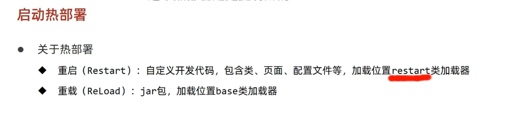
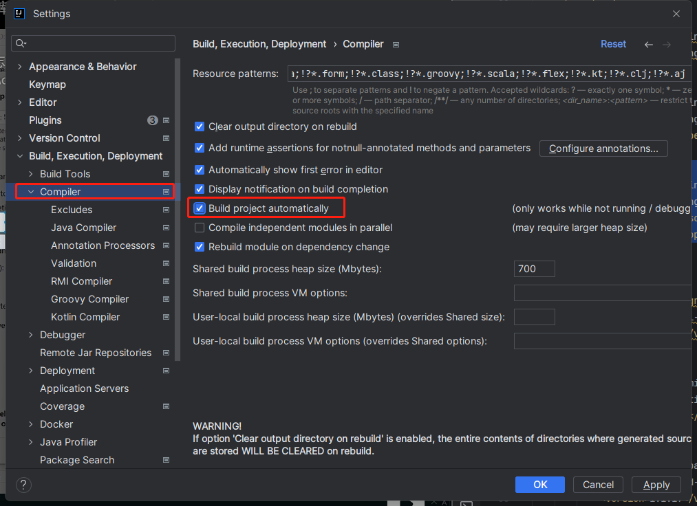
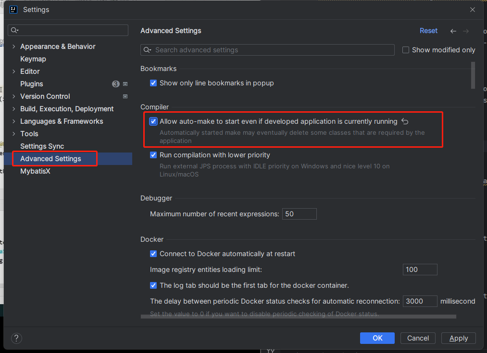
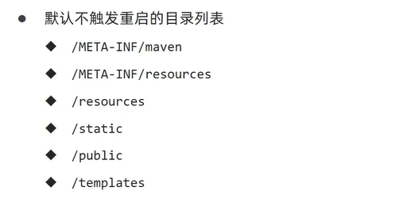
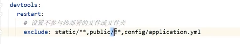
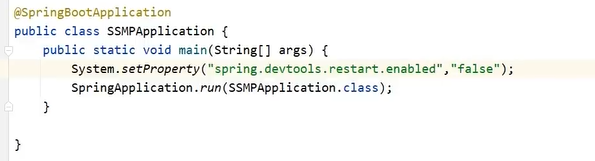

# 热部署

## 手动热部署

```xml
<dependency>
            <groupId>org.springframework.boot</groupId>
            <artifactId>spring-boot-devtools</artifactId>
            <scope>runtime</scope>
            <optional>true</optional>
        </dependency>
```

idea快捷键 ctrl+F9




## 自动热部署





失去焦点5秒后自动构建

## 热部署范围配置





## 关闭热部署


