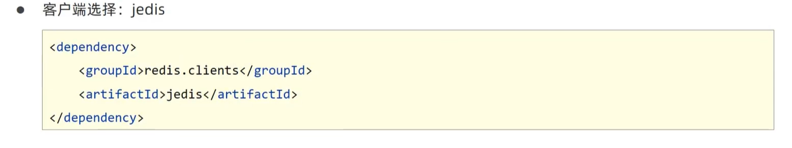

# SQL

## 数据源

```xml
<dependency>
    <groupId>com.alibaba</groupId>
    <artifactId>druid-spring-boot-starter</artifactId>
    <version>1.2.6</version>
</dependency>
```


## 内嵌轻量级数据库（测试）


# NOSQL

## Redis


```java
RedisTemplate<String, User> redisTemplate = run.getBean("redisTemplate", RedisTemplate.class);
    User user = new User();
    user.setUserId(1);
    redisTemplate.opsForValue().set("token", user);

    RedisTemplate<String, String> redisTemplate1 = run.getBean("redisTemplate", RedisTemplate.class);
    System.out.println(redisTemplate1.opsForValue().get("token"));
```




## Mongodb


```sql
db.user.save({"name": "xiaoming",type:'1'})

db.user.find({})

db.user.find({type:"1"})

db.user.remove({type:'1'})

db.user.update({name:"xiaoming"},{$set:{name:"xiaohuang"}})
```


# Elasticsearch (ES)


手撸创建请求


方案一：不推荐


方案二：


创建索引


添加文档


批处理


查询


```java
private RestHighLevelClient client;

    @Test
    void contextLoads() throws IOException {
        HttpHost host = HttpHost.create("http://127.0.0.1:9200");
        RestClientBuilder builder = RestClient.builder(host);
        client = new RestHighLevelClient(builder);


        client.close();
    }

    @Test
    void testContextLoads() throws IOException {
        HttpHost host = HttpHost.create("http://127.0.0.1:9200");
        RestClientBuilder builder = RestClient.builder(host);
        client = new RestHighLevelClient(builder);
        CreateIndexRequest request = new CreateIndexRequest("books");
        client.indices().create(request, RequestOptions.DEFAULT);

        client.close();
    }

    @Test
    void testContextLoads1() throws IOException {
        HttpHost host = HttpHost.create("http://127.0.0.1:9200");
        RestClientBuilder builder = RestClient.builder(host);
        client = new RestHighLevelClient(builder);
        CreateIndexRequest request = new CreateIndexRequest("books");
        //设置请求中的参数
        String json = "{\"mappings\":{\n" +
                "        \"properties\":{\n" +
                "            \"id\":{\n" +
                "                \"type\":\"keyword\"\n" +
                "            },\n" +
                "            \"name\":{\n" +
                "                \"type\":\"text\",\n" +
                "                \"analyzer\":\"ik_max_word\",\n" +
                "                \"copy_to\":\"all\"\n" +
                "            },\n" +
                "            \"type\":{\n" +
                "                \"type\":\"keyword\"\n" +
                "            },\n" +
                "            \"des\":{\n" +
                "                \"type\":\"text\",\n" +
                "                \"analyzer\":\"ik_max_word\",\n" +
                "                \"copy_to\":\"all\"\n" +
                "            },\n" +
                "            \"all\":{\n" +
                "                \"type\":\"text\",\n" +
                "                \"analyzer\":\"ik_max_word\"\n" +
                "            }\n" +
                "        }\n" +
                "    }\n" +
                "}";
        request.source(json, XContentType.JSON);

        client.indices().create(request, RequestOptions.DEFAULT);

        client.close();
    }


    @Test
    void testContextLoads2() throws IOException {
        HttpHost host = HttpHost.create("http://127.0.0.1:9200");
        RestClientBuilder builder = RestClient.builder(host);
        client = new RestHighLevelClient(builder);

        Book book = new Book();
        book.setId(1);
        book.setName("bobo");
        book.setDes("...");
        book.setType("yyy");

        IndexRequest request = new IndexRequest("books").id(book.getId().toString());
        String jsonString = JSON.toJSONString(book);
        request.source(jsonString, XContentType.JSON);
        client.index(request, RequestOptions.DEFAULT);
        client.close();
    }

    @Test
    void testContextLoads3() throws IOException {
        HttpHost host = HttpHost.create("http://127.0.0.1:9200");
        RestClientBuilder builder = RestClient.builder(host);
        client = new RestHighLevelClient(builder);

        Book book = new Book();
        book.setId(1);
        book.setName("bobo");
        book.setDes("...");
        book.setType("yyy");
        List<Book> list = new ArrayList<>();
        list.add(book);

        BulkRequest bulkRequest = new BulkRequest();

        list.forEach(book0 -> {
            IndexRequest request = new IndexRequest("books").id(book0.getId().toString());
            String jsonString = JSON.toJSONString(book0);
            request.source(jsonString, XContentType.JSON);
            bulkRequest.add(request);
        });

        client.bulk(bulkRequest, RequestOptions.DEFAULT);
        client.close();
    }


    @Test
    void testContextLoads4() throws IOException {
        HttpHost host = HttpHost.create("http://127.0.0.1:9200");
        RestClientBuilder builder = RestClient.builder(host);
        client = new RestHighLevelClient(builder);
        GetRequest request = new GetRequest("books", "1");
        GetResponse response = client.get(request, RequestOptions.DEFAULT);
        String s = response.getSourceAsString();
        System.out.println(s);
        client.close();
    }

    @Test
    void testContextLoads5() throws IOException {
        //*****************************************************
        HttpHost host = HttpHost.create("http://127.0.0.1:9200");
        RestClientBuilder builder = RestClient.builder(host);
        client = new RestHighLevelClient(builder);

        SearchRequest request = new SearchRequest("books");
        SearchSourceBuilder builder1 = new SearchSourceBuilder();
        builder1.query(QueryBuilders.termQuery("name", "bobo"));

        request.source(builder1);
        SearchResponse response = client.search(request, RequestOptions.DEFAULT);
        SearchHits hits = response.getHits();
        hits.forEach(item -> {
            String s = item.getSourceAsString();
            System.out.println(s);
        });
        client.close();
    }
```
