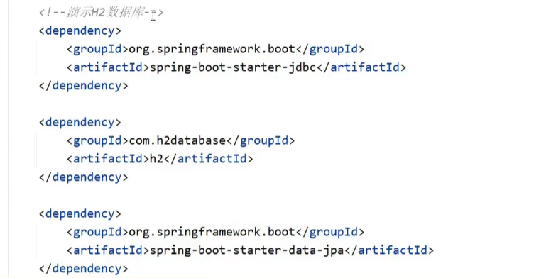
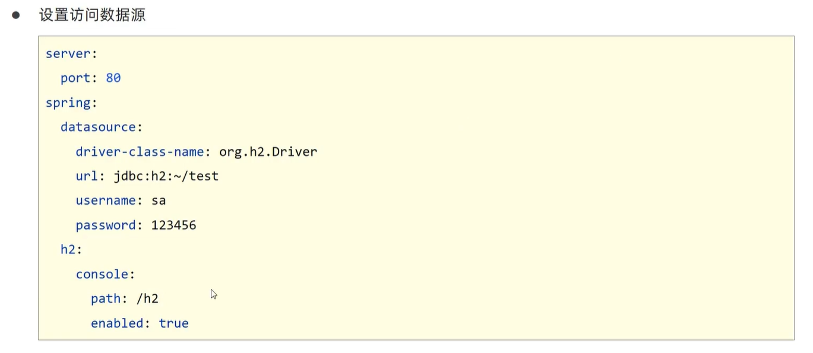

# SQL

## 数据源

```xml
<dependency>
    <groupId>com.alibaba</groupId>
    <artifactId>druid-spring-boot-starter</artifactId>
    <version>1.2.6</version>
</dependency>
```


## 内嵌轻量级数据库（测试）







# NOSQL

## Redis


```java
RedisTemplate<String, User> redisTemplate = run.getBean("redisTemplate", RedisTemplate.class);
    User user = new User();
    user.setUserId(1);
    redisTemplate.opsForValue().set("token", user);

    RedisTemplate<String, String> redisTemplate1 = run.getBean("redisTemplate", RedisTemplate.class);
    System.out.println(redisTemplate1.opsForValue().get("token"));
```


## Mongodb


