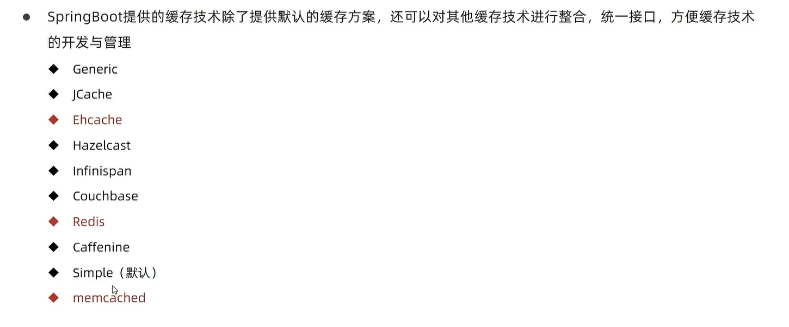
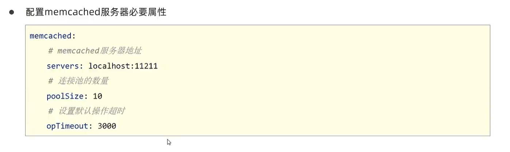

## 缓存

### springboot默认缓存技术


案例一


案例二


### 常用缓存技术



### Ehcache


```xml
<ehcache xmlns:xsi="http://www.w3.org/2001/XMLSchema-instance"
         xsi:noNamespaceSchemaLocation="http://www.ehcache.org/ehcache.xsd"
         updateCheck="false">
    <diskStore path="D:\ehcache"/>

    <defaultCache
            maxEntriesLocalHeap="10000"
            eternal="false"
            timeToIdleSeconds="120"
            timeToLiveSeconds="120"
            diskSpoolBufferSizeMB="30"
            maxEntriesLocalDisk="10000000"
            diskExpiryThreadIntervalSeconds="120"
            memoryStoreEvictionPolicy="LRU"
            statistics="true">
    </defaultCache>

    <cache
            name="a"
            maxEntriesLocalHeap="10000"
            eternal="false"
            timeToIdleSeconds="300"
            timeToLiveSeconds="600"
            memoryStoreEvictionPolicy="LFU">
    </cache>
</ehcache>
```

### 数据淘汰策略


### Redis


### memcached





### jetcache


启用方法注解


### j2cache


## 定时任务


### Quartz


### task


## javamail


```java
@Service
public class MailServiceImpl implements MailService {
    @Autowired
    private JavaMailSender javaMailSender;

    // 发送人
    private String from = "xxxxxxxx@qq.com";

    // 接收人
    private String to = "xxxxxxxxx@163.com";


    @Override
    public void sendMail() {
        SimpleMailMessage msg = new SimpleMailMessage();
        msg.setFrom(from + "(章北海)");
        msg.setTo(to);
        // 主题
        String subject = "测试发邮件";
        // 正文
        String context = "测试邮件的正文内容";
        msg.setSubject(subject);
        msg.setText(context);
        javaMailSender.send(msg);
    }

    @Override
    // 发送带链接和附件的消息
    public void sendMailWithLinkAttachment() throws MessagingException {
        MimeMessage msg = javaMailSender.createMimeMessage();
        // 要想发送附件，需要指定第二个参数为true
        MimeMessageHelper msgHelper = new MimeMessageHelper(msg, true);
        msgHelper.setFrom(from + "(章北海)");
        msgHelper.setTo(to);
        // 主题
        String subject = "测试发送带链接和附件的消息";
        // 正文
        String context = "<a href='https://www.baidu.com'>百度一下</a><br>";
        msgHelper.setSubject(subject);
        // 要想正文以html格式解析，需要指定第二个参数为true
        msgHelper.setText(context, true);

        // 添加附件
        File file1 = new File("D:\\ideacode\\spring-boot-study\\springboot_16_03_mail\\src\\main\\resources\\test.jpg");
        File file2 = new File("D:\\ideacode\\spring-boot-study\\springboot_16_03_mail\\target\\springboot_16_03_mail-0.0.1-SNAPSHOT.jar");
        msgHelper.addAttachment(file1.getName(), file1);
        msgHelper.addAttachment(file2.getName(), file2);

        javaMailSender.send(msg);
    }
}

```
