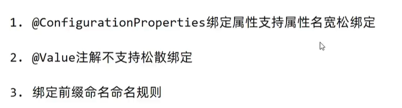

# 配置高级

## @ConfigurationProperties

使用@ConfigurationProperties注解直接绑定：在需要绑定属性的Bean类上添加@ConfigurationProperties注解，并指定属性的前缀。然后，通过在application.properties或application.yml配置文件中设置以该前缀开头的属性值来实现属性的绑定。

例如，在一个名为MyConfig的Bean类上添加@ConfigurationProperties注解，并指定前缀为"myconfig"，可以这样绑定属性：

```java
@ConfigurationProperties(prefix = "myconfig")
public class MyConfig {
    private String property1;
    private int property2;
     // getters and setters
}
```

使用@Bean注解结合@ConfigurationProperties注解：在一个配置类中，使用@Bean注解创建一个Bean实例，并通过@ConfigurationProperties注解绑定属性。这种方式适用于需要将属性绑定到一个特定的Bean实例上的情况。

例如，在一个名为MyConfig的配置类中，使用@Bean注解创建一个MyConfig的Bean实例，并通过@ConfigurationProperties注解绑定属性：

```java
@Configuration
public class MyConfig {
    @Bean
    @ConfigurationProperties(prefix = "myconfig")
    public MyConfig myConfig() {
        return new MyConfig();
    }
     // other configuration beans or methods
}
```

@EnableConfigurationProperties注解的作用是将带有@ConfigurationProperties注解的类注册为Spring的Bean，并启用属性绑定功能。

当我们在一个带有@ConfigurationProperties注解的类上使用@EnableConfigurationProperties注解时，Spring会自动注册该类为Bean，并将其属性与配置文件中的属性进行绑定。这样，我们就可以通过在配置文件中设置属性值来配置和定制这个Bean的属性。

例如，假设我们有一个名为MyConfig的类，使用@ConfigurationProperties注解来绑定属性：

```java
@ConfigurationProperties(prefix = "myconfig")
public class MyConfig {
    private String property1;
    private int property2;
    // getters and setters
}
```

如果我们在一个配置类上使用@EnableConfigurationProperties注解，如下所示：

```java
@Configuration
@EnableConfigurationProperties(MyConfig.class)
public class AppConfig {
    // other configuration beans or methods
}
```

那么，MyConfig类就会被注册为一个Bean，并且可以通过在配置文件中设置以"myconfig"为前缀的属性值来配置它的属性。

这样，我们就可以在其他组件中通过@Autowired注解将MyConfig的Bean注入，并使用其中的属性值。

总结来说，@EnableConfigurationProperties注解的作用是启用@ConfigurationProperties注解类的属性绑定功能，使其成为可配置的Bean。


## 宽松绑定/松散绑定




## 常用计量单位绑定


## 数据校验

接口与实现


注入校验


其他方式

```xml
<dependency>
    <groupId>org.springframework.boot</groupId>
    <artifactId>spring-boot-starter-validation</artifactId>
</dependency>
```

## 进制数据转换规则


