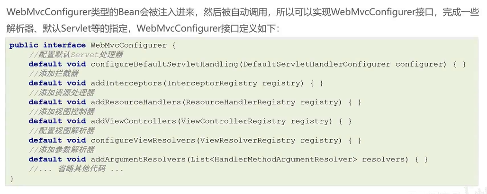
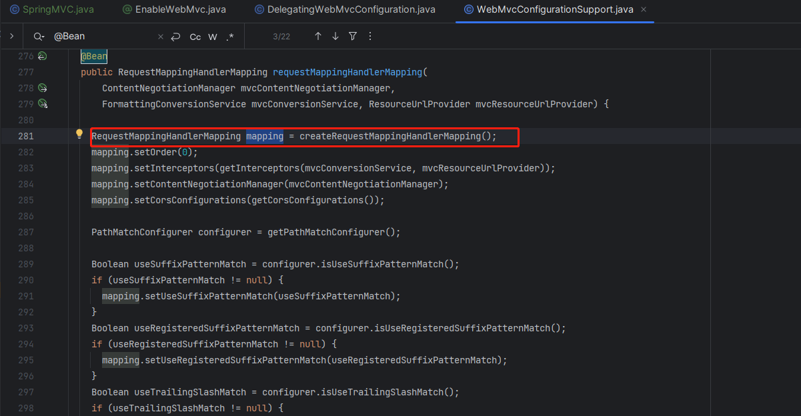
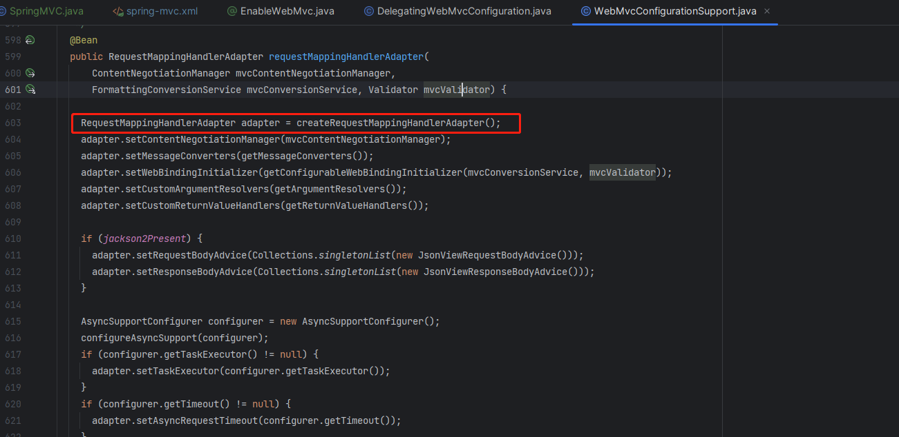
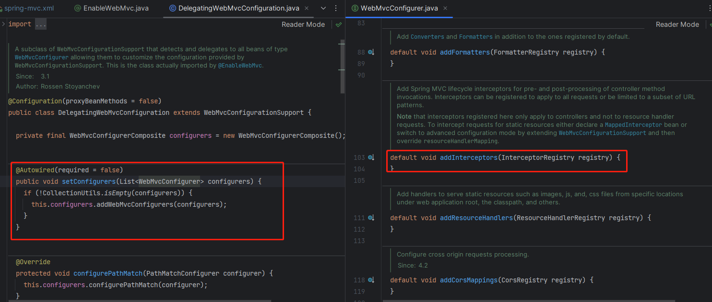
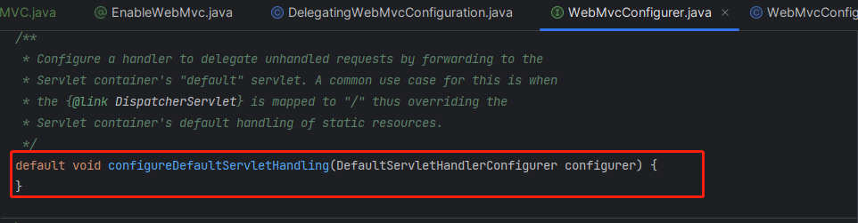

# spring-mvc.xml中组件转化为注解形式

## Bean的配置

```xml
<context:component-scan base-package="com.bobo.webmvc.controller"/>

  <!--  配置文件上传解析器  -->
  <bean id="multipartResolver" class="org.springframework.web.multipart.commons.CommonsMultipartResolver">
    <property name="defaultEncoding" value="UTF=8"/>
    <property name="maxUploadSizePerFile" value="1048576"/>
    <property name="maxUploadSize" value="3145728"/>
    <property name="maxInMemorySize" value="1048576"/>
  </bean>
```

转化为

```java
@Configuration
//<context:component-scan base-package="com.bobo.webmvc.controller"/>
@ComponentScan("com.bobo.webmvc.controller")
public class SpringMVC {

/*  <bean id="multipartResolver" class="org.springframework.web.multipart.commons.CommonsMultipartResolver">
    <property name="defaultEncoding" value="UTF=8"/>
    <property name="maxUploadSizePerFile" value="1048576"/>
    <property name="maxUploadSize" value="3145728"/>
    <property name="maxInMemorySize" value="1048576"/>
  </bean>*/

  @Bean
  public CommonsMultipartResolver multipartResolver() {
    CommonsMultipartResolver multipartResolver = new CommonsMultipartResolver();
    multipartResolver.setDefaultEncoding("UTF-8");
    multipartResolver.setMaxUploadSizePerFile(1048576);
    multipartResolver.setMaxUploadSize(3145728);
    multipartResolver.setMaxInMemorySize(1048576);
    return multipartResolver;
  }

}
```

## 非Bean的配置


```xml
<!-- 为了简化配置，下面的标签将简化RequestMappingHandlerMapping、RequestMappingHandlerAdapter等的配置 -->
  <mvc:annotation-driven/>

  <!-- 允许访问静态资源，但如果RequestMappingHandlerMapping没有注入，会默认诸如一个SimpleUrlHandlerMapping，导致无法访问Controller -->
  <mvc:default-servlet-handler/>

  <mvc:interceptors>
    <mvc:interceptor>
      <!--   哪些请求路径进行拦截   -->
      <mvc:mapping path="/**"/>
      <bean class="com.bobo.webmvc.interceptors.Interceptor1"/>
    </mvc:interceptor>
  </mvc:interceptors>
```

转化为

```java
@Configuration
//<context:component-scan base-package="com.bobo.webmvc.controller"/>
@ComponentScan("com.bobo.webmvc.controller")
//启用处理器映射器适配器等、访问静态资源、拦截器
@EnableWebMvc
public class SpringMVC {

/*  <bean id="multipartResolver" class="org.springframework.web.multipart.commons.CommonsMultipartResolver">
    <property name="defaultEncoding" value="UTF=8"/>
    <property name="maxUploadSizePerFile" value="1048576"/>
    <property name="maxUploadSize" value="3145728"/>
    <property name="maxInMemorySize" value="1048576"/>
  </bean>*/

  @Bean
  public CommonsMultipartResolver multipartResolver() {
    CommonsMultipartResolver multipartResolver = new CommonsMultipartResolver();
    multipartResolver.setDefaultEncoding("UTF-8");
    multipartResolver.setMaxUploadSizePerFile(1048576);
    multipartResolver.setMaxUploadSize(3145728);
    multipartResolver.setMaxInMemorySize(1048576);
    return multipartResolver;
  }

}
```



@EnableWebMvc消除mvc:annotation-driven的原理





@EnableWebMvc消除mvc:interceptors

会将所有实现了WebMvcConfigurer的类注册为拦截器配置，拦截器配置内添加自定义的拦截器



```java
@Configuration
@EnableWebMvc
public class WebConfig implements WebMvcConfigurer {
     @Override
    public void addInterceptors(InterceptorRegistry registry) {
        registry.addInterceptor(new MyInterceptor())
                .addPathPatterns("/**")
                .excludePathPatterns("/login");
    }
}
```

@EnableWebMvc消除mvc:default-servlet-handler



最终代码

```java
@Component
public class MyWebMvcConfigurer implements WebMvcConfigurer {
  @Override
  public void configureDefaultServletHandling(DefaultServletHandlerConfigurer configurer) {
    //开启DefaultServletHandling
    configurer.enable();
  }

  @Override
  public void addInterceptors(InterceptorRegistry registry) {
    registry.addInterceptor(new Interceptor1()).addPathPatterns("/**");
  }
}
```
