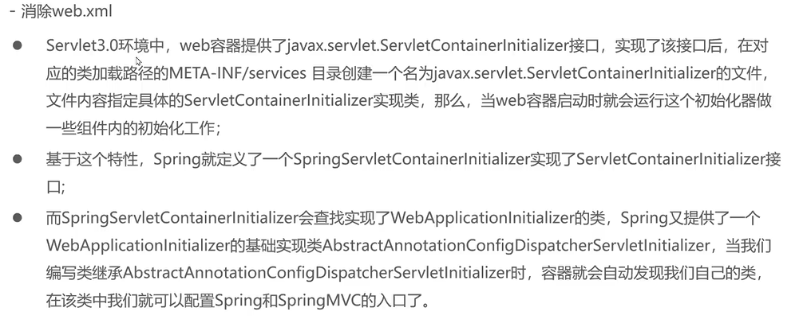
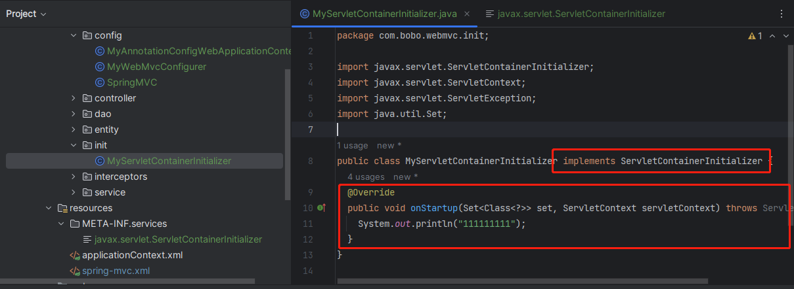
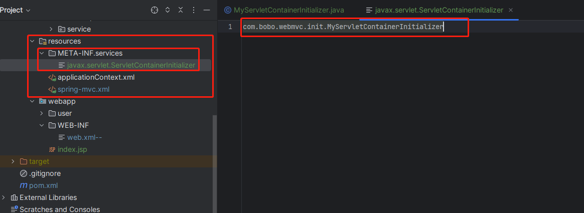
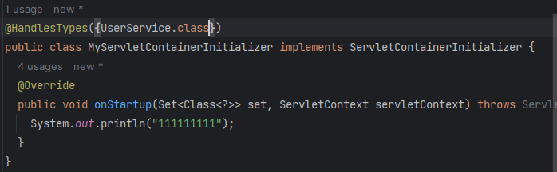
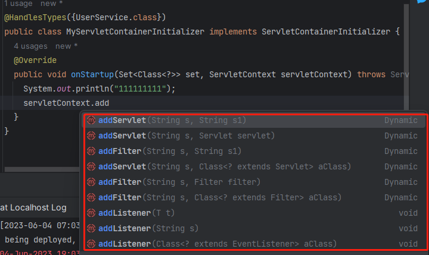

# 消除web.xml



## 简单前置Servlet3.0

此处只是展示了Servlet3.0的新特性

javax.servlet.ServletContainerInitializer

第一步



第二步



@HandlesTypes({})传入接口，他会帮你自动扫描该接口的实现类，跟spring暂时无关



servletContext可以添加servlet原生或spring的东西



## 代码实现

需要前置：springmvc的父子容器

### 配置springConfig

```java
@Configuration
@ComponentScan({"com.bobo.webmvc.service","com.bobo.webmvc.dao"})
public class SpringConfig {

}
```

### 配置springMVCConfig

```java
@Configuration
//<context:component-scan base-package="com.bobo.webmvc.controller"/>
@ComponentScan("com.bobo.webmvc.controller")
@Import(MyWebMvcConfigurer.class)
//启用处理器映射器适配器等、访问静态资源、拦截器
@EnableWebMvc
public class SpringMVCConfig {

/*  <bean id="multipartResolver" class="org.springframework.web.multipart.commons.CommonsMultipartResolver">
    <property name="defaultEncoding" value="UTF=8"/>
    <property name="maxUploadSizePerFile" value="1048576"/>
    <property name="maxUploadSize" value="3145728"/>
    <property name="maxInMemorySize" value="1048576"/>
  </bean>*/

  @Bean
  public CommonsMultipartResolver multipartResolver() {
    CommonsMultipartResolver multipartResolver = new CommonsMultipartResolver();
    multipartResolver.setDefaultEncoding("UTF-8");
    multipartResolver.setMaxUploadSizePerFile(1048576);
    multipartResolver.setMaxUploadSize(3145728);
    multipartResolver.setMaxInMemorySize(1048576);
    return multipartResolver;
  }

}
```

继承AbstractAnnotationConfigDispatcherServletInitializer

```java
public class MyAbstractAnnotationConfigDispatcherServletInitializer extends AbstractAnnotationConfigDispatcherServletInitializer {
  /**
   * 获取根容器的配置(类似于之前监听器配置spring的配置文件)
   *    <listener>
   *      <listener-class>org.springframework.web.context.ContextLoaderListener</listener-class>
   *     </listener>
   *
   *<context-param>
   *     <param-name>contextConfigLocation</param-name>
   *     <param-value>classpath:spring/applicationContext-*.xml</param-value> 。
   * </context-param>
   *
   *
   *
   **/

  @Override
  protected Class<?>[] getRootConfigClasses() {
    return new Class[]{SpringConfig.class};
  }

  /**
   * 获取web容器的配置类(类似于springmvc的配置文件)(前端控制器)子容器
   * @return
   */
  @Override
  protected Class<?>[] getServletConfigClasses() {
    return new Class[]{SpringMVCConfig.class};
  }

  /**
   * 获取DispatcherServlet的映射信息
   *
   * {"/"}:拦截所有请求包括静态资源(xx.js,xx.png),不包括*.jsp
   * {"/*"}:拦截所有请求，包括*.jsp,jsp页面是tomcat的jsp引擎解析的
   * @return
   */
  @Override
  protected String[] getServletMappings() {
    return new String[]{"/"};
  }
}
```

### 资源目录下META-INF/services/javax.servlet.ServletContainerInitializer文件

添加 `org.springframework.web.MyAbstractAnnotationConfigDispatcherServletInitializer `

来指定无配置文件的启动类

注意：web.xml被认为注释为web.xml--任然会被读取，尽量删除他
