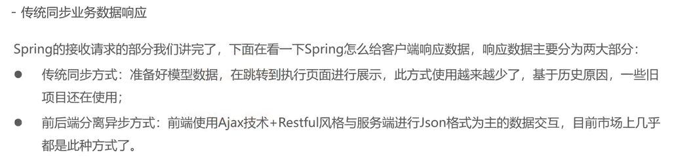
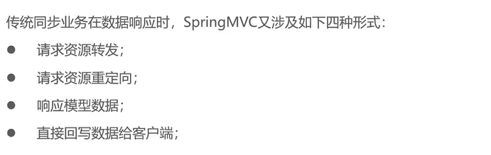
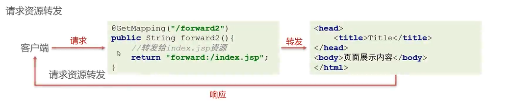
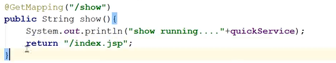
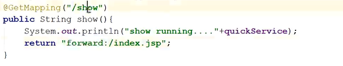
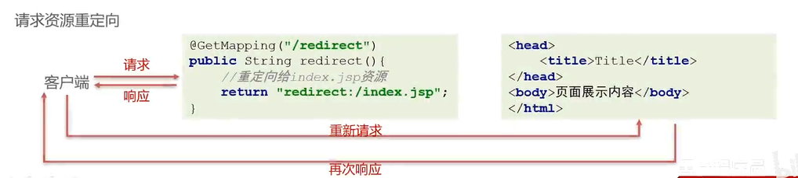
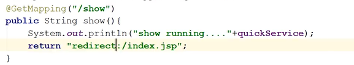

# 传统同步业务数据响应





## 请求转发



注意视图名前加/是绝对地址，不加则为相对地址



或



还可以省略前缀和后缀

xml配置方式

```xml
<bean id="viewResolver" class="org.springframework.web.servlet.view.InternalResourceViewResolver">
    <property name="prefix" value="/jsp/"/>
    <property name="suffix" value=".jsp"/>
  </bean>
```

全注解方式

```java
@Bean
  public InternalResourceViewResolver viewResolver() {
    InternalResourceViewResolver viewResolver = new InternalResourceViewResolver();
    viewResolver.setPrefix("/views/");
    viewResolver.setSuffix(".jsp");
    return viewResolver;
  }
```

## 重定向





## 响应模型数据

```java
@Controller
@RequestMapping("/modelAndView")
public class ModelAndViewController {

  @GetMapping("/test")
  public ModelAndView test(ModelAndView modelAndView){
    User user = new User();
    user.setUserno("1123");
    modelAndView.addObject("user",user);
    modelAndView.setViewName("/index.jsp");
    return modelAndView;
  }
}
```

## 直接回写数据给客户端

以后前后端分离开发中@ResponseBody直接写在类上即可

```java
  @GetMapping("/test1")
  @ResponseBody
  public String test1(){
    //不能直接返回字符串，默认会返回视图名
    return "aoligei";
  }
```
