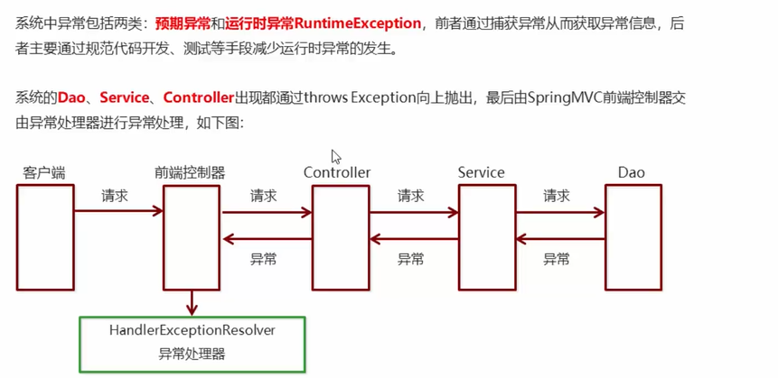
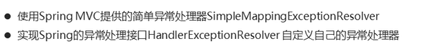
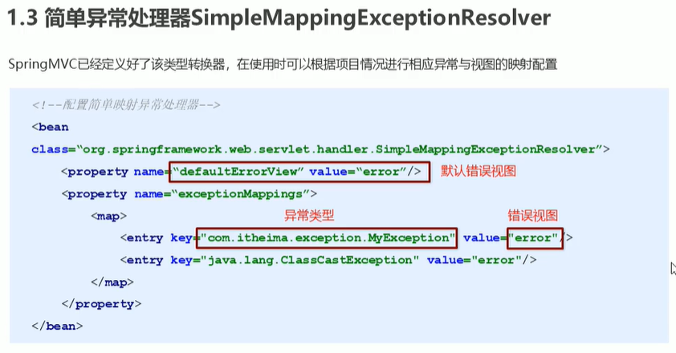
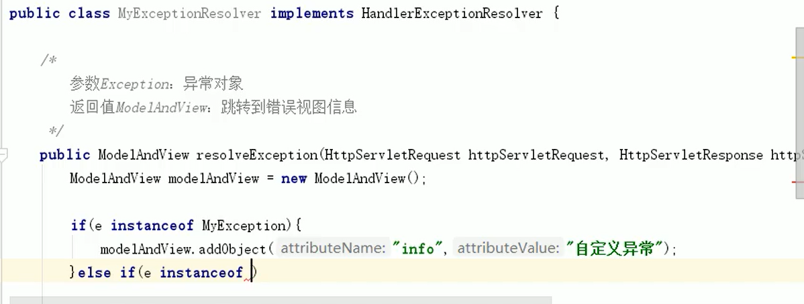

# 异常处理思路



# 异常处理两种方式



## SimpleMappingExceptionResolver

此处的error是完整的视图名，此处已经配置了前缀和后缀可以省略



## HandlerExceptionResolver



## 其他

1. @ExceptionHandler 注解：在 Controller 中定义一个方法，使用 @ExceptionHandler 注解来捕获指定的异常类型，然后在该方法中进行异常处理。
   ```java
   @Controller
   public class UserController {
        @ExceptionHandler(UserNotFoundException.class)
       public ModelAndView handleUserNotFoundException(UserNotFoundException e) {
           ModelAndView mav = new ModelAndView();
           mav.addObject("exception", e);
           mav.setViewName("userNotFound");
           return mav;
       }
        @RequestMapping("/user/{id}")
       public ModelAndView getUser(@PathVariable("id") int id) throws UserNotFoundException {
           User user = userService.getUserById(id);
           if (user == null) {
               throw new UserNotFoundException("User not found with id " + id);
           }
           ModelAndView mav = new ModelAndView();
           mav.addObject("user", user);
           mav.setViewName("userDetails");
           return mav;
       }
   }
   ```
2. @ControllerAdvice 注解：使用 @ControllerAdvice 注解来定义一个全局的异常处理类，该类中可以定义多个 @ExceptionHandler 方法，用来处理不同类型的异常。
   ```java
   @ControllerAdvice
   public class GlobalExceptionHandler {

       @ExceptionHandler(Exception.class)
       public ModelAndView handleException(Exception e) {
           ModelAndView mav = new ModelAndView();
           mav.addObject("exception", e);
           mav.setViewName("error");
           return mav;
       }
   }
   ```
3. SimpleMappingExceptionResolver 类：使用 SimpleMappingExceptionResolver 类来配置异常处理，可以将异常类型映射到指定的视图，同时可以为不同的异常类型指定不同的状态码。
   ```java
   <bean id="simpleMappingExceptionResolver"
       class="org.springframework.web.servlet.handler.SimpleMappingExceptionResolver">
       <property name="exceptionMappings">
           <props>
               <prop key="java.lang.Exception">error</prop>
           </props>
       </property>
   </bean>
   ```
4. HandlerExceptionResolver 接口：实现 HandlerExceptionResolver 接口来自定义异常处理逻辑，该接口定义了两个方法，分别用于处理请求异常和视图异常。
5. ResponseEntityExceptionHandler 类：继承 ResponseEntityExceptionHandler 类来自定义异常处理，该类提供了多个处理异常的方法，可以根据需要进行选择和重写。
