# 前端控制器初始化

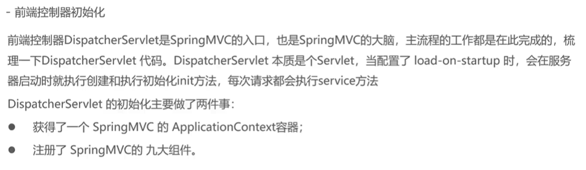

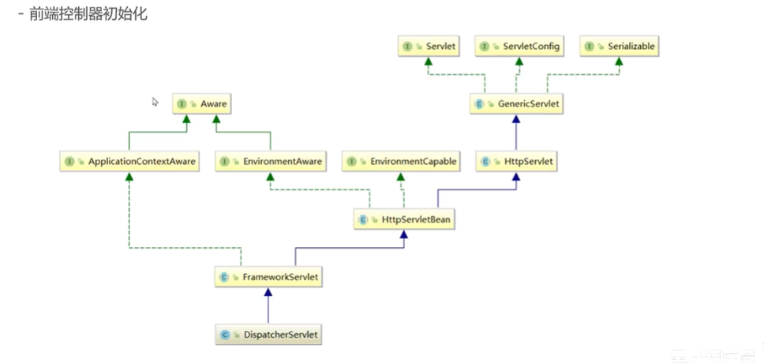

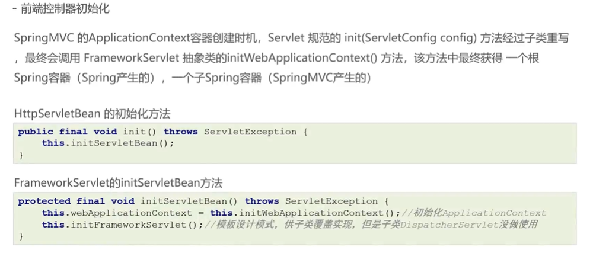

此处的尝试设置为父子容器关系

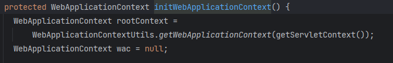

如果mvc容器存在

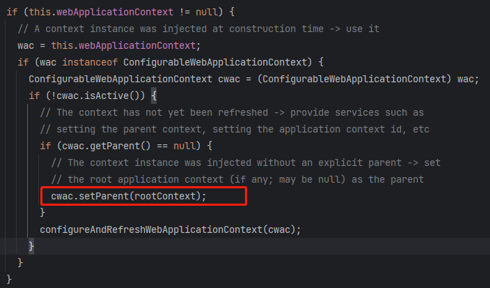

如果mvc容器不存在

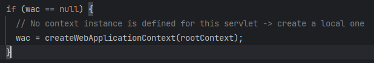

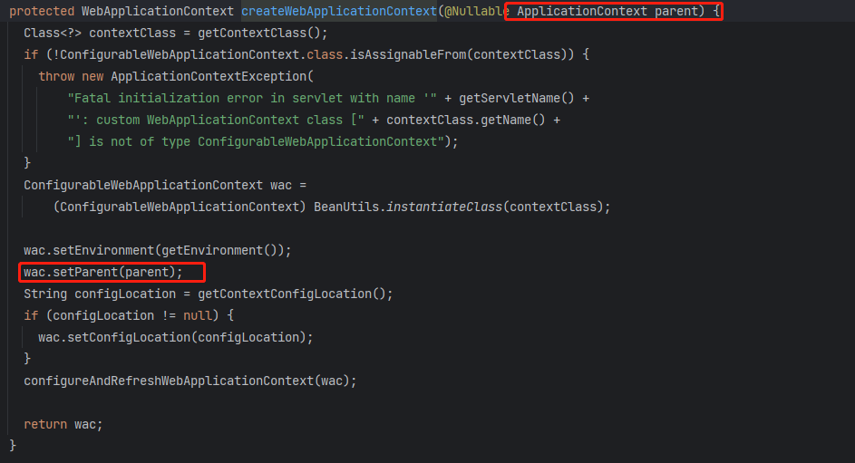

configureAndRefreshWebApplicationContext(***);

不论是新创建的还是已经存在的mvc容器，都要进行配置和刷新。wac.refresh()：执行一系列容器初始化

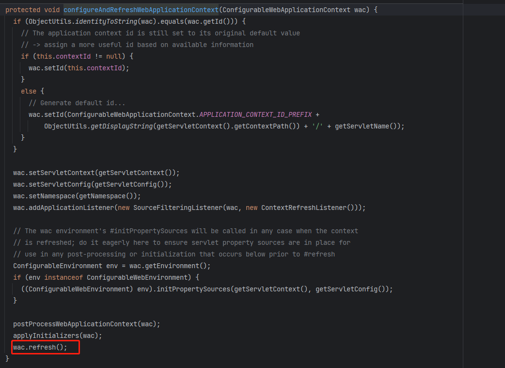

finishRefresh();完成容器的初始化

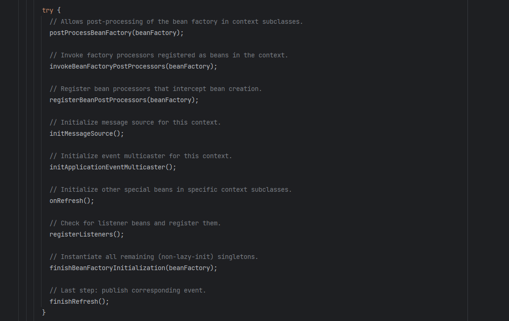

publishEvent(new ContextRefreshedEvent(this)); 发布一个容器刷新完毕的事件（spring体系的监听器机制）

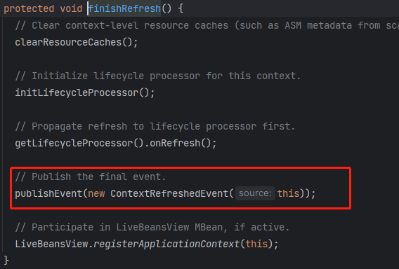

此处会被监听器获取到上面发布的事件，执行onApplicationEvent方法

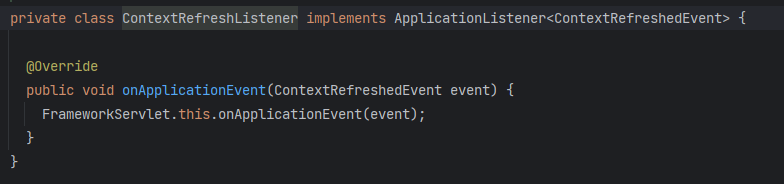

然后执行DispatcherServlet的onRefresh方法，进行注册九大组件。如果指定了组件，会只加载指定的，反之加载默认的

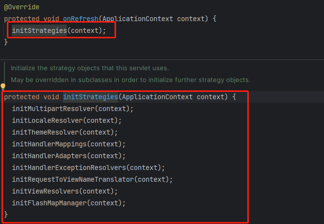

此处init在执行前就已经将拦截器，控制层等的引用进行维护了

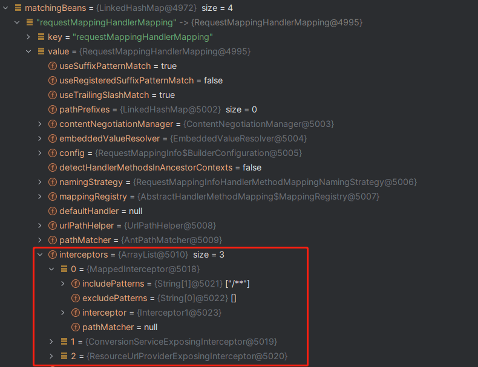

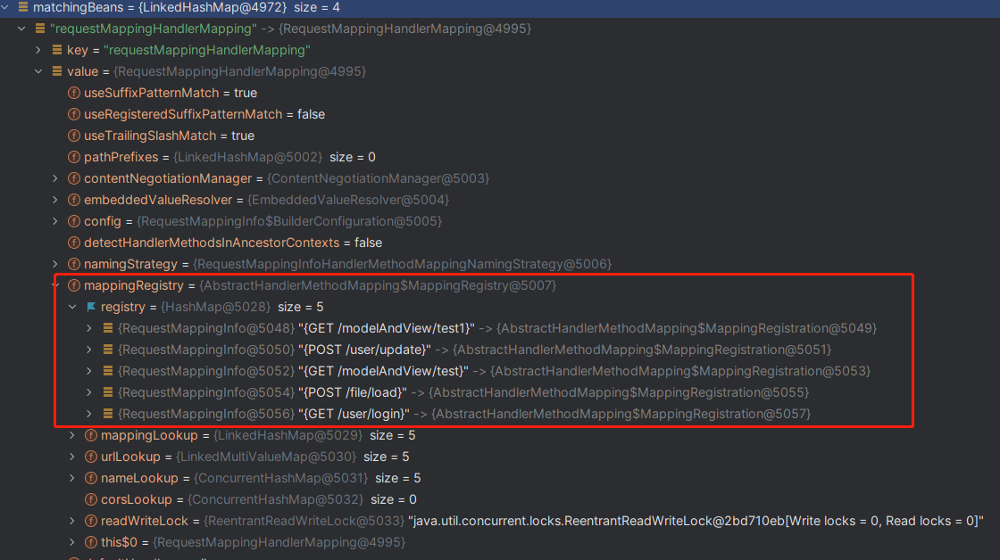
