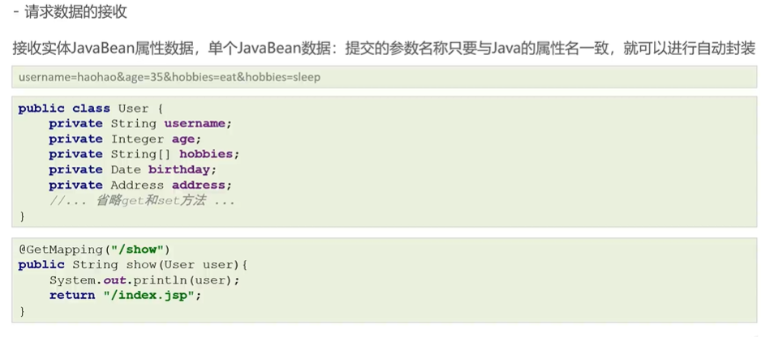
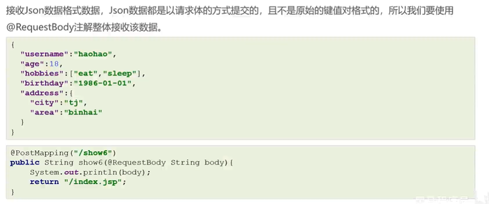
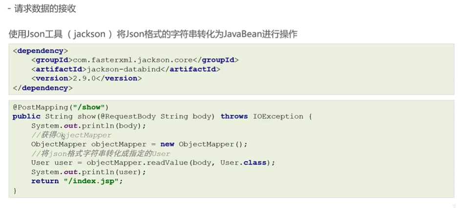
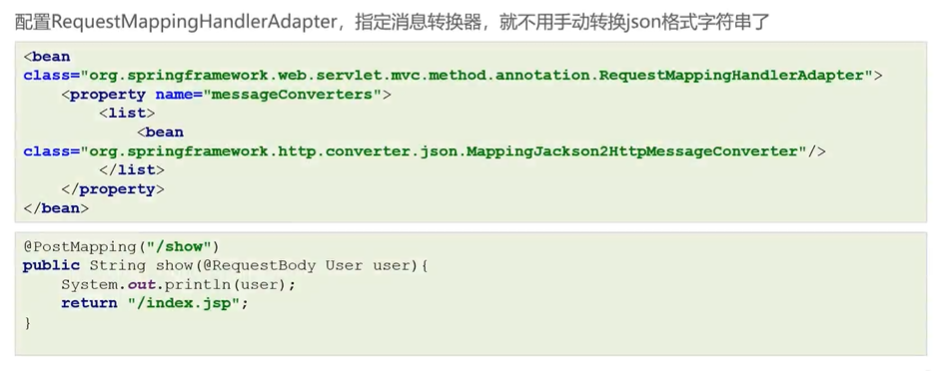
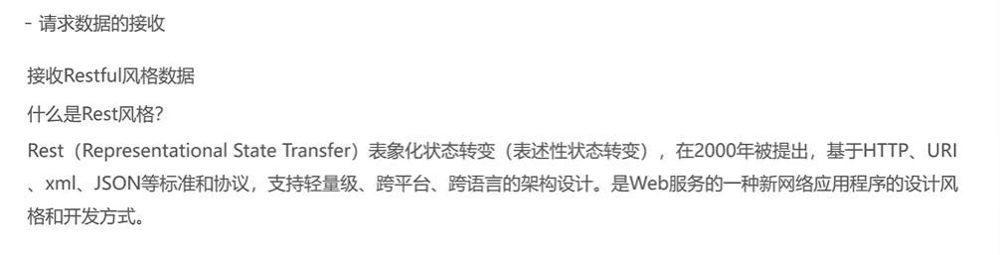
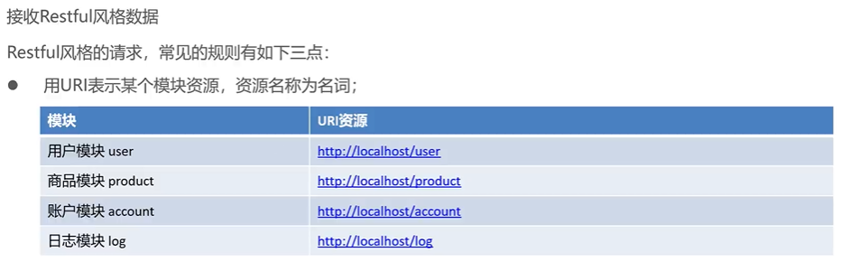
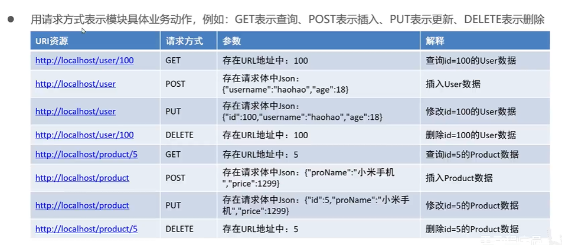
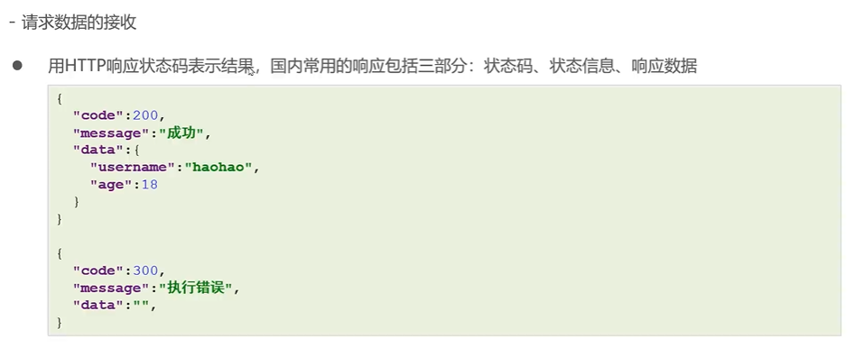
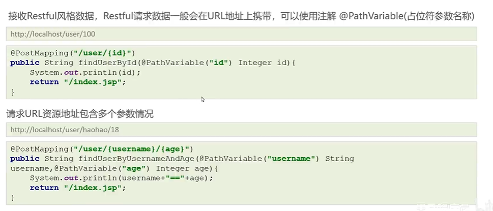

# javaweb常用对象获取

## 键值对

如果【实体类1】套【实体类2】，传递参数时使用【实体类2.属性】即可



## Json格式

以字符串接收



以对象接收



或在spring-mvc.xml中加入下面代码，可直接转换为javaBean对象

```xml
<bean class="org.springframework.web.servlet.mvc.method.annotation.RequestMappingHandlerAdapter">
    <property name="messageConverters">
      <list>
        <bean class="org.springframework.http.converter.json.MappingJackson2HttpMessageConverter"/>
      </list>
    </property>
  </bean>
```



## Restful风格



### 请求



此处仍然存在局限性



### 响应



### 测试


