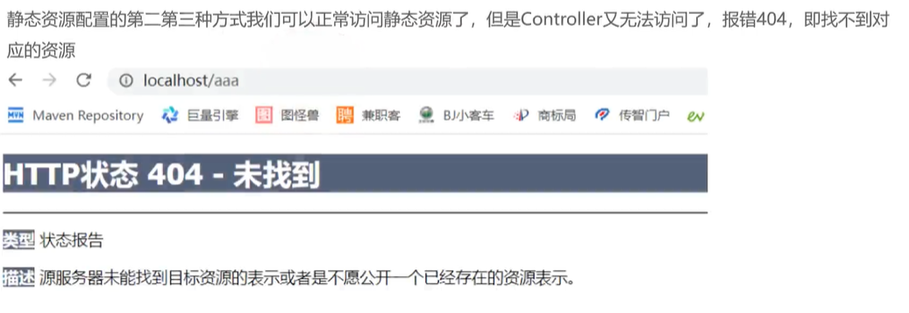
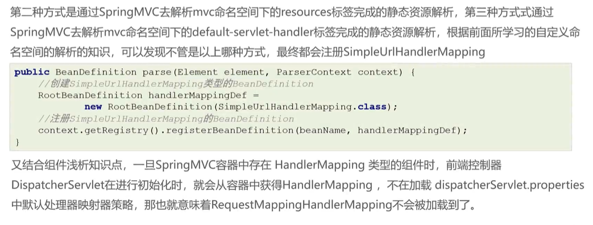
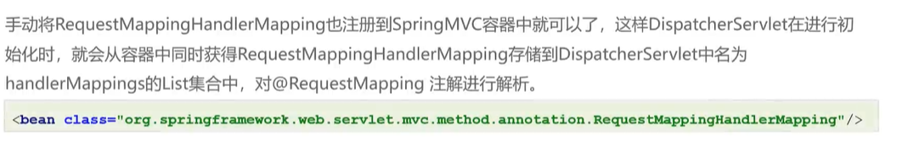
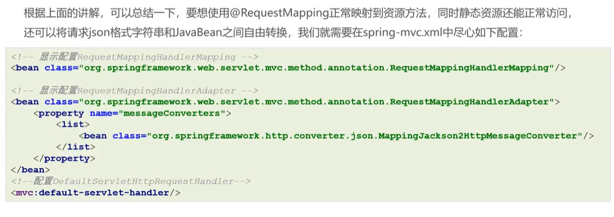
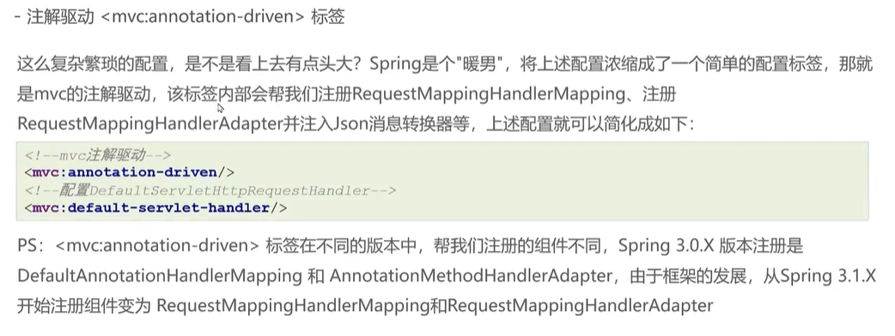

# 注解驱动mvc:annotation-driven标签









重点



```xml
<!--  <!– 注入后就无法自动注入另外两个HandlerMapping –>-->
  <!--  <bean class="org.springframework.web.servlet.mvc.method.annotation.RequestMappingHandlerMapping"/>-->

  <!--  <!– post请求的请求体转对象 –>-->
  <!--  <bean class="org.springframework.web.servlet.mvc.method.annotation.RequestMappingHandlerAdapter">-->
  <!--    <property name="messageConverters">-->
  <!--      <list>-->
  <!--        <bean class="org.springframework.http.converter.json.MappingJackson2HttpMessageConverter"/>-->
  <!--      </list>-->
  <!--    </property>-->
  <!--  </bean>-->

  <!-- 为了简化配置，下面的标签将简化RequestMappingHandlerMapping、RequestMappingHandlerAdapter等的配置 -->
  <mvc:annotation-driven/>

  <!-- 允许访问静态资源，但如果RequestMappingHandlerMapping没有注入，会默认诸如一个SimpleUrlHandlerMapping，导致无法访问Controller -->
  <mvc:default-servlet-handler/>
```

此时就解决了json直接转对象、静态资源和接口的同时访问等问题
