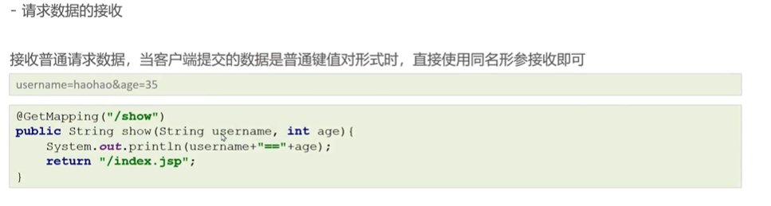
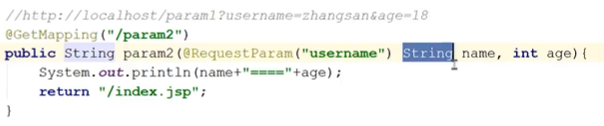
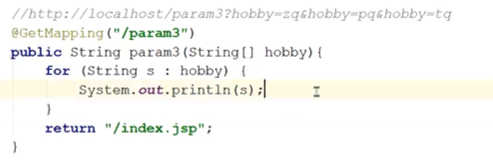
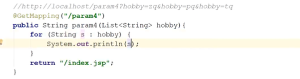
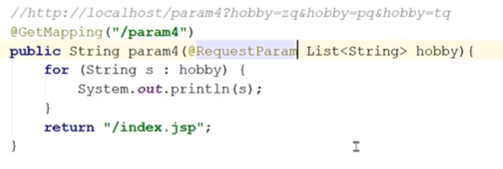
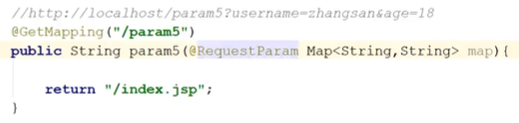
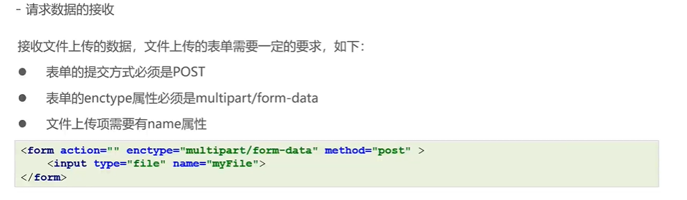

# 请求数据的接收

## 键值对

### 同名参数

### 非同名参数

### 多参同名

会出错！！！

因为底层会尝试创建List对象

正确的：添加@RequestParam注解

### Map

正确的：添加@RequestParam注解

## @RequestParam属性

* value  表示对应参数的键
* required  表示是否是必须的
* defaultValue  参数为空的默认值

## 注意点

基本数据类型如果没有传值会报错，一般使用包装类

## 接收文件

