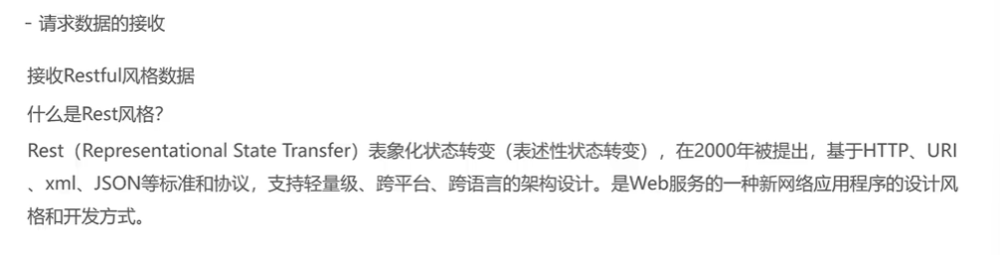
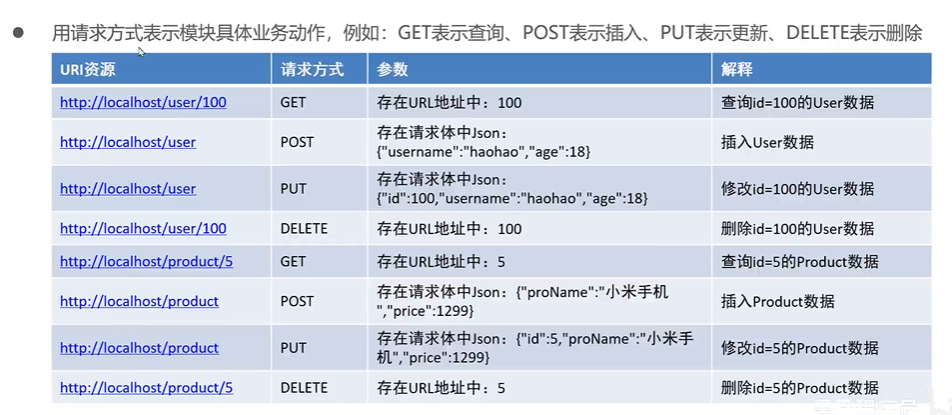
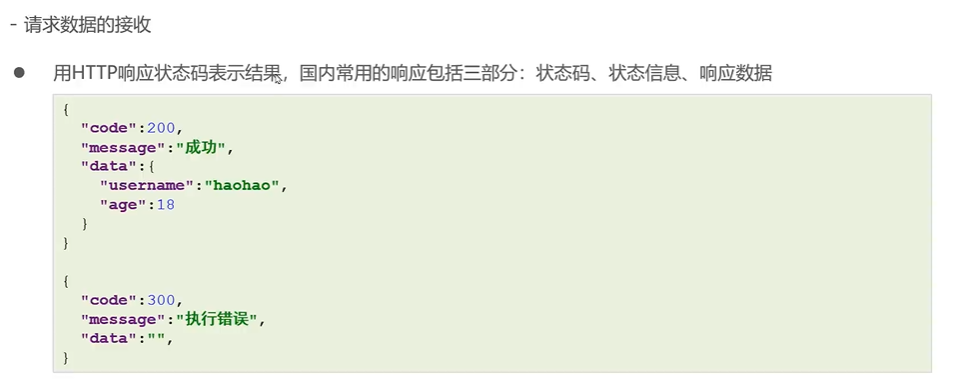
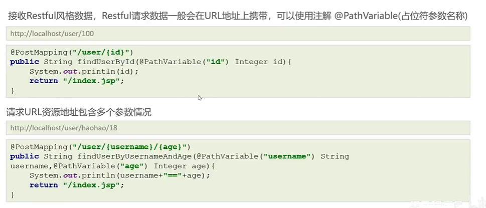

# 请求数据的接收

## 普通键值对

### 同名参数


### 非同名参数


### 多参同名


会出错！！！

因为底层会尝试创建List对象


正确的：添加@RequestParam注解


### Map

正确的：添加@RequestParam注解


## 对象键值对

如果【实体类1】套【实体类2】，传递参数时使用【实体类2.属性】即可


## Json格式

以字符串接收


以对象接收


或在spring-mvc.xml中加入下面代码，可直接转换为javaBean对象

```xml
<bean class="org.springframework.web.servlet.mvc.method.annotation.RequestMappingHandlerAdapter">
    <property name="messageConverters">
      <list>
        <bean class="org.springframework.http.converter.json.MappingJackson2HttpMessageConverter"/>
      </list>
    </property>
  </bean>
```


## Restful风格



### 请求


此处仍然存在局限性



### 响应



### 测试



## @RequestParam属性

* value  表示对应参数的键
* required  表示是否是必须的
* defaultValue  参数为空的默认值

## 注意点

基本数据类型如果没有传值会报错，一般使用包装类

## 接收文件


添加依赖

```xml
<dependency>
      <groupId>commons-fileupload</groupId>
      <artifactId>commons-fileupload</artifactId>
      <version>1.4</version>
    </dependency>
```

配置spring.xml

id必须为multipartResolver

```xml
<!--  配置文件上传解析器  -->
  <bean id="multipartResolver" class="org.springframework.web.multipart.commons.CommonsMultipartResolver">
    <property name="defaultEncoding" value="UTF=8"/>
    <property name="maxUploadSizePerFile" value="1048576"/>
    <property name="maxUploadSize" value="3145728"/>
    <property name="maxInMemorySize" value="1048576"/>
  </bean>
```

控制层

注意参数名要与文件上传的表单name相同

```java
@RestController
@RequestMapping("/file")
public class FileUploadController {

  @PostMapping("/load")
  public Map load(@RequestBody MultipartFile file) throws IOException {
    System.out.println(file);

    //上传文件保存
    //1.获得当前上传文件的输入流
    InputStream inputStream = file.getInputStream();
    //2.获得上传位置的输出流
    FileOutputStream outputStream = new FileOutputStream("E:\\新建文件夹 (2)\\" + file.getOriginalFilename());
    //3.执行文件拷贝
    IOUtils.copyLarge(inputStream,outputStream);
    inputStream.close();
    outputStream.close();

    Map map = new HashMap();
    map.put("111","2222");
    return map;
  }
}
```

## 获取请求头


## 获取cookie


## 获取Request和Session域中的值

### Request


### Session

通过@SessionAttribute("name") 注解获取session域中的值

当然，我们还可以通过注入Request或Session，通过getAttribute和setAttribute设置或获取值，可见下一章
