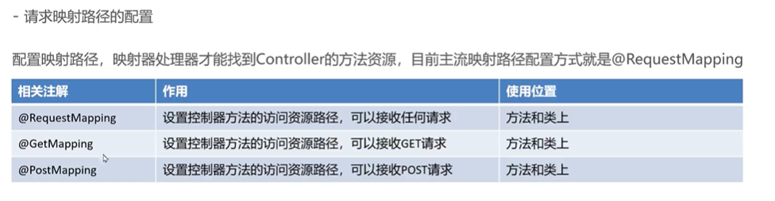

# 请求映射路径的配置



```java
@Controller
@RequestMapping("/user")
public class UserController {

  @Autowired
  private UserService userService;

  @RequestMapping("/login")
  public String login() {
    userService.selectAll();
    return "index.jsp";
  }
}
```
