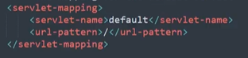
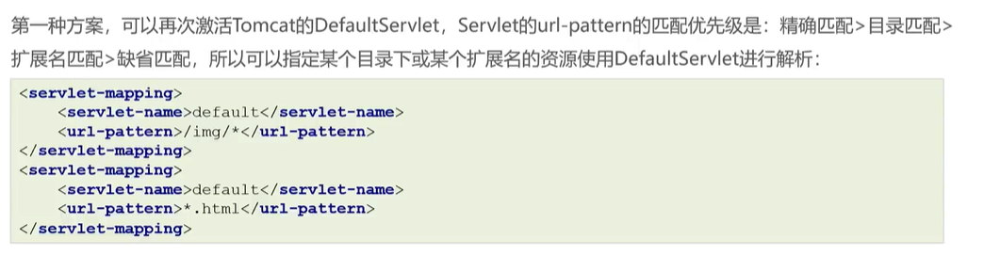
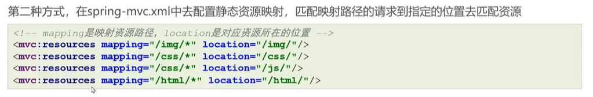
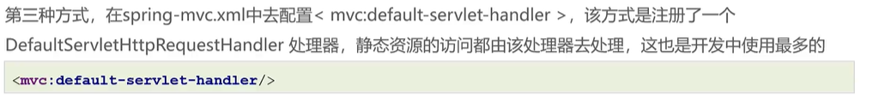
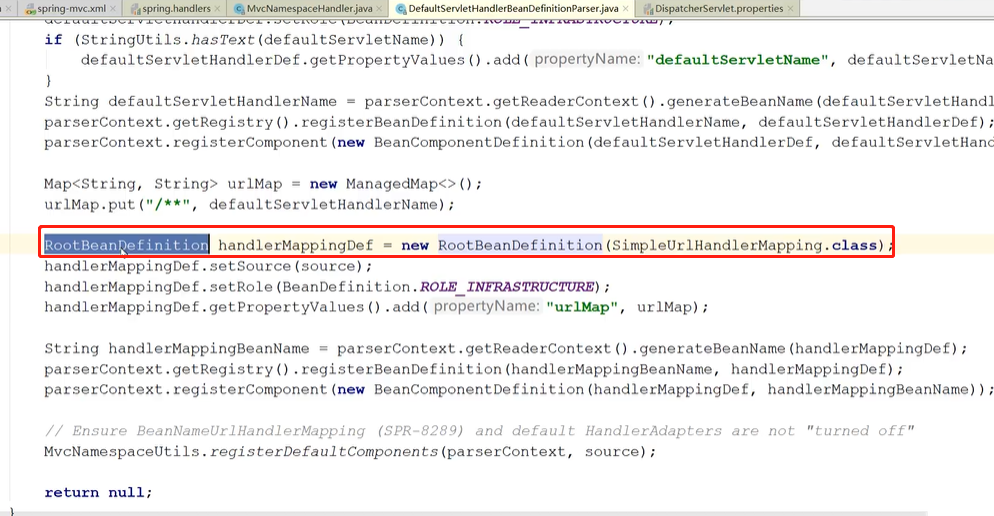

# 请求静态资源

问题由来：原本tomcat通过DefaultServlet来访问静态资源，其url-pattern为/，但我们的springmvc却占用了url-pattern为/的DefaultServlet，所以无法访问静态资源

我们的DispatcherServlet

```xml
<servlet-mapping>
    <servlet-name>DispatcherServlet</servlet-name>
    <!--  /代表所有轻轻都访问的是DispatcherServlet  -->
    <url-pattern>/</url-pattern>
  </servlet-mapping>
```

tomcat的DefaultServlet



## 方案一

再次激活DefaultServlet，在web.xml中添加代码

```xml
<!-- 再次激活DefaultServlet url-pattern配置更加精确一点 -->
  <servlet-mapping>
    <servlet-name>default</servlet-name>
    <!--  扩展名匹配，优先级更高  -->
    <url-pattern>*.html</url-pattern>
  </servlet-mapping>
  <servlet-mapping>
    <servlet-name>default</servlet-name>
    <!--  目录匹配  -->
    <url-pattern>/img/*</url-pattern>
  </servlet-mapping>
```



## 方案二



见方案三的问题，一样无效

## 方案三



如果RequestMappingHandlerMapping没有注入，会默认注入一个SimpleUrlHandlerMapping，导致无法访问Controller，所以一定要写RequestMappingHandlerMapping的标签或下一章的解决方案


