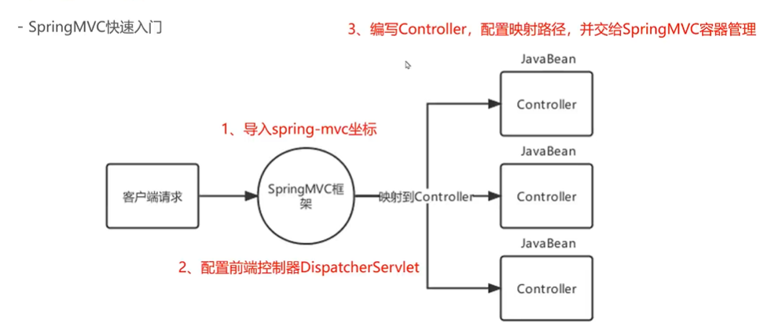

# SpringMVC快速入门



导入坐标

```xml
    <dependency>
      <groupId>org.springframework</groupId>
      <artifactId>spring-webmvc</artifactId>
      <version>5.2.0.RELEASE</version>
    </dependency>
```

配置前端映射器 web.xml

```xml
  <!-- 配置DispatcherServlet -->
  <servlet>
    <servlet-name>DispatcherServlet</servlet-name>
    <servlet-class>org.springframework.web.servlet.DispatcherServlet</servlet-class>
    <init-param>
      <param-name>contextConfigLocation</param-name>
	<!-- 加载spring-mvc配置文件 -->
      <param-value>classpath:spring-mvc.xml</param-value>
    </init-param>
    <load-on-startup>2</load-on-startup>
  </servlet>

  <servlet-mapping>
    <servlet-name>DispatcherServlet</servlet-name>
    <!--  /代表所有轻轻都访问的是DispatcherServlet  -->
    <url-pattern>/</url-pattern>
  </servlet-mapping>
```

编写spring-mvc.xml

次配置文件只通过注解解析controller*

```xml
<?xml version="1.0" encoding="UTF-8"?>
<beans xmlns="http://www.springframework.org/schema/beans"
       xmlns:context="http://www.springframework.org/schema/context"
       xmlns:xsi="http://www.w3.org/2001/XMLSchema-instance"
       xsi:schemaLocation="http://www.springframework.org/schema/beans http://www.springframework.org/schema/beans/spring-beans.xsd
        http://www.springframework.org/schema/context http://www.springframework.org/schema/context/spring-context.xsd">

  <context:component-scan base-package="com.bobo.webmvc.controller"/>

</beans>
```

编写Controller，配置映射路径，并交给SpringMVC容器管理

```java
@Controller
@RequestMapping("/user")
public class UserController {

  @RequestMapping("/login")
  public void login() {
      System.out.println("111");
  }
}
```

但此处虽然找到了并打印了111，但页面报错500或404，因为默认需要返回一个视图（页面），下面的代码将返回webapp目录下的/user/index.jsp页面

```java
@Controller
@RequestMapping("/user")
public class UserController {

  @RequestMapping("/login")
  public String login() {
    System.out.println("111");
    return "index.jsp";
  }
}
```
