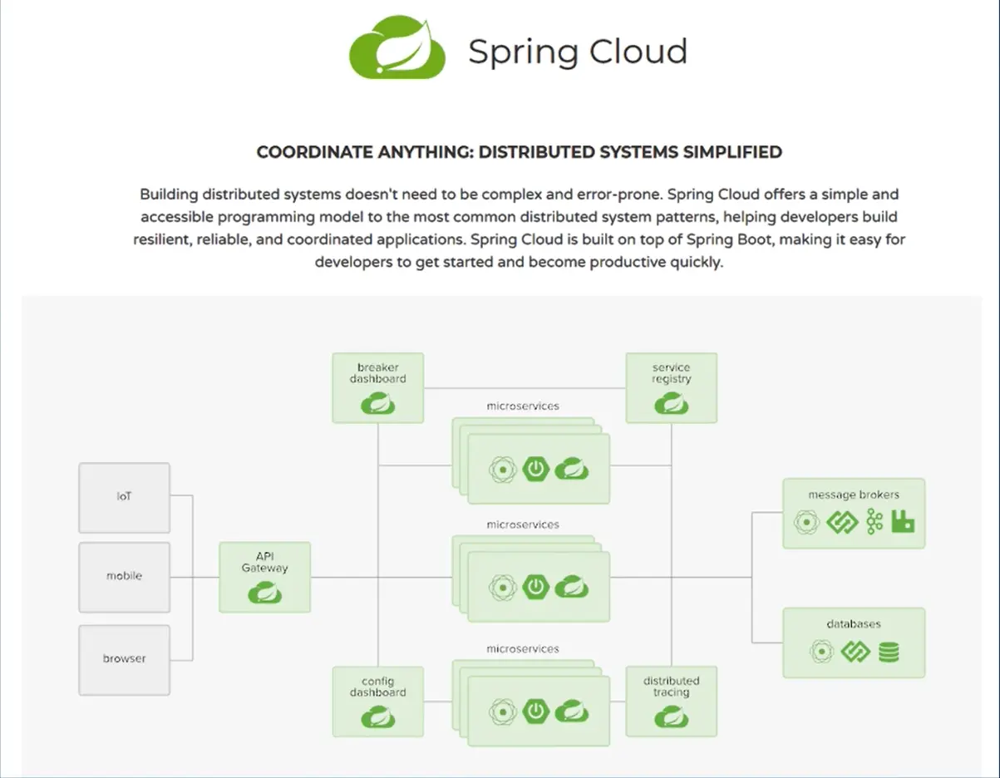
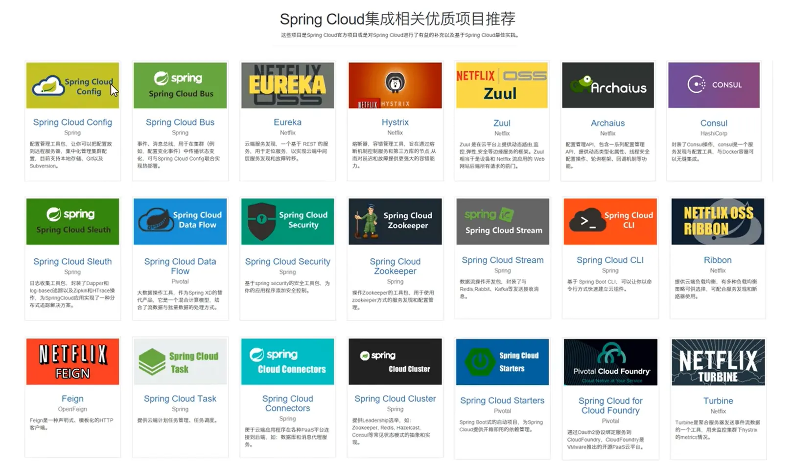
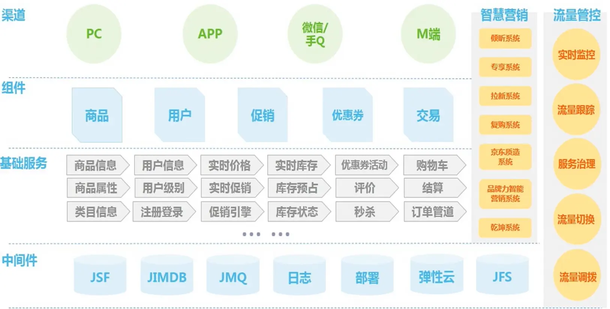
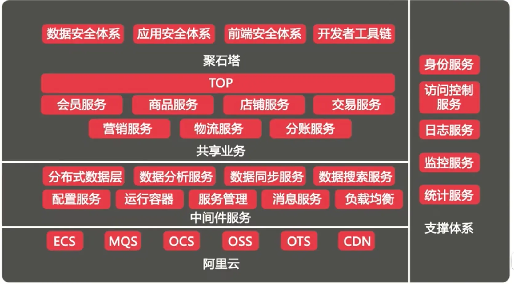
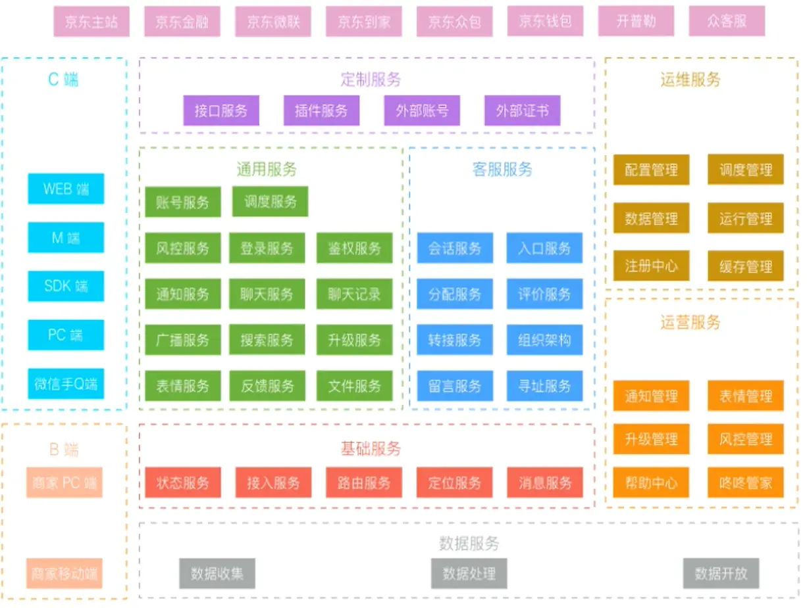
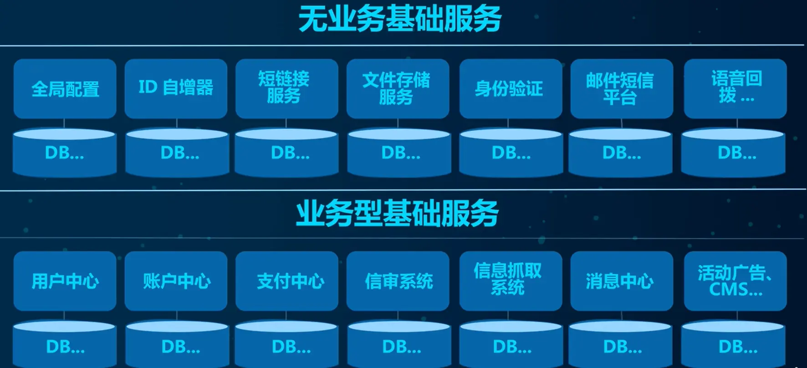
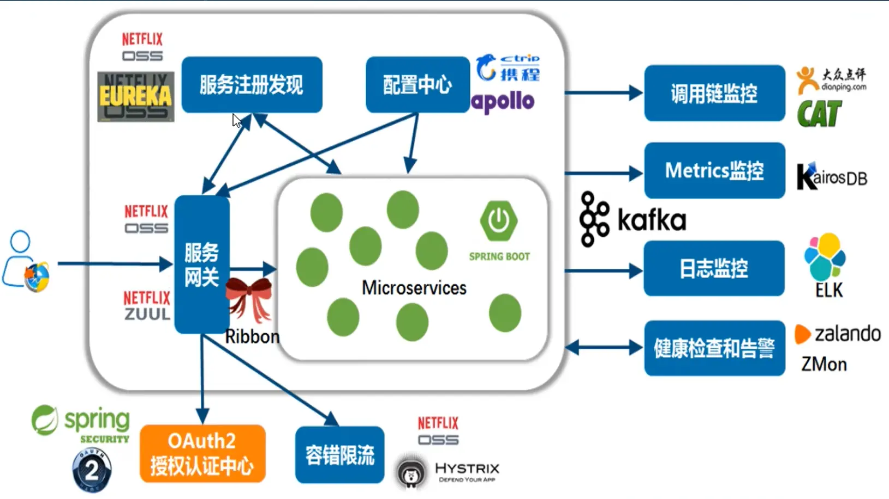
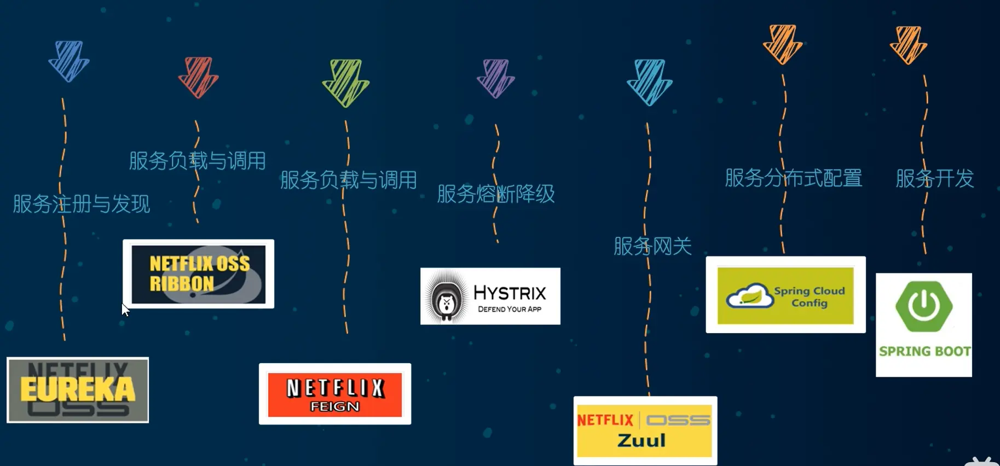
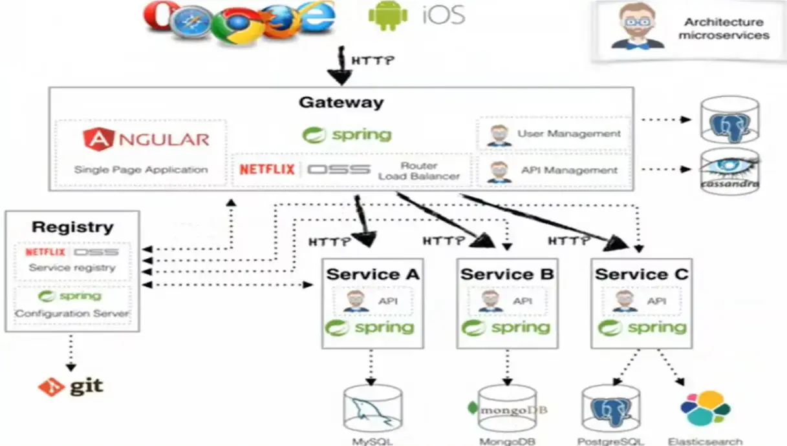
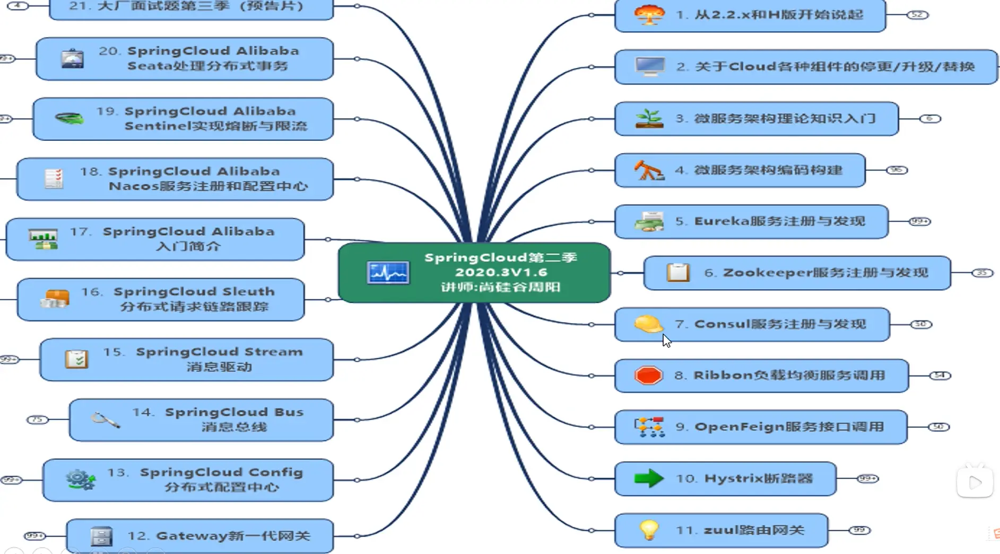

# 微服务架构理论入门

## 什么是微服务

* 微服务是一种架构风格
* 一个应用拆分为一组小型服务
* 每个服务运行在自己的进程内，也就是可独立部署和升级
* 服务之间使用轻量级HTTP交互
* 服务围绕业务功能拆分
* 可以由全自动部署机制独立部署
* 去中心化，服务自治。服务可以使用不同的语言、不同的存储技术

**主题词01：现代数字化生活-落地维度**

* 手机
* PC
* 智能家居
* …

**主题词02：分布式微服务架构-落地维度**

满足哪些维度？支撑起这些维度的具体技术？

* 服务调用
* 服务降级
* 服务注册与发先
* 服务熔断
* 负载均衡
* 服务消息队列
* 服务网关
* 配置中心管理
* 自动化构建部署
* 服务监控
* 全链路追踪
* 服务定时任务
* 调度操作

### **Spring Cloud简介**

是什么？符合微服务技术维度

**SpringCloud=分布式微服务架构的站式解决方案，是多种微服务架构落地技术的集合体，俗称微服务全家桶**

猜猜SpringCloud这个大集合里有多少种技术?

SpringCloud俨然已成为微服务开发的主流技术栈，在国内开发者社区非常火爆。

**“微”力十足，互联网大厂微服务架构案例**

京东的：

阿里的：

京东物流的:

### **Spring Cloud技术栈**

### 总结

