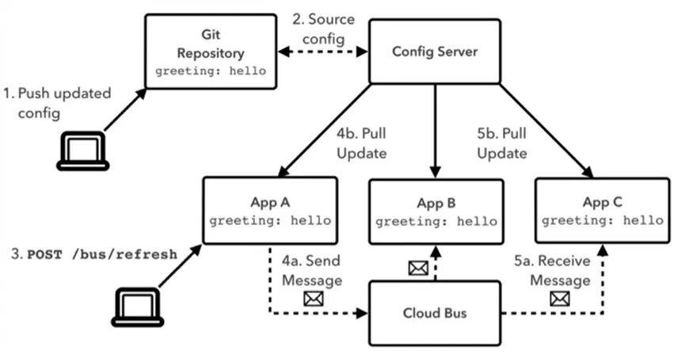
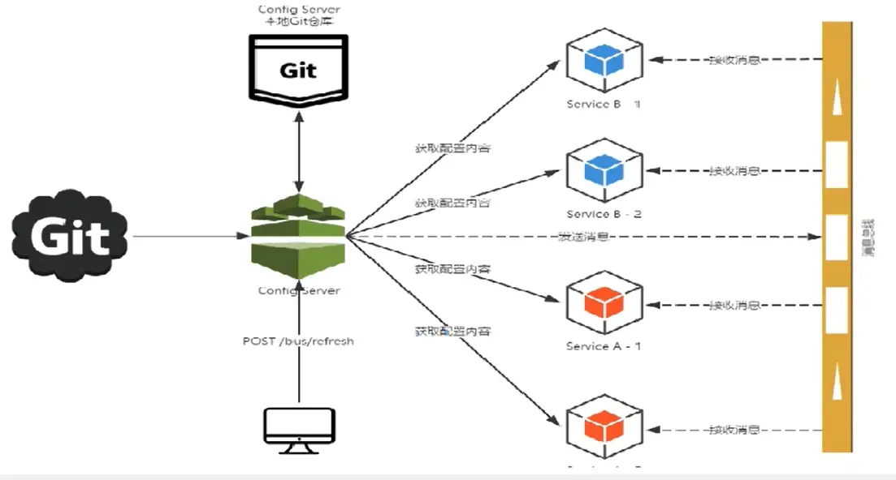
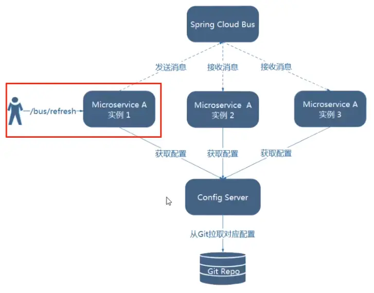
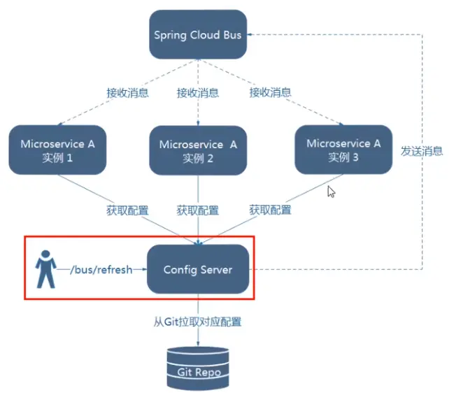

# Config 服务配置中心 与 BUS 消息总线

## Config分布式配置中心介绍

**分布式系统面临的配置问题**

微服务意味着要将单体应用中的业务拆分成一个个子服务，每个服务的粒度相对较小，因此系统中会出现大量的服务。由于每个服务都需要必要的配置信息才能运行，所以一套集中式的、动态的配置管理设施是必不可少的。

SpringCloud提供了ConfigServer来解决这个问题，我们每一个微服务自己带着一个application.yml，上百个配置文件的管理.……

**是什么**


SpringCloud Config为微服务架构中的微服务提供集中化的外部配置支持，配置服务器为各个不同微服务应用的所有环境提供了一个中心化的外部配置。

**怎么玩**

SpringCloud Config分为**服务端**和**客户端**两部分。

* 服务端也称为分布式配置中心，它是一个独立的微服务应用，用来连接配置服务器并为客户端提供获取配置信息，加密/解密信息等访问接口。
* 客户端则是通过指定的配置中心来管理应用资源，以及与业务相关的配置内容，并在启动的时候从配置中心获取和加载配置信息配置服务器默认采用git来存储配置信息，这样就有助于对环境配置进行版本管理，并且可以通过git客户端工具来方便的管理和访问配置内容。

能干嘛

* 集中管理配置文件
* 不同环境不同配置，动态化的配置更新，分环境部署比如dev/test/prod/beta/release
* 运行期间动态调整配置，不再需要在每个服务部署的机器上编写配置文件，服务会向配置中心统一拉取配置自己的信息
* 当配置发生变动时，服务不需要重启即可感知到配置的变化并应用新的配置
* 将配置信息以REST接口的形式暴露 - post/crul访问刷新即可…

**与GitHub整合配置**

由于SpringCloud Config默认使用Git来存储配置文件(也有其它方式,比如支持SVN和本地文件)，但最推荐的还是Git，而且使用的是http/https访问的形式。

**官网**

[https://cloud.spring.io/spring-cloud-static/spring-cloud-config/2.2.1.RELEASE/reference/html/(opens new window)](https://cloud.spring.io/spring-cloud-static/spring-cloud-config/2.2.1.RELEASE/reference/html/)

## [#](https://frxcat.fun/Spring/SpringCloud/Config_And_BUS/#config%E9%85%8D%E7%BD%AE%E6%80%BB%E6%8E%A7%E4%B8%AD%E5%BF%83%E6%90%AD%E5%BB%BA)Config配置总控中心搭建

用你自己的账号在GitHub上新建一个名为springcloud-config的新Repository。

由上一步获得刚新建的git地址 - `git@github.com:xustudyxu/springcloud-config.git`。

本地硬盘目录上新建git仓库并clone。

* 工作目录为 F：\SpringCloud-project
* `git clone git@github.com:xustudyxu/springcloud-config.git`

此时在工作目录会创建名为springcloud-config的文件夹。

在springcloud-config的文件夹种创建三个配置文件（为本次教学使用的）,随后 `git add .`，`git commit -m "sth"`等一系列上传操作上传到springcloud-config的新Repository。

* config-dev.yml

```yaml
config:
  info: "master branch,springcloud-config/config-dev.yml version=1"
```

* config-prod.yml

```yaml
config:
  info: "master branch,springcloud-config/config-prod.yml version=1"
```

* config-test.yml

```yaml
config:
  info: "master branch,springcloud-config/config-test.yml version=1" 
```

新建Module模块cloud-config-center-3344，它即为Cloud的配置中心模块CloudConfig Center

POM

```xml
<?xml version="1.0" encoding="UTF-8"?>
<project xmlns="http://maven.apache.org/POM/4.0.0"
         xmlns:xsi="http://www.w3.org/2001/XMLSchema-instance"
         xsi:schemaLocation="http://maven.apache.org/POM/4.0.0 http://maven.apache.org/xsd/maven-4.0.0.xsd">
    <parent>
        <artifactId>cloud2020</artifactId>
        <groupId>com.frx01.springcloud</groupId>
        <version>1.0-SNAPSHOT</version>
    </parent>
    <modelVersion>4.0.0</modelVersion>

    <artifactId>cloud-config-center-3344</artifactId>
    <dependencies>
        <!--添加消息总线RabbitMQ支持-->
        <dependency>
            <groupId>org.springframework.cloud</groupId>
            <artifactId>spring-cloud-starter-bus-amqp</artifactId>
        </dependency>
        <dependency>
            <groupId>org.springframework.cloud</groupId>
            <artifactId>spring-cloud-config-server</artifactId>
        </dependency>
        <dependency>
            <groupId>org.springframework.cloud</groupId>
            <artifactId>spring-cloud-starter-netflix-eureka-client</artifactId>
        </dependency>
        <dependency>
            <groupId>org.springframework.boot</groupId>
            <artifactId>spring-boot-starter-web</artifactId>
        </dependency>

        <dependency>
            <groupId>org.springframework.boot</groupId>
            <artifactId>spring-boot-starter-actuator</artifactId>
        </dependency>
        <dependency>
            <groupId>org.springframework.boot</groupId>
            <artifactId>spring-boot-devtools</artifactId>
            <scope>runtime</scope>
            <optional>true</optional>
        </dependency>
        <dependency>
            <groupId>org.projectlombok</groupId>
            <artifactId>lombok</artifactId>
            <optional>true</optional>
        </dependency>
        <dependency>
            <groupId>org.springframework.boot</groupId>
            <artifactId>spring-boot-starter-test</artifactId>
            <scope>test</scope>
        </dependency>
    </dependencies>
</project>
```

 YML

```yaml
server:
  port: 3344

spring:
  application:
    name:  cloud-config-center #注册进Eureka服务器的微服务名
  cloud:
    config:
      server:
        git:
          uri: git@github.com:xustudyxu/springcloud-config.git #GitHub上面的git仓库名字
        ####搜索目录
          search-paths:
            - springcloud-config
      ####读取分支
      label: master

#服务注册到eureka地址
eureka:
  client:
    service-url:
      defaultZone: http://localhost:7001/eureka
```

主启动类

```java
import org.springframework.boot.SpringApplication;
import org.springframework.boot.autoconfigure.SpringBootApplication;
import org.springframework.cloud.config.server.EnableConfigServer;

@SpringBootApplication
@EnableConfigServer
public class ConfigCenterMain3344
{
    public static void main(String[] args) {
            SpringApplication.run(ConfigCenterMain3344.class, args);
    }
}
```

windows下修改hosts文件，增加映射

```sh
127.0.0.1 config-3344.com
```

测试通过Config微服务是否可以从GitHub上获取配置内容

* 启动7001,ConfigCenterMain3344
* 浏览器防问 - [http://config-3344.com:3344/master/config-dev.yml(opens new window)](http://config-3344.com:3344/master/config-dev.yml)
* 页面返回结果：


配置读取规则

* [官方文档(opens new window)](https://cloud.spring.io/spring-cloud-static/spring-cloud-config/2.2.1.RELEASE/reference/html/#_quick_start)
* `/{label(分支)}/{application}-{profile}.yml`（推荐）

  * master分支
    * http://config-3344.com:3344/master/config-dev.yml
    * http://config-3344.com:3344/master/config-test.yml
    * http://config-3344.com:3344/master/config-prod.yml
  * dev分支 - http://config-3344.com:3344/dev/config-dev.yml - http://config-3344.com:3344/dev/config-test.yml - http://config-3344.com:3344/dev/config-prod.yml
* `/{application}-{profile}.yml`

  * http://config-3344.com:3344/config-dev.yml
  * http://config-3344.com:3344/config-test.yml
  * http://config-3344.com:3344/config-prod.yml
  * http://config-3344.com:3344/config-xxxx.yml(不存在的配置)
* `/{application}/{profile}[/{label}]`

  * http://config-3344.com:3344/config/dev/master
  * http://config-3344.com:3344/config/test/master
  * http://config-3344.com:3344/config/test/dev

成功实现了用SpringCloud Config通过GitHub获取配置信息

## [#](https://frxcat.fun/Spring/SpringCloud/Config_And_BUS/#config%E5%AE%A2%E6%88%B7%E7%AB%AF%E9%85%8D%E7%BD%AE%E4%B8%8E%E6%B5%8B%E8%AF%95)Config客户端配置与测试

**新建cloud-config-client-3355**

**POM**

```xml
<?xml version="1.0" encoding="UTF-8"?>
<project xmlns="http://maven.apache.org/POM/4.0.0"
         xmlns:xsi="http://www.w3.org/2001/XMLSchema-instance"
         xsi:schemaLocation="http://maven.apache.org/POM/4.0.0 http://maven.apache.org/xsd/maven-4.0.0.xsd">
    <parent>
        <artifactId>cloud2020</artifactId>
        <groupId>com.frx01.springcloud</groupId>
        <version>1.0-SNAPSHOT</version>
    </parent>
    <modelVersion>4.0.0</modelVersion>

    <artifactId>cloud-config-client-3355</artifactId>

    <dependencies>
        <!--添加消息总线RabbitMQ支持-->
        <dependency>
            <groupId>org.springframework.cloud</groupId>
            <artifactId>spring-cloud-starter-bus-amqp</artifactId>
        </dependency>
        <dependency>
            <groupId>org.springframework.cloud</groupId>
            <artifactId>spring-cloud-starter-config</artifactId>
        </dependency>
        <dependency>
            <groupId>org.springframework.cloud</groupId>
            <artifactId>spring-cloud-starter-netflix-eureka-client</artifactId>
        </dependency>
        <dependency>
            <groupId>org.springframework.boot</groupId>
            <artifactId>spring-boot-starter-web</artifactId>
        </dependency>
        <dependency>
            <groupId>org.springframework.boot</groupId>
            <artifactId>spring-boot-starter-actuator</artifactId>
        </dependency>

        <dependency>
            <groupId>org.springframework.boot</groupId>
            <artifactId>spring-boot-devtools</artifactId>
            <scope>runtime</scope>
            <optional>true</optional>
        </dependency>
        <dependency>
            <groupId>org.projectlombok</groupId>
            <artifactId>lombok</artifactId>
            <optional>true</optional>
        </dependency>
        <dependency>
            <groupId>org.springframework.boot</groupId>
            <artifactId>spring-boot-starter-test</artifactId>
            <scope>test</scope>
        </dependency>
    </dependencies>
</project>
```

 bootstrap.yml

applicaiton.yml是用户级的资源配置项

bootstrap.yml是系统级的，优先级更加高

Spring Cloud会创建一个Bootstrap Context，作为Spring应用的Application Context的父上下文。

初始化的时候，BootstrapContext负责从外部源加载配置属性并解析配置。这两个上下文共享一个从外部获取的Environment。

Bootstrap属性有高优先级，默认情况下，它们不会被本地配置覆盖。Bootstrap context和Application Context有着不同的约定，所以新增了一个bootstrap.yml文件，保证Bootstrap Context和Application Context配置的分离。

要将Client模块下的application.yml文件改为bootstrap.yml,这是很关键的，因为bootstrap.yml是比application.yml先加载的。`bootstrap.yml`优先级高于 `application.yml`。

```yaml
server:
  port: 3355

spring:
  application:
    name: config-client
  cloud:
    #Config客户端配置
    config:
      label: master #分支名称
      name: config #配置文件名称
      profile: dev #读取后缀名称   上述3个综合：master分支上config-dev.yml的配置文件被读取http://config-3344.com:3344/master/config-dev.yml
      uri: http://localhost:3344/ #配置中心地址k


#服务注册到eureka地址
eureka:
  client:
    service-url:
      defaultZone: http://localhost:7001/eureka
```

**修改config-dev.yml配置并提交到GitHub中，比如加个变量age或者版本号version**

主启动

```java
@EnableEurekaClient
@SpringBootApplication
public class ConfigClientMain3355 {
    public static void main(String[] args) {
        SpringApplication.run(ConfigClientMain3355.class,args);
    }
}
```

 业务类

```java
@RestController
@Slf4j
public class ConfigClientController {

    @Value("${config.info}")
    private String configInfo;

    @GetMapping("/configInfo")
    public String getConfigInfo(){
        return configInfo;
    }
}
```

 测试

* 启动Config配置中心3344微服务并自测
  * http://config-3344.com:3344/master/config-prod.yml
  * http://config-3344.com:3344/master/config-dev.yml
* 启动3355作为Client准备访问
  * [http://localhost:3355/configlnfo(opens new window)](http://localhost:3355/configlnfo)


**成功实现了客户端3355访问SpringCloud Config3344通过GitHub获取配置信息可题随时而来**

**分布式配置的动态刷新问题**

* Linux运维修改GitHub上的配置文件内容做调整
* 刷新3344，发现ConfigServer配置中心立刻响应


* 刷新3355，发现ConfigClient客户端没有任何响应


* 3355没有变化除非自己重启或者重新加载
* 难到每次运维修改配置文件，客户端都需要重启??噩梦

## [#](https://frxcat.fun/Spring/SpringCloud/Config_And_BUS/#config%E5%8A%A8%E6%80%81%E5%88%B7%E6%96%B0%E4%B9%8B%E6%89%8B%E5%8A%A8%E7%89%88)Config动态刷新之手动版

避免每次更新配置都要重启客户端微服务3355

 **动态刷新步骤** ：

修改3355模块

POM引入actuator监控

```xml
<dependency>
    <groupId>org.springframework.boot</groupId>
    <artifactId>spring-boot-starter-actuator</artifactId>
</dependency>
```

 修改YML，添加暴露监控端口配置：

```yaml
# 暴露监控端点
management:
  endpoints:
    web:
      exposure:
        include: "*"
```

 `@RefreshScope`业务类Controller修改

```java
@RestController
@RefreshScope//<----添加该注解
@Slf4j
public class ConfigClientController {

}
```

 测试

此时修改github配置文件内容 -> 访问3344 -> 访问3355

* http://config-3344.com:3344/master/config-dev.yml


* [http://localhost:3355/configInfo(opens new window)](http://localhost:3355/configInfo)


3355改变没有???  **没有** ，还需一步

How

需要运维人员发送Post请求刷新3355

```sh
curl -X POST "http://localhost:3355/actuator/refresh"
```

再次测试

[http://localhost:3355/configInfo(opens new window)](http://localhost:3355/configInfo)

3355改变没有???  **改了** 。


成功实现了客户端3355刷新到最新配置内容，避免了服务重启

想想还有什么问题?

* 假如有多个微服务客户端3355/3366/3377
* 每个微服务都要执行—次post请求，手动刷新?
* 可否广播，一次通知，处处生效?
* 我们想大范围的自动刷新，求方法

## [#](https://frxcat.fun/Spring/SpringCloud/Config_And_BUS/#bus%E6%B6%88%E6%81%AF%E6%80%BB%E7%BA%BF%E6%98%AF%E4%BB%80%E4%B9%88)Bus消息总线是什么

**上—讲解的加深和扩充**

一言以蔽之，分布式自动刷新配置功能。

**是什么**

Spring Cloud Bus 配合Spring Cloud Config 使用可以实现配置的动态刷新。

Spring Cloud Bus是用来将分布式系统的节点与轻量级消息系统链接起来的框架，它 =整合了Java的事件处理机制和消息中间件的功能= 。Spring Clud Bus目前支持 `RabbitMQ`和 `Kafka`。



**能干嘛**

Spring Cloud Bus能管理和传播分布式系统间的消息，就像一个分布式执行器，可用于广播状态更改、事件推送等，也可以当作微服务间的通信通道。



**为何被称为总线**

什么是总线

在微服务架构的系统中，通常会使用=轻量级的消息代理=来构建一个 =共用的消息主题= ，并让系统中所有微服务实例都连接上来。由于 =该主题中产生的消息会被所有实例监听和消费，所以称它为消息总线= 。在总线上的各个实例，都可以方便地广播一些需要让其他连接在该主题上的实例都知道的消息。

基本原理

ConfigClient实例都监听MQ中同一个topic(默认是Spring Cloud Bus)。当一个服务刷新数据的时候，它会把这个信息放入到Topic中，这样其它监听同一Topic的服务就能得到通知，然后去更新自身的配置。

## [#](https://frxcat.fun/Spring/SpringCloud/Config_And_BUS/#bus%E4%B9%8Brabbitmq%E7%8E%AF%E5%A2%83%E9%85%8D%E7%BD%AE)Bus之RabbitMQ环境配置

* [具体安装步骤跳转](https://frxcat.fun/middleware/RabbitMQ/RabbitMQ_install/#%E5%AE%89%E8%A3%85)
* 安装Erlang，下载地址：http://erlang.org/download/otp_win64_21.3.exe
* 安装RabbitMQ，下载地址：https://github.com/rabbitmq/rabbitmq-server/releases/download/v3.8.3/rabbitmq-server-3.8.3.exe
* 打开cmd进入RabbitMQ安装目录下的sbin目录，如：D:\DevelopTools\RabbitMQ\install\rabbitmq_server-3.8.3\sbin
* 输入以下命令启动管理功能

```sh
rabbitmq-plugins enable rabbitmq_management
```

这样就可以添加可视化插件。

* 访问地址查看是否安装成功：[http://localhost:15672/(opens new window)](http://localhost:15672/)
* 输入账号密码并登录：guest guest


## [#](https://frxcat.fun/Spring/SpringCloud/Config_And_BUS/#bus%E5%8A%A8%E6%80%81%E5%88%B7%E6%96%B0%E5%85%A8%E5%B1%80%E5%B9%BF%E6%92%AD%E7%9A%84%E8%AE%BE%E8%AE%A1%E6%80%9D%E6%83%B3%E5%92%8C%E9%80%89%E5%9E%8B)Bus动态刷新全局广播的设计思想和选型

必须先具备良好的RabbitMQ环境先

演示广播效果，增加复杂度，再以3355为模板再制作一个3366

1. 新建cloud-config-client-3366
2. POM

```xml
<?xml version="1.0" encoding="UTF-8"?>
<project xmlns="http://maven.apache.org/POM/4.0.0"
         xmlns:xsi="http://www.w3.org/2001/XMLSchema-instance"
         xsi:schemaLocation="http://maven.apache.org/POM/4.0.0 http://maven.apache.org/xsd/maven-4.0.0.xsd">
    <parent>
        <artifactId>cloud2020</artifactId>
        <groupId>com.frx01.springcloud</groupId>
        <version>1.0-SNAPSHOT</version>
    </parent>
    <modelVersion>4.0.0</modelVersion>

    <artifactId>cloud-config-client-3366</artifactId>

    <dependencies>
        <!--添加消息总线RabbitMQ支持-->
        <dependency>
            <groupId>org.springframework.cloud</groupId>
            <artifactId>spring-cloud-starter-bus-amqp</artifactId>
        </dependency>
        <dependency>
            <groupId>org.springframework.cloud</groupId>
            <artifactId>spring-cloud-starter-config</artifactId>
        </dependency>
        <dependency>
            <groupId>org.springframework.cloud</groupId>
            <artifactId>spring-cloud-starter-netflix-eureka-client</artifactId>
        </dependency>
        <dependency>
            <groupId>org.springframework.boot</groupId>
            <artifactId>spring-boot-starter-web</artifactId>
        </dependency>
        <dependency>
            <groupId>org.springframework.boot</groupId>
            <artifactId>spring-boot-starter-actuator</artifactId>
        </dependency>

        <dependency>
            <groupId>org.springframework.boot</groupId>
            <artifactId>spring-boot-devtools</artifactId>
            <scope>runtime</scope>
            <optional>true</optional>
        </dependency>
        <dependency>
            <groupId>org.projectlombok</groupId>
            <artifactId>lombok</artifactId>
            <optional>true</optional>
        </dependency>
        <dependency>
            <groupId>org.springframework.boot</groupId>
            <artifactId>spring-boot-starter-test</artifactId>
            <scope>test</scope>
        </dependency>
    </dependencies>
</project>
```

3. YML

```yaml
server:
  port: 3366

spring:
  application:
    name: config-client
  cloud:
    #Config客户端配置
    config:
      label: master #分支名称
      name: config #配置文件名称
      profile: dev #读取后缀名称   上述3个综合：master分支上config-dev.yml的配置文件被读取http://config-3344.com:3344/master/config-dev.yml
      uri: http://localhost:3344 #配置中心地址

#rabbitmq相关配置 15672是Web管理界面的端口；5672是MQ访问的端口
  rabbitmq:
    host: localhost
    port: 5672
    username: guest
    password: guest

#服务注册到eureka地址
eureka:
  client:
    service-url:
      defaultZone: http://localhost:7001/eureka

# 暴露监控端点
management:
  endpoints:
    web:
      exposure:
        include: "*"
```

4. 主启动

```java
@SpringBootApplication
@EnableEurekaClient
public class ConfigClientMain3366 {
    public static void main(String[] args) {
        SpringApplication.run(ConfigClientMain3366.class,args);
    }
}
```

5. 业务类

```java
@RestController
@RefreshScope
public class ConfigClientController {

    @Value("${server.port}")
    private String serverPort;

    @Value("${config.info}")
    private String configInfo;

    @GetMapping(value = "/configInfo")
    public String getConfigInfo(){
        return "serverPort:"+serverPort+"\t\n\n configInfo:"+configInfo;
    }
}
```

 **设计思想**

1. 利用消息总线触发一个客户端/bus/refresh,而刷新所有客户端的配置



2. 利用消息总线触发一个服务端ConfigServer的/bus/refresh端点，而刷新所有客户端的配置



图二的架构显然更加适合，图—不适合的原因如下：

* 打破了微服务的职责单一性，因为微服务本身是业务模块，它本不应该承担配置刷新的职责。
* 破坏了微服务各节点的对等性。
* 有一定的局限性。例如，微服务在迁移时，它的网络地址常常会发生变化，此时如果想要做到自动刷新，那就会增加更多的修改。

## [#](https://frxcat.fun/Spring/SpringCloud/Config_And_BUS/#bus%E5%8A%A8%E6%80%81%E5%88%B7%E6%96%B0%E5%85%A8%E5%B1%80%E5%B9%BF%E6%92%AD%E9%85%8D%E7%BD%AE%E5%AE%9E%E7%8E%B0)Bus动态刷新全局广播配置实现

**给cloud-config-center-3344配置中心服务端添加消息总线支持**

POM

```xml
<!--添加消息总线RabbitNQ支持-->
<dependency>
	<groupId>org.springframework.cloud</groupId>
	<artifactId>spring-cloud-starter-bus-amap</artifactId>
</dependency>
<dependency>
	<groupId>org-springframework.boot</groupId>
	<artifactId>spring-boot-starter-actuator</artifactId>
</dependency>
```

 application.yml

```yaml
server:
  port: 3344

spring:
  application:
    name:  cloud-config-center #注册进Eureka服务器的微服务名
  cloud:
    config:
      server:
        git:
          uri: git@github.com:xutudyxu/springcloud-config.git #GitHub上面的git仓库名字
          ####搜索目录
          search-paths:
            - springcloud-config
      ####读取分支
      label: master
#rabbitmq相关配置<--------------------------
rabbitmq:
  host: localhost
  port: 5672
  username: guest
  password: guest

#服务注册到eureka地址
eureka:
  client:
    service-url:
      defaultZone: http://localhost:7001/eureka

##rabbitmq相关配置,暴露bus刷新配置的端点<--------------------------
management:
  endpoints: #暴露bus刷新配置的端点
    web:
      exposure:
        include: 'bus-refresh'
```

**给cloud-config-client-3355客户端添加消息总线支持**

POM

```xml
<!--添加消息总线RabbitNQ支持-->
<dependency>
	<groupId>org.springframework.cloud</groupId>
	<artifactId>spring-cloud-starter-bus-amap</artifactId>
</dependency>
<dependency>
	<groupId>org-springframework.boot</groupId>
	<artifactId>spring-boot-starter-actuator</artifactId>
</dependency>
```

 bootstrap.yml

```yaml
server:
  port: 3355

spring:
  application:
    name: config-client
  cloud:
    #Config客户端配置
    config:
      label: master #分支名称
      name: config #配置文件名称
      profile: dev #读取后缀名称   上述3个综合：master分支上config-dev.yml的配置文件被读取http://config-3344.com:3344/master/config-dev.yml
      uri: http://localhost:3344 #配置中心地址k

#rabbitmq相关配置 15672是Web管理界面的端口；5672是MQ访问的端口<----------------------
  rabbitmq:
    host: localhost
    port: 5672
    username: guest
    password: guest

#服务注册到eureka地址
eureka:
  client:
    service-url:
      defaultZone: http://localhost:7001/eureka

# 暴露监控端点
management:
  endpoints:
    web:
      exposure:
        include: "*"
```

**给cloud-config-client-3366客户端添加消息总线支持**

POM

```xml
<!--添加消息总线RabbitNQ支持-->
<dependency>
	<groupId>org.springframework.cloud</groupId>
	<artifactId>spring-cloud-starter-bus-amap</artifactId>
</dependency>
<dependency>
	<groupId>org-springframework.boot</groupId>
	<artifactId>spring-boot-starter-actuator</artifactId>
</dependency>
```

 bootstrap.yml

```yaml
server:
  port: 3366

spring:
  application:
    name: config-client
  cloud:
    #Config客户端配置
    config:
      label: master #分支名称
      name: config #配置文件名称
      profile: dev #读取后缀名称   上述3个综合：master分支上config-dev.yml的配置文件被读取http://config-3344.com:3344/master/config-dev.yml
      uri: http://localhost:3344 #配置中心地址

#rabbitmq相关配置 15672是Web管理界面的端口；5672是MQ访问的端口<-----------------------
  rabbitmq:
    host: localhost
    port: 5672
    username: guest
    password: guest

#服务注册到eureka地址
eureka:
  client:
    service-url:
      defaultZone: http://localhost:7001/eureka

# 暴露监控端点
management:
  endpoints:
    web:
      exposure:
        include: "*"
```

**测试**

* 启动
  * EurekaMain7001
  * ConfigcenterMain3344
  * ConfigclientMain3355
  * ConfigclicntMain3366
* 运维工程师
  * 修改Github上配置文件内容，增加版本号为 **4**
  * 发送POST请求
    * `curl -X POST "http://localhost:3344/actuator/bus-refresh"`
    * **—次发送，处处生效** (触发服务端3344，刷新客户端)
* 配置中心
  * [http://config-3344.com:3344/config-dev.yml(opens new window)](http://config-3344.com:3344/config-dev.yml)


* 客户端
* [http://localhost:3355/configlnfo(opens new window)](http://localhost:3355/configlnfo)


* [http://localhost:3366/configInfo(opens new window)](http://localhost:3366/configlnfo)


* 获取配置信息，发现都已经刷新了

**—次修改，广播通知，处处生效**

> 遇到的问题:
>
> github我整了两个小时，还是没访问成功。我换了gitee[在gitee创建仓库，选择已有的仓库,导入github仓库]，就OK了。注意：仓库不能为私有！

## [#](https://frxcat.fun/Spring/SpringCloud/Config_And_BUS/#bus%E5%8A%A8%E6%80%81%E5%88%B7%E6%96%B0%E5%AE%9A%E7%82%B9%E9%80%9A%E7%9F%A5)Bus动态刷新定点通知

不想全部通知，只想定点通知

* 只通知3355
* 不通知3366

简单一句话 - 指定具体某一个实例生效而不是全部

* 公式：http://localhost:3344/actuator/bus-refresh/{destination}
* /bus/refresh请求不再发送到具体的服务实例上，而是发给config server通过destination参数类指定需要更新配置的服务或实例

案例

* 我们这里以刷新运行在3355端口上的config-client（配置文件中设定的应用名称）为例，只通知3355，不通知3366
* curl -X POST "http://localhost:3344/actuator/bus-refresh/config-client:3355"
* 将版本改为**5**

配置中心

* [http://config-3344.com:3344/config-dev.yml(opens new window)](http://config-3344.com:3344/config-dev.yml)


* 客户端
* [http://localhost:3355/configlnfo(opens new window)](http://localhost:3355/configlnfo)


* [http://localhost:3366/configlnfo(opens new window)](http://localhost:3366/configlnfo)


通知总结


