# Nacos 服务发现、配置管理和服务管理平台

## Nacos简介和下载

**为什么叫Nacos**

* 前四个字母分别为Naming和Configuration的前两个字母，最后的s为Service。

**是什么**

* 一个更易于构建云原生应用的动态服务发现、配置管理和服务管理平台。
* Nacos: Dynamic Naming and Configuration Service
* Nacos就是注册中心＋配置中心的组合 -> Nacos = **Eureka+Config+Bus**

**能干嘛**

* 替代Eureka做服务注册中心
* 替代Config做服务配置中心

去哪下

* [https://github.com/alibaba/nacos/releases(opens new window)](https://github.com/alibaba/nacos/releases)
* [官网文档](https://spring-cloud-alibaba-group.github.io/github-pages/greenwich/spring-cloud-alibaba.html#_spring cloud alibaba nacos_discovery)

**各中注册中心比较**

| 服务注册与发现框架 | CAP模型 | 控制台管理 | 社区活跃度      |
| ------------------ | ------- | ---------- | --------------- |
| Eureka             | AP      | 支持       | 低(2.x版本闭源) |
| Zookeeper          | CP      | 不支持     | 中              |
| consul             | CP      | 支持       | 高              |
| Nacos              | AP      | 支持       | 高              |

据说Nacos在阿里巴巴内部有超过10万的实例运行，已经过了类似双十一等各种大型流量的考验。

## [#](https://frxcat.fun/Spring/SpringCloud/Nacos_/#nacos%E5%AE%89%E8%A3%85)Nacos安装

* 本地Java8+Maven环境已经OK先
* 从[官网 **(opens new window)**](https://github.com/alibaba/nacos/releases)下载Nacos
* 解压安装包，直接运行bin目录下的startup.cmd
  ```sh
  startup.cmd -m standalone
  ```
* 命令运行成功后直接访问[http://localhost:8848/nacos **(opens new window)**](http://localhost:8848/nacos)，默认账号密码都是nacos
* 结果页面

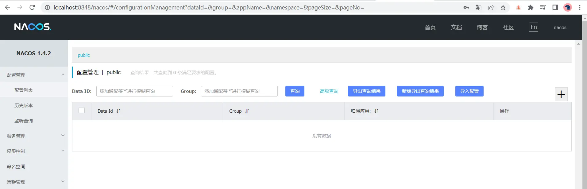

## [#](https://frxcat.fun/Spring/SpringCloud/Nacos_/#nacos%E4%B9%8B%E6%9C%8D%E5%8A%A1%E6%8F%90%E4%BE%9B%E8%80%85%E6%B3%A8%E5%86%8C)Nacos之服务提供者注册

[官方文档(opens new window)](https://spring-cloud-alibaba-group.github.io/github-pages/greenwich/spring-cloud-alibaba.html#_spring_cloud_alibaba_nacos_discovery)

新建Module - cloudalibaba-provider-payment9001

POM

父POM

```xml
<dependencyManagement>
    <dependencies>
        <!--spring cloud alibaba 2.1.0.RELEASE-->
        <dependency>
            <groupId>com.alibaba.cloud</groupId>
            <artifactId>spring-cloud-alibaba-dependencies</artifactId>
            <version>2.1.0.RELEASE</version>
            <type>pom</type>
            <scope>import</scope>
        </dependency>
    </dependencies>
</dependencyManagement>
```

 本模块POM

```xml
<?xml version="1.0" encoding="UTF-8"?>
<project xmlns="http://maven.apache.org/POM/4.0.0"
         xmlns:xsi="http://www.w3.org/2001/XMLSchema-instance"
         xsi:schemaLocation="http://maven.apache.org/POM/4.0.0 http://maven.apache.org/xsd/maven-4.0.0.xsd">
    <parent>
        <artifactId>cloud2020</artifactId>
        <groupId>com.frx01.springcloud</groupId>
        <version>1.0-SNAPSHOT</version>
    </parent>
    <modelVersion>4.0.0</modelVersion>

    <artifactId>cloudalibaba-provider-payment9001</artifactId>
    <dependencies>
        <!--SpringCloud ailibaba nacos -->
        <dependency>
            <groupId>com.alibaba.cloud</groupId>
            <artifactId>spring-cloud-starter-alibaba-nacos-discovery</artifactId>
        </dependency>
        <!-- SpringBoot整合Web组件 -->
        <dependency>
            <groupId>org.springframework.boot</groupId>
            <artifactId>spring-boot-starter-web</artifactId>
        </dependency>
        <dependency>
            <groupId>org.springframework.boot</groupId>
            <artifactId>spring-boot-starter-actuator</artifactId>
        </dependency>
        <!--日常通用jar包配置-->
        <dependency>
            <groupId>org.springframework.boot</groupId>
            <artifactId>spring-boot-devtools</artifactId>
            <scope>runtime</scope>
            <optional>true</optional>
        </dependency>
        <dependency>
            <groupId>org.projectlombok</groupId>
            <artifactId>lombok</artifactId>
            <optional>true</optional>
        </dependency>
        <dependency>
            <groupId>org.springframework.boot</groupId>
            <artifactId>spring-boot-starter-test</artifactId>
            <scope>test</scope>
        </dependency>
    </dependencies>
</project>
```

 YML

```yaml
server:
  port: 9001

spring:
  application:
    name: nacos-payment-provider
  cloud:
    nacos:
      discovery:
        server-addr: localhost:8848 #配置Nacos地址

management:
  endpoints:
    web:
      exposure:
        include: '*'
```

主启动

```java
@SpringBootApplication
@EnableDiscoveryClient
public class PaymentMain9001 {
    public static void main(String[] args) {
        SpringApplication.run(PaymentMain9001.class,args);
    }
}
```

 Controller

```java
@RestController
public class PaymentController {

    @Value("${server.port}")
    private String serverPort;

    @GetMapping("/payment/nacos/{id}")
    public String getPayment(@PathVariable("id") Integer id){
        return "Nacos registry, serverPort: "+serverPort+"\t id:"+id;
    }
}
```

 测试

* [http://localhost:9001/payment/nacos/1(opens new window)](http://localhost:9001/payment/nacos/1)


* nacos控制台

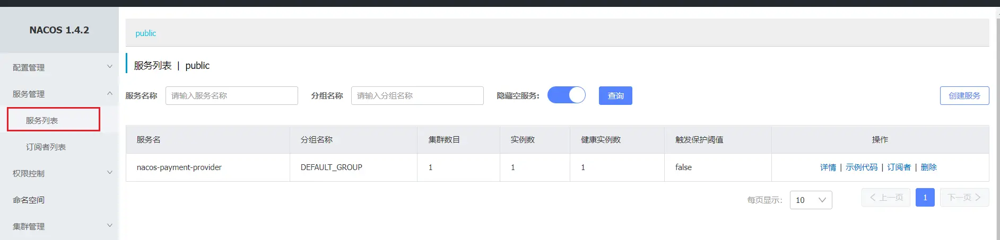

* nacos服务注册中心+服务提供者9001都OK了

为了下一章节演示nacos的负载均衡，参照9001新建9002

* 新建cloudalibaba-provider-payment9002
* 9002其它步骤你懂的
* 或者**取巧**不想新建重复体力劳动，可以利用IDEA功能，直接拷贝虚拟端口映射


* [http://localhost:9011/payment/nacos/1(opens new window)](http://localhost:9011/payment/nacos/1)


* nacos控制台

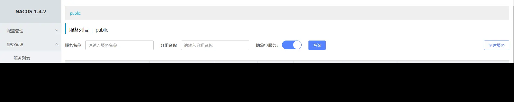

* 新建cloudalibaba-provider-payment9002

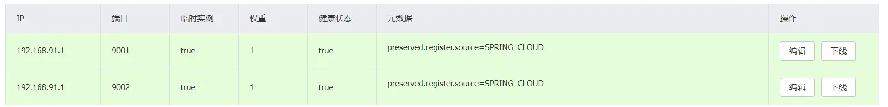

## [#](https://frxcat.fun/Spring/SpringCloud/Nacos_/#nacos%E4%B9%8B%E6%9C%8D%E5%8A%A1%E6%B6%88%E8%B4%B9%E8%80%85%E6%B3%A8%E5%86%8C%E5%92%8C%E8%B4%9F%E8%BD%BD)Nacos之服务消费者注册和负载

新建Module - cloudalibaba-consumer-nacos-order83

POM

```xml
<?xml version="1.0" encoding="UTF-8"?>
<project xmlns="http://maven.apache.org/POM/4.0.0"
         xmlns:xsi="http://www.w3.org/2001/XMLSchema-instance"
         xsi:schemaLocation="http://maven.apache.org/POM/4.0.0 http://maven.apache.org/xsd/maven-4.0.0.xsd">
    <parent>
        <artifactId>cloud2020</artifactId>
        <groupId>com.frx01.springcloud</groupId>
        <version>1.0-SNAPSHOT</version>
    </parent>
    <modelVersion>4.0.0</modelVersion>

    <artifactId>cloudalibaba-consumer-nacos-order83</artifactId>
    <dependencies>
        <!--SpringCloud ailibaba nacos -->
        <dependency>
            <groupId>com.alibaba.cloud</groupId>
            <artifactId>spring-cloud-starter-alibaba-nacos-discovery</artifactId>
        </dependency>
        <!-- 引入自己定义的api通用包，可以使用Payment支付Entity -->
        <dependency>
            <groupId>com.frx01.springcloud</groupId>
            <artifactId>cloud-api-commons</artifactId>
            <version>1.0-SNAPSHOT</version>
        </dependency>
        <!-- SpringBoot整合Web组件 -->
        <dependency>
            <groupId>org.springframework.boot</groupId>
            <artifactId>spring-boot-starter-web</artifactId>
        </dependency>
        <dependency>
            <groupId>org.springframework.boot</groupId>
            <artifactId>spring-boot-starter-actuator</artifactId>
        </dependency>
        <!--日常通用jar包配置-->
        <dependency>
            <groupId>org.springframework.boot</groupId>
            <artifactId>spring-boot-devtools</artifactId>
            <scope>runtime</scope>
            <optional>true</optional>
        </dependency>
        <dependency>
            <groupId>org.projectlombok</groupId>
            <artifactId>lombok</artifactId>
            <optional>true</optional>
        </dependency>
        <dependency>
            <groupId>org.springframework.boot</groupId>
            <artifactId>spring-boot-starter-test</artifactId>
            <scope>test</scope>
        </dependency>
    </dependencies>
</project>
```

 为什么nacos支持负载均衡？ =因为spring-cloud-starter-alibaba-nacos-discovery内含netflix-ribbon包= 。

YML

```yaml
server:
  port: 83

spring:
  application:
    name: nacos-order-consumer
  cloud:
    nacos:
      discovery:
        server-addr: localhost:8848

#消费者将要去访问的微服务名称(注册成功进nacos的微服务提供者)
service-url:
  nacos-user-service: http://nacos-payment-provider
```

主启动

```java
@SpringBootApplication
@EnableDiscoveryClient
public class OrderNacosMain83 {
    public static void main(String[] args) {
        SpringApplication.run(OrderNacosMain83.class,args);
    }
}
```

 业务类

ApplicationContextConfig

```java
@Configuration
public class ApplicationConfig {
  
    @Bean
    @LoadBalanced
    public RestTemplate getRestTemplate(){
        return new RestTemplate();
    }
}
```

 OrderNacosController

```java
@RestController
public class OrderNacosController {

    @Resource
    private RestTemplate restTemplate;

    @Value("${service-url.nacos-user-service}")
    private String serverURL;

    @GetMapping("/consumer/payment/nacos/{id}")
    public String paymentInfo(@PathVariable("id") Integer id){
        return restTemplate.getForObject(serverURL+"/payment/nacos/"+id,String.class);
    }
}
```

 测试

* 启动nacos控制台
* [http://localhost:83/consumer/payment/nacos/1(opens new window)](http://localhost:83/consumer/payment/nacos/1)

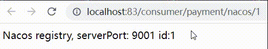

* 83访问9001/9002，轮询负载OK

## [#](https://frxcat.fun/Spring/SpringCloud/Nacos_/#nacos%E6%9C%8D%E5%8A%A1%E6%B3%A8%E5%86%8C%E4%B8%AD%E5%BF%83%E5%AF%B9%E6%AF%94%E6%8F%90%E5%8D%87)Nacos服务注册中心对比提升

**Nacos全景图**

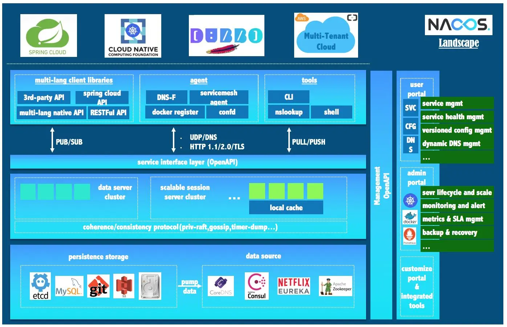

**Nacos和CAP**

Nacos与其他注册中心特性对比

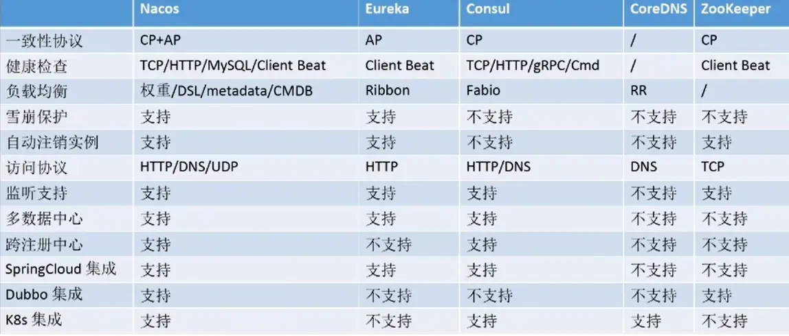

**Nacos服务发现实例模型**


**Nacos支持AP和CP模式的切换**

C是所有节点在同一时间看到的数据是一致的;而A的定义是所有的请求都会收到响应。

何时选择使用何种模式?

—般来说，如果不需要存储服务级别的信息且服务实例是通过nacos-client注册，并能够保持心跳上报，那么就可以选择AP模式。当前主流的服务如Spring cloud和Dubbo服务，都适用于AP模式，AP模式为了服务的可能性而减弱了一致性，因此AP模式下只支持注册临时实例。

如果需要在服务级别编辑或者存储配置信息，那么CP是必须，K8S服务和DNS服务则适用于CP模式。CP模式下则支持注册持久化实例，此时则是以Raft协议为集群运行模式，该模式下注册实例之前必须先注册服务，如果服务不存在，则会返回错误。

切换命令：

`curl -X PUT '$NACOS_SERVER:8848/nacos/v1/ns/operator/switches?entry=serverMode&value=CP`

## [#](https://frxcat.fun/Spring/SpringCloud/Nacos_/#nacos%E4%B9%8B%E6%9C%8D%E5%8A%A1%E9%85%8D%E7%BD%AE%E4%B8%AD%E5%BF%83)Nacos之服务配置中心

基础配置

cloudalibaba-config-nacos-client3377

POM

```xml
<?xml version="1.0" encoding="UTF-8"?>
<project xmlns="http://maven.apache.org/POM/4.0.0"
         xmlns:xsi="http://www.w3.org/2001/XMLSchema-instance"
         xsi:schemaLocation="http://maven.apache.org/POM/4.0.0 http://maven.apache.org/xsd/maven-4.0.0.xsd">
    <parent>
        <artifactId>cloud2020</artifactId>
        <groupId>com.frx01.springcloud</groupId>
        <version>1.0-SNAPSHOT</version>
    </parent>
    <modelVersion>4.0.0</modelVersion>

    <artifactId>cloudalibaba-config-nacos-client3377</artifactId>
    <dependencies>
        <!--nacos-config-->
        <dependency>
            <groupId>com.alibaba.cloud</groupId>
            <artifactId>spring-cloud-starter-alibaba-nacos-config</artifactId>
        </dependency>
        <!--nacos-discovery-->
        <dependency>
            <groupId>com.alibaba.cloud</groupId>
            <artifactId>spring-cloud-starter-alibaba-nacos-discovery</artifactId>
        </dependency>
        <!--web + actuator-->
        <dependency>
            <groupId>org.springframework.boot</groupId>
            <artifactId>spring-boot-starter-web</artifactId>
        </dependency>
        <dependency>
            <groupId>org.springframework.boot</groupId>
            <artifactId>spring-boot-starter-actuator</artifactId>
        </dependency>
        <!--一般基础配置-->
        <dependency>
            <groupId>org.springframework.boot</groupId>
            <artifactId>spring-boot-devtools</artifactId>
            <scope>runtime</scope>
            <optional>true</optional>
        </dependency>
        <dependency>
            <groupId>org.projectlombok</groupId>
            <artifactId>lombok</artifactId>
            <optional>true</optional>
        </dependency>
        <dependency>
            <groupId>org.springframework.boot</groupId>
            <artifactId>spring-boot-starter-test</artifactId>
            <scope>test</scope>
        </dependency>
    </dependencies>
</project>
```

 YML

Nacos同springcloud-config一样，在项目初始化时，要保证先从配置中心进行配置拉取，拉取配置之后，才能保证项目的正常启动。

springboot中配置文件的加载是存在优先级顺序的，bootstrap优先级高于application

bootstrap

```yaml
# nacos配置
server:
  port: 3377

spring:
  application:
    name: nacos-config-client
  cloud:
    nacos:
      discovery:
        server-addr: localhost:8848 #Nacos服务注册中心地址
      config:
        server-addr: localhost:8848 #Nacos作为配置中心地址
        file-extension: yaml #指定yaml格式的配置


# ${spring.application.name}-${spring.profile.active}.${spring.cloud.nacos.config.file-extension}
# nacos-config-client-dev.yaml

# nacos-config-client-test.yaml   ----> config.info
```

 application

```yaml
spring:
  profiles:
    active: dev # 表示开发环境
    #active: test # 表示测试环境
    #active: info
```

主启动

```java
@EnableDiscoveryClient
@SpringBootApplication
public class NacosConfigClientMain3377
{
    public static void main(String[] args) {
        SpringApplication.run(NacosConfigClientMain3377.class, args);
    }
}
```

 Controller

```java
@RestController
@RefreshScope   //支持Nacos的动态刷新功能
public class ConfigClientController {

    @Value("${config.info}")
    private String configInfo;

    @GetMapping("/config/info")
    public String getConfigInfo(){
        return configInfo;
    }
}
```

 **在Nacos中添加配置信息**

Nacos中的dataid的组成格式及与SpringBoot配置文件中的匹配规则

[官方文档(opens new window)](https://nacos.io/zh-cn/docs/quick-start-spring-cloud.html)

说明：之所以需要配置spring.application.name，是因为它是构成Nacos配置管理dataId 字段的一部分。

在 Nacos Spring Cloud中,dataId的完整格式如下：

```yaml
${prefix}-${spring-profile.active}.${file-extension}
```

* `prefix`默认为 `spring.application.name`的值，也可以通过配置项 `spring.cloud.nacos.config.prefix`来配置。
* `spring.profile.active`即为当前环境对应的 `profile`，详情可以参考 Spring Boot文档。注意：当 `spring.profile.active`为空时，对应的连接符 - 也将不存在，`datald` 的拼接格式变成{file-extension}
* file-exetension为配置内容的数据格式，可以通过配置项 `spring .cloud.nacos.config.file-extension`来配置。目前只支持 `properties`和 `yaml`类型。
* 通过Spring Cloud 原生注解 `@RefreshScope`实现配置自动更新。

最后公式：

```java
${spring.application.name)}-${spring.profiles.active}.${spring.cloud.nacos.config.file-extension}
```

 配置新增

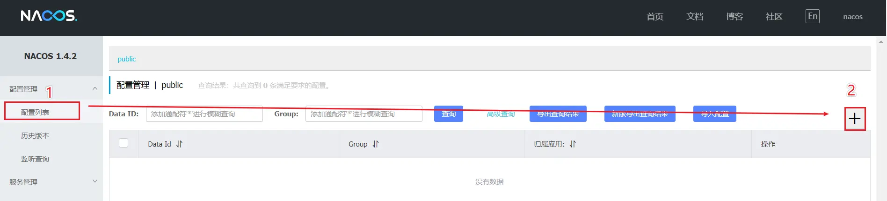

Nacos界面配置对应 - 设置DataId

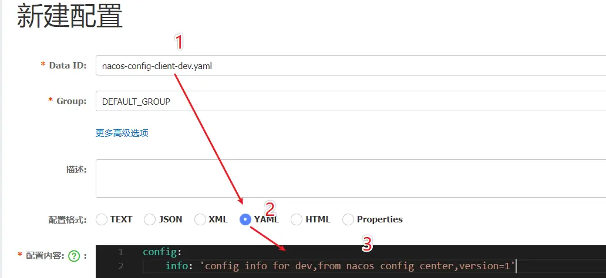

```yaml
config:
    info: config info for dev,from nacos config center,version=1
```

配置小结

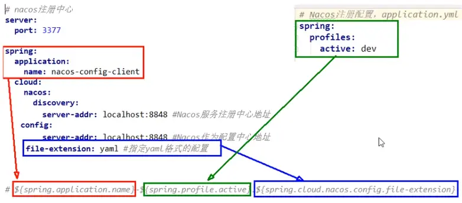

* 测试
* 启动前需要在nacos客户端-配置管理-配置管理栏目下有对应的yaml配置文件
* 运行cloud-config-nacos-client3377的主启动类
* 调用接口查看配置信息 - [http://localhost:3377/config/info(opens new window)](http://localhost:3377/config/info)


**自带动态刷新**

修改下Nacos中的yaml配置文件，再次调用查看配置的接口，就会发现配置已经刷新。

* 将version改为2


## [#](https://frxcat.fun/Spring/SpringCloud/Nacos_/#nacos%E4%B9%8B%E5%91%BD%E5%90%8D%E7%A9%BA%E9%97%B4%E5%88%86%E7%BB%84%E5%92%8Cdataid%E4%B8%89%E8%80%85%E5%85%B3%E7%B3%BB)Nacos之命名空间分组和DataID三者关系

**问题 - 多环境多项目管理**

问题1:

实际开发中，通常一个系统会准备

1. dev开发环境
2. test测试环境
3. prod生产环境。

如何保证指定环境启动时服务能正确读取到Nacos上相应环境的配置文件呢?

问题2:

一个大型分布式微服务系统会有很多微服务子项目，每个微服务项目又都会有相应的开发环境、测试环境、预发环境、正式环境…那怎么对这些微服务配置进行管理呢?

Nacos的图形化管理界面


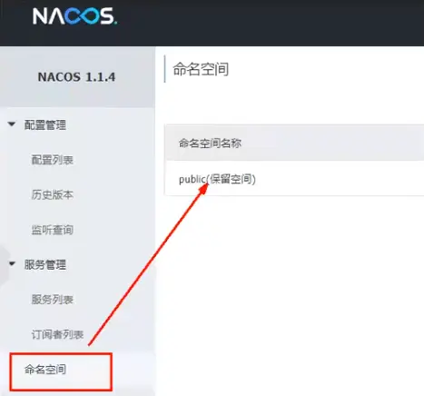

**Namespace+Group+Data lD三者关系？为什么这么设计？**

1. 是什么

类似Java里面的package名和类名最外层的namespace是可以用于区分部署环境的，Group和DatalD逻辑上区分两个目标对象。

2. 三者情况

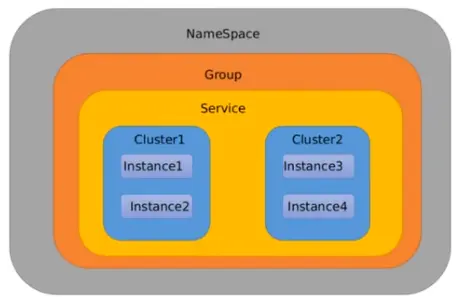

默认情况：Namespace=public，Group=DEFAULT_GROUP，默认Cluster是DEFAULT

* Nacos默认的Namespace是public，Namespace主要用来实现隔离。
  * 比方说我们现在有三个环境：开发、测试、生产环境，我们就可以创建三个Namespace，不同的Namespace之间是隔离的。
* Group默认是DEFAULT_GROUP，Group可以把不同的微服务划分到同一个分组里面去
* Service就是微服务:一个Service可以包含多个Cluster (集群)，Nacos默认Cluster是DEFAULT，Cluster是对指定微服务的一个虚拟划分。
  * 比方说为了容灾，将Service微服务分别部署在了杭州机房和广州机房，这时就可以给杭州机房的Service微服务起一个集群名称(HZ) ，给广州机房的Service微服务起一个集群名称(GZ)，还可以尽量让同一个机房的微服务互相调用，以提升性能。
* 最后是Instance，就是微服务的实例。

## [#](https://frxcat.fun/Spring/SpringCloud/Nacos_/#nacos%E4%B9%8Bdataid%E9%85%8D%E7%BD%AE)Nacos之DataID配置

指定spring.profile.active和配置文件的DatalD来使不同环境下读取不同的配置

默认空间+默认分组+新建dev和test两个DatalD

* 新建dev配置DatalD

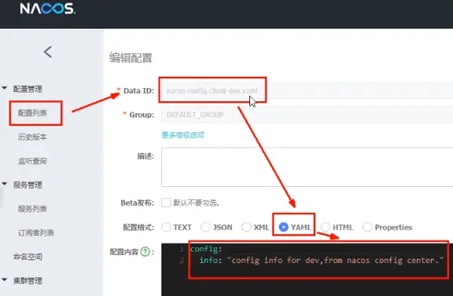

* 新建test配置DatalD

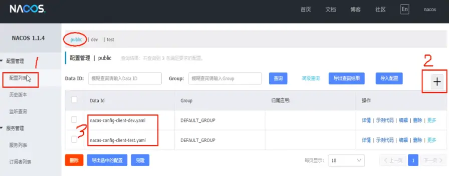

通过spring.profile.active属性就能进行多环境下配置文件的读取

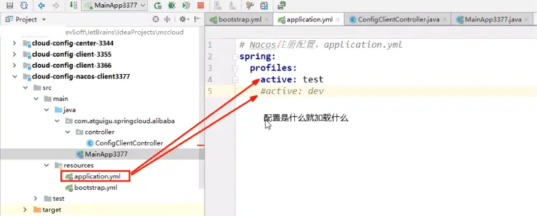

**测试**

* [http://localhost:3377/config/info(opens new window)](http://localhost:3377/config/info)


* 配置是什么就加载什么 test/dev

## [#](https://frxcat.fun/Spring/SpringCloud/Nacos_/#nacos%E4%B9%8Bgroup%E5%88%86%E7%BB%84%E6%96%B9%E6%A1%88)Nacos之Group分组方案

通过Group实现环境区分 - 新建Group

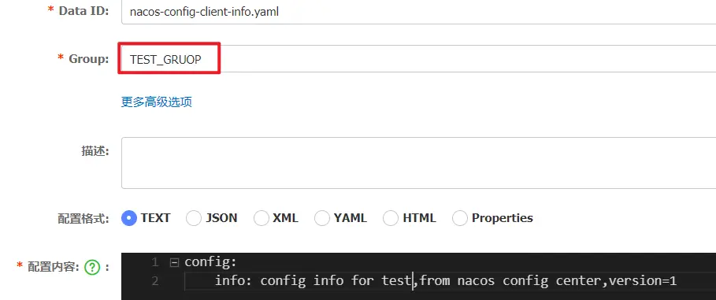

在nacos图形界面控制台上面新建配置文件DatalD

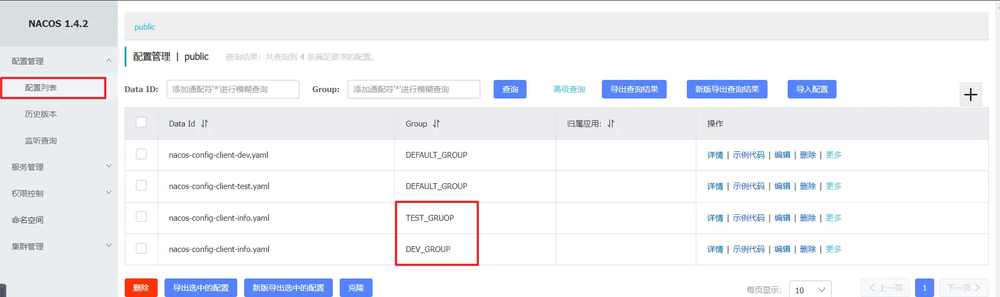

bootstrap+application

在config下增加一条group的配置即可。可配置为DEV_GROUP或TEST GROUP

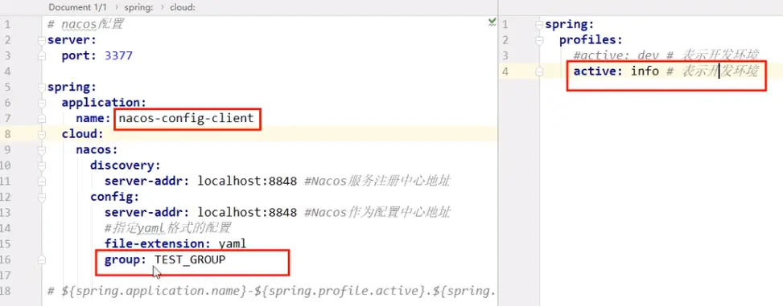

## [#](https://frxcat.fun/Spring/SpringCloud/Nacos_/#nacos%E4%B9%8Bnamespace%E7%A9%BA%E9%97%B4%E6%96%B9%E6%A1%88)Nacos之Namespace空间方案

新建dev/test的Namespace

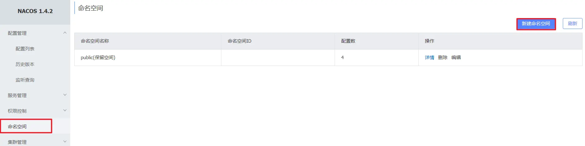

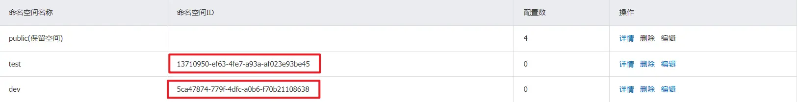

回到服务管理-服务列表查看

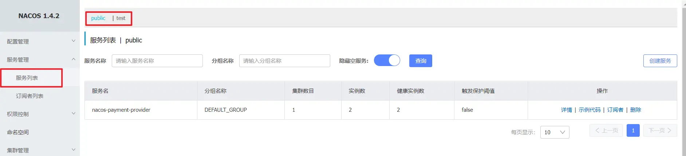

按照域名配置填写

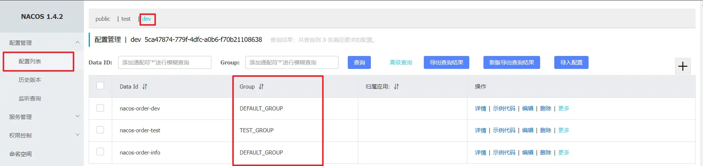

YML

```yaml
# nacos配置
server:
  port: 3377

spring:
  application:
    name: nacos-config-client
  cloud:
    nacos:
      discovery:
        server-addr: localhost:8848 #Nacos服务注册中心地址
      config:
        server-addr: localhost:8848 #Nacos作为配置中心地址
        file-extension: yaml #指定yaml格式的配置
        group: DEV_GROUP
        namespace: 5ca47874-779f-4dfc-a0b6-f70b21108638  #<----指定namespace

# ${spring.application.name}-${spring.profile.active}.${spring.cloud.nacos.config.file-extension}
# nacos-config-client-dev.yaml

# nacos-config-client-test.yaml   ----> config.info
```

* 测试访问[http://localhost:3377/config/info(opens new window)](http://localhost:3377/config/info)

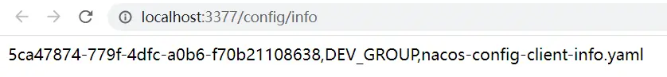

## [#](https://frxcat.fun/Spring/SpringCloud/Nacos_/#nacos%E9%9B%86%E7%BE%A4-%E6%9E%B6%E6%9E%84%E8%AF%B4%E6%98%8E)Nacos集群_架构说明

> [官方文档(opens new window)](https://nacos.io/zh-cn/docs/cluster-mode-quick-start.html)
>
> 官网架构图
>
> 集群部署架构图
>
> 因此开源的时候推荐用户把所有服务列表放到一个vip下面，然后挂到一个域名下面
>
> http://ip1:port/openAPI直连ip模式，机器挂则需要修改ip才可以使用。
>
> http://VIP:port/openAPI挂载VIP模式，直连vip即可，下面挂server真实ip，可读性不好。
>
> http://nacos.com:port/openAPI域名＋VIP模式，可读性好，而且换ip方便，推荐模式
>
> 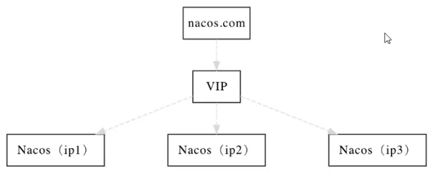

上图官网翻译，真实情况

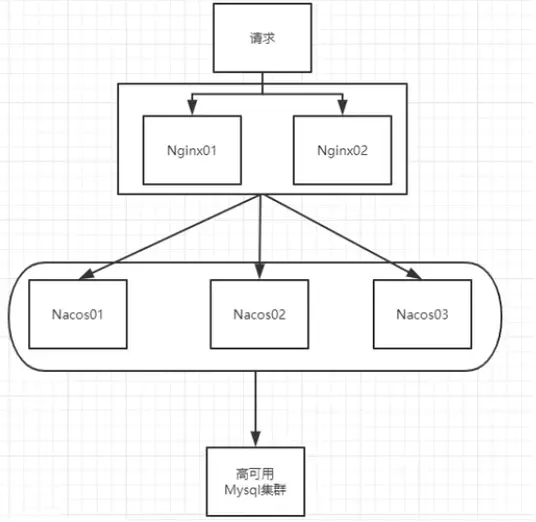

> 官网说明
>
> 默认Nacos使用嵌入式数据库实现数据的存储。所以，如果启动多个默认配置下的Nacos节点，数据存储是存在一致性问题的。为了解决这个问题，**Nacos采用了集中式存储的方式来支持集群化部署，目前只支持MySQL的存储。**
>
> Nacos支持三种部署模式
>
> * 单机模式-用于测试和单机试用。
> * 集群模式-用于生产环境，确保高可用。
> * 多集群模式-用于多数据中心场景。
>
> **Windows**
>
> cmd startup.cmd或者双击startup.cmd文件
>
> **单机模式支持mysql**
>
> 在0.7版本之前，在单机模式时nacos使用嵌入式数据库实现数据的存储，不方便观察数据存储的基本情况。0.7版本增加了支持mysql数据源能力，具体的操作步骤:
>
> 1. 安装数据库，版本要求:5.6.5+
> 2. 初始化mysq数据库，数据库初始化文件: nacos-mysql.sql
> 3. 修改conf/application.properties文件，增加支持mysql数据源配置（目前只支持mysql)，添加mysql数据源的url、用户名和密码。
>
> ```properties
> spring.datasource.platform=mysql
>
> db.num=1
> db.url.0=jdbc:mysql://11.162.196.16:3306/nacos_devtest?characterEncoding=utf8&connectTimeout=1000&socketTimeout=3000&autoReconnect=true
> db.user=nacos_devtest
> db.password=youdontknow
> ```
>
> 再以单机模式启动nacos，nacos所有写嵌入式数据库的数据都写到了mysql。

## [#](https://frxcat.fun/Spring/SpringCloud/Nacos_/#nacos%E6%8C%81%E4%B9%85%E5%8C%96%E5%88%87%E6%8D%A2%E9%85%8D%E7%BD%AE)Nacos持久化切换配置

Nacos默认自带的是嵌入式数据库derby，[nacos的pom.xml **(opens new window)**](https://github.com/alibaba/nacos/blob/develop/pom.xml)中可以看出。

derby到mysql切换配置步骤：

1. nacos-server-1.1.4\nacos\conf录下找到nacos-mysql.sql文件，执行脚本。
2. nacos-server-1.1.4\nacos\conf目录下找到application.properties，添加以下配置（按需修改对应值）。

```properties
spring.datasource.platform=mysql

db.num=1
db.url.0=jdbc:mysql://localhost:3306/nacos_config?characterEncoding=utf8&connectTimeout=1000&socketTimeout=3000&autoReconnect=true
db.user=root
db.password=hsp
```

启动Nacos，可以看到是个全新的空记录界面，以前是记录进derby。

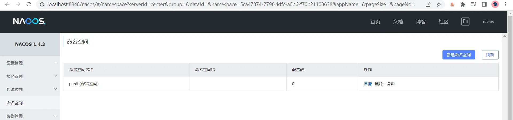

* 添加配置，查询MySQL数据库

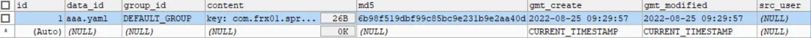

## [#](https://frxcat.fun/Spring/SpringCloud/Nacos_/#nacos%E4%B9%8Blinux%E7%89%88%E6%9C%AC%E5%AE%89%E8%A3%85)Nacos之Linux版本安装

预计需要，1个Nginx+3个[nacos **(opens new window)**](https://so.csdn.net/so/search?q=nacos&spm=1001.2101.3001.7020)注册中心+1个mysql

> 请确保是在环境中安装使用:
>
> 1. 64 bit OS Linux/Unix/Mac，推荐使用Linux系统。
> 2. 64 bit JDK 1.8+；[下载 **(opens new window)**](http://www.oracle.com/technetwork/java/javase/downloads/jdk8-downloads-2133151.html).[配置 **(opens new window)**](https://docs.oracle.com/cd/E19182-01/820-7851/inst_cli_jdk_javahome_t/)。
> 3. Maven 3.2.x+；[下载 **(opens new window)**](https://maven.apache.org/download.cgi).[配置 **(opens new window)**](https://maven.apache.org/settings.html)。
> 4. 3个或3个以上Nacos节点才能构成集群。
>
> [link(opens new window)](https://nacos.io/zh-cn/docs/cluster-mode-quick-start.html)

Nacos下载Linux版

* [https://github.com/alibaba/nacos/releases/tag/1.1.4(opens new window)](https://github.com/alibaba/nacos/releases/tag/1.1.4)
* nacos-server-1.1.4.tar.gz 解压后安装
* 使用XFTP工具将压缩包上传到Linux系统

docker一次性配置

单容器跑多端口集群（老师的）

```
docker run -id \
-p 3306:3306 \
--name=c_mysql \
-v $PWD/conf:/etc/mysql/conf.d \
-v $PWD/logs:/logs \
-v $PWD/data:/var/lib/mysql \
-e MYSQL_ROOT_PASSWORD=123456 \
mysql:5.6
```

```yaml
cd /usr/local/myLocal/nacos-docker-master/example

vim docker-compose.yml

# docker-compose.yml 文件内容
# ------------------------------- 开始 ------------------------------

version: '3' 
services:  
  docker-nacos-server-1:
    image: nacos/nacos-server
    container_name: nacos-server-1
    ports:
      - "8848:8848"
      - "9555:9555"
    restart: on-failure
    network_mode: host  # 将Linux宿主机的IP赋给容器
    environment:
      SPRING_DATASOURCE_PLATFORM: mysql 
      NACOS_SERVERS: 192.168.20.255:8848 192.168.20.255:8849 192.168.20.255:8850  # 集群中容器节点的IP地址
      MYSQL_SERVICE_HOST: 192.168.20.255
      NACOS_APPLICATION_PORT: 8848  # 该容器的端口号，如果不指定的话，默认就是8848
      MYSQL_SERVICE_DB_NAME: nacos_config
      MYSQL_SERVICE_USER: root
      MYSQL_SERVICE_PASSWORD: admin
      # JVM虚拟机参数，调小点，太大了启动不起来。
      JVM_XMS: 256m
      JVM_XMX: 256m
      JVM_XMN: 256m
    volumes:  # 挂载的文件夹及文件
      - ./cluster-logs/nacos1:/home/nacos/logs
      - ./init.d/custom.properties:/home/nacos/init.d/custom.properties
  docker-nacos-server-2:
    image: nacos/nacos-server
    container_name: nacos-server-2
    ports:
      - "8849:8848"
    restart: on-failure
    network_mode: host
    environment:
      SPRING_DATASOURCE_PLATFORM: mysql 
      NACOS_SERVERS: 192.168.20.255:8848 192.168.20.255:8849 192.168.20.255:8850
      NACOS_APPLICATION_PORT: 8849
      MYSQL_SERVICE_HOST: 192.168.20.255
      MYSQL_SERVICE_DB_NAME: nacos_config
      MYSQL_SERVICE_USER: root
      MYSQL_SERVICE_PASSWORD: admin
      JVM_XMS: 256m
      JVM_XMX: 256m
      JVM_XMN: 256m
    volumes:
      - ./cluster-logs/nacos2:/home/nacos/logs 
      - ./init.d/custom.properties:/home/nacos/init.d/custom.properties
  docker-nacos-server-3:
    image: nacos/nacos-server
    container_name: nacos-server-3
    ports:
      - "8850:8848"
    restart: on-failure
    network_mode: host
    environment:
      SPRING_DATASOURCE_PLATFORM: mysql
      NACOS_SERVERS: 192.168.20.255:8848 192.168.20.255:8849 192.168.20.255:8850
      NACOS_APPLICATION_PORT: 8850
      MYSQL_SERVICE_HOST: 192.168.20.255
      MYSQL_SERVICE_DB_NAME: nacos_config
      MYSQL_SERVICE_USER: root
      MYSQL_SERVICE_PASSWORD: admin
      JVM_XMS: 256m
      JVM_XMX: 256m
      JVM_XMN: 256m
    volumes:
      - ./cluster-logs/nacos3:/home/nacos/logs
      - ./init.d/custom.properties:/home/nacos/init.d/custom.properties

# ------------------------------- 结束 --------------------------------

```

多容器跑多端口集群

```yaml
version: '3'
services:
  nginx:
    image: nginx:latest
    container_name: nginx
    ports:
      - 80:80
    volumes:
      - ./nginx/conf.d:/etc/nginx/conf.d
    depends_on:
      - nacos1
    networks:
      - nacos-network

  nacos1:
    image: nacos/nacos-server:v2.1.0
    container_name: nacos1
    ports:
      - 8848:8848
    environment:
      - PREFER_HOST_MODE=ip
      - NACOS_SERVERS: 192.168.20.255:8848 192.168.20.255:8849 192.168.20.255:8850  # 集群中容器节点的IP地址
      - SPRING_DATASOURCE_PLATFORM=mysql
      - MYSQL_SERVICE_HOST=192.168.182.130
      - MYSQL_SERVICE_PORT=3306
      - MYSQL_SERVICE_DB_NAME=nacos_config
      - MYSQL_SERVICE_USER=root
      - MYSQL_SERVICE_PASSWORD=123456
      - JVM_XMS=256m
      - JVM_XMX=256m
      - JVM_XMN=256m
    depends_on:
      - mysql
    networks:
      - nacos-network

  mysql:
    image: mysql:5.7
    container_name: mysql
    ports:
      - 3306:3306
    environment:
      - MYSQL_ROOT_PASSWORD=123456
      - MYSQL_DATABASE=nacos_config
    volumes:
      - ./mysql_data:/var/lib/mysql
    networks:
      - nacos-network
    command: --default-authentication-plugin=mysql_native_password

networks:
  nacos-network:
```

## [#](https://frxcat.fun/Spring/SpringCloud/Nacos_/#nacos%E9%9B%86%E7%BE%A4%E9%85%8D%E7%BD%AE-%E4%B8%8A)Nacos集群配置(上)

集群配置步骤(重点)

1. **Linux服务器上mysql数据库配置**

SQL脚本在哪里 - 目录/usr/local/nacos/nacos/conf/nacos-mysql.sql

```sh
[root@master conf]# pwd
/usr/local/nacos/nacos/conf
[root@master conf]# ll
总用量 52
-rw-r--r-- 1 502 games  1564 11月  4 2019 application.properties
-rw-r--r-- 1 502 games   408 10月 11 2019 application.properties.example
-rw-r--r-- 1 502 games    58 10月 11 2019 cluster.conf.example
-rw-r--r-- 1 502 games 20210 11月  4 2019 nacos-logback.xml
-rw-r--r-- 1 502 games  9788 10月 11 2019 nacos-mysql.sql
-rw-r--r-- 1 502 games  7196 10月 11 2019 schema.sql
```

 自己Linux机器上的Mysql数据库上运行

```sh
mysql> show tables;
+------------------------+
| Tables_in_nacos_config |
+------------------------+
| config_info            |
| config_info_aggr       |
| config_info_beta       |
| config_info_tag        |
| config_tags_relation   |
| group_capacity         |
| his_config_info        |
| roles                  |
| tenant_capacity        |
| tenant_info            |
| users                  |
+------------------------+
11 rows in set (0.00 sec)
```

2. **application.properties配置**

位置

```sh
[root@master conf]# pwd
/usr/local/nacos/nacos/conf
[root@master conf]# cp application.properties.example application.properties
cp：是否覆盖"application.properties"？ y
[root@master conf]# ls
application.properties  application.properties.example  cluster.conf.example  nacos-logback.xml  nacos-mysql.sql  schema.sql
[root@master conf]# vim application.properties
```

 添加以下内容，设置数据源

```properties
spring.datasource.platform=mysql

db.num=1
db.url.0=jdbc:mysql://localhost:3306/nacos_config?characterEncoding=utf8&connectTimeout=1000&socketTimeout=3000&autoReconnect=true
db.user=root
db.password=12345678
```

3. **Linux服务器上nacos的集群配置cluster.conf**

梳理出3台nacos集器的不同服务端口号，设置3个端口：

* 3333
* 4444
* 5555

复制出cluster.conf

```sh
[root@master conf]# pwd
/usr/local/nacos/nacos/conf
[root@master conf]# cp cluster.conf.example cluster.conf
[root@master conf]# ll
总用量 56
-rw-r--r-- 1  502 games   431 8月  25 20:22 application.properties
-rw-r--r-- 1  502 games   408 10月 11 2019 application.properties.example
-rw-r--r-- 1 root root     58 8月  25 20:22 cluster.conf
-rw-r--r-- 1  502 games    58 10月 11 2019 cluster.conf.example
-rw-r--r-- 1  502 games 20210 11月  4 2019 nacos-logback.xml
-rw-r--r-- 1  502 games  9788 10月 11 2019 nacos-mysql.sql
-rw-r--r-- 1  502 games  7196 10月 11 2019 schema.sql
[root@master conf]# vim cluster.conf
```

 内容

```sh
192.168.91.200:3333
192.168.91.200:4444
192.168.91.200:5555
```

 **注意** ，这个IP不能写127.0.0.1，必须是Linux命令 `hostname -i`能够识别的IP

```sh
[root@master conf]# hostname -i
192.168.91.200
```

4. **编辑Nacos的启动脚本startup.sh，使它能够接受不同的启动端口**

/usr/local/nacos/nasos/bin目录下有startup.sh

```sh
[root@master conf]# cd ../bin/
[root@master bin]# ls
shutdown.cmd  shutdown.sh  startup.cmd  startup.sh
```

 平时单机版的启动，都是./startup.sh即可

但是，集群启动，我们希望可以类似其它软件的shell命令，传递不同的端口号启动不同的nacos实例。

命令: `./startup.sh -p 3333`表示启动端口号为3333的nacos服务器实例，和上一步的cluster.conf配置的一致。

修改内容

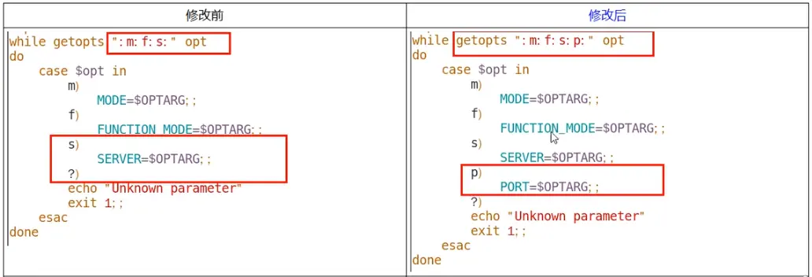

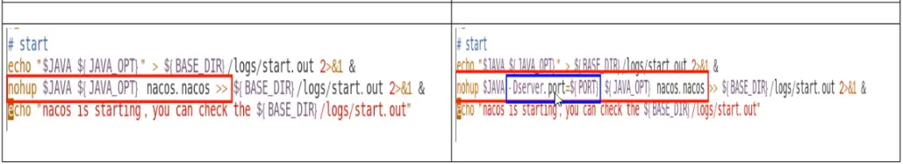

```sh
while getopts ":m:f:s:p:" opt
do
    case $opt in
        m)
            MODE=$OPTARG;;
        f)
            FUNCTION_MODE=$OPTARG;;
        s)
            SERVER=$OPTARG;;
        p)
            PORT=$OPTARG;;
        ?)
        echo "Unknown parameter"
        exit 1;;
    esac
done
...
nohup $JAVA -Dserver.port=${PORT} ${JAVA_OPT} nacos.nacos >> ${BASE_DIR}/logs/start.out 2>&1 &
```

执行方式 - `startup.sh - p 端口号`

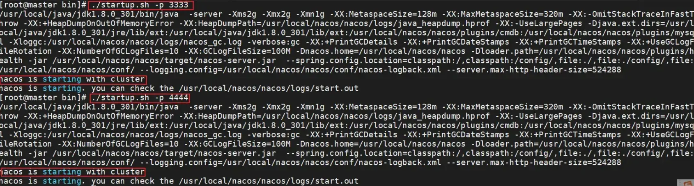

## [#](https://frxcat.fun/Spring/SpringCloud/Nacos_/#nacos%E9%9B%86%E7%BE%A4%E9%85%8D%E7%BD%AE-%E4%B8%8B)Nacos集群配置(下)

[Nginx安装](https://frxcat.fun/middleware/Nginx/Nginx_install/#nginx%E7%8E%AF%E5%A2%83%E5%AE%89%E8%A3%85)

5. **Nginx的配置，由它作为负载均衡器**

修改nginx的配置文件 - nginx.conf

```sh
[root@master conf]# pwd
/usr/local/nginx/conf
[root@master conf]# ll
总用量 96
-rw-r--r-- 1 root root 1637 8月   7 16:35 \
-rw-r--r-- 1 root root  740 7月  30 15:58 ！
-rw-r--r-- 1 root root 1077 7月  27 20:31 fastcgi.conf
-rw-r--r-- 1 root root 1077 7月  27 20:33 fastcgi.conf.default
-rw-r--r-- 1 root root 1007 7月  27 20:31 fastcgi_params
-rw-r--r-- 1 root root 1007 7月  27 20:33 fastcgi_params.default
-rw-r--r-- 1 root root   43 8月   6 21:43 htpasswd
-rw-r--r-- 1 root root 2837 7月  27 20:33 koi-utf
-rw-r--r-- 1 root root 2223 7月  27 20:33 koi-win
-rw-r--r-- 1 root root 5349 7月  27 20:31 mime.types
-rw-r--r-- 1 root root 5349 7月  27 20:33 mime.types.default
-rw-r--r-- 1 root root 1525 8月   7 16:41 nginx.conf
-rw-r--r-- 1 root root 1476 7月  30 13:52 nginx.conf.backup
-rw-r--r-- 1 root root 3018 8月   6 20:58 nginx.conf.static.bak
-rw-r--r-- 1 root root  168 7月  31 16:20 nginx_gzip.conf
-rw-r--r-- 1 root root  790 7月  30 16:08 nginx_server.conf
-rw-r--r-- 1 root root  749 7月  31 20:04 nginxTestServer.conf
-rw-r--r-- 1 root root  636 7月  27 20:31 scgi_params
-rw-r--r-- 1 root root  636 7月  27 20:33 scgi_params.default
-rw-r--r-- 1 root root  664 7月  27 20:31 uwsgi_params
-rw-r--r-- 1 root root  664 7月  27 20:33 uwsgi_params.default
-rw-r--r-- 1 root root 3610 7月  27 20:33 win-utf
[root@master conf]# vim nginx.conf
```

 修改内容

```nginx
    upstream cluster{
        server 127.0.0.1:3333;
        server 127.0.0.1:4444;
        server 127.0.0.1:5555;
    }

    server {
        listen 1111;
        server_name localhost;

        location / {
            proxy_pass http://cluster;
        }
    }
```

按照指定启动

```sh
[root@master conf]# nginx -c /usr/local/nginx/conf/nginx.conf
[root@master conf]# nginx -s reload
```

6. **截止到此处，1个Nginx+3个nacos注册中心+1个mysql**

**测试**

* 启动3个nacos注册中心

  * `./startup.sh - p 3333`
  * `./startup.sh - p 4444`
  * `./startup.sh - p 5555`

  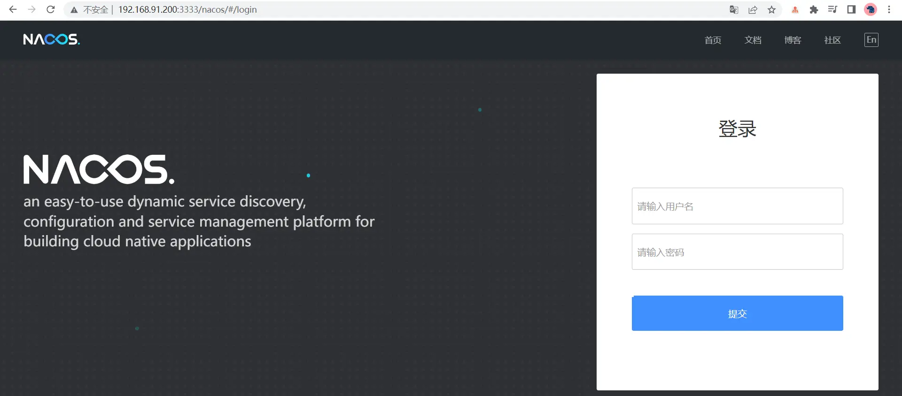

  * 查看nacos进程启动数 `ps -ef | grep nacos | grep -v grep | wc -l`

```sh
[root@master bin]# ps -ef | grep nacos | grep -v grep | wc -l
3
```

* 启动nginx
* `./nginx -c /usr/local/nginx/conf/nginx.conf`
* 查看nginx进程 `ps -ef| grep nginx`

```sh
[root@master bin]# nginx -c /usr/local/nginx/conf/nginx.conf
[root@master bin]# ps -ef|grep nginx
root       2812      1  0 21:47 ?        00:00:00 nginx: master process nginx -c /usr/local/nginx/conf/nginx.conf
nobody     2813   2812  0 21:47 ?        00:00:00 nginx: worker process
root       2824   1977  0 21:47 pts/0    00:00:00 grep --color=auto nginx
```

* 测试通过nginx，访问nacos - [http://192.168.91.200:1111/nacos/#/login(opens new window)](http://192.168.91.200:1111/nacos/#/login)

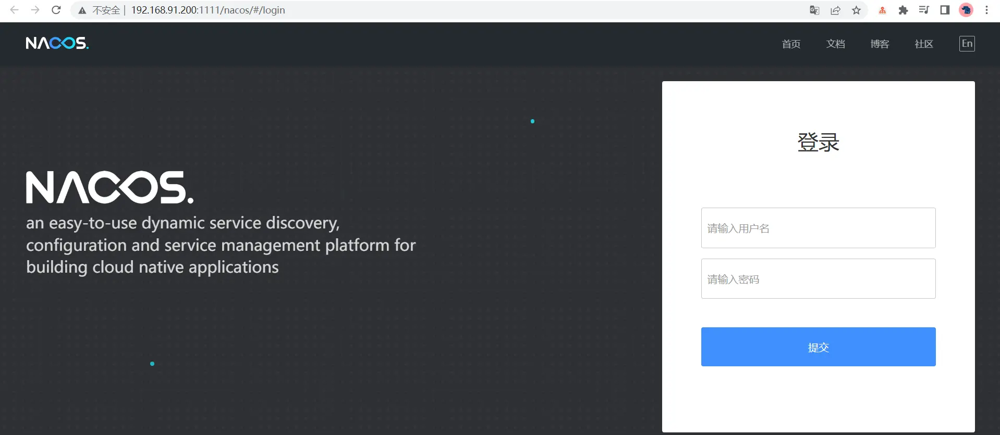

* 新建一个配置测试

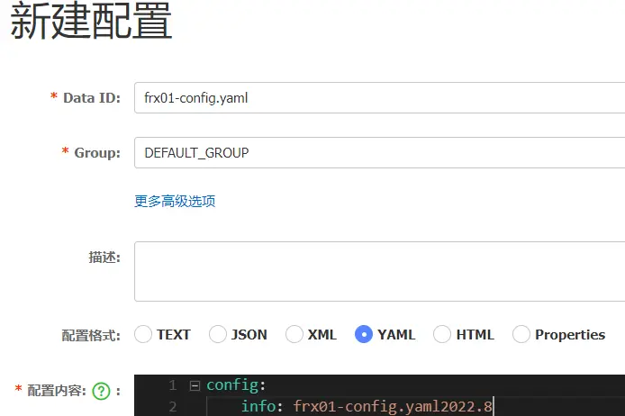

* 新建后，可在linux服务器的mysql新插入一条记录

```sh
mysql> select * from config_info;
+----+-------------------+---------------+--------------------------------------------+----------------------------------+---------------------+---------------------+----------+-----------+----------+-----------+--------+-------+--------+------+----------+
| id | data_id           | group_id      | content                                    | md5                              | gmt_create          | gmt_modified        | src_user | src_ip    | app_name | tenant_id | c_desc | c_use | effect | type | c_schema |
+----+-------------------+---------------+--------------------------------------------+----------------------------------+---------------------+---------------------+----------+-----------+----------+-----------+--------+-------+--------+------+----------+
|  1 | frx01-config.yaml | DEFAULT_GROUP | config:
    info: frx01-config.yaml2022.8 | 17c83f9c04dd207ffc6c9d87c456a316 | 2022-08-26 11:30:24 | 2022-08-26 11:30:24 | NULL     | 127.0.0.1 |          |           | NULL   | NULL  | NULL   | yaml | NULL     |
+----+-------------------+---------------+--------------------------------------------+----------------------------------+---------------------+---------------------+----------+-----------+----------+-----------+--------+-------+--------+------+----------+
```

* 让微服务cloudalibaba-provider-payment9002启动注册进nacos集群 - 修改配置文件

```yaml
server:
  port: 9002

spring:
  application:
    name: nacos-payment-provider
  cloud:
    nacos:
      discovery:
        #配置Nacos地址
        #server-addr: Localhost:8848
        #换成nginx的1111端口，做集群
        server-addr: 192.168.91.200:1111

management:
  endpoints:
    web:
      exposure:
        inc1ude: '*'
```

* 启动微服务cloudalibaba-provider-payment9002
* 访问nacos，查看注册结果

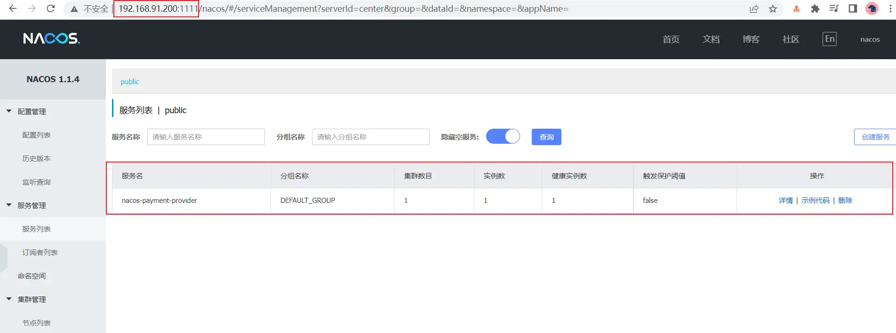

* 注册成功

**高可用小总结**

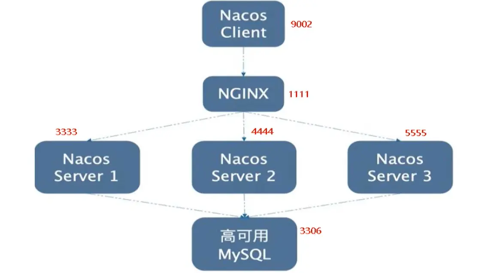
