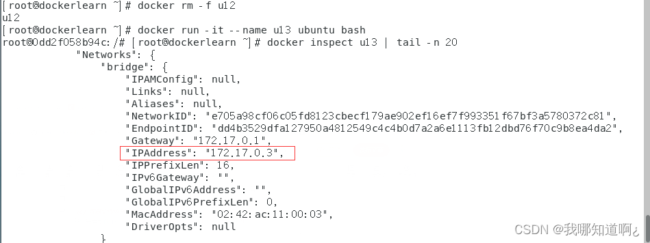

# docker网络

## 基础简介

***是什么***


***常用命令***


***能干嘛***

1. 容器间的互联和通信以及端口映射
2. 容器IP变动时候可以通过服务名直接网络通信而不受到影响

***几种网络模式介绍***


 ***容器实例内默认网络IP生产规则***

我们先启动两个Ubuntu容器实例u11和u12，发现他们人手一个ip


接下来删除u12，新建一个u13，发现原来u12的IP地址给u13了， **这说明容器的ip是会变化的，所以ip不能写死** ！



## 五种网络模式的案例（bridge，host，none，container，自定义）

***bridge(桥接)***

Docker 服务默认会创建一个 docker0 网桥（其上有一个 docker0 内部接口），该桥接网络的名称为docker0，它在内核层连通了其他的物理或虚拟网卡，这就 **将所有容器和本地主机都放到同一个物理网络** 。Docker 默认指定了 docker0 接口 的 IP 地址和子网掩码，让 **主机和容器之间可以通过网桥相互通信** 。


接下来代码验证一下，先启动两个tomcat容器

```bash
docker run -d -p 8081:8080   --name tomcat81 billygoo/tomcat8-jdk8
docker run -d -p 8082:8080   --name tomcat82 billygoo/tomcat8-jdk8
```


***host***

直接使用**宿主机的 IP 地址**与外界进行通信，不再需要额外进行NAT 转换，**容器将不会虚拟出自己的网卡而是使用宿主机的IP和端口。**


案例，注意，因为是host，所以-p参数就没有意义了，会抛出警告，可以直接无视，或者不写

```bash
docker run -d --network host --name tomcat83 billygoo/tomcat8-jdk8
```

进入容器，使用ip addr，发现没有网桥和网关了


如果想访问，直接用主机ip:8080即可

***none***

在none模式下，并不为Docker容器进行任何网络配置。
也就是说，这个Docker容器没有网卡、IP、路由等信息，只有一个lo（本地链路回环地址）
需要我们自己为Docker容器添加网卡、配置IP等。

```sh
docker run -d -p 8084:8080 --network none --name tomcat84 billygoo/tomcat8-jdk8
```


***container***

新建的容器和已经存在的一个容器共享一个网络ip配置而不是和宿主机共享。新创建的容器不会创建自己的网卡，配置自己的IP，而是和一个指定的容器共享IP、端口范围等。同样，两个容器除了网络方面，其他的如文件系统、进程列表等还是隔离的。


```sh
docker run -it --name alpine1  alpine /bin/sh

docker run -it --network container:alpine1 --name alpine2  alpine /bin/sh

```


此时，如果我们关掉alpine2共用网卡的alpine1呢？此时发现又只剩一个lo了


***自定义***

在前面的案例中，我们的容器ping其他容器的ip是可以ping通的，但是并不能按照服务名ping，上文也说过， **容器的ip地址是会变的，我们不能把ip地址写死** ，那么这个时候，就需要自定义网络了。

1、自定义桥接网络，自定义网络默认使用的是桥接网络bridge

```sh
docker network create zzyy_network
```

2、新建的容器加入上面的自定义网段

```sh
docker run -d -p 8081:8080 --network zzyy_network  --name tomcat81 billygoo/tomcat8-jdk8
docker run -d -p 8082:8080 --network zzyy_network  --name tomcat82 billygoo/tomcat8-jdk8
```

3、互相ping试试


**自定义网络本身就维护好了主机名和ip的对应关系（ip和域名都能通）**
