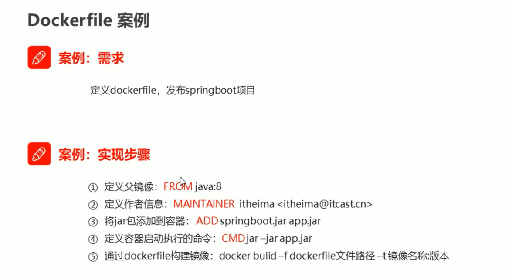
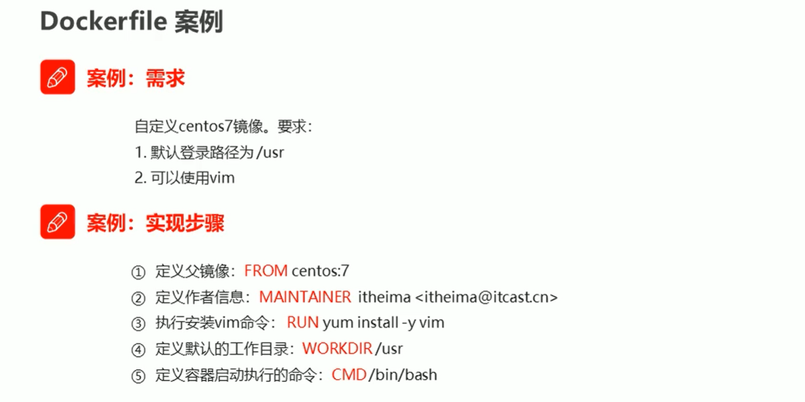

## Dockerfile


## 案例一



```
FROM openjdk:8-jdk-alpine

MAINTAINER BOBO <bobo@qq.com>

# 设置工作目录
ADD dockerfile-0.0.1-SNAPSHOT.jar app.jar

# 定义容器启动时执行的命令
CMD java -jar app.jar


docker build -f dockerfile1 -t app:v1.1 .
```

## 案例二



## 关键字

| 关键字      | 作用                     | 备注                                                                                                                        |
| ----------- | ------------------------ | --------------------------------------------------------------------------------------------------------------------------- |
| FROM        | 指定父镜像               | 指定dockerfile基于那个image构建                                                                                             |
| MAINTAINER  | 作者信息                 | 用来标明这个dockerfile谁写的                                                                                                |
| LABEL       | 标签                     | 用来标明dockerfile的标签 可以使用Label代替Maintainer 最终都是在docker image基本信息中可以查看                               |
| RUN         | 执行命令                 | 执行一段命令 默认是/bin/sh 格式: RUN command 或者 RUN ["command" , "param1","param2"]                                       |
| CMD         | 容器启动命令             | 提供启动容器时候的默认命令 和ENTRYPOINT配合使用.格式 CMD command param1 param2 或者 CMD ["command" , "param1","param2"]     |
| ENTRYPOINT  | 入口                     | 一般在制作一些执行就关闭的容器中会使用                                                                                      |
| COPY        | 复制文件                 | build的时候复制文件到image中                                                                                                |
| ADD         | 添加文件                 | build的时候添加文件到image中 不仅仅局限于当前build上下文 可以来源于远程服务                                                 |
| ENV         | 环境变量                 | 指定build时候的环境变量 可以在启动的容器的时候 通过-e覆盖 格式ENV name=value                                                |
| ARG         | 构建参数                 | 构建参数 只在构建的时候使用的参数 如果有ENV 那么ENV的相同名字的值始终覆盖arg的参数                                          |
| VOLUME      | 定义外部可以挂载的数据卷 | 指定build的image那些目录可以启动的时候挂载到文件系统中 启动容器的时候使用 -v 绑定 格式 VOLUME ["目录"]                      |
| EXPOSE      | 暴露端口                 | 定义容器运行的时候监听的端口 启动容器的使用-p来绑定暴露端口 格式: EXPOSE 8080 或者 EXPOSE 8080/udp                          |
| WORKDIR     | 工作目录                 | 指定容器内部的工作目录 如果没有创建则自动创建 如果指定/ 使用的是绝对地址 如果不是/开头那么是在上一条workdir的路径的相对路径 |
| USER        | 指定执行用户             | 指定build或者启动的时候 用户 在RUN CMD ENTRYPONT执行的时候的用户                                                            |
| HEALTHCHECK | 健康检查                 | 指定监测当前容器的健康监测的命令 基本上没用 因为很多时候 应用本身有健康监测机制                                             |
| ONBUILD     | 触发器                   | 当存在ONBUILD关键字的镜像作为基础镜像的时候 当执行FROM完成之后 会执行 ONBUILD的命令 但是不影响当前镜像 用处也不怎么大       |
| STOPSIGNAL  | 发送信号量到宿主机       | 该STOPSIGNAL指令设置将发送到容器的系统调用信号以退出。                                                                      |
| SHELL       | 指定执行脚本的shell      | 指定RUN CMD ENTRYPOINT 执行命令的时候 使用的shell                                                                           |
