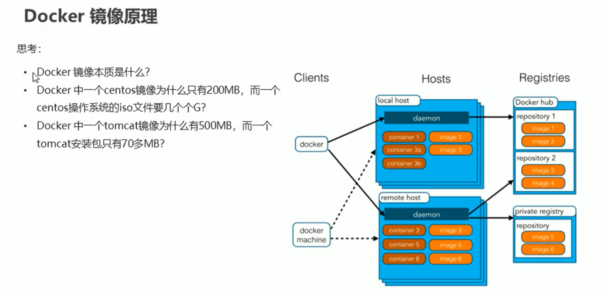
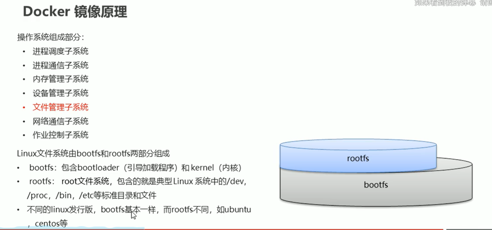
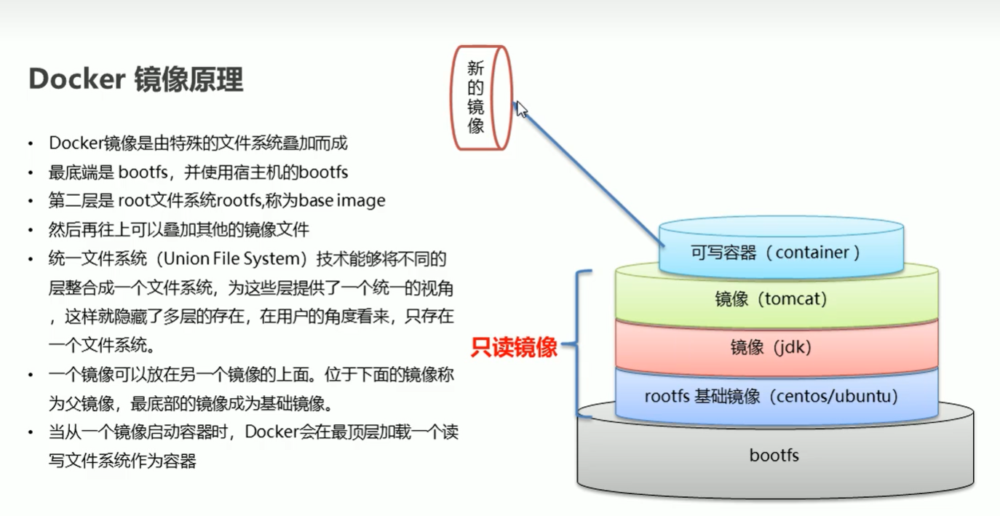
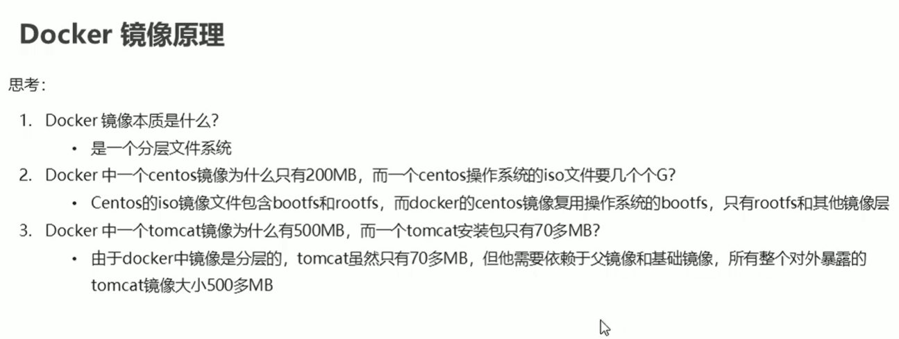

## Docker镜像原理

### Docker的生命周期组成：镜像、容器、仓库

**概括的说，Docker镜像是一个只读的Docker容器模板，含有启动Docker容器所需的文件系统结构及其内容。**

而镜像和容器之间的关系可以比作Java中类与实例之间的关系，**镜像**是一种 **构建时（build-time）结构** ，而**容器**是一种 **运行时（run-time）结构** 。

仓库则是存储镜像的地方，默认使用Docker Hub（官方仓库，也有其他第三方仓库），通过仓库将所需镜像下载到本地。

### Docker镜像的本质

在了解其本质之前，我们需要知道，Linux文件系统是由bootfs和rootfs两部分组成的：

* bootfs包含bootloader（引导加载程序）和kernel（内核）
* rootfs包含Linux系统中的/dev、/proc、/bin等标准目录和文件
* 不同的Linux发行版所使用的bootfs基本一样，而rootfs存在很大的差异（这也决定了各个发行版的特性）

Docker镜像实际上是由一种特殊的文件系统叠加而成，这种文件系统就是 **UnionFS** （联合文件系统）。

UnionFS是一种分层、轻量级且高性能的文件系统，它支持对文件系统的修改作为一次提交来一层层的叠加，同时可以将不同目录挂载到同一个虚拟文件系统中。如此，在用户看来，就只存在一个统一的文件系统。

而每一个Docker镜像的最底层都会使用宿主机的bootfs（因此无需下载这一层的镜像），第二层被称为 **基础镜像（Base Image）** ，使用rootfs，再往上可以叠加其他镜像文件。位于下面的镜像便成为 **父镜像** 。

 **容器则是Docker在镜像顶层加载的一个可读写的文件系统（新的一层）** 。而容器层 + 原本的镜像，就可以形成一个新的镜像，这时我们就可以进行镜像的Commit了。

以Tomcat为例，如图：

当我们下载Tomcat时，可以发现Docker是分层下载的，这些层是共用的。即，其他镜像的下载如果涉及到已下载过的层，那么不必重复下载，从而极大地节省了资源。这些层级的文件系统就是UnionFS，UnionFS实现了资源的 **复用** ，极大提高了资源利用率。

那么，我们可以再通过两个问题来巩固我们对Docker的理解：

* Docker中一个centos镜像为什么大小只有200M，而在VMware中一个centos的iso镜像文件大小几个G？
  因为Docker中的centos直接使用了宿主机的bootfs，下载时只需要叠加一层精简的rootfs即可。
* Docker中一个Tomcat镜像为什么有500M，而一个Tomcat安装包只有不到100M？
  因为Tomcat需要依赖基础镜像和父镜像。
