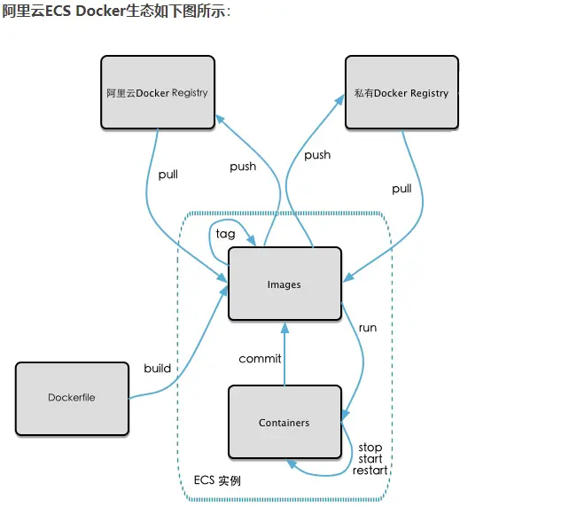
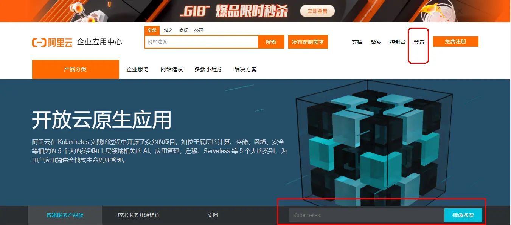
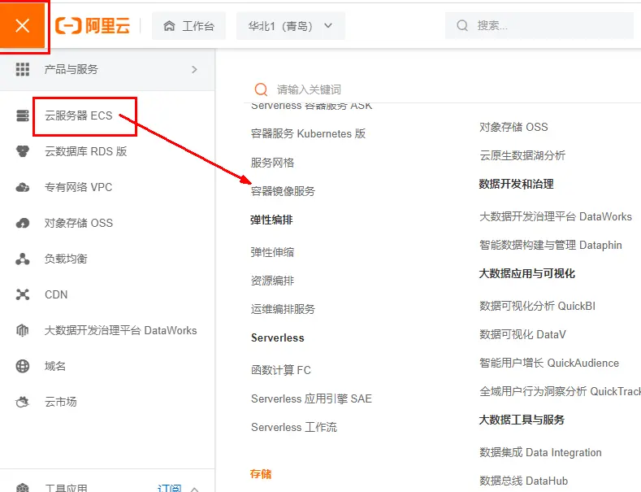
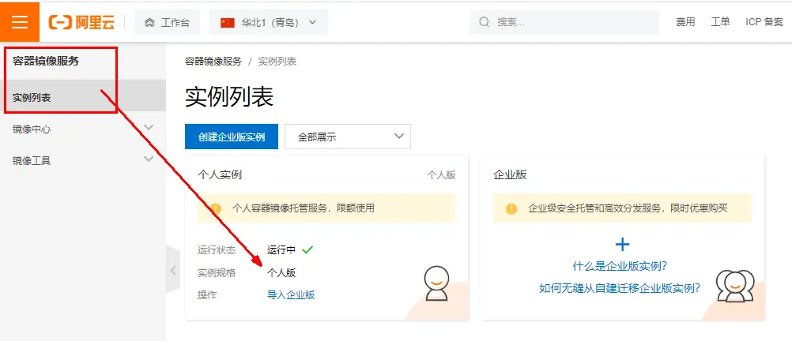
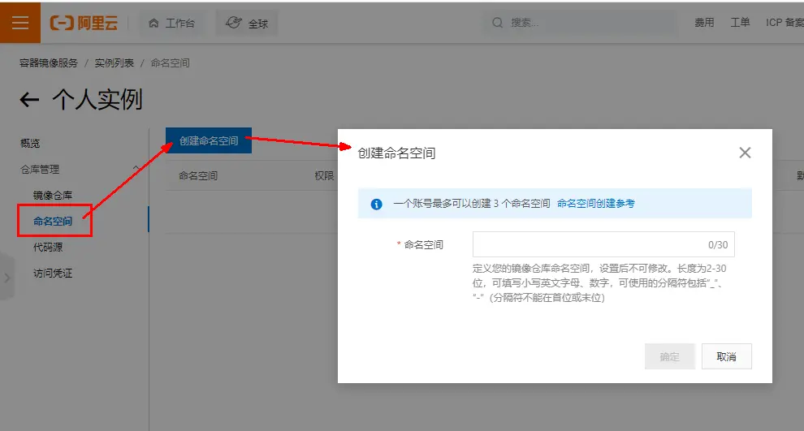
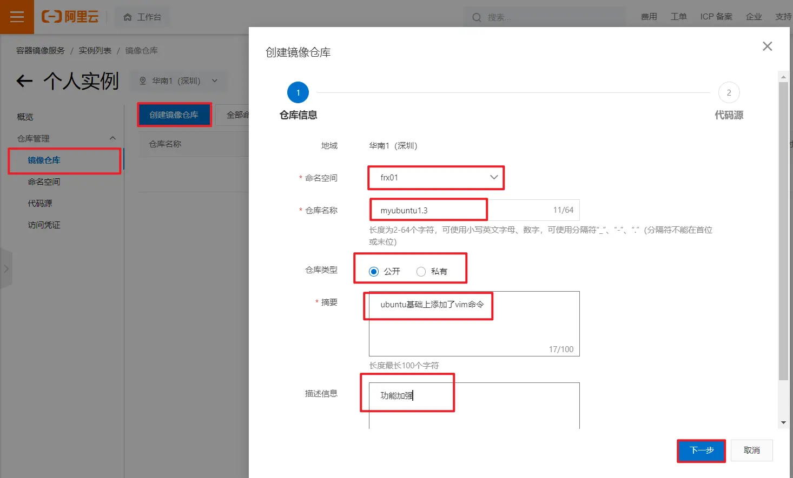
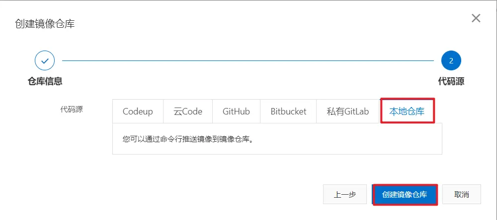
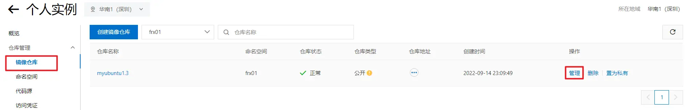
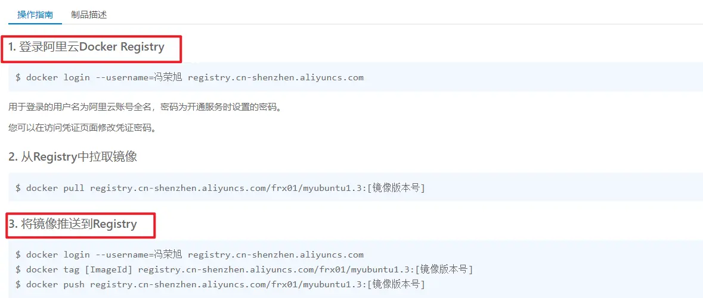
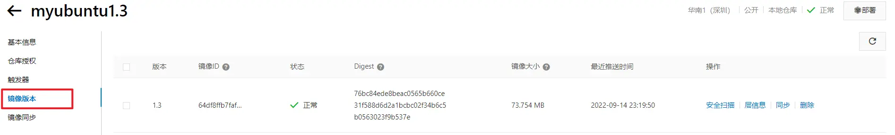

# 本地镜像发布到阿里云

## 流程



## [#](https://frxcat.fun/project-management/Docker/Local_images_are_published_to_Alibaba_Cloud/#%E9%95%9C%E5%83%8F%E7%9A%84%E7%94%9F%E6%88%90%E6%96%B9%E6%B3%95)镜像的生成方法

* 第一种：基于当前容器创建一个新的镜像，新功能增强
  * [具体步骤](https://frxcat.fun/project-management/Docker/Docker_images_principle/#docker%E9%95%9C%E5%83%8Fcommit%E6%93%8D%E4%BD%9C%E6%A1%88%E4%BE%8B)
* 第二种：DockerFile章节

## [#](https://frxcat.fun/project-management/Docker/Local_images_are_published_to_Alibaba_Cloud/#%E5%B0%86%E6%9C%AC%E5%9C%B0%E9%95%9C%E5%83%8F%E6%8E%A8%E9%80%81%E5%88%B0%E9%98%BF%E9%87%8C%E4%BA%91)将本地镜像推送到阿里云

### [#](https://frxcat.fun/project-management/Docker/Local_images_are_published_to_Alibaba_Cloud/#%E6%9C%AC%E5%9C%B0%E9%95%9C%E5%83%8F%E5%8E%9F%E5%9E%8B)本地镜像原型

```sh
[root@frx01 ~]# docker images
REPOSITORY          TAG                 IMAGE ID            CREATED             SIZE
frx01/myubuntu      1.3                 64df8ffb7faf        3 days ago          179MB
ubuntu              latest              ba6acccedd29        11 months ago       72.8MB
centos              latest              5d0da3dc9764        12 months ago       231MB
tomcat              8.5.27              a92c139758db        4 years ago         558MB
```

* 阿里云开发者平台:[https://promotion.aliyun.com/ntms/act/kubernetes.html(opens new window)](https://promotion.aliyun.com/ntms/act/kubernetes.html)



* 选择控制台，进入容器镜像服务



* 进入个人实例



* 创建命名空间



* 创建镜像仓库





* 进入管理页面获得脚本



## [#](https://frxcat.fun/project-management/Docker/Local_images_are_published_to_Alibaba_Cloud/#%E5%B0%86%E9%95%9C%E5%83%8F%E6%8E%A8%E9%80%81%E5%88%B0%E9%98%BF%E9%87%8C%E4%BA%91)将镜像推送到阿里云

* 将镜像推送到阿里云registy
* 管理页面脚本



* 执行3的命令

```sh
docker login --username=冯荣旭 registry.cn-shenzhen.aliyuncs.com
docker tag [ImageId] registry.cn-shenzhen.aliyuncs.com/frx01/myubuntu1.3:[镜像版本号]
docker push registry.cn-shenzhen.aliyuncs.com/frx01/myubuntu1.3:[镜像版本号]
```

> 密码是自己容器镜像下面的访问凭证设置的密码


> 设置image id和版本号

* 在阿里云上面查看结果



## [#](https://frxcat.fun/project-management/Docker/Local_images_are_published_to_Alibaba_Cloud/#%E5%B0%86%E9%98%BF%E9%87%8C%E4%BA%91%E7%9A%84%E9%95%9C%E5%83%8F%E4%B8%8B%E8%BD%BD%E5%88%B0%E6%9C%AC%E5%9C%B0)将阿里云的镜像下载到本地

```sh
[root@frx01 ~]# docker images
REPOSITORY                                            TAG                 IMAGE ID            CREATED             SIZE
registry.cn-shenzhen.aliyuncs.com/frx01/myubuntu1.3   1.3                 64df8ffb7faf        3 days ago          179MB
frx01/myubuntu                                        1.3                 64df8ffb7faf        3 days ago          179MB
ubuntu                                                latest              ba6acccedd29        11 months ago       72.8MB
centos                                                latest              5d0da3dc9764        12 months ago       231MB
tomcat                                                8.5.27              a92c139758db        4 years ago         558MB
[root@frx01 ~]# docker rmi -f 64df8ffb7faf
Untagged: frx01/myubuntu:1.3
Untagged: registry.cn-shenzhen.aliyuncs.com/frx01/myubuntu1.3:1.3
Untagged: registry.cn-shenzhen.aliyuncs.com/frx01/myubuntu1.3@sha256:76bc84ede8beac0565b660ce31f588d6d2a1bcbc02f34b6c5b0563023f9b537e
Deleted: sha256:64df8ffb7faf445aa2c8e0e69e67819c4abe549dae7f6ddea943b1a62588b190
Deleted: sha256:7d5069718116e4d0a0329ef44838cda33f59aefae7e97e6e403185db6d3a9a80
```

```sh
[root@frx01 ~]# docker images
REPOSITORY          TAG                 IMAGE ID            CREATED             SIZE
ubuntu              latest              ba6acccedd29        11 months ago       72.8MB
centos              latest              5d0da3dc9764        12 months ago       231MB
tomcat              8.5.27              a92c139758db        4 years ago         558MB
[root@frx01 ~]# docker pull registry.cn-shenzhen.aliyuncs.com/frx01/myubuntu1.3:1.3
1.3: Pulling from frx01/myubuntu1.3
7b1a6ab2e44d: Already exists
bc4c9551ae8d: Pull complete
Digest: sha256:76bc84ede8beac0565b660ce31f588d6d2a1bcbc02f34b6c5b0563023f9b537e
Status: Downloaded newer image for registry.cn-shenzhen.aliyuncs.com/frx01/myubuntu1.3:1.3
[root@frx01 ~]# docker images
REPOSITORY                                            TAG                 IMAGE ID            CREATED             SIZE
registry.cn-shenzhen.aliyuncs.com/frx01/myubuntu1.3   1.3                 64df8ffb7faf        3 days ago          179MB
ubuntu                                                latest              ba6acccedd29        11 months ago       72.8MB
centos                                                latest              5d0da3dc9764        12 months ago       231MB
tomcat                                                8.5.27              a92c139758db        4 years ago         558MB
[root@frx01 ~]# docker run -it 64df8ffb7faf /bin/bash
root@a7795849ec26:/# vim a.text
```
