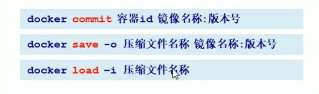

## Docker镜像commit操作案例

* docker commit提交容器副本使之成为一个新的镜像
* docker commit  -m="提交的描述信息"  -a="作者" 容器ID 要创建的目标镜像名:[标签名]
* 案例演示ubuntu安装vim
  * 从Hub上下载ubuntu镜像到本地并成功运行
  * 原始的默认Ubuntu镜像是不带着vim命令的

```sh
[root@frx01 ~]# docker run -it ubuntu /bin/bash
root@e4a6abf80ca5:/# ls
bin  boot  dev  etc  home  lib  lib32  lib64  libx32  media  mnt  opt  proc  root  run  sbin  srv  sys  tmp  usr  var
root@e4a6abf80ca5:/# vim a.txt
bash: vim: command not found
```

* 外网连通的情况下，安装vim，docker容器内执行以下两条命令：

```sh
#先更新我们的包管理工具
apt-get update
#然后安装我们需要的vim
apt-get install vim
```

* 安装完成后，commit我们自己的新镜像

```sh
[root@frx01 ~]# docker ps
CONTAINER ID        IMAGE               COMMAND             CREATED             STATUS              PORTS               NAMES
e4a6abf80ca5        ubuntu              "/bin/bash"         21 minutes ago      Up 21 minutes                           nostalgic_mclaren
[root@frx01 ~]# docker commit -m="add vim cmd" -a="frx" e4a6abf80ca5 frx01/myubuntu:1.3
sha256:64df8ffb7faf445aa2c8e0e69e67819c4abe549dae7f6ddea943b1a62588b190
```

* 启动我们的新镜像并和原来的对比

```sh
[root@frx01 ~]# docker images
REPOSITORY          TAG                 IMAGE ID            CREATED             SIZE
frx01/myubuntu      1.3                 64df8ffb7faf        40 seconds ago      179MB
ubuntu              latest              ba6acccedd29        11 months ago       72.8MB
centos              latest              5d0da3dc9764        12 months ago       231MB
tomcat              8.5.27              a92c139758db        4 years ago         558MB
```

1. 官网是默认下载的Ubuntu没有vim命令
2. 我们自己commit构建的镜像，新增加了vim功能，可以成功使用。

小总结

Docker中的镜像分层， **支持通过扩展现有镜像，创建新的镜像** 。类似Java继承于一个Base基础类，自己再按需扩展。

新镜像是从 base 镜像一层一层叠加生成的。每安装一个软件，就在现有镜像的基础上增加一层。

## 将镜像提供给其他人使用（精简版）


