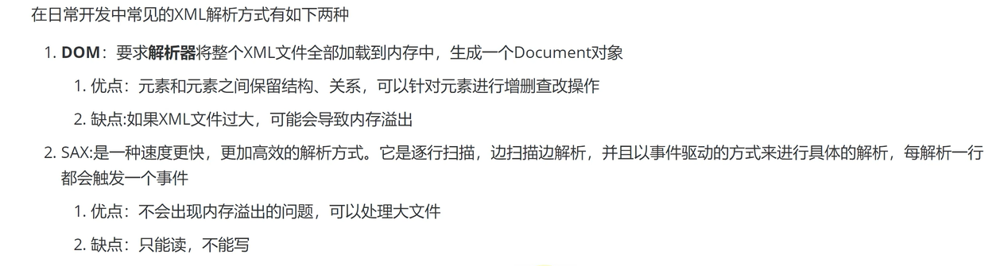

# dom4j

## 解析方式介绍




## 使用dom4j解析xml

### 添加依赖

```xml
<dependency>
      <groupId>org.dom4j</groupId>
      <artifactId>dom4j</artifactId>
      <version>2.1.4</version>
    </dependency>
```

### 解析xml步骤

1. 创建解析器对象
2. 使用解析器对象读取xml文档生成Document对象
3. 根据Document获取元素信息

### 重要api说明

1. 创建解析器对象

```java
SAXReader saxReader = new SAXReader();
Doucoment document = saxReader.read(Test.class.getClassLoader().getResource("user.xml");//Test.class（测试类），user.xml需要解析的xml文件
```

2. org.dom4j.Docunmen常用方法

```java
Element getRootElement();//获取根节点
String getName();//返回标签的名称
List<Element> elements();// 获取标签的子标签
String attributeValue(String name);//获取指定属性
String getText();//获取标签的文本
Element element(String name);//获取第一个指定子标签
String elementText(String name);//获取指定名称的自标签的文本，返回子标签文本的值
```

**总结：这样的方法一层层解析，一层层for循环，一个个去拿值，十分的麻烦不够灵活。所以就要使用下面的XPath进行xml的解析。**

## dom4j结合XPath解析XML

XPath可以使用**路径表达式**来选取XML文档中的元素或者属性节点，节点是沿着**路径**来选取的。

XPath的官方文档地址：https://zvon.org/xxl/XPathTutorial/General_chi/examples.html

### dom4j集成XPath

```xml
<dependency>
      <groupId>jaxen</groupId>
      <artifactId>jaxen</artifactId>
      <version>1.2.0</version>
    </dependency>
```

### dom4j提供基于XPath的API

Doucument/Element关于XPath的api

```java
Node selectSingleNode(String xpathExpression);//根据XPath获取单个标签(元素/节点)。
List<Node> selectNodes(String xpathExpression);//根据XPath获取多个标签(元素/节点)
```

期望Node向下转型为Element

### XPath的语法

1. 绝对路径表示方式：**以/开头**的路径表示绝对路径，绝对路径是从根元素开始写。
   例如：元素/子元素/子子元素…
2. 相对路径方式：相对于当前节点的元素继续查找的节点， **不以/开头** ， **…/表示上一个元素** ， **./表示当前元素** 。
3. 全文搜索路径方式：**//表示无论中间有多少层，直接获取所有子元素满足条件的元素。
   /表示只找一层。**
   例如：//子元素，//子元素//子子元素，//子元素/子子元素。
4. 谓语(条件筛选)形式 例如：**//元素[@attr1=‘value’]**
