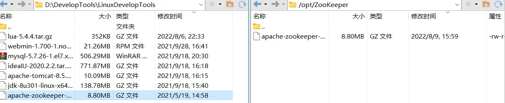
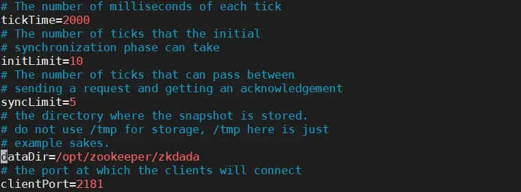
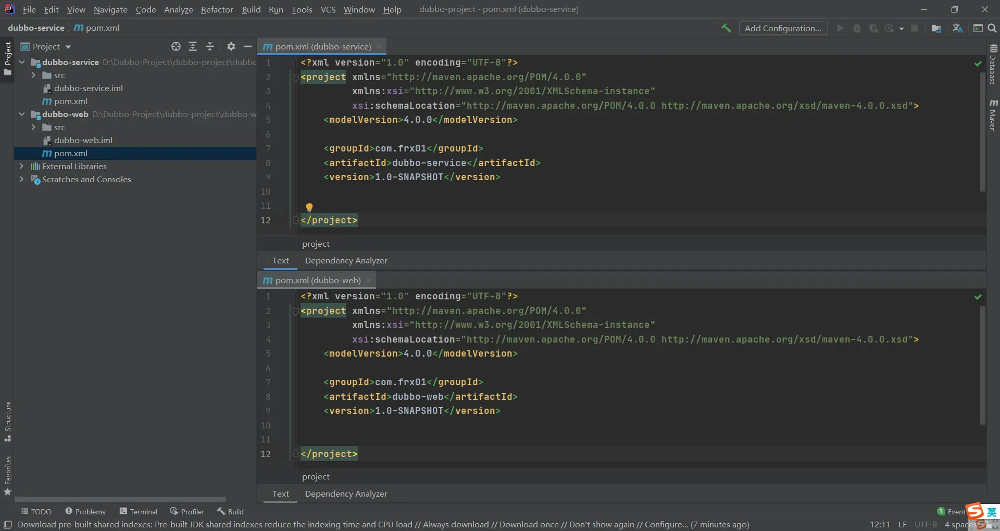
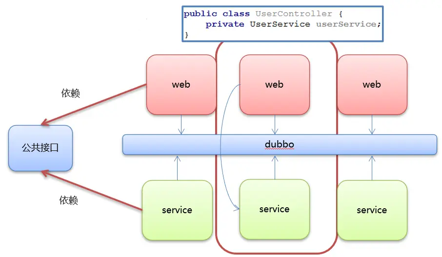
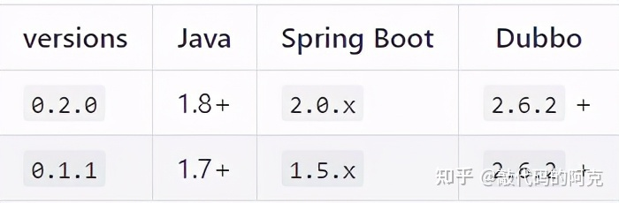
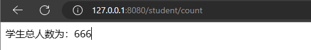

# Dubbo 快速入门

## Zookeeper安装

* Dubbo官方推荐使用Zookeeper作为注册中心

### [#](https://frxcat.fun/middleware/Dubbo/Dubbo_Geting_start/#%E4%B8%8B%E8%BD%BD%E5%AE%89%E8%A3%85)下载安装

ZooKeeper服务器是用Java创建的，它运行在JVM之上。需要安装JDK 7或更高版本。

* [Zookeeper下载地址(opens new window)](https://zookeeper.apache.org/releases.html)
* 将下载的ZooKeeper放到/opt/ZooKeeper目录下

```sh
mkdir /opt/ZooKeeper
```

* 使用XFTP工具将压缩包传输到Linux系统



* 将tar包解压到/opt/zookeeper目录下

```sh
mkdir /opt/zookeeper
tar -zxvf apache-zookeeper-3.5.6-bin.tar.gz -C /opt/zookeeper
```

### [#](https://frxcat.fun/middleware/Dubbo/Dubbo_Geting_start/#%E9%85%8D%E7%BD%AE%E5%90%AF%E5%8A%A8)配置启动

#### [#](https://frxcat.fun/middleware/Dubbo/Dubbo_Geting_start/#%E9%85%8D%E7%BD%AEzoo-cfg)配置zoo.cfg

进入到conf目录拷贝一个zoo_sample.cfg并完成配置

```sh
cd /opt/zookeeper/apache-zookeeper-3.5.6-bin/conf && ls
#拷贝
cp  zoo_sample.cfg  zoo.cfg
```

* 创建zk存储目录

```sh
mkdir /opt/zookeeper/zkdada
```

* 修改zoo.cfg

```sh
#修改zoo.cfg
vim /opt/zookeeper/apache-zooKeeper-3.5.6-bin/conf/zoo.cfg
```

 

修改存储目录：dataDir=/opt/zookeeper/zkdata

#### [#](https://frxcat.fun/middleware/Dubbo/Dubbo_Geting_start/#%E5%90%AF%E5%8A%A8zookeeper)启动ZooKeeper

```sh
cd /opt/zookeeper/apache-zooKeeper-3.5.6-bin/bin/
#启动
 ./zkServer.sh  start
```

```sh
[root@master bin]# ./zkServer.sh start
ZooKeeper JMX enabled by default
Using config: /opt/zookeeper/apache-zookeeper-3.5.6-bin/bin/../conf/zoo.cfg
Starting zookeeper ... STARTED
```

> STARTED表示zk启动成功

#### [#](https://frxcat.fun/middleware/Dubbo/Dubbo_Geting_start/#%E6%9F%A5%E7%9C%8Bzookeeper%E7%8A%B6%E6%80%81)查看ZooKeeper状态

```sh
./zkServer.sh status
```

```sh
[root@master bin]# ./zkServer.sh status
ZooKeeper JMX enabled by default
Using config: /opt/zookeeper/apache-zookeeper-3.5.6-bin/bin/../conf/zoo.cfg
Client port found: 2181. Client address: localhost.
Mode: standalone
```

> zookeeper启动成功。standalone代表zk没有搭建集群，现在是单节点

```sh
[root@master bin]# ./zkServer.sh status
ZooKeeper JMX enabled by default
Using config: /opt/zookeeper/apache-zookeeper-3.5.6-bin/bin/../conf/zoo.cfg
Client port found: 2181. Client address: localhost.
Error contacting service. It is probably not running.
```

> (not running),zookeeper没有启动

* 关闭ZooKeeper

```sh
./zkServer.sh stop
```

## [#](https://frxcat.fun/middleware/Dubbo/Dubbo_Geting_start/#%E5%88%9B%E5%BB%BA%E5%B7%A5%E7%A8%8B)创建工程MVC



### [#](https://frxcat.fun/middleware/Dubbo/Dubbo_Geting_start/#%E9%85%8D%E7%BD%AEdubbo-web%E7%9A%84pom-xml)配置dubbo-web的pom.xml

```xml
<?xml version="1.0" encoding="UTF-8"?>
<project xmlns="http://maven.apache.org/POM/4.0.0"
         xmlns:xsi="http://www.w3.org/2001/XMLSchema-instance"
         xsi:schemaLocation="http://maven.apache.org/POM/4.0.0 http://maven.apache.org/xsd/maven-4.0.0.xsd">
    <modelVersion>4.0.0</modelVersion>

    <groupId>com.frx01</groupId>
    <artifactId>dubbo-web</artifactId>
    <version>1.0-SNAPSHOT</version>
	<packaging>war</packaging>

    <properties>
        <spring.version>5.1.9.RELEASE</spring.version>
        <dubbo.version>2.7.4.1</dubbo.version>
        <zookeeper.version>4.0.0</zookeeper.version>

    </properties>

    <dependencies>
        <!-- servlet3.0规范的坐标 -->
        <dependency>
            <groupId>javax.servlet</groupId>
            <artifactId>javax.servlet-api</artifactId>
            <version>3.1.0</version>
            <scope>provided</scope>
        </dependency>
        <!--spring的坐标-->
        <dependency>
            <groupId>org.springframework</groupId>
            <artifactId>spring-context</artifactId>
            <version>${spring.version}</version>
        </dependency>
        <!--springmvc的坐标-->
        <dependency>
            <groupId>org.springframework</groupId>
            <artifactId>spring-webmvc</artifactId>
            <version>${spring.version}</version>
        </dependency>

        <!--日志-->
        <dependency>
            <groupId>org.slf4j</groupId>
            <artifactId>slf4j-api</artifactId>
            <version>1.7.21</version>
        </dependency>
        <dependency>
            <groupId>org.slf4j</groupId>
            <artifactId>slf4j-log4j12</artifactId>
            <version>1.7.21</version>
        </dependency>

        <!--Dubbo的起步依赖，版本2.7之后统一为rg.apache.dubb -->
        <dependency>
            <groupId>org.apache.dubbo</groupId>
            <artifactId>dubbo</artifactId>
            <version>${dubbo.version}</version>
        </dependency>
        <!--ZooKeeper客户端实现 -->
        <dependency>
            <groupId>org.apache.curator</groupId>
            <artifactId>curator-framework</artifactId>
            <version>${zookeeper.version}</version>
        </dependency>
        <!--ZooKeeper客户端实现 -->
        <dependency>
            <groupId>org.apache.curator</groupId>
            <artifactId>curator-recipes</artifactId>
            <version>${zookeeper.version}</version>
        </dependency>
        <!--依赖service模块-->
        <dependency>
            <groupId>com.frx01</groupId>
            <artifactId>dubbo-service</artifactId>
            <version>1.0-SNAPSHOT</version>
        </dependency>

    </dependencies>
  
    <build>
        <plugins>
            <!--tomcat插件-->
            <plugin>
                <groupId>org.apache.tomcat.maven</groupId>
                <artifactId>tomcat7-maven-plugin</artifactId>
                <version>2.1</version>
                <configuration>
                    <port>8000</port>
                    <path>/</path>
                </configuration>
            </plugin>
        </plugins>
    </build>
</project>
```

### [#](https://frxcat.fun/middleware/Dubbo/Dubbo_Geting_start/#%E9%85%8D%E7%BD%AEdubbo-service%E7%9A%84pom-xml)配置dubbo-service的pom.xml

```xml
<?xml version="1.0" encoding="UTF-8"?>
<project xmlns="http://maven.apache.org/POM/4.0.0"
         xmlns:xsi="http://www.w3.org/2001/XMLSchema-instance"
         xsi:schemaLocation="http://maven.apache.org/POM/4.0.0 http://maven.apache.org/xsd/maven-4.0.0.xsd">
    <modelVersion>4.0.0</modelVersion>

    <groupId>com.frx01</groupId>
    <artifactId>dubbo-service</artifactId>
    <version>1.0-SNAPSHOT</version>


    <properties>
        <spring.version>5.1.9.RELEASE</spring.version>
        <dubbo.version>2.7.4.1</dubbo.version>
        <zookeeper.version>4.0.0</zookeeper.version>

    </properties>

    <dependencies>
        <!-- servlet3.0规范的坐标 -->
        <dependency>
            <groupId>javax.servlet</groupId>
            <artifactId>javax.servlet-api</artifactId>
            <version>3.1.0</version>
            <scope>provided</scope>
        </dependency>
        <!--spring的坐标-->
        <dependency>
            <groupId>org.springframework</groupId>
            <artifactId>spring-context</artifactId>
            <version>${spring.version}</version>
        </dependency>
        <!--springmvc的坐标-->
        <dependency>
            <groupId>org.springframework</groupId>
            <artifactId>spring-webmvc</artifactId>
            <version>${spring.version}</version>
        </dependency>

        <!--日志-->
        <dependency>
            <groupId>org.slf4j</groupId>
            <artifactId>slf4j-api</artifactId>
            <version>1.7.21</version>
        </dependency>
        <dependency>
            <groupId>org.slf4j</groupId>
            <artifactId>slf4j-log4j12</artifactId>
            <version>1.7.21</version>
        </dependency>

        <!--Dubbo的起步依赖，版本2.7之后统一为rg.apache.dubb -->
        <dependency>
            <groupId>org.apache.dubbo</groupId>
            <artifactId>dubbo</artifactId>
            <version>${dubbo.version}</version>
        </dependency>
        <!--ZooKeeper客户端实现 -->
        <dependency>
            <groupId>org.apache.curator</groupId>
            <artifactId>curator-framework</artifactId>
            <version>${zookeeper.version}</version>
        </dependency>
        <!--ZooKeeper客户端实现 -->
        <dependency>
            <groupId>org.apache.curator</groupId>
            <artifactId>curator-recipes</artifactId>
            <version>${zookeeper.version}</version>
        </dependency>
    </dependencies>
</project>
```

### [#](https://frxcat.fun/middleware/Dubbo/Dubbo_Geting_start/#%E9%85%8D%E7%BD%AElog4j-properties)配置log4j.properties

```properties
# DEBUG < INFO < WARN < ERROR < FATAL
# Global logging configuration
log4j.rootLogger=info, stdout,file
# My logging configuration...
#log4j.logger.com.tocersoft.school=DEBUG
#log4j.logger.net.sf.hibernate.cache=debug
## Console output...
log4j.appender.stdout=org.apache.log4j.ConsoleAppender
log4j.appender.stdout.layout=org.apache.log4j.PatternLayout
log4j.appender.stdout.layout.ConversionPattern=%5p %d %C: %m%n

log4j.appender.file=org.apache.log4j.FileAppender
log4j.appender.file.File=../logs/iask.log
log4j.appender.file.layout=org.apache.log4j.PatternLayout
log4j.appender.file.layout.ConversionPattern=%d{yyyy-MM-dd HH:mm:ss}  %l  %m%n
```

### [#](https://frxcat.fun/middleware/Dubbo/Dubbo_Geting_start/#%E5%88%9B%E5%BB%BAdubbo-web%E7%9A%84service%E7%9A%84%E6%8E%A5%E5%8F%A3%E5%8F%8A%E5%AE%9E%E7%8E%B0%E7%B1%BB)创建dubbo-web的Service的接口及实现类

* 接口

```java
public interface UserService {

    public String sayHello();
}
```

* 实现类

```java
@Service
public class UserServiceImpl implements UserService {
    @Override
    public String sayHello() {
        return "hello,dubbo~";
    }
}
```

### [#](https://frxcat.fun/middleware/Dubbo/Dubbo_Geting_start/#%E9%85%8D%E7%BD%AEdubbo-web%E7%9A%84spring%E6%A0%B8%E5%BF%83%E9%85%8D%E7%BD%AE%E6%96%87%E4%BB%B6)配置dubbo-web的spring核心配置文件

```xml
<?xml version="1.0" encoding="UTF-8"?>
<beans xmlns="http://www.springframework.org/schema/beans"
	   xmlns:xsi="http://www.w3.org/2001/XMLSchema-instance"
	   xmlns:dubbo="http://dubbo.apache.org/schema/dubbo" xmlns:context="http://www.springframework.org/schema/context"
	   xsi:schemaLocation="http://www.springframework.org/schema/beans http://www.springframework.org/schema/beans/spring-beans.xsd
        http://dubbo.apache.org/schema/dubbo http://dubbo.apache.org/schema/dubbo/dubbo.xsd http://www.springframework.org/schema/context https://www.springframework.org/schema/context/spring-context.xsd">

	<context:component-scan base-package="com.frx01.service"/>
</beans>
```

### [#](https://frxcat.fun/middleware/Dubbo/Dubbo_Geting_start/#%E9%85%8D%E7%BD%AEdubbo-service%E7%9A%84web-xml)配置dubbo-service的web.xml

```xml
<?xml version="1.0" encoding="UTF-8"?>
<web-app xmlns:xsi="http://www.w3.org/2001/XMLSchema-instance"
         xmlns="http://java.sun.com/xml/ns/javaee"
         xsi:schemaLocation="http://java.sun.com/xml/ns/javaee http://java.sun.com/xml/ns/javaee/web-app_2_5.xsd"
         version="2.5">

		 
	<!-- spring -->
    <context-param>
        <param-name>contextConfigLocation</param-name>
        <param-value>classpath*:spring/applicationContext*.xml</param-value>
    </context-param>
    <listener>
        <listener-class>org.springframework.web.context.ContextLoaderListener</listener-class>
    </listener>
		 
	<!-- Springmvc -->	 
    <servlet>
        <servlet-name>springmvc</servlet-name>
        <servlet-class>org.springframework.web.servlet.DispatcherServlet</servlet-class>
        <!-- 指定加载的配置文件 ，通过参数contextConfigLocation加载-->
        <init-param>
            <param-name>contextConfigLocation</param-name>
            <param-value>classpath:spring/springmvc.xml</param-value>
        </init-param>
    </servlet>

    <servlet-mapping>
        <servlet-name>springmvc</servlet-name>
        <url-pattern>*.do</url-pattern>
    </servlet-mapping>

</web-app>
```

### [#](https://frxcat.fun/middleware/Dubbo/Dubbo_Geting_start/#%E5%88%9B%E5%BB%BAdubbo-web%E7%9A%84controller)创建dubbo-web的Controller

```java
@RestController
@RequestMapping("/user")
public class UserController {

    @Autowired
    private UserService userService;

    @RequestMapping("/sayHello")
    public String sayHello(){
        return userService.sayHello();
    }
}
```

### [#](https://frxcat.fun/middleware/Dubbo/Dubbo_Geting_start/#%E9%85%8D%E7%BD%AEdubbo-service%E7%9A%84springmvc%E9%85%8D%E7%BD%AE%E6%96%87%E4%BB%B6)配置dubbo-service的springmvc配置文件

```xml
<?xml version="1.0" encoding="UTF-8"?>
<beans xmlns="http://www.springframework.org/schema/beans"
       xmlns:xsi="http://www.w3.org/2001/XMLSchema-instance"
       xmlns:dubbo="http://dubbo.apache.org/schema/dubbo"
       xmlns:mvc="http://www.springframework.org/schema/mvc"
       xmlns:context="http://www.springframework.org/schema/context"
       xsi:schemaLocation="http://www.springframework.org/schema/beans http://www.springframework.org/schema/beans/spring-beans.xsd
        http://www.springframework.org/schema/mvc http://www.springframework.org/schema/mvc/spring-mvc.xsd
         http://dubbo.apache.org/schema/dubbo http://dubbo.apache.org/schema/dubbo/dubbo.xsd http://www.springframework.org/schema/context https://www.springframework.org/schema/context/spring-context.xsd">

    <mvc:annotation-driven/>
    <context:component-scan base-package="com.frx01.controller"/>

</beans>
```

## [#](https://frxcat.fun/middleware/Dubbo/Dubbo_Geting_start/#%E6%B5%8B%E8%AF%95)测试

* 因为dubbo-service被dubbo-web所依赖，我们需要先 `install`dubbo-service这个项目。
* 启动dubbo-web
* 结果


> 目前此项目，仍然是单体项目

## [#](https://frxcat.fun/middleware/Dubbo/Dubbo_Geting_start/#dubbo-%E5%BC%95%E5%85%A5)Dubbo 引入MVC



### [#](https://frxcat.fun/middleware/Dubbo/Dubbo_Geting_start/#%E6%9C%8D%E5%8A%A1%E6%8F%90%E4%BE%9B%E8%80%85)服务提供者

> 在dubbo-service的pom.xml文件中引入tomcat插件，并修改打包方式为war

### [#](https://frxcat.fun/middleware/Dubbo/Dubbo_Geting_start/#%E4%BF%AE%E6%94%B9userserviceimpl-java)修改UserServiceImpl.java

```java
package com.frx01.service.impl;

import com.frx01.service.UserService;
import org.apache.dubbo.config.annotation.Service;

@Service//将这这类提供的方法(服务)对外发布，将访问的地址,ip,端口,路径注册到注册中心中
public class UserServiceImpl implements UserService {
    @Override
    public String sayHello() {
        return "hello,dubbo~";
    }
}
```

### [#](https://frxcat.fun/middleware/Dubbo/Dubbo_Geting_start/#%E4%BF%AE%E6%94%B9dubbo-server%E7%9A%84application-xml)修改dubbo-server的application.xml

```xml
<?xml version="1.0" encoding="UTF-8"?>
<beans xmlns="http://www.springframework.org/schema/beans"
	   xmlns:xsi="http://www.w3.org/2001/XMLSchema-instance"
	   xmlns:dubbo="http://dubbo.apache.org/schema/dubbo" xmlns:context="http://www.springframework.org/schema/context"
	   xsi:schemaLocation="http://www.springframework.org/schema/beans http://www.springframework.org/schema/beans/spring-beans.xsd
        http://dubbo.apache.org/schema/dubbo http://dubbo.apache.org/schema/dubbo/dubbo.xsd http://www.springframework.org/schema/context https://www.springframework.org/schema/context/spring-context.xsd">

	<!--<context:component-scan base-package="com.frx01.service"/>-->
	<!--dubbo的配置-->
	<!--1.项目的名称-->
	<dubbo:application name="dubbo-service"/>
	<!--2.配置一下注册中心的地址-->
	<dubbo:registry address="zookeeper://192.168.91.200:2181"/>
	<!--3.配置dubbo包扫描-->
	<dubbo:annotation package="com.frx01.service.impl"/>
</beans>
```

### [#](https://frxcat.fun/middleware/Dubbo/Dubbo_Geting_start/#%E4%BF%AE%E6%94%B9dubbo-server%E7%9A%84web-xml)修改dubbo-server的web.xml

```xml
<?xml version="1.0" encoding="UTF-8"?>
<web-app xmlns:xsi="http://www.w3.org/2001/XMLSchema-instance"
         xmlns="http://java.sun.com/xml/ns/javaee"
         xsi:schemaLocation="http://java.sun.com/xml/ns/javaee http://java.sun.com/xml/ns/javaee/web-app_2_5.xsd"
         version="2.5">


	<!-- spring -->
    <context-param>
        <param-name>contextConfigLocation</param-name>
        <param-value>classpath*:spring/applicationContext*.xml</param-value>
    </context-param>
    <listener>
        <listener-class>org.springframework.web.context.ContextLoaderListener</listener-class>
    </listener>
    <!-- 删去springmvc的配置 -->

</web-app>
```

### [#](https://frxcat.fun/middleware/Dubbo/Dubbo_Geting_start/#%E6%9C%8D%E5%8A%A1%E6%B6%88%E8%B4%B9%E8%80%85)服务消费者

> 删除dubbo-web的pom.xml的dubbo-service模块依赖
>
> 删除web.xml的spring配置

### [#](https://frxcat.fun/middleware/Dubbo/Dubbo_Geting_start/#%E4%BF%AE%E6%94%B9dubbo-web%E7%9A%84%E6%8E%A7%E5%88%B6%E5%99%A8)修改dubbo-web的控制器

```java
import com.frx01.service.UserService;
import org.apache.dubbo.config.annotation.Reference;
import org.springframework.beans.factory.annotation.Autowired;
import org.springframework.web.bind.annotation.RequestMapping;
import org.springframework.web.bind.annotation.RestController;

/**
 * @author frx
 * @version 1.0
 * @date 2022/8/9  17:45
 */
@RestController
@RequestMapping("/user")
public class UserController {

    /**
     * 1.从zookeeper注册中心获取userService的访问url
     * 2.远程的调用RPC
     * 3.将结果封装为代理的对象，给变量赋值
     */
    @Reference //远程注入
    private UserService userService;

    @RequestMapping("/sayHello")
    public String sayHello(){
        return userService.sayHello();
    }
}
```

### [#](https://frxcat.fun/middleware/Dubbo/Dubbo_Geting_start/#%E4%BF%AE%E6%94%B9dubbo-web%E9%A1%B9%E7%9B%AE%E7%9A%84springmvc-xml)修改dubbo-web项目的springmvc.xml

```xml
<?xml version="1.0" encoding="UTF-8"?>
<beans xmlns="http://www.springframework.org/schema/beans"
       xmlns:xsi="http://www.w3.org/2001/XMLSchema-instance"
       xmlns:dubbo="http://dubbo.apache.org/schema/dubbo"
       xmlns:mvc="http://www.springframework.org/schema/mvc"
       xmlns:context="http://www.springframework.org/schema/context"
       xsi:schemaLocation="http://www.springframework.org/schema/beans http://www.springframework.org/schema/beans/spring-beans.xsd
        http://www.springframework.org/schema/mvc http://www.springframework.org/schema/mvc/spring-mvc.xsd
         http://dubbo.apache.org/schema/dubbo http://dubbo.apache.org/schema/dubbo/dubbo.xsd http://www.springframework.org/schema/context https://www.springframework.org/schema/context/spring-context.xsd">

    <mvc:annotation-driven/>
    <context:component-scan base-package="com.frx01.controller"/>
    <!--dubbo的配置-->
    <!--1.项目的名称-->
    <dubbo:application name="dubbo-web"/>
    <!--2.配置一下注册中心的地址-->
    <dubbo:registry address="zookeeper://192.168.91.200:2181"/>
    <!--3.配置dubbo包扫描-->
    <dubbo:annotation package="com.frx01.controller"/>

</beans>
```

### [#](https://frxcat.fun/middleware/Dubbo/Dubbo_Geting_start/#%E6%B7%BB%E5%8A%A0%E6%A8%A1%E5%9D%97dubbo-interface)添加模块dubbo-interface

* 将UserService接口抽取出来放入dubbo-interface模块
* 在dubbo-service和dubbo-web模块中引入dubbo-interface模块

```xml
        <dependency>
            <groupId>com.frx01</groupId>
            <artifactId>dubbo-interface</artifactId>
            <version>1.0-SNAPSHOT</version>
        </dependency>
```

### [#](https://frxcat.fun/middleware/Dubbo/Dubbo_Geting_start/#test)Test

* 将dubbo-interface模块进行 `install`
* 启动dubbo-service

<details class="custom-block details"><summary>控制台输出</summary>

```java

```

* 启动dubbo-web

<details class="custom-block details"><summary>控制台输出</summary>

```java

```

* 访问[http://localhost:8000/user/sayHello.do(opens new window)](http://localhost:8000/user/sayHello.do)


## Dubbo springboot

首先了话，仍然需要三个工程。

* 接口工程：存放实体bean和业务接口
* 服务提供者：业务接口的实现类，同时将服务暴露，注册到注册中心zookeeper，调用数据持久层（dao）

  a. pom文件中添加依赖（dubbo、注册中心[zookeeper](https://so.csdn.net/so/search?q=zookeeper&spm=1001.2101.3001.7020)、接口工程）

  b. 配置服务提供者的dubbo核心配置文件。
* 服务消费者：处理浏览器客户端发来的请求，从注册中心调用服务提供者所提供的服务。

  a. pom文件中添加依赖（dubbo、注册中心zookeeper、接口工程）

  b. 配置服务消费者的dubbo核心配置文件。



### 父工程

```xml
<properties>
        <project.build.sourceEncoding>UTF-8</project.build.sourceEncoding>
        <project.reporting.outputEncoding>UTF-8</project.reporting.outputEncoding>
        <java.version>1.8</java.version>
        <zookeeper.version>3.5.6</zookeeper.version>
        <dubbo.starter.version>2.0.0</dubbo.starter.version>
    </properties>
```

### dubbo-interface 接口提供

#### service

```java
public interface StudentService {

    Integer queryAllStudentCount();

}
```

### dubbo-service 服务提供

#### pom

```xml
<dependencies>
        <dependency>
            <groupId>org.springframework.boot</groupId>
            <artifactId>spring-boot-starter</artifactId>
        </dependency>

        <dependency>
            <groupId>org.springframework.boot</groupId>
            <artifactId>spring-boot-starter-test</artifactId>
            <scope>test</scope>
        </dependency>
        <dependency>
            <groupId>com.example</groupId>
            <artifactId>dubbo-interface</artifactId>
            <version>0.0.1-SNAPSHOT</version>
        </dependency>
        <dependency>
            <groupId>com.101tec</groupId>
            <artifactId>zkclient</artifactId>
            <version>0.4</version>
        </dependency>
        <dependency>
            <groupId>org.apache.zookeeper</groupId>
            <artifactId>zookeeper</artifactId>
            <version>${zookeeper.version}</version>
        </dependency>
        <!-- Dubbo集成SpringBoot框架的起步依赖 -->
        <dependency>
            <groupId>com.alibaba.spring.boot</groupId>
            <artifactId>dubbo-spring-boot-starter</artifactId>
            <version>${dubbo.starter.version}</version>
        </dependency>
    </dependencies>
```

#### 配置

```properties
# 配置内嵌tomcat的端口号和上下文跟
server.port=8081
server.servlet.context-path=/

# 配置Dubbo
# 声明dubbo服务提供者的名称：保证唯一性
# spring.application.name=dubbo-service
spring.dubbo.application.name=dubbo-service
#设置访问服务的协议及端口号，dubbo官方推荐使用的是dubbo协议，端口号默认20880
spring.dubbo.protocol.name=dubbo
#需要唯一，否则后续会有冲突
spring.dubbo.protocol.port=20880
# 当前工程是一个服务提供者
spring.dubbo.server=true
# 设置注册中心的地址端口号
spring.dubbo.registry=zookeeper://192.168.182.130:2181
```

#### StudentServiceImpl

dubbo提供了@Service注解**来暴露服务**，可将类声明为提供方，省去了大量配置的麻烦

```java
@Component
@Service(interfaceClass = StudentService.class, version = "1.0.0", timeout = 15000)
public class StudentServiceImpl implements StudentService {
  @Override
  public Integer queryAllStudentCount() {
    return 666;
  }

}
```

#### 启动类

```java
@SpringBootApplication
@EnableDubboConfiguration //开启Dubbo注解配置
public class DubboServiceApplication {

  public static void main(String[] args) {
    SpringApplication.run(DubboServiceApplication.class, args);
  }

}
```

### dubbo-web 服务消费

#### pom

```xml
<dependencies>
        <dependency>
            <groupId>org.springframework.boot</groupId>
            <artifactId>spring-boot-starter</artifactId>
        </dependency>

        <dependency>
            <groupId>org.springframework.boot</groupId>
            <artifactId>spring-boot-starter-test</artifactId>
            <scope>test</scope>
        </dependency>
        <dependency>
            <groupId>com.101tec</groupId>
            <artifactId>zkclient</artifactId>
            <version>0.4</version>
        </dependency>
        <dependency>
            <groupId>com.example</groupId>
            <artifactId>dubbo-interface</artifactId>
            <version>0.0.1-SNAPSHOT</version>
        </dependency>
        <dependency>
            <groupId>org.apache.zookeeper</groupId>
            <artifactId>zookeeper</artifactId>
            <version>${zookeeper.version}</version>
        </dependency>
        <!-- Dubbo集成SpringBoot框架的起步依赖 -->
        <dependency>
            <groupId>com.alibaba.spring.boot</groupId>
            <artifactId>dubbo-spring-boot-starter</artifactId>
            <version>${dubbo.starter.version}</version>
        </dependency>
    </dependencies>
```

#### 配置

```properties
# 配置内嵌tomcat的端口号和上下文跟
server.port=8080
server.servlet.context-path=/

# 配置Dubbo
# 声明dubbo服务消费者的名称：保证唯一性
spring.application.name=dubbo-web
# 设置注册中心的地址端口号
spring.dubbo.registry=zookeeper://192.168.182.130:2181
```

#### StudentController

dubbo提供了@Reference注解，可替换@Autowired注解，用于引入远程服务

```java
@Controller
public class StudentController {

  @Reference(interfaceClass = StudentService.class, version = "1.0.0", check = false)
  private StudentService studentService;

  @RequestMapping(value = "/student/count")
  public @ResponseBody Object studentCount() {
    Integer allStudentCount = studentService.queryAllStudentCount();
    return "学生总人数为：" + allStudentCount;
  }
}
```

#### 启动类

```java
@SpringBootApplication
@EnableDubboConfiguration //开启Dubbo注解配置
public class DubboWebApplication {

  public static void main(String[] args) {
    SpringApplication.run(DubboWebApplication.class, args);
  }

}

```

### 测试

[127.0.0.1:8080/student/count](http://127.0.0.1:8080/student/count)



注意：如果没有spring.dubbo.application.name则使用spring.application.name

```java
      applicationConfig = properties.getApplication();
      if (applicationConfig == null) {
        applicationConfig = new ApplicationConfig();
        applicationConfig.setName(environment.getProperty("spring.application.name"));
      }
```
